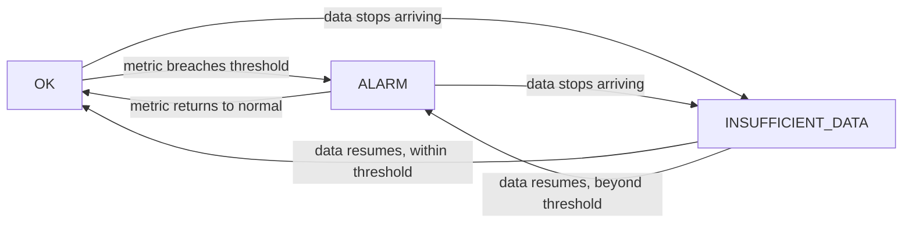

# How to Create CloudWatch Metric Alarms

Author: [nawazdhandala](https://github.com/nawazdhandala)

Tags: AWS, CloudWatch, Monitoring, Alerting, DevOps

Description: A comprehensive guide to creating Amazon CloudWatch metric alarms, covering threshold configuration, evaluation periods, alarm actions, and best practices for production monitoring.

---

Monitoring dashboards are great for understanding your system visually, but someone has to be looking at them for them to be useful. CloudWatch metric alarms watch your metrics 24/7 and take action when something goes wrong - sending notifications, triggering auto-scaling, or invoking automated remediation.

Getting alarms right takes more thought than you'd expect. Set the threshold too low and you get paged for every minor fluctuation. Set it too high and you don't find out about problems until users start complaining. Let's go through how to create effective CloudWatch alarms.

## Alarm Basics

A CloudWatch alarm has three states:

- **OK** - The metric is within the normal range
- **ALARM** - The metric has breached the threshold
- **INSUFFICIENT_DATA** - Not enough data points to evaluate

An alarm watches a metric, compares it against a threshold, and transitions between states based on the evaluation.



## Creating a Basic Alarm

Here's a simple alarm that triggers when CPU utilization exceeds 80%:

```bash
# Create a basic CPU alarm
aws cloudwatch put-metric-alarm \
  --alarm-name "high-cpu-web-server" \
  --alarm-description "CPU utilization above 80% on web server" \
  --namespace "AWS/EC2" \
  --metric-name CPUUtilization \
  --dimensions Name=InstanceId,Value=i-abc123def456 \
  --statistic Average \
  --period 300 \
  --threshold 80 \
  --comparison-operator GreaterThanThreshold \
  --evaluation-periods 2 \
  --alarm-actions "arn:aws:sns:us-east-1:123456789012:ops-alerts" \
  --ok-actions "arn:aws:sns:us-east-1:123456789012:ops-alerts" \
  --treat-missing-data missing
```

Let's unpack each parameter:

- **period** (300) - Evaluate the metric every 5 minutes
- **evaluation-periods** (2) - Must breach threshold for 2 consecutive periods
- **statistic** (Average) - Use the average value within each period
- **comparison-operator** - The metric must be greater than (not equal to) the threshold
- **treat-missing-data** (missing) - Don't change state if data is missing

The combination of `period: 300` and `evaluation-periods: 2` means the alarm triggers after 10 minutes of sustained high CPU. This prevents false alarms from brief spikes.

## Understanding Evaluation

How CloudWatch evaluates alarms can be confusing. Here's the mental model:

```
Period 1 (5 min): CPU = 85%  -> BREACH
Period 2 (5 min): CPU = 82%  -> BREACH
-> 2 of 2 periods breaching -> ALARM triggers

Period 1 (5 min): CPU = 85%  -> BREACH
Period 2 (5 min): CPU = 75%  -> OK
-> Only 1 of 2 periods breaching -> Alarm stays OK
```

You can also use the M out of N evaluation pattern:

```bash
# Alarm triggers if 3 out of 5 periods breach the threshold
aws cloudwatch put-metric-alarm \
  --alarm-name "intermittent-high-cpu" \
  --namespace "AWS/EC2" \
  --metric-name CPUUtilization \
  --dimensions Name=InstanceId,Value=i-abc123def456 \
  --statistic Average \
  --period 60 \
  --threshold 90 \
  --comparison-operator GreaterThanThreshold \
  --evaluation-periods 5 \
  --datapoints-to-alarm 3 \
  --alarm-actions "arn:aws:sns:us-east-1:123456789012:ops-alerts"
```

Here, `datapoints-to-alarm: 3` with `evaluation-periods: 5` means the alarm triggers if 3 out of the last 5 one-minute periods are above 90% CPU. This catches sustained issues while tolerating brief spikes.

## Choosing the Right Statistic

The statistic determines how data points within a period are aggregated:

| Statistic | Best For |
|-----------|----------|
| Average | General utilization metrics (CPU, memory) |
| Maximum | Peak detection (latency spikes, memory peaks) |
| Minimum | Detecting drops (available connections, free storage) |
| Sum | Count metrics (errors, requests) |
| p99, p95, p90 | Percentile latency metrics |

For latency monitoring, always use percentiles. The average latency can look fine while the p99 is terrible:

```bash
# Alarm on p99 latency exceeding 500ms
aws cloudwatch put-metric-alarm \
  --alarm-name "high-p99-latency" \
  --namespace "AWS/ApplicationELB" \
  --metric-name TargetResponseTime \
  --dimensions Name=LoadBalancer,Value=app/my-alb/abc123 \
  --extended-statistic p99 \
  --period 300 \
  --threshold 0.5 \
  --comparison-operator GreaterThanThreshold \
  --evaluation-periods 2 \
  --alarm-actions "arn:aws:sns:us-east-1:123456789012:ops-alerts"
```

## Metric Math Alarms

Sometimes you need to alarm on a calculation rather than a raw metric. Metric math lets you create alarms on expressions:

```bash
# Alarm when error rate exceeds 5% of total requests
aws cloudwatch put-metric-alarm \
  --alarm-name "high-error-rate" \
  --metrics '[
    {
      "Id": "errors",
      "MetricStat": {
        "Metric": {
          "Namespace": "AWS/ApplicationELB",
          "MetricName": "HTTPCode_Target_5XX_Count",
          "Dimensions": [
            {"Name": "LoadBalancer", "Value": "app/my-alb/abc123"}
          ]
        },
        "Period": 300,
        "Stat": "Sum"
      },
      "ReturnData": false
    },
    {
      "Id": "requests",
      "MetricStat": {
        "Metric": {
          "Namespace": "AWS/ApplicationELB",
          "MetricName": "RequestCount",
          "Dimensions": [
            {"Name": "LoadBalancer", "Value": "app/my-alb/abc123"}
          ]
        },
        "Period": 300,
        "Stat": "Sum"
      },
      "ReturnData": false
    },
    {
      "Id": "error_rate",
      "Expression": "(errors / requests) * 100",
      "Label": "Error Rate %",
      "ReturnData": true
    }
  ]' \
  --threshold 5 \
  --comparison-operator GreaterThanThreshold \
  --evaluation-periods 2 \
  --alarm-actions "arn:aws:sns:us-east-1:123456789012:ops-alerts"
```

This is much more useful than a raw error count alarm because it accounts for traffic volume. 50 errors during 1000 requests is a 5% error rate. 50 errors during 100,000 requests is 0.05% - not worth waking up for.

## Handling Missing Data

The `treat-missing-data` parameter is often overlooked but critically important:

| Option | Behavior | Best For |
|--------|----------|----------|
| `missing` | Maintain current state | Most metrics |
| `notBreaching` | Treat as within threshold | Metrics that naturally stop |
| `breaching` | Treat as threshold breach | Critical health metrics |
| `ignore` | Skip the data point | Intermittent data sources |

For health-check-style alarms, use `breaching` - if data stops arriving, that's itself a problem:

```bash
# Missing heartbeat data should trigger the alarm
aws cloudwatch put-metric-alarm \
  --alarm-name "service-heartbeat-missing" \
  --namespace "Custom/App" \
  --metric-name Heartbeat \
  --statistic Sum \
  --period 60 \
  --threshold 0 \
  --comparison-operator LessThanOrEqualToThreshold \
  --evaluation-periods 3 \
  --treat-missing-data breaching \
  --alarm-actions "arn:aws:sns:us-east-1:123456789012:critical-alerts"
```

## Alarm Actions

Alarms can trigger multiple action types:

### SNS Notifications

The most common action - send a notification:

```bash
# Send to multiple SNS topics
--alarm-actions \
  "arn:aws:sns:us-east-1:123456789012:ops-alerts" \
  "arn:aws:sns:us-east-1:123456789012:pagerduty"
```

### Auto Scaling Actions

Trigger scaling policies:

```bash
--alarm-actions "arn:aws:autoscaling:us-east-1:123456789012:scalingPolicy:abc123:autoScalingGroupName/my-asg:policyName/scale-up"
```

### EC2 Actions

Stop, terminate, or reboot an instance:

```bash
--alarm-actions "arn:aws:automate:us-east-1:ec2:recover"
```

### OK Actions

Don't forget to set OK actions so you get notified when the problem resolves:

```bash
--ok-actions "arn:aws:sns:us-east-1:123456789012:ops-alerts"
```

## Essential Alarms for Production

Here's a starter set of alarms every production environment should have:

```bash
# 1. High error rate
aws cloudwatch put-metric-alarm \
  --alarm-name "prod-high-error-rate" \
  --metric-name HTTPCode_Target_5XX_Count \
  --namespace "AWS/ApplicationELB" \
  --statistic Sum --period 300 --threshold 50 \
  --comparison-operator GreaterThanThreshold \
  --evaluation-periods 1 \
  --alarm-actions "arn:aws:sns:us-east-1:123456789012:critical"

# 2. High latency
aws cloudwatch put-metric-alarm \
  --alarm-name "prod-high-latency" \
  --metric-name TargetResponseTime \
  --namespace "AWS/ApplicationELB" \
  --extended-statistic p99 --period 300 --threshold 2 \
  --comparison-operator GreaterThanThreshold \
  --evaluation-periods 2 \
  --alarm-actions "arn:aws:sns:us-east-1:123456789012:warning"

# 3. Low healthy hosts
aws cloudwatch put-metric-alarm \
  --alarm-name "prod-low-healthy-hosts" \
  --metric-name HealthyHostCount \
  --namespace "AWS/ApplicationELB" \
  --statistic Minimum --period 60 --threshold 2 \
  --comparison-operator LessThanThreshold \
  --evaluation-periods 2 \
  --treat-missing-data breaching \
  --alarm-actions "arn:aws:sns:us-east-1:123456789012:critical"

# 4. Database connections
aws cloudwatch put-metric-alarm \
  --alarm-name "prod-db-connections" \
  --metric-name DatabaseConnections \
  --namespace "AWS/RDS" \
  --dimensions Name=DBInstanceIdentifier,Value=prod-db \
  --statistic Maximum --period 300 --threshold 80 \
  --comparison-operator GreaterThanThreshold \
  --evaluation-periods 2 \
  --alarm-actions "arn:aws:sns:us-east-1:123456789012:warning"
```

For combining multiple alarms into higher-level health indicators, see our guide on [creating CloudWatch composite alarms](https://oneuptime.com/blog/post/create-cloudwatch-composite-alarms/view).

## Best Practices

1. **Use meaningful alarm names.** Include the environment, service, and what's being measured. `prod-api-high-cpu` is better than `alarm-1`.

2. **Don't alarm on everything.** Focus on metrics that indicate real problems requiring human action. If nobody needs to respond to it, it shouldn't be an alarm.

3. **Test your alarms.** Deliberately cross thresholds in staging to verify notifications arrive and are actionable.

4. **Set different severities.** Not all alarms are created equal. A 5xx error spike is more urgent than CPU at 75%.

5. **Review and tune regularly.** If an alarm fires and nobody takes action, it's either not important enough to be an alarm or the threshold is wrong.

## Wrapping Up

CloudWatch metric alarms are the backbone of automated monitoring on AWS. Start with the essentials - error rates, latency, and resource utilization - and expand as you learn your system's behavior. The goal isn't to alarm on every possible metric, but to get the right alerts to the right people at the right time.
