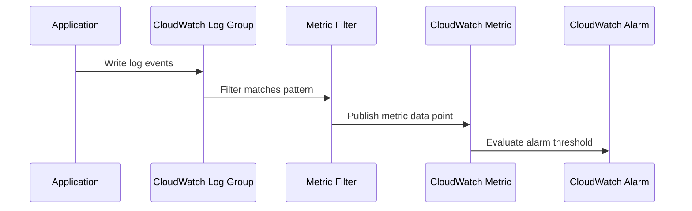

# How to Create CloudWatch Metric Filters from Log Data

Author: [nawazdhandala](https://github.com/nawazdhandala)

Tags: AWS, CloudWatch, Logging, Metrics, Monitoring

Description: Learn how to create CloudWatch metric filters that automatically extract custom metrics from your log data, enabling alarms and dashboards based on log patterns.

---

Your logs contain a goldmine of operational data. Error counts, latency values, status codes, business events - it's all there in your log lines. But raw logs aren't great for real-time monitoring. You can't create a CloudWatch alarm on a log message. You can't graph error trends on a dashboard directly from logs.

That's where metric filters come in. A metric filter watches a log group, matches log events against a pattern, and publishes a CloudWatch metric whenever it finds a match. Once you have a metric, you can alarm on it, graph it, and include it in dashboards just like any built-in AWS metric.

## How Metric Filters Work

The flow is straightforward:



Metric filters are evaluated in near-real-time as log events arrive. There's typically a few seconds of delay, which is fine for most monitoring use cases.

## Creating a Simple Pattern-Based Metric Filter

Let's start with the most common use case: counting errors. Suppose your application logs lines like `ERROR: Failed to process payment for order 12345`.

```bash
# Create a metric filter that counts ERROR occurrences
aws logs put-metric-filter \
  --log-group-name "/myapp/production/api" \
  --filter-name "ErrorCount" \
  --filter-pattern "ERROR" \
  --metric-transformations \
    metricName=ErrorCount,metricNamespace=MyApp/Production,metricValue=1,defaultValue=0
```

Breaking this down:
- `filter-pattern`: The text pattern to match. `"ERROR"` matches any log line containing the word ERROR.
- `metricName`: The name of the custom metric to publish.
- `metricNamespace`: The namespace to publish under.
- `metricValue`: The value to publish for each match. Here, we're counting, so each match adds 1.
- `defaultValue`: The value to publish when no matches occur in a period. Setting this to 0 means the metric always has data points, which is important for ALARM-to-OK transitions.

## Filter Pattern Syntax

CloudWatch supports two types of filter patterns: simple text patterns and JSON-based patterns. Let's look at both.

### Simple text patterns

```bash
# Match any line containing "ERROR"
"ERROR"

# Match lines containing both "ERROR" and "timeout"
"ERROR timeout"

# Match lines containing "ERROR" but NOT "expected"
"ERROR" -"expected"

# Match lines starting with a specific text (using spaces for positioning)
"[timestamp, level = ERROR, ...]"
```

### JSON filter patterns

If your logs are JSON-formatted (and they should be), you get much more powerful filtering:

```bash
# Match JSON logs where the level field equals "ERROR"
{ $.level = "ERROR" }

# Match where status code is 500 or higher
{ $.statusCode >= 500 }

# Match where response time exceeds 1000ms
{ $.responseTime > 1000 }

# Combine conditions with AND
{ $.level = "ERROR" && $.service = "payment" }

# Combine conditions with OR
{ $.statusCode = 500 || $.statusCode = 502 || $.statusCode = 503 }

# Check if a field exists
{ $.errorMessage IS TRUE }

# Wildcard matching on string values
{ $.endpoint = "/api/orders*" }
```

## Extracting Numeric Values from Logs

Instead of just counting matches, you can extract actual values from your logs to create metrics like average latency or max queue depth.

Suppose your logs look like this:

```json
{"timestamp": "2026-02-12T10:00:00Z", "level": "INFO", "endpoint": "/api/orders", "responseTime": 234, "statusCode": 200}
```

You can extract the `responseTime` value:

```bash
# Extract response time as a metric value
aws logs put-metric-filter \
  --log-group-name "/myapp/production/api" \
  --filter-name "ResponseTime" \
  --filter-pattern '{ $.statusCode = 200 }' \
  --metric-transformations \
    metricName=ResponseTime,metricNamespace=MyApp/Production,metricValue='$.responseTime',defaultValue=0
```

Notice that `metricValue` is set to `$.responseTime` instead of a static number. CloudWatch extracts the actual value from each matching log event and publishes it as the metric value. This gives you min, max, average, and percentile statistics on your response times.

## Creating Multiple Metric Filters

A single log group can have up to 100 metric filters. Here's a set of filters that gives you comprehensive API monitoring from logs alone:

```bash
# Count 5xx errors
aws logs put-metric-filter \
  --log-group-name "/myapp/production/api" \
  --filter-name "5xxErrors" \
  --filter-pattern '{ $.statusCode >= 500 }' \
  --metric-transformations \
    metricName=5xxErrors,metricNamespace=MyApp/Production,metricValue=1,defaultValue=0

# Count 4xx errors
aws logs put-metric-filter \
  --log-group-name "/myapp/production/api" \
  --filter-name "4xxErrors" \
  --filter-pattern '{ $.statusCode >= 400 && $.statusCode < 500 }' \
  --metric-transformations \
    metricName=4xxErrors,metricNamespace=MyApp/Production,metricValue=1,defaultValue=0

# Track response time for successful requests
aws logs put-metric-filter \
  --log-group-name "/myapp/production/api" \
  --filter-name "SuccessLatency" \
  --filter-pattern '{ $.statusCode >= 200 && $.statusCode < 300 }' \
  --metric-transformations \
    metricName=SuccessLatency,metricNamespace=MyApp/Production,metricValue='$.responseTime',defaultValue=0

# Count specific business events
aws logs put-metric-filter \
  --log-group-name "/myapp/production/api" \
  --filter-name "OrdersPlaced" \
  --filter-pattern '{ $.event = "order_placed" }' \
  --metric-transformations \
    metricName=OrdersPlaced,metricNamespace=MyApp/Production,metricValue=1,defaultValue=0
```

## CloudFormation Example

Here's how to define metric filters in CloudFormation:

```yaml
Resources:
  ErrorCountFilter:
    Type: AWS::Logs::MetricFilter
    Properties:
      LogGroupName: /myapp/production/api
      FilterName: ErrorCount
      FilterPattern: '{ $.level = "ERROR" }'
      MetricTransformations:
        - MetricName: ErrorCount
          MetricNamespace: MyApp/Production
          MetricValue: "1"
          DefaultValue: 0

  LatencyFilter:
    Type: AWS::Logs::MetricFilter
    Properties:
      LogGroupName: /myapp/production/api
      FilterName: RequestLatency
      FilterPattern: '{ $.responseTime >= 0 }'
      MetricTransformations:
        - MetricName: RequestLatency
          MetricNamespace: MyApp/Production
          MetricValue: $.responseTime
          DefaultValue: 0
          Unit: Milliseconds

  # Alarm based on the metric filter
  HighErrorAlarm:
    Type: AWS::CloudWatch::Alarm
    Properties:
      AlarmName: HighErrorRate
      AlarmDescription: More than 10 errors in 5 minutes
      Namespace: MyApp/Production
      MetricName: ErrorCount
      Statistic: Sum
      Period: 300
      EvaluationPeriods: 1
      Threshold: 10
      ComparisonOperator: GreaterThanThreshold
      AlarmActions:
        - !Ref AlertTopic
```

## Dimensions in Metric Filters

You can add dimensions to metric filter metrics, which lets you filter and aggregate them in dashboards:

```bash
# Create a metric with dimensions
aws logs put-metric-filter \
  --log-group-name "/myapp/production/api" \
  --filter-name "ErrorsByService" \
  --filter-pattern '{ $.level = "ERROR" }' \
  --metric-transformations '[
    {
      "metricName": "ErrorCount",
      "metricNamespace": "MyApp/Production",
      "metricValue": "1",
      "defaultValue": 0,
      "dimensions": {
        "Service": "$.service",
        "Environment": "$.environment"
      }
    }
  ]'
```

With dimensions extracted from log fields, you can create per-service or per-environment error counts automatically.

## Testing Filter Patterns

Before deploying a metric filter, test your pattern against existing log data:

```bash
# Test a filter pattern against existing log events
aws logs filter-log-events \
  --log-group-name "/myapp/production/api" \
  --filter-pattern '{ $.statusCode >= 500 }' \
  --start-time $(date -d '1 hour ago' +%s000) \
  --limit 10
```

This returns the actual log events that match your pattern, so you can verify it works before creating the metric filter.

## Metric Filter Limitations

There are some things to know about metric filter limitations. Each log group supports up to 100 metric filters. Each metric filter can create up to 3 metric transformations. The filter pattern can be up to 1024 characters long. And metric filters only process new log events - they don't backfill historical data.

Also, metric filters don't support regex. If you need regex-level pattern matching, you might want to use Logs Insights queries instead (see our [Logs Insights query syntax guide](https://oneuptime.com/blog/post/2026-02-12-cloudwatch-logs-insights-query-syntax/view)) or stream your logs to Lambda for custom processing.

## Common Patterns

Here are some filter patterns you'll find yourself using often:

```bash
# Match any exception stack trace (Java)
"Exception"

# Match OOM errors
"OutOfMemoryError"

# Match slow database queries (assuming structured JSON logs)
{ $.queryTime > 5000 }

# Match failed authentication attempts
{ $.event = "auth_failed" }

# Match HTTP timeouts
{ $.error = "ETIMEDOUT" || $.error = "ESOCKETTIMEDOUT" }

# Match Lambda cold starts
"Init Duration"
```

## Wrapping Up

Metric filters bridge the gap between logs and metrics. They let you turn unstructured or semi-structured log data into actionable CloudWatch metrics that you can alarm on and visualize. The key is structured logging - if your applications output JSON logs with consistent field names, metric filters become incredibly powerful. Start with error counts and latency extraction, then expand to business metrics as needed.

For more on what you can do once you have these metrics, check out our post on [publishing custom CloudWatch metrics](https://oneuptime.com/blog/post/2026-02-12-publish-custom-cloudwatch-metrics/view) and [creating CloudWatch dashboards](https://oneuptime.com/blog/post/2026-02-12-create-cloudwatch-dashboards-application-monitoring/view).
