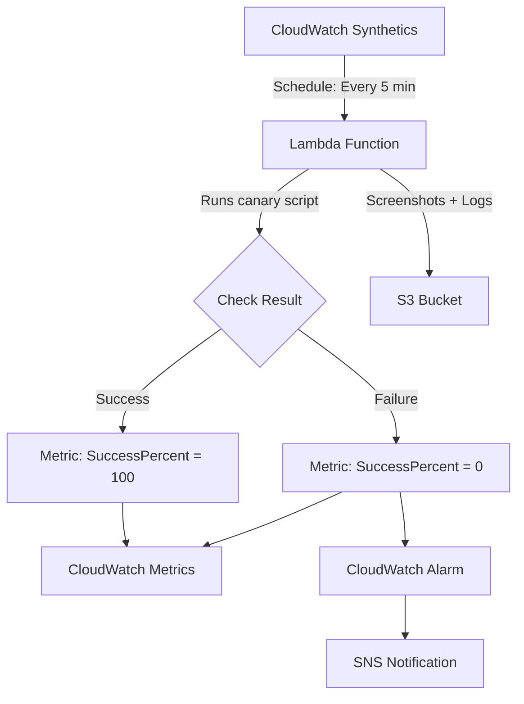

# How to Create CloudWatch Synthetics Canaries with Node.js

Author: [nawazdhandala](https://github.com/nawazdhandala)

Tags: AWS, CloudWatch, Synthetics, Canaries, Node.js, Monitoring, Testing

Description: Build CloudWatch Synthetics canaries with Node.js to proactively monitor your endpoints and detect issues before your users do

---

CloudWatch Synthetics lets you create canaries - automated scripts that run on a schedule to monitor your endpoints and APIs. Think of them as automated health checks that continuously verify your application is working correctly. Instead of waiting for users to report problems, canaries detect issues proactively.

Node.js is one of the two supported runtimes for Synthetics canaries (Python being the other). The Node.js runtime includes the Synthetics library, Puppeteer for browser automation, and the AWS SDK. You can write canaries that check API endpoints, navigate through web applications, verify SSL certificates, and more.

This guide walks through creating canaries with Node.js, from simple heartbeat checks to complex multi-step browser workflows.

## How Synthetics Canaries Work



Behind the scenes, each canary runs as a Lambda function on a schedule. The function executes your script, captures the results, stores screenshots and logs in S3, and pushes success/failure metrics to CloudWatch.

## Step 1: Create a Simple Heartbeat Canary

The simplest canary checks if a URL returns a successful response.

```javascript
// heartbeat-canary.js
const synthetics = require('Synthetics');
const log = require('SyntheticsLogger');

const heartbeatCanary = async function () {
  // Configure the heartbeat check
  const urls = [
    'https://api.example.com/health',
    'https://www.example.com',
    'https://api.example.com/v1/status',
  ];

  for (const url of urls) {
    log.info(`Checking URL: ${url}`);

    // Use the built-in HTTP check
    const response = await synthetics.executeHttpStep(
      `Check ${url}`,  // Step name
      {
        hostname: new URL(url).hostname,
        path: new URL(url).pathname,
        port: 443,
        protocol: 'https:',
        method: 'GET',
      },
      // Validation callback
      (res) => {
        if (res.statusCode < 200 || res.statusCode >= 300) {
          throw new Error(`Expected 2xx status code, got ${res.statusCode}`);
        }
        log.info(`URL ${url} returned status ${res.statusCode}`);
      }
    );
  }
};

exports.handler = async () => {
  return await heartbeatCanary();
};
```

## Step 2: Deploy the Canary

Deploy via the AWS CLI.

```bash
# First, zip your canary script
# The file must be in a specific directory structure
mkdir -p nodejs/node_modules
cp heartbeat-canary.js nodejs/node_modules/heartbeat-canary.js
zip -r canary-code.zip nodejs/

# Create an S3 bucket for canary artifacts
aws s3 mb s3://my-canary-artifacts-123456

# Create the canary
aws synthetics create-canary \
  --name heartbeat-check \
  --artifact-s3-location "s3://my-canary-artifacts-123456/heartbeat/" \
  --execution-role-arn arn:aws:iam::123456789012:role/canary-execution-role \
  --schedule '{"Expression": "rate(5 minutes)"}' \
  --runtime-version syn-nodejs-puppeteer-6.1 \
  --code '{"S3Bucket": "my-canary-artifacts-123456", "S3Key": "canary-code.zip", "Handler": "heartbeat-canary.handler"}' \
  --run-config '{"TimeoutInSeconds": 60, "MemoryInMBs": 960}'

# Start the canary
aws synthetics start-canary --name heartbeat-check
```

### IAM Role for Canaries

The canary execution role needs permissions to write to S3, publish CloudWatch metrics, and create log groups.

```json
{
  "Version": "2012-10-17",
  "Statement": [
    {
      "Effect": "Allow",
      "Action": [
        "s3:PutObject",
        "s3:GetObject",
        "s3:GetBucketLocation"
      ],
      "Resource": [
        "arn:aws:s3:::my-canary-artifacts-123456/*"
      ]
    },
    {
      "Effect": "Allow",
      "Action": [
        "cloudwatch:PutMetricData"
      ],
      "Resource": "*",
      "Condition": {
        "StringEquals": {
          "cloudwatch:namespace": "CloudWatchSynthetics"
        }
      }
    },
    {
      "Effect": "Allow",
      "Action": [
        "logs:CreateLogGroup",
        "logs:CreateLogStream",
        "logs:PutLogEvents"
      ],
      "Resource": "arn:aws:logs:*:*:log-group:/aws/lambda/cwsyn-*"
    },
    {
      "Effect": "Allow",
      "Action": [
        "s3:ListAllMyBuckets",
        "xray:PutTraceSegments"
      ],
      "Resource": "*"
    }
  ]
}
```

## Step 3: Create an API Canary

API canaries make HTTP requests and validate the response body, headers, and status codes.

```javascript
// api-canary.js
const synthetics = require('Synthetics');
const log = require('SyntheticsLogger');
const https = require('https');

const apiCanary = async function () {
  // Test 1: Check the orders API endpoint
  await testOrdersEndpoint();

  // Test 2: Check the user profile endpoint
  await testUserProfileEndpoint();

  // Test 3: Verify API response time
  await testResponseTime();
};

async function testOrdersEndpoint() {
  log.info('Testing orders API endpoint');

  const requestOptions = {
    hostname: 'api.example.com',
    path: '/v1/orders?limit=5',
    port: 443,
    protocol: 'https:',
    method: 'GET',
    headers: {
      'Authorization': 'Bearer test-api-key',
      'Content-Type': 'application/json',
    },
  };

  await synthetics.executeHttpStep(
    'Verify Orders API',
    requestOptions,
    (response, body) => {
      // Verify status code
      if (response.statusCode !== 200) {
        throw new Error(`Orders API returned ${response.statusCode}`);
      }

      // Parse and validate response body
      const data = JSON.parse(body);

      if (!Array.isArray(data.orders)) {
        throw new Error('Response missing orders array');
      }

      if (data.orders.length === 0) {
        log.warn('Orders array is empty - this may be expected');
      }

      // Verify response headers
      const contentType = response.headers['content-type'];
      if (!contentType || !contentType.includes('application/json')) {
        throw new Error(`Expected JSON content type, got ${contentType}`);
      }

      log.info(`Orders API returned ${data.orders.length} orders`);
    }
  );
}

async function testUserProfileEndpoint() {
  log.info('Testing user profile endpoint');

  const postData = JSON.stringify({
    userId: 'test-user-001',
  });

  const requestOptions = {
    hostname: 'api.example.com',
    path: '/v1/users/profile',
    port: 443,
    protocol: 'https:',
    method: 'POST',
    headers: {
      'Authorization': 'Bearer test-api-key',
      'Content-Type': 'application/json',
      'Content-Length': Buffer.byteLength(postData),
    },
    body: postData,
  };

  await synthetics.executeHttpStep(
    'Verify User Profile API',
    requestOptions,
    (response, body) => {
      if (response.statusCode !== 200) {
        throw new Error(`Profile API returned ${response.statusCode}`);
      }

      const data = JSON.parse(body);
      if (!data.profile || !data.profile.email) {
        throw new Error('Profile response missing expected fields');
      }

      log.info(`Profile API returned profile for: ${data.profile.email}`);
    }
  );
}

async function testResponseTime() {
  log.info('Testing API response time');

  const startTime = Date.now();

  await synthetics.executeHttpStep(
    'Verify Response Time',
    {
      hostname: 'api.example.com',
      path: '/v1/health',
      port: 443,
      protocol: 'https:',
      method: 'GET',
    },
    (response) => {
      const duration = Date.now() - startTime;

      if (response.statusCode !== 200) {
        throw new Error(`Health check returned ${response.statusCode}`);
      }

      // Fail if response takes more than 3 seconds
      if (duration > 3000) {
        throw new Error(`Response took ${duration}ms, exceeds 3000ms threshold`);
      }

      log.info(`Health check responded in ${duration}ms`);
    }
  );
}

exports.handler = async () => {
  return await apiCanary();
};
```

## Step 4: Create a Browser Canary

Browser canaries use Puppeteer to simulate real user interactions: clicking buttons, filling forms, navigating pages.

```javascript
// browser-canary.js
const synthetics = require('Synthetics');
const log = require('SyntheticsLogger');

const browserCanary = async function () {
  // Launch the browser and navigate to the login page
  const page = await synthetics.getPage();

  // Set viewport size
  await page.setViewport({ width: 1920, height: 1080 });

  // Step 1: Navigate to the login page
  await synthetics.executeStep('Navigate to Login', async function () {
    await page.goto('https://app.example.com/login', {
      waitUntil: 'networkidle0',
      timeout: 30000,
    });

    // Take a screenshot for debugging
    await synthetics.takeScreenshot('login-page', 'loaded');

    // Verify the login form is present
    const loginForm = await page.$('#login-form');
    if (!loginForm) {
      throw new Error('Login form not found on page');
    }

    log.info('Login page loaded successfully');
  });

  // Step 2: Fill in credentials and submit
  await synthetics.executeStep('Submit Login Form', async function () {
    // Type username
    await page.type('#username', 'canary-test-user@example.com');

    // Type password
    await page.type('#password', process.env.TEST_PASSWORD || 'test-password');

    // Click the login button
    await page.click('#login-button');

    // Wait for navigation after login
    await page.waitForNavigation({
      waitUntil: 'networkidle0',
      timeout: 15000,
    });

    await synthetics.takeScreenshot('after-login', 'dashboard');
    log.info('Login form submitted');
  });

  // Step 3: Verify dashboard loaded
  await synthetics.executeStep('Verify Dashboard', async function () {
    // Check that we landed on the dashboard
    const currentUrl = page.url();
    if (!currentUrl.includes('/dashboard')) {
      throw new Error(`Expected dashboard URL, got ${currentUrl}`);
    }

    // Verify a key element is present
    const welcomeMessage = await page.$('.welcome-message');
    if (!welcomeMessage) {
      throw new Error('Welcome message not found on dashboard');
    }

    const text = await page.evaluate(
      (el) => el.textContent,
      welcomeMessage
    );
    log.info(`Dashboard loaded with message: ${text}`);

    await synthetics.takeScreenshot('dashboard', 'verified');
  });

  // Step 4: Navigate to a critical feature
  await synthetics.executeStep('Check Orders Page', async function () {
    await page.click('a[href="/orders"]');
    await page.waitForSelector('.orders-table', { timeout: 10000 });

    const orderRows = await page.$$('.orders-table tbody tr');
    log.info(`Orders page loaded with ${orderRows.length} orders`);

    await synthetics.takeScreenshot('orders-page', 'loaded');
  });
};

exports.handler = async () => {
  return await browserCanary();
};
```

## Step 5: Set Up Alerting on Canary Failures

When a canary fails, you want to know immediately. Create a CloudWatch alarm on the canary's success metric.

```bash
# Create an alarm for canary failures
aws cloudwatch put-metric-alarm \
  --alarm-name canary-heartbeat-failure \
  --metric-name SuccessPercent \
  --namespace CloudWatchSynthetics \
  --dimensions Name=CanaryName,Value=heartbeat-check \
  --statistic Average \
  --period 300 \
  --threshold 100 \
  --comparison-operator LessThanThreshold \
  --evaluation-periods 2 \
  --alarm-actions arn:aws:sns:us-east-1:123456789012:ops-alerts \
  --treat-missing-data breaching
```

This alarm fires when the canary success rate drops below 100% for two consecutive 5-minute periods.

## Step 6: Use Environment Variables for Secrets

Never hardcode API keys or passwords in canary scripts. Use environment variables.

```bash
# Update canary with environment variables
aws synthetics update-canary \
  --name api-check \
  --run-config '{
    "TimeoutInSeconds": 60,
    "MemoryInMBs": 960,
    "EnvironmentVariables": {
      "API_KEY": "your-test-api-key",
      "BASE_URL": "https://api.example.com"
    }
  }'
```

Access them in your script:

```javascript
const apiKey = process.env.API_KEY;
const baseUrl = process.env.BASE_URL;
```

For sensitive secrets, store them in Secrets Manager and fetch them in your canary script using the AWS SDK.

## Best Practices

**Run from multiple regions**: Deploy canaries in multiple regions to detect regional outages and measure latency from different locations.

**Keep canaries focused**: Each canary should test one workflow or feature. Do not combine unrelated checks into a single canary.

**Use meaningful step names**: Step names appear in CloudWatch metrics and logs. Make them descriptive enough to identify the failure point.

**Set appropriate timeouts**: Default timeout is 60 seconds. Increase it for complex browser workflows. Decrease it for simple API checks to detect slowdowns faster.

**Monitor canary costs**: Each canary run costs money (Lambda invocation + S3 storage). A canary running every minute costs more than one running every 5 minutes. Choose the frequency based on how quickly you need to detect issues.

For monitoring your API endpoints more broadly, see our guide on [monitoring API endpoints with CloudWatch Synthetics](https://oneuptime.com/blog/post/2026-02-12-monitor-api-endpoints-with-cloudwatch-synthetics/view).

## Wrapping Up

CloudWatch Synthetics canaries with Node.js give you proactive monitoring that catches problems before your users do. Start with simple heartbeat canaries for your critical endpoints, then add browser canaries for key user workflows. The screenshots and detailed step-by-step logs make debugging failures straightforward. Combined with CloudWatch alarms, you get instant notification when something breaks, often before a single user is affected.
