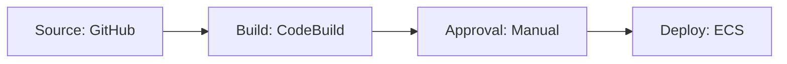

# How to Create CodePipeline with Terraform

Author: [nawazdhandala](https://github.com/nawazdhandala)

Tags: AWS, CodePipeline, Terraform, CI/CD

Description: Complete guide to setting up AWS CodePipeline with Terraform, including source stages from GitHub, CodeBuild integration, and ECS deployment targets.

---

AWS CodePipeline orchestrates your CI/CD workflow by connecting source providers, build systems, and deployment targets into an automated pipeline. It's a solid choice if you're already invested in the AWS ecosystem and want everything under one roof. Setting it up through the console is painful though - lots of clicking, lots of IAM role creation, and zero reproducibility. Terraform fixes all of that.

This guide walks through building a complete pipeline from source (GitHub) through build (CodeBuild) to deployment (ECS), all managed as code.

## Pipeline Architecture

A typical CodePipeline has three or four stages. Each stage contains one or more actions, and actions can run in parallel within a stage.



## Prerequisites

Before creating the pipeline, you need:
- An S3 bucket for pipeline artifacts
- An IAM role for CodePipeline
- A CodeStar connection for GitHub (or a CodeCommit repo)
- A CodeBuild project
- An ECS service to deploy to

Let's build everything step by step.

## The Artifact Bucket

CodePipeline stores artifacts (source code, build output) in S3 between stages.

This creates an encrypted S3 bucket for pipeline artifacts:

```hcl
resource "aws_s3_bucket" "pipeline_artifacts" {
  bucket = "my-pipeline-artifacts-${data.aws_caller_identity.current.account_id}"

  tags = {
    Purpose   = "codepipeline-artifacts"
    ManagedBy = "terraform"
  }
}

resource "aws_s3_bucket_server_side_encryption_configuration" "pipeline_artifacts" {
  bucket = aws_s3_bucket.pipeline_artifacts.id

  rule {
    apply_server_side_encryption_by_default {
      sse_algorithm = "aws:kms"
    }
  }
}

resource "aws_s3_bucket_public_access_block" "pipeline_artifacts" {
  bucket = aws_s3_bucket.pipeline_artifacts.id

  block_public_acls       = true
  block_public_policy     = true
  ignore_public_acls      = true
  restrict_public_buckets = true
}

data "aws_caller_identity" "current" {}
```

## IAM Role for CodePipeline

CodePipeline needs permission to read from the source, trigger builds, and initiate deployments.

This IAM role grants CodePipeline the permissions it needs across all stages:

```hcl
resource "aws_iam_role" "codepipeline" {
  name = "codepipeline-service-role"

  assume_role_policy = jsonencode({
    Version = "2012-10-17"
    Statement = [{
      Action = "sts:AssumeRole"
      Effect = "Allow"
      Principal = {
        Service = "codepipeline.amazonaws.com"
      }
    }]
  })
}

resource "aws_iam_role_policy" "codepipeline" {
  name = "codepipeline-policy"
  role = aws_iam_role.codepipeline.id

  policy = jsonencode({
    Version = "2012-10-17"
    Statement = [
      {
        Effect = "Allow"
        Action = [
          "s3:GetObject",
          "s3:GetObjectVersion",
          "s3:GetBucketVersioning",
          "s3:PutObject"
        ]
        Resource = [
          aws_s3_bucket.pipeline_artifacts.arn,
          "${aws_s3_bucket.pipeline_artifacts.arn}/*"
        ]
      },
      {
        Effect = "Allow"
        Action = [
          "codestar-connections:UseConnection"
        ]
        Resource = aws_codestarconnections_connection.github.arn
      },
      {
        Effect = "Allow"
        Action = [
          "codebuild:BatchGetBuilds",
          "codebuild:StartBuild"
        ]
        Resource = "*"
      },
      {
        Effect = "Allow"
        Action = [
          "ecs:DescribeServices",
          "ecs:DescribeTaskDefinition",
          "ecs:DescribeTasks",
          "ecs:ListTasks",
          "ecs:RegisterTaskDefinition",
          "ecs:UpdateService"
        ]
        Resource = "*"
      },
      {
        Effect   = "Allow"
        Action   = "iam:PassRole"
        Resource = "*"
        Condition = {
          StringEqualsIfExists = {
            "iam:PassedToService" = [
              "ecs-tasks.amazonaws.com"
            ]
          }
        }
      },
      {
        Effect = "Allow"
        Action = [
          "sns:Publish"
        ]
        Resource = aws_sns_topic.pipeline_approval.arn
      }
    ]
  })
}
```

## GitHub Connection

CodePipeline V2 uses CodeStar Connections for GitHub integration. The connection needs to be confirmed in the AWS console after creation (this is a one-time manual step).

This creates a CodeStar connection to GitHub:

```hcl
resource "aws_codestarconnections_connection" "github" {
  name          = "github-connection"
  provider_type = "GitHub"
}
```

After running `terraform apply`, go to the AWS console, navigate to CodePipeline > Settings > Connections, and complete the GitHub authorization. The connection will show as "Pending" until you do this.

## The Pipeline

Now let's tie everything together. This pipeline has four stages: Source, Build, Approval, and Deploy.

This creates a complete pipeline with GitHub source, CodeBuild build, manual approval, and ECS deployment:

```hcl
resource "aws_codepipeline" "main" {
  name     = "my-app-pipeline"
  role_arn = aws_iam_role.codepipeline.arn

  artifact_store {
    location = aws_s3_bucket.pipeline_artifacts.bucket
    type     = "S3"
  }

  # Stage 1: Pull source from GitHub
  stage {
    name = "Source"

    action {
      name             = "Source"
      category         = "Source"
      owner            = "AWS"
      provider         = "CodeStarSourceConnection"
      version          = "1"
      output_artifacts = ["source_output"]

      configuration = {
        ConnectionArn    = aws_codestarconnections_connection.github.arn
        FullRepositoryId = "my-org/my-app"
        BranchName       = "main"
      }
    }
  }

  # Stage 2: Build with CodeBuild
  stage {
    name = "Build"

    action {
      name             = "Build"
      category         = "Build"
      owner            = "AWS"
      provider         = "CodeBuild"
      input_artifacts  = ["source_output"]
      output_artifacts = ["build_output"]
      version          = "1"

      configuration = {
        ProjectName = aws_codebuild_project.main.name
      }
    }
  }

  # Stage 3: Manual approval before deploying to production
  stage {
    name = "Approval"

    action {
      name     = "ManualApproval"
      category = "Approval"
      owner    = "AWS"
      provider = "Manual"
      version  = "1"

      configuration = {
        NotificationArn = aws_sns_topic.pipeline_approval.arn
        CustomData      = "Please review the build output and approve deployment to production."
      }
    }
  }

  # Stage 4: Deploy to ECS
  stage {
    name = "Deploy"

    action {
      name            = "Deploy"
      category        = "Deploy"
      owner           = "AWS"
      provider        = "ECS"
      input_artifacts = ["build_output"]
      version         = "1"

      configuration = {
        ClusterName = "production-cluster"
        ServiceName = "my-app-service"
        FileName    = "imagedefinitions.json"
      }
    }
  }

  tags = {
    Environment = "production"
    Application = "my-app"
  }
}

# SNS topic for approval notifications
resource "aws_sns_topic" "pipeline_approval" {
  name = "pipeline-approval-notifications"
}

resource "aws_sns_topic_subscription" "approval_email" {
  topic_arn = aws_sns_topic.pipeline_approval.arn
  protocol  = "email"
  endpoint  = "team-lead@example.com"
}
```

## Pipeline Notifications

Get notified when your pipeline succeeds, fails, or needs approval.

This sets up notifications for pipeline state changes:

```hcl
resource "aws_codestarnotifications_notification_rule" "pipeline" {
  name        = "my-app-pipeline-notifications"
  resource    = aws_codepipeline.main.arn
  detail_type = "BASIC"

  event_type_ids = [
    "codepipeline-pipeline-pipeline-execution-failed",
    "codepipeline-pipeline-pipeline-execution-succeeded",
    "codepipeline-pipeline-manual-approval-needed",
  ]

  target {
    address = aws_sns_topic.pipeline_approval.arn
  }
}
```

## Pipeline with Parallel Actions

You can run actions in parallel within a stage by giving them the same `run_order` value. This is useful for running tests and linting simultaneously.

This build stage runs unit tests and integration tests in parallel:

```hcl
stage {
  name = "Test"

  action {
    name             = "UnitTests"
    category         = "Build"
    owner            = "AWS"
    provider         = "CodeBuild"
    input_artifacts  = ["source_output"]
    version          = "1"
    run_order        = 1  # Same run_order = parallel execution

    configuration = {
      ProjectName = aws_codebuild_project.unit_tests.name
    }
  }

  action {
    name             = "IntegrationTests"
    category         = "Build"
    owner            = "AWS"
    provider         = "CodeBuild"
    input_artifacts  = ["source_output"]
    version          = "1"
    run_order        = 1  # Runs at the same time as UnitTests

    configuration = {
      ProjectName = aws_codebuild_project.integration_tests.name
    }
  }
}
```

## Cross-Region Deployment

For multi-region deployments, use additional artifact stores.

This configures artifact stores in two regions for cross-region deployment:

```hcl
resource "aws_codepipeline" "multi_region" {
  name     = "multi-region-pipeline"
  role_arn = aws_iam_role.codepipeline.arn

  artifact_store {
    location = aws_s3_bucket.artifacts_us_east.bucket
    type     = "S3"
    region   = "us-east-1"
  }

  artifact_store {
    location = aws_s3_bucket.artifacts_eu_west.bucket
    type     = "S3"
    region   = "eu-west-1"
  }

  # ... stages ...
}
```

## Triggering the Pipeline

By default, CodePipeline triggers on every push to the configured branch. You can also trigger it with EventBridge for more control.

This EventBridge rule triggers the pipeline on tag pushes instead of every commit:

```hcl
resource "aws_cloudwatch_event_rule" "tag_push" {
  name = "trigger-pipeline-on-tag"

  event_pattern = jsonencode({
    source      = ["aws.codecommit"]
    detail-type = ["CodeCommit Repository State Change"]
    detail = {
      event         = ["referenceCreated"]
      referenceType = ["tag"]
    }
  })
}
```

For more on setting up EventBridge rules, see our guide on [EventBridge rules with Terraform](https://oneuptime.com/blog/post/create-eventbridge-rules-terraform/view).

## Wrapping Up

CodePipeline in Terraform gives you a reproducible, version-controlled CI/CD setup. The IAM configuration is the most tedious part, but once that's done, adding new stages and actions is straightforward. Remember to complete the CodeStar GitHub connection in the console after the first apply, and use manual approval gates before production deployments. Combined with CodeBuild for the actual build steps, you've got a complete AWS-native CI/CD pipeline.
