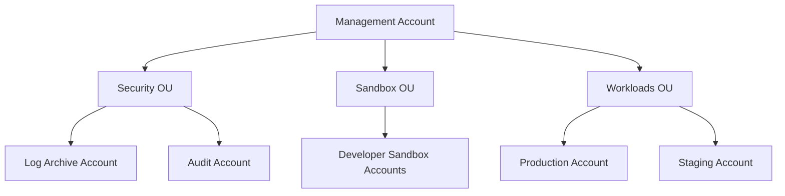

# How to Create Control Tower with Terraform

Author: [nawazdhandala](https://github.com/nawazdhandala)

Tags: AWS, Terraform, Control Tower, Organizations, Governance

Description: Guide to setting up AWS Control Tower with Terraform for multi-account governance, including landing zones, organizational units, guardrails, and account factory.

---

AWS Control Tower automates the setup and governance of a multi-account AWS environment. It builds on AWS Organizations, Service Catalog, and Config to give you a pre-configured landing zone with guardrails that enforce security and compliance policies. While Control Tower's initial setup typically happens through the console, Terraform can manage the ongoing configuration - organizational units, account provisioning, guardrails, and customizations.

Let's cover how to integrate Terraform with Control Tower for a well-governed multi-account setup.

## Understanding Control Tower Components

Control Tower brings together several AWS services:

- **Landing Zone**: The overall multi-account environment structure
- **Organizational Units (OUs)**: Groups of accounts with shared policies
- **Guardrails**: Preventive and detective controls (implemented as SCPs and Config rules)
- **Account Factory**: Automated account provisioning
- **Log Archive Account**: Centralized logging
- **Audit Account**: Security and compliance auditing



## Prerequisites

Before using Terraform with Control Tower, you need to set up the landing zone through the AWS console. This is a one-time operation that creates the foundational structure. After that, Terraform takes over for ongoing management.

Make sure you have:

1. Control Tower landing zone set up and enabled
2. The management account credentials configured for Terraform
3. AWS Organizations already configured by Control Tower

## Managing Organizational Units

Control Tower creates a few default OUs. You can add more with Terraform:

```hcl
# Reference the organization
data "aws_organizations_organization" "main" {}

# Get the root OU
data "aws_organizations_organizational_units" "root" {
  parent_id = data.aws_organizations_organization.main.roots[0].id
}

# Create additional OUs under the root
resource "aws_organizations_organizational_unit" "workloads" {
  name      = "Workloads"
  parent_id = data.aws_organizations_organization.main.roots[0].id

  tags = {
    ManagedBy = "terraform"
  }
}

resource "aws_organizations_organizational_unit" "production" {
  name      = "Production"
  parent_id = aws_organizations_organizational_unit.workloads.id
}

resource "aws_organizations_organizational_unit" "staging" {
  name      = "Staging"
  parent_id = aws_organizations_organizational_unit.workloads.id
}

resource "aws_organizations_organizational_unit" "development" {
  name      = "Development"
  parent_id = aws_organizations_organizational_unit.workloads.id
}

resource "aws_organizations_organizational_unit" "infrastructure" {
  name      = "Infrastructure"
  parent_id = data.aws_organizations_organization.main.roots[0].id
}
```

## Enabling Control Tower Controls (Guardrails)

Control Tower controls (formerly called guardrails) enforce policies across your OUs. Terraform can enable and manage these:

```hcl
# Enable mandatory controls on the Workloads OU
resource "aws_controltower_control" "disallow_public_s3" {
  control_identifier = "arn:aws:controltower:us-east-1::control/AWS-GR_S3_ACCOUNT_LEVEL_PUBLIC_ACCESS_BLOCKS_PERIODIC"
  target_identifier  = aws_organizations_organizational_unit.workloads.arn
}

resource "aws_controltower_control" "require_mfa_root" {
  control_identifier = "arn:aws:controltower:us-east-1::control/AWS-GR_RESTRICT_ROOT_USER"
  target_identifier  = aws_organizations_organizational_unit.workloads.arn
}

resource "aws_controltower_control" "disallow_internet_access" {
  control_identifier = "arn:aws:controltower:us-east-1::control/AWS-GR_RESTRICT_INTERNET_ACCESS"
  target_identifier  = aws_organizations_organizational_unit.production.arn
}

resource "aws_controltower_control" "require_encryption" {
  control_identifier = "arn:aws:controltower:us-east-1::control/AWS-GR_EBS_OPTIMIZED_INSTANCE"
  target_identifier  = aws_organizations_organizational_unit.workloads.arn
}

# Strongly recommended: require tags
resource "aws_controltower_control" "require_tags" {
  control_identifier = "arn:aws:controltower:us-east-1::control/AWS-GR_TAG_POLICIES_ENABLED"
  target_identifier  = aws_organizations_organizational_unit.workloads.arn
}
```

Control identifiers vary by region. Check the AWS documentation for the full list of available controls.

## Account Factory with Terraform

Account Factory for Terraform (AFT) lets you provision and customize new AWS accounts automatically. First, set up the AFT module:

```hcl
# AFT deployment module
module "aft" {
  source = "github.com/aws-ia/terraform-aws-control_tower_account_factory"

  ct_management_account_id    = var.management_account_id
  log_archive_account_id      = var.log_archive_account_id
  audit_account_id            = var.audit_account_id
  aft_management_account_id   = var.aft_account_id

  ct_home_region = "us-east-1"
  tf_backend_secondary_region = "us-west-2"

  # VCS settings for account customizations
  vcs_provider                  = "github"
  account_customizations_repo_name = "myorg/aft-account-customizations"
  account_request_repo_name       = "myorg/aft-account-request"

  # Terraform distribution
  terraform_distribution = "oss"
  terraform_version      = "1.7.0"

  tags = {
    ManagedBy = "terraform"
  }
}
```

Then create account requests by adding files to your account request repository:

```hcl
# Account request for a new workload account
module "production_account" {
  source = "./modules/aft-account-request"

  control_tower_parameters = {
    AccountEmail              = "aws-prod@mycompany.com"
    AccountName               = "Production Workload"
    ManagedOrganizationalUnit = "Workloads/Production"
    SSOUserEmail              = "admin@mycompany.com"
    SSOUserFirstName          = "Admin"
    SSOUserLastName           = "User"
  }

  account_tags = {
    Environment = "production"
    Team        = "platform"
    CostCenter  = "CC-1001"
  }

  custom_fields = {
    vpc_cidr = "10.1.0.0/16"
    region   = "us-east-1"
  }

  account_customizations_name = "production-baseline"
}
```

## Service Control Policies

SCPs are the backbone of preventive controls. Control Tower creates some automatically, but you can add custom ones:

```hcl
# Deny access to unused regions
resource "aws_organizations_policy" "deny_unused_regions" {
  name        = "DenyUnusedRegions"
  description = "Restrict access to only approved AWS regions"
  type        = "SERVICE_CONTROL_POLICY"

  content = jsonencode({
    Version = "2012-10-17"
    Statement = [
      {
        Sid       = "DenyUnapprovedRegions"
        Effect    = "Deny"
        NotAction = [
          "iam:*",
          "organizations:*",
          "sts:*",
          "support:*",
          "budgets:*",
        ]
        Resource = "*"
        Condition = {
          StringNotEquals = {
            "aws:RequestedRegion" = [
              "us-east-1",
              "us-west-2",
              "eu-west-1",
            ]
          }
        }
      }
    ]
  })
}

# Attach SCP to the Workloads OU
resource "aws_organizations_policy_attachment" "deny_regions_workloads" {
  policy_id = aws_organizations_policy.deny_unused_regions.id
  target_id = aws_organizations_organizational_unit.workloads.id
}

# Deny deletion of CloudTrail logs
resource "aws_organizations_policy" "protect_cloudtrail" {
  name = "ProtectCloudTrail"
  type = "SERVICE_CONTROL_POLICY"

  content = jsonencode({
    Version = "2012-10-17"
    Statement = [
      {
        Sid    = "ProtectCloudTrail"
        Effect = "Deny"
        Action = [
          "cloudtrail:DeleteTrail",
          "cloudtrail:StopLogging",
          "cloudtrail:UpdateTrail",
        ]
        Resource = "*"
      }
    ]
  })
}

resource "aws_organizations_policy_attachment" "protect_cloudtrail" {
  policy_id = aws_organizations_policy.protect_cloudtrail.id
  target_id = data.aws_organizations_organization.main.roots[0].id
}
```

## Cross-Account Access Setup

Set up IAM roles for cross-account access from the management account:

```hcl
# In the child account - role for management account access
resource "aws_iam_role" "cross_account_admin" {
  provider = aws.child_account
  name     = "OrganizationAccountAccessRole"

  assume_role_policy = jsonencode({
    Version = "2012-10-17"
    Statement = [
      {
        Effect = "Allow"
        Principal = {
          AWS = "arn:aws:iam::${var.management_account_id}:root"
        }
        Action = "sts:AssumeRole"
        Condition = {
          Bool = {
            "aws:MultiFactorAuthPresent" = "true"
          }
        }
      }
    ]
  })
}
```

## Centralized Logging Configuration

Control Tower sets up centralized logging, but you can extend it:

```hcl
# Additional CloudWatch log destinations in the log archive account
resource "aws_cloudwatch_log_destination" "central" {
  provider   = aws.log_archive
  name       = "central-log-destination"
  role_arn   = aws_iam_role.log_destination.arn
  target_arn = aws_kinesis_stream.log_stream.arn
}

resource "aws_cloudwatch_log_destination_policy" "central" {
  provider         = aws.log_archive
  destination_name = aws_cloudwatch_log_destination.central.name
  access_policy = jsonencode({
    Version = "2012-10-17"
    Statement = [
      {
        Sid    = "AllowOrganization"
        Effect = "Allow"
        Principal = {
          AWS = data.aws_organizations_organization.main.roots[0].id
        }
        Action   = "logs:PutSubscriptionFilter"
        Resource = aws_cloudwatch_log_destination.central.arn
      }
    ]
  })
}
```

## Variables

```hcl
variable "management_account_id" {
  description = "AWS account ID of the management account"
  type        = string
}

variable "log_archive_account_id" {
  description = "AWS account ID of the log archive account"
  type        = string
}

variable "audit_account_id" {
  description = "AWS account ID of the audit account"
  type        = string
}

variable "aft_account_id" {
  description = "AWS account ID for AFT management"
  type        = string
}
```

## Summary

Control Tower plus Terraform gives you automated, governed multi-account management. The initial landing zone setup happens through the console, but everything after that - new OUs, guardrails, account provisioning, SCPs - is managed through code. This approach scales well from a handful of accounts to hundreds, and ensures every new account starts with the right security baseline.

For monitoring your multi-account environment, see our guide on [AWS infrastructure monitoring](https://oneuptime.com/blog/post/monitor-aws-infrastructure/view).
