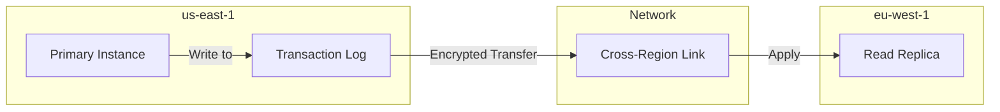
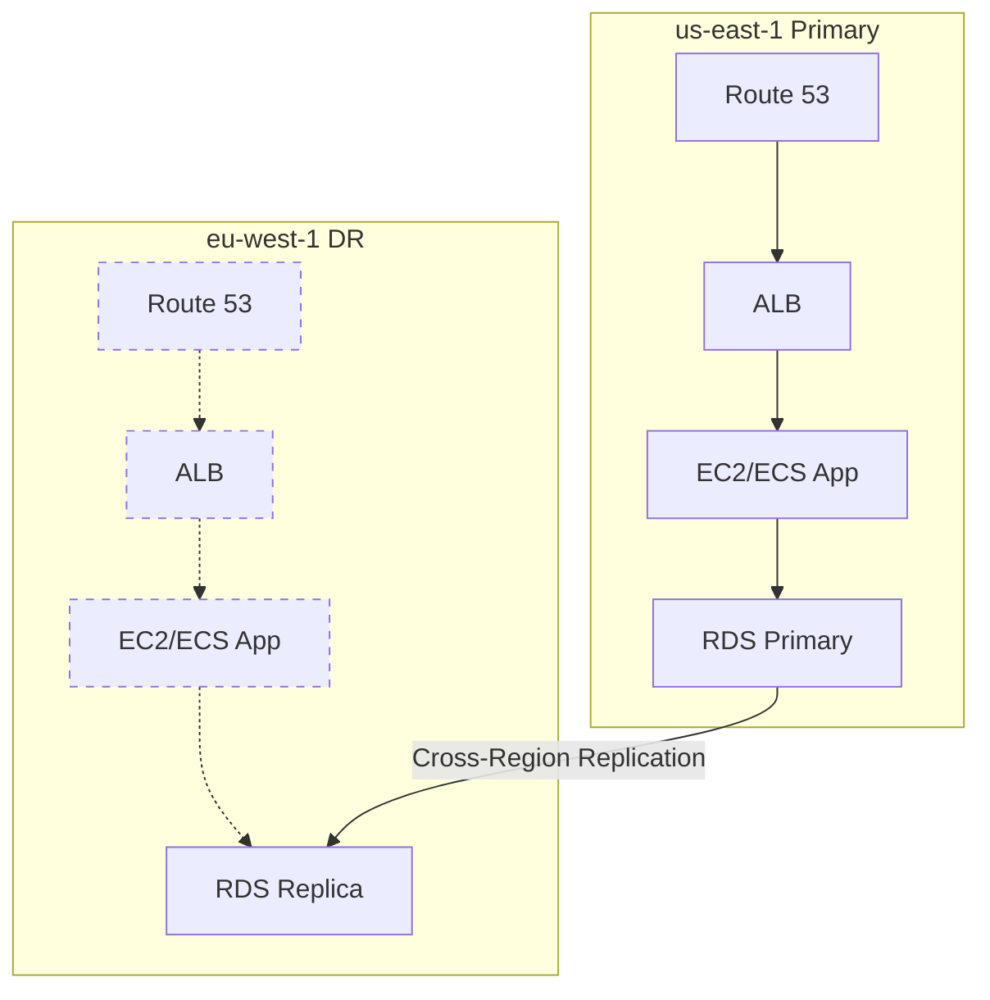

# How to Create Cross-Region RDS Read Replicas

Author: [nawazdhandala](https://github.com/nawazdhandala)

Tags: AWS, RDS, Read Replicas, Disaster Recovery

Description: Learn how to create cross-region RDS read replicas for disaster recovery, lower latency reads, and regional data distribution.

---

Cross-region read replicas take the read replica concept and extend it across AWS regions. Instead of just distributing reads within a single region, you can have replicas in completely different geographic areas. This gives you disaster recovery, lower-latency reads for users in other regions, and a way to migrate databases between regions. Let's dig into how to set them up and what to watch out for.

## Why Cross-Region Replicas?

There are three main reasons to create cross-region replicas:

**Disaster recovery**: If your primary region goes down, you can promote the cross-region replica to a standalone instance in minutes. This gives you a recovery point objective (RPO) measured in seconds and a recovery time objective (RTO) measured in minutes.

**Lower latency for distributed users**: If your primary database is in us-east-1 but you have users in Europe, a replica in eu-west-1 can serve their reads with much lower latency.

**Regional migration**: Moving your database to a new region? Set up a cross-region replica, let it sync, then promote it. Much smoother than dump-and-restore.

## Prerequisites

Before creating a cross-region replica, you need:

- The source instance must have automated backups enabled (backup retention > 0)
- The source must not be encrypted with the default RDS encryption key if you want encrypted replicas in another region (use a custom KMS key instead)
- VPC security groups in the destination region that allow the replica to function
- A DB subnet group in the destination region

## Creating a Cross-Region Replica

The command runs from the destination region, referencing the source by its full ARN.

This creates a cross-region replica in eu-west-1 from a source in us-east-1.

```bash
aws rds create-db-instance-read-replica \
  --db-instance-identifier my-db-eu-replica \
  --source-db-instance-identifier arn:aws:rds:us-east-1:123456789012:db:my-primary-db \
  --db-instance-class db.r6g.large \
  --region eu-west-1 \
  --db-subnet-group-name eu-db-subnet-group \
  --vpc-security-group-ids sg-eu-db-123 \
  --storage-encrypted \
  --kms-key-id arn:aws:kms:eu-west-1:123456789012:key/abc-def-123 \
  --no-publicly-accessible \
  --tags Key=Role,Value=cross-region-replica Key=SourceRegion,Value=us-east-1
```

Key differences from same-region replicas:
- You must use the full ARN for `--source-db-instance-identifier`
- You specify `--region` for the destination region
- If the source is encrypted, you need a KMS key in the destination region
- You need a subnet group in the destination region

## The Replication Flow

Cross-region replication works differently from same-region replication under the hood.



1. Writes happen on the primary in the source region
2. Transaction logs are shipped across regions over an encrypted link
3. The replica applies the transaction logs asynchronously

The cross-region network adds latency to replication. Expect replica lag of 1-5 seconds under normal conditions, compared to sub-second lag for same-region replicas. During write-heavy periods, lag can be higher.

## Encryption Considerations

Cross-region replicas with encryption require careful KMS key management.

**If the source is unencrypted**: You can create an encrypted cross-region replica by specifying a KMS key in the destination region.

**If the source is encrypted with a custom KMS key**: You must specify a KMS key in the destination region. The source key is used to decrypt the snapshot during initial sync, and the destination key encrypts the replica.

**If the source is encrypted with the default RDS key**: You cannot create a cross-region replica. The default RDS key is region-specific and can't be shared. You'll need to migrate to a custom KMS key first.

This script migrates an RDS instance from the default key to a custom KMS key.

```bash
# Step 1: Create a custom KMS key
KMS_KEY=$(aws kms create-key \
  --description "RDS encryption key" \
  --query 'KeyMetadata.KeyId' --output text)

# Step 2: Create a snapshot of the current instance
aws rds create-db-snapshot \
  --db-instance-identifier my-primary-db \
  --db-snapshot-identifier my-db-snapshot-for-migration

# Step 3: Copy the snapshot with the new KMS key
aws rds copy-db-snapshot \
  --source-db-snapshot-identifier my-db-snapshot-for-migration \
  --target-db-snapshot-identifier my-db-snapshot-custom-key \
  --kms-key-id $KMS_KEY

# Step 4: Restore from the snapshot with custom key
aws rds restore-db-instance-from-db-snapshot \
  --db-instance-identifier my-primary-db-new \
  --db-snapshot-identifier my-db-snapshot-custom-key
```

## Monitoring Cross-Region Replica Lag

Replica lag is even more important for cross-region replicas because the network distance adds latency.

This CloudWatch query checks the replica lag trend over the last 6 hours.

```bash
aws cloudwatch get-metric-statistics \
  --namespace AWS/RDS \
  --metric-name ReplicaLag \
  --dimensions Name=DBInstanceIdentifier,Value=my-db-eu-replica \
  --start-time $(date -u -d '6 hours ago' +%Y-%m-%dT%H:%M:%S) \
  --end-time $(date -u +%Y-%m-%dT%H:%M:%S) \
  --period 300 \
  --statistics Average,Maximum \
  --unit Seconds \
  --region eu-west-1
```

Set up CloudWatch alarms for replica lag.

This creates an alarm that triggers when replica lag exceeds 60 seconds.

```bash
aws cloudwatch put-metric-alarm \
  --alarm-name cross-region-replica-lag \
  --metric-name ReplicaLag \
  --namespace AWS/RDS \
  --dimensions Name=DBInstanceIdentifier,Value=my-db-eu-replica \
  --statistic Average \
  --period 300 \
  --evaluation-periods 3 \
  --threshold 60 \
  --comparison-operator GreaterThanThreshold \
  --alarm-actions arn:aws:sns:eu-west-1:123456789012:rds-alerts \
  --region eu-west-1
```

## Data Transfer Costs

Cross-region replication incurs data transfer charges for the data sent between regions. The cost depends on the regions involved:

- US regions to US regions: ~$0.02/GB
- US to Europe: ~$0.02/GB
- US to Asia Pacific: ~$0.09/GB

For a database with 10 GB of daily write volume, that's roughly $0.20-$0.90/day depending on regions. Not huge, but it adds up for write-heavy workloads.

## Disaster Recovery with Cross-Region Replicas

The primary use case for cross-region replicas is DR. Here's an automated failover script.

This script promotes the cross-region replica and reconfigures it for production use.

```python
import boto3
import time

def failover_to_region(replica_id, replica_region):
    rds = boto3.client('rds', region_name=replica_region)

    # Check current replica lag before promotion
    cw = boto3.client('cloudwatch', region_name=replica_region)
    lag = cw.get_metric_statistics(
        Namespace='AWS/RDS',
        MetricName='ReplicaLag',
        Dimensions=[{'Name': 'DBInstanceIdentifier', 'Value': replica_id}],
        StartTime=time.strftime('%Y-%m-%dT%H:%M:%S', time.gmtime(time.time() - 300)),
        EndTime=time.strftime('%Y-%m-%dT%H:%M:%S', time.gmtime()),
        Period=60,
        Statistics=['Average']
    )

    if lag['Datapoints']:
        avg_lag = lag['Datapoints'][-1]['Average']
        print(f"Current replica lag: {avg_lag:.1f} seconds")
        print(f"Potential data loss: up to {avg_lag:.1f} seconds of transactions")

    # Promote the replica
    print(f"Promoting {replica_id} in {replica_region}...")
    rds.promote_read_replica(
        DBInstanceIdentifier=replica_id,
        BackupRetentionPeriod=7
    )

    # Wait for promotion
    waiter = rds.get_waiter('db_instance_available')
    waiter.wait(DBInstanceIdentifier=replica_id)

    # Enable Multi-AZ on the new primary
    rds.modify_db_instance(
        DBInstanceIdentifier=replica_id,
        MultiAZ=True,
        DeletionProtection=True,
        ApplyImmediately=True
    )

    # Get the endpoint
    response = rds.describe_db_instances(DBInstanceIdentifier=replica_id)
    endpoint = response['DBInstances'][0]['Endpoint']['Address']
    print(f"Failover complete. New primary endpoint: {endpoint}")
    return endpoint

# Execute failover
new_endpoint = failover_to_region('my-db-eu-replica', 'eu-west-1')
```

## Multi-Region Architecture

For a robust multi-region setup, combine cross-region replicas with other AWS services.



Route 53 health checks can detect when the primary region is down and automatically route traffic to the DR region. The application in the DR region promotes the replica and starts serving traffic.

## Limitations

Be aware of these cross-region replica limitations:

1. **No cascading replicas**: You can't create a replica of a cross-region replica
2. **Engine support**: MySQL, MariaDB, PostgreSQL, and Oracle support cross-region replicas. SQL Server does not.
3. **Maximum replicas**: You can have up to 5 cross-region replicas per source instance
4. **Replica lag**: Will always be higher than same-region due to network latency
5. **No automatic failover**: Unlike Multi-AZ, cross-region failover requires manual promotion

## Wrapping Up

Cross-region read replicas are a powerful tool for disaster recovery and global read performance. The setup is straightforward - it's really just one CLI command - but the operational considerations around encryption, monitoring, and failover procedures require planning. For production DR, document your failover procedure, automate it as much as possible, and test it regularly. For monitoring replica health across regions, consider using [OneUptime](https://oneuptime.com/blog/post/2026-02-13-aws-cloudwatch-infrastructure-monitoring/view) to get a unified view of your multi-region database infrastructure.
