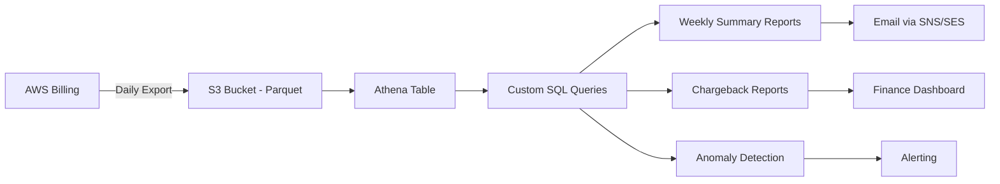

# How to Create Custom AWS Billing Reports with CUR 2.0

Author: [nawazdhandala](https://github.com/nawazdhandala)

Tags: AWS, Billing, CUR, Cost Management, FinOps, Data Exports

Description: Learn how to create custom AWS billing reports using Cost and Usage Report 2.0 (Data Exports) for detailed cost analysis and chargeback reporting.

---

If you have ever tried to understand your AWS bill beyond the high-level Cost Explorer view, you have probably encountered the Cost and Usage Report (CUR). CUR has been the gold standard for detailed billing data for years. But the original CUR had its quirks - large file sizes, complex column structures, and limited query options. CUR 2.0, now called AWS Data Exports, fixes many of these issues with a cleaner schema, better integration with analytics tools, and more flexible delivery options.

This guide covers setting up CUR 2.0, querying it with Athena, and building custom billing reports for your organization.

## What Changed in CUR 2.0?

CUR 2.0 (Data Exports) brings several improvements:

- **Simplified column names.** No more camelCase mixed with snake_case. Columns follow a consistent naming convention.
- **SQL-based column selection.** You define which columns you want using SQL, so you only get what you need.
- **Parquet by default.** Better compression and faster query performance compared to CSV.
- **Direct Athena integration.** The export automatically creates and maintains an Athena table.
- **Smaller, more manageable files.** Better partitioning means faster queries.

## Prerequisites

- AWS account with billing access
- S3 bucket for report storage
- Amazon Athena set up with a workgroup and query results location
- IAM permissions for `bcm-data-exports:*`, `s3:*` on your bucket, and `athena:*`

## Step 1: Create a Data Export

You can create a data export through the console or CLI. Let us use the CLI for repeatability.

First, define the export configuration:

```bash
# Create a CUR 2.0 data export
aws bcm-data-exports create-export \
  --export '{
    "Name": "monthly-detailed-billing",
    "Description": "Detailed monthly billing report for all accounts",
    "DataQuery": {
      "QueryStatement": "SELECT identity_line_item_id, identity_time_interval, bill_billing_period_start_date, bill_billing_period_end_date, bill_payer_account_id, line_item_usage_account_id, line_item_line_item_type, line_item_usage_start_date, line_item_usage_end_date, line_item_product_code, line_item_usage_type, line_item_operation, line_item_resource_id, line_item_usage_amount, line_item_unblended_cost, line_item_blended_cost, product_product_name, product_region, pricing_term, pricing_unit, resource_tags FROM COST_AND_USAGE_REPORT",
      "TableConfigurations": {
        "COST_AND_USAGE_REPORT": {
          "TIME_GRANULARITY": "DAILY",
          "INCLUDE_RESOURCES": "TRUE",
          "INCLUDE_MANUAL_DISCOUNT_COMPATIBILITY": "FALSE",
          "INCLUDE_SPLIT_COST_ALLOCATION_DATA": "FALSE"
        }
      }
    },
    "DestinationConfigurations": {
      "S3Destination": {
        "S3Bucket": "my-billing-reports-123456789012",
        "S3Prefix": "cur2/",
        "S3Region": "us-east-1",
        "S3OutputConfigurations": {
          "OutputType": "CUSTOM",
          "Format": "PARQUET",
          "Compression": "PARQUET",
          "Overwrite": "OVERWRITE_REPORT"
        }
      }
    },
    "RefreshCadence": {
      "Frequency": "SYNCHRONOUS"
    }
  }'
```

This creates a daily-granularity report that includes resource IDs and tags, delivered in Parquet format.

## Step 2: Set Up the S3 Bucket

Make sure your S3 bucket has the right policy:

```bash
# Create the bucket if it does not exist
aws s3 mb s3://my-billing-reports-123456789012 --region us-east-1

# Apply the bucket policy for Data Exports
aws s3api put-bucket-policy \
  --bucket my-billing-reports-123456789012 \
  --policy '{
    "Version": "2012-10-17",
    "Statement": [
      {
        "Effect": "Allow",
        "Principal": {
          "Service": "bcm-data-exports.amazonaws.com"
        },
        "Action": [
          "s3:PutObject",
          "s3:GetBucketLocation"
        ],
        "Resource": [
          "arn:aws:s3:::my-billing-reports-123456789012",
          "arn:aws:s3:::my-billing-reports-123456789012/*"
        ],
        "Condition": {
          "StringEquals": {
            "aws:SourceAccount": "123456789012"
          }
        }
      }
    ]
  }'
```

## Step 3: Query with Amazon Athena

Once the first export is delivered (usually within 24 hours), you can query it with Athena. CUR 2.0 can automatically create the Athena table for you, but here is how to set it up manually:

```sql
-- Create the Athena table for CUR 2.0 data
CREATE EXTERNAL TABLE IF NOT EXISTS billing_reports (
    identity_line_item_id STRING,
    identity_time_interval STRING,
    bill_billing_period_start_date STRING,
    bill_payer_account_id STRING,
    line_item_usage_account_id STRING,
    line_item_line_item_type STRING,
    line_item_usage_start_date STRING,
    line_item_usage_end_date STRING,
    line_item_product_code STRING,
    line_item_usage_type STRING,
    line_item_operation STRING,
    line_item_resource_id STRING,
    line_item_usage_amount DOUBLE,
    line_item_unblended_cost DOUBLE,
    line_item_blended_cost DOUBLE,
    product_product_name STRING,
    product_region STRING,
    pricing_term STRING,
    pricing_unit STRING,
    resource_tags STRING
)
STORED AS PARQUET
LOCATION 's3://my-billing-reports-123456789012/cur2/'
TBLPROPERTIES ('parquet.compression'='SNAPPY');
```

## Step 4: Build Custom Reports

Now the fun part. Here are practical queries for common billing reports.

Top 10 most expensive services this month:

```sql
-- Top 10 most expensive services
SELECT
    line_item_product_code AS service,
    product_product_name AS service_name,
    ROUND(SUM(line_item_unblended_cost), 2) AS total_cost
FROM billing_reports
WHERE bill_billing_period_start_date = '2026-02-01'
    AND line_item_line_item_type = 'Usage'
GROUP BY line_item_product_code, product_product_name
ORDER BY total_cost DESC
LIMIT 10;
```

Cost per account per service:

```sql
-- Cost breakdown by account and service
SELECT
    line_item_usage_account_id AS account_id,
    line_item_product_code AS service,
    ROUND(SUM(line_item_unblended_cost), 2) AS total_cost,
    ROUND(SUM(line_item_usage_amount), 2) AS total_usage
FROM billing_reports
WHERE bill_billing_period_start_date = '2026-02-01'
GROUP BY line_item_usage_account_id, line_item_product_code
HAVING SUM(line_item_unblended_cost) > 10
ORDER BY account_id, total_cost DESC;
```

Daily cost trend:

```sql
-- Daily cost trend for the current month
SELECT
    DATE(line_item_usage_start_date) AS usage_date,
    ROUND(SUM(line_item_unblended_cost), 2) AS daily_cost
FROM billing_reports
WHERE bill_billing_period_start_date = '2026-02-01'
    AND line_item_line_item_type = 'Usage'
GROUP BY DATE(line_item_usage_start_date)
ORDER BY usage_date;
```

Resource-level costs (most expensive resources):

```sql
-- Top 20 most expensive individual resources
SELECT
    line_item_resource_id AS resource_id,
    line_item_product_code AS service,
    product_region AS region,
    ROUND(SUM(line_item_unblended_cost), 2) AS total_cost
FROM billing_reports
WHERE bill_billing_period_start_date = '2026-02-01'
    AND line_item_resource_id != ''
    AND line_item_line_item_type = 'Usage'
GROUP BY line_item_resource_id, line_item_product_code, product_region
ORDER BY total_cost DESC
LIMIT 20;
```

## Step 5: Automate Report Generation

Use a Lambda function with Athena to generate reports on a schedule:

```python
# Lambda function to generate weekly billing summary
import boto3
import time

def lambda_handler(event, context):
    athena = boto3.client('athena')

    query = """
    SELECT
        line_item_usage_account_id AS account_id,
        line_item_product_code AS service,
        product_region AS region,
        ROUND(SUM(line_item_unblended_cost), 2) AS weekly_cost
    FROM billing_reports
    WHERE line_item_usage_start_date >= date_add('day', -7, current_date)
    GROUP BY line_item_usage_account_id,
             line_item_product_code,
             product_region
    HAVING SUM(line_item_unblended_cost) > 1
    ORDER BY weekly_cost DESC
    """

    # Execute the query
    response = athena.start_query_execution(
        QueryString=query,
        QueryExecutionContext={'Database': 'billing_db'},
        ResultConfiguration={
            'OutputLocation': 's3://my-billing-reports-123456789012/athena-results/'
        }
    )

    query_id = response['QueryExecutionId']

    # Wait for completion
    while True:
        result = athena.get_query_execution(QueryExecutionId=query_id)
        state = result['QueryExecution']['Status']['State']
        if state in ['SUCCEEDED', 'FAILED', 'CANCELLED']:
            break
        time.sleep(2)

    if state == 'SUCCEEDED':
        return {
            'statusCode': 200,
            'body': f'Report generated: {query_id}',
            'resultLocation': result['QueryExecution']['ResultConfiguration']['OutputLocation']
        }
    else:
        return {
            'statusCode': 500,
            'body': f'Query failed: {state}'
        }
```

## CUR 2.0 Data Flow



## Best Practices

1. **Select only the columns you need.** CUR data can be massive. Using the SQL-based column selection in CUR 2.0 significantly reduces storage costs and query times.

2. **Use Parquet format.** Always use Parquet over CSV. The compression is better, and Athena queries run much faster on Parquet data.

3. **Partition by billing period.** The default partitioning by billing period works well for most queries. Avoid over-partitioning.

4. **Set up lifecycle policies on S3.** Old billing data adds up. Move data older than 12 months to Glacier or delete it based on your retention requirements.

5. **Create saved queries in Athena.** Build a library of common queries that your finance and engineering teams can run on demand.

6. **Monitor your Athena costs.** Querying large billing datasets is not free. Use Athena workgroups with query limits to prevent runaway costs.

For more ways to optimize your AWS costs, check out our guide on [optimizing data transfer costs with VPC endpoints](https://oneuptime.com/blog/post/2026-02-12-optimize-data-transfer-costs-with-vpc-endpoints/view).

## Wrapping Up

CUR 2.0 (Data Exports) gives you the raw material to build any billing report your organization needs. The SQL-based column selection, Parquet delivery, and native Athena integration make it dramatically easier to work with compared to the original CUR. Start with the basic queries in this guide, customize them for your reporting needs, and automate the generation and delivery of reports. Once your finance and engineering teams have access to granular billing data, cost optimization becomes a data-driven process rather than guesswork.
