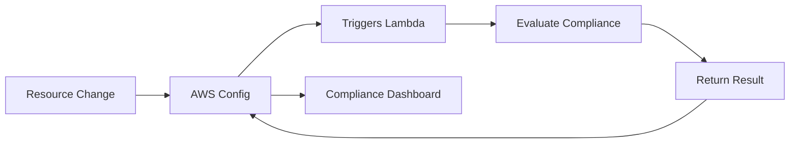

# How to Create Custom AWS Config Rules

Author: [nawazdhandala](https://github.com/nawazdhandala)

Tags: AWS, Config, Compliance, Lambda, Security

Description: Learn how to build custom AWS Config rules using Lambda functions to enforce organization-specific compliance policies that managed rules don't cover.

---

AWS provides over 300 managed Config rules, but they can't cover every compliance requirement your organization has. Maybe you need to verify that all EC2 instances use a specific AMI approved by your security team. Or that RDS instances in production accounts have a minimum backup retention period of 30 days. Or that Lambda functions don't use runtime versions you've deprecated.

Custom Config rules let you write your own compliance logic as Lambda functions. Config triggers your function whenever a resource changes (or on a schedule), and your function returns a compliance verdict. It's flexible enough to encode virtually any compliance requirement.

## How Custom Config Rules Work

The flow looks like this:



There are two trigger types:

1. **Configuration change triggered** - Your Lambda runs whenever a tracked resource is created, changed, or deleted. Use this for rules that check resource properties.
2. **Periodic triggered** - Your Lambda runs on a schedule (every 1, 3, 6, 12, or 24 hours). Use this for rules that check things not directly tied to a single resource change.

## Writing Your First Custom Rule

Let's start with a practical example: a rule that checks if EC2 instances are using approved AMIs.

### The Lambda Function

```python
import json
import boto3

# List of approved AMI IDs
APPROVED_AMIS = [
    'ami-0abcdef1234567890',
    'ami-0fedcba9876543210',
]

config = boto3.client('config')

def handler(event, context):
    # Parse the invoking event
    invoking_event = json.loads(event['invokingEvent'])
    rule_parameters = json.loads(event.get('ruleParameters', '{}'))

    # Get the configuration item (the resource being evaluated)
    configuration_item = invoking_event.get('configurationItem')

    if not configuration_item:
        # This can happen for oversized configuration items
        return

    # Only evaluate EC2 instances
    if configuration_item['resourceType'] != 'AWS::EC2::Instance':
        return

    # Check if the instance is using an approved AMI
    ami_id = configuration_item['configuration'].get('imageId', '')

    if ami_id in APPROVED_AMIS:
        compliance = 'COMPLIANT'
        annotation = f'Instance is using approved AMI {ami_id}'
    else:
        compliance = 'NON_COMPLIANT'
        annotation = f'Instance is using unapproved AMI {ami_id}. Approved AMIs: {", ".join(APPROVED_AMIS)}'

    # Report the evaluation result back to Config
    config.put_evaluations(
        Evaluations=[{
            'ComplianceResourceType': configuration_item['resourceType'],
            'ComplianceResourceId': configuration_item['resourceId'],
            'ComplianceType': compliance,
            'Annotation': annotation,
            'OrderingTimestamp': configuration_item['configurationItemCaptureTime']
        }],
        ResultToken=event['resultToken']
    )
```

### Creating the Lambda Function

Package and deploy the Lambda function.

```bash
# Create the deployment package
zip function.zip lambda_function.py

# Create the Lambda function
aws lambda create-function \
  --function-name config-rule-approved-amis \
  --runtime python3.12 \
  --handler lambda_function.handler \
  --role arn:aws:iam::111111111111:role/ConfigRuleLambdaRole \
  --zip-file fileb://function.zip \
  --timeout 60
```

The Lambda role needs these permissions.

```json
{
  "Version": "2012-10-17",
  "Statement": [
    {
      "Effect": "Allow",
      "Action": [
        "config:PutEvaluations"
      ],
      "Resource": "*"
    },
    {
      "Effect": "Allow",
      "Action": [
        "logs:CreateLogGroup",
        "logs:CreateLogStream",
        "logs:PutLogEvents"
      ],
      "Resource": "arn:aws:logs:*:*:*"
    }
  ]
}
```

You also need to give Config permission to invoke your Lambda function.

```bash
# Allow Config to invoke the Lambda function
aws lambda add-permission \
  --function-name config-rule-approved-amis \
  --statement-id AllowConfigInvoke \
  --action lambda:InvokeFunction \
  --principal config.amazonaws.com \
  --source-account 111111111111
```

### Registering the Config Rule

Now create the Config rule that uses your Lambda function.

```bash
aws configservice put-config-rule \
  --config-rule '{
    "ConfigRuleName": "ec2-approved-amis",
    "Description": "Checks that EC2 instances use approved AMIs",
    "Scope": {
      "ComplianceResourceTypes": ["AWS::EC2::Instance"]
    },
    "Source": {
      "Owner": "CUSTOM_LAMBDA",
      "SourceIdentifier": "arn:aws:lambda:us-east-1:111111111111:function:config-rule-approved-amis",
      "SourceDetails": [{
        "EventSource": "aws.config",
        "MessageType": "ConfigurationItemChangeNotification"
      }]
    },
    "InputParameters": "{}"
  }'
```

## More Custom Rule Examples

### Check RDS Backup Retention

This rule verifies that RDS instances have a minimum backup retention period.

```python
import json
import boto3

config = boto3.client('config')

def handler(event, context):
    invoking_event = json.loads(event['invokingEvent'])
    rule_parameters = json.loads(event.get('ruleParameters', '{}'))

    # Get minimum retention from rule parameters, default to 7
    min_retention = int(rule_parameters.get('minRetentionDays', 7))

    configuration_item = invoking_event.get('configurationItem')
    if not configuration_item:
        return

    if configuration_item['resourceType'] != 'AWS::RDS::DBInstance':
        return

    # Check backup retention period
    retention = configuration_item['configuration'].get('backupRetentionPeriod', 0)

    if retention >= min_retention:
        compliance = 'COMPLIANT'
        annotation = f'Backup retention is {retention} days (minimum: {min_retention})'
    else:
        compliance = 'NON_COMPLIANT'
        annotation = f'Backup retention is {retention} days, below minimum of {min_retention}'

    config.put_evaluations(
        Evaluations=[{
            'ComplianceResourceType': configuration_item['resourceType'],
            'ComplianceResourceId': configuration_item['resourceId'],
            'ComplianceType': compliance,
            'Annotation': annotation,
            'OrderingTimestamp': configuration_item['configurationItemCaptureTime']
        }],
        ResultToken=event['resultToken']
    )
```

Register this rule with input parameters.

```bash
aws configservice put-config-rule \
  --config-rule '{
    "ConfigRuleName": "rds-minimum-backup-retention",
    "Description": "Checks RDS backup retention meets minimum requirement",
    "Scope": {
      "ComplianceResourceTypes": ["AWS::RDS::DBInstance"]
    },
    "Source": {
      "Owner": "CUSTOM_LAMBDA",
      "SourceIdentifier": "arn:aws:lambda:us-east-1:111111111111:function:config-rule-rds-retention",
      "SourceDetails": [{
        "EventSource": "aws.config",
        "MessageType": "ConfigurationItemChangeNotification"
      }]
    },
    "InputParameters": "{\"minRetentionDays\": \"30\"}"
  }'
```

### Check Required Tags

This periodic rule checks all resources for required tags.

```python
import json
import boto3
from datetime import datetime

config = boto3.client('config')

REQUIRED_TAGS = ['Environment', 'Owner', 'CostCenter']

def handler(event, context):
    invoking_event = json.loads(event['invokingEvent'])
    rule_parameters = json.loads(event.get('ruleParameters', '{}'))

    # For periodic rules, we need to list and evaluate all resources
    resource_types = ['AWS::EC2::Instance', 'AWS::RDS::DBInstance', 'AWS::S3::Bucket']
    evaluations = []

    for resource_type in resource_types:
        paginator = config.get_paginator('list_discovered_resources')
        for page in paginator.paginate(resourceType=resource_type):
            for resource in page.get('resourceIdentifiers', []):
                # Get the resource's current configuration
                result = config.get_resource_config_history(
                    resourceType=resource_type,
                    resourceId=resource['resourceId'],
                    limit=1
                )

                if not result['configurationItems']:
                    continue

                item = result['configurationItems'][0]
                tags = item.get('tags', {})

                missing_tags = [t for t in REQUIRED_TAGS if t not in tags]

                if not missing_tags:
                    compliance = 'COMPLIANT'
                    annotation = 'All required tags present'
                else:
                    compliance = 'NON_COMPLIANT'
                    annotation = f'Missing required tags: {", ".join(missing_tags)}'

                evaluations.append({
                    'ComplianceResourceType': resource_type,
                    'ComplianceResourceId': resource['resourceId'],
                    'ComplianceType': compliance,
                    'Annotation': annotation[:255],
                    'OrderingTimestamp': datetime.utcnow().isoformat() + 'Z'
                })

    # Put evaluations in batches of 100
    for i in range(0, len(evaluations), 100):
        config.put_evaluations(
            Evaluations=evaluations[i:i+100],
            ResultToken=event['resultToken']
        )
```

## Terraform for Custom Rules

Here's a complete Terraform module for deploying a custom Config rule.

```hcl
resource "aws_lambda_function" "config_rule" {
  filename         = "function.zip"
  function_name    = "config-rule-approved-amis"
  role             = aws_iam_role.config_rule_lambda.arn
  handler          = "lambda_function.handler"
  runtime          = "python3.12"
  timeout          = 60
  source_code_hash = filebase64sha256("function.zip")
}

resource "aws_lambda_permission" "config" {
  statement_id  = "AllowConfigInvoke"
  action        = "lambda:InvokeFunction"
  function_name = aws_lambda_function.config_rule.function_name
  principal     = "config.amazonaws.com"
  source_account = data.aws_caller_identity.current.account_id
}

resource "aws_config_config_rule" "approved_amis" {
  name        = "ec2-approved-amis"
  description = "Checks that EC2 instances use approved AMIs"

  scope {
    compliance_resource_types = ["AWS::EC2::Instance"]
  }

  source {
    owner             = "CUSTOM_LAMBDA"
    source_identifier = aws_lambda_function.config_rule.arn

    source_detail {
      event_source = "aws.config"
      message_type = "ConfigurationItemChangeNotification"
    }
  }

  depends_on = [aws_lambda_permission.config]
}
```

## Testing Custom Rules

You can test your Lambda function locally by creating a sample event.

```json
{
  "invokingEvent": "{\"configurationItem\":{\"resourceType\":\"AWS::EC2::Instance\",\"resourceId\":\"i-1234567890abcdef0\",\"configuration\":{\"imageId\":\"ami-0abcdef1234567890\"},\"configurationItemCaptureTime\":\"2026-02-12T00:00:00.000Z\"},\"messageType\":\"ConfigurationItemChangeNotification\"}",
  "ruleParameters": "{}",
  "resultToken": "test-token",
  "eventLeftScope": false,
  "executionRoleArn": "arn:aws:iam::111111111111:role/AWSConfigRole",
  "configRuleArn": "arn:aws:config:us-east-1:111111111111:config-rule/config-rule-abc123",
  "configRuleName": "ec2-approved-amis",
  "configRuleId": "config-rule-abc123",
  "accountId": "111111111111"
}
```

After deploying, trigger a manual evaluation to verify the rule works.

```bash
# Trigger a re-evaluation of the rule
aws configservice start-config-rules-evaluation \
  --config-rule-names ec2-approved-amis

# Check compliance results
aws configservice get-compliance-details-by-config-rule \
  --config-rule-name ec2-approved-amis \
  --compliance-types NON_COMPLIANT
```

## Next Steps

Once you've got custom rules working, you might want to [set up automatic remediation](https://oneuptime.com/blog/post/2026-02-12-remediate-non-compliant-resources-aws-config/view) for non-compliant resources. And for deploying rules across multiple accounts, look into [Config conformance packs](https://oneuptime.com/blog/post/2026-02-12-aws-config-conformance-packs/view) or [Config aggregators](https://oneuptime.com/blog/post/2026-02-12-aws-config-aggregators-multi-account/view).
