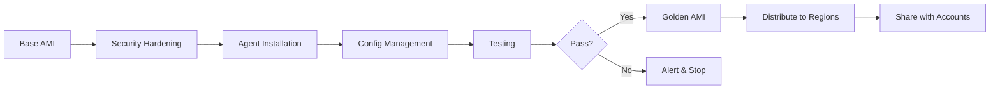

# How to Create Custom Golden AMIs with EC2 Image Builder Pipelines

Author: [nawazdhandala](https://github.com/nawazdhandala)

Tags: AWS, EC2, AMI, Image Builder, Golden AMI, Security, DevOps

Description: Build hardened, standardized golden AMIs using EC2 Image Builder pipelines with security baselines, compliance checks, and automated distribution.

---

A golden AMI is the blessed, approved machine image that every instance in your organization should be launched from. It's got your security baseline baked in, the right monitoring agents installed, and all the compliance requirements handled before your application code ever touches it. Building these by hand is fragile. EC2 Image Builder pipelines make it repeatable.

## What Makes an AMI "Golden"

A golden AMI isn't just any AMI you created. It's a standardized image that meets specific organizational requirements:

- Operating system patches applied
- Security hardening (CIS benchmarks, STIG compliance)
- Monitoring and logging agents installed
- Standard tools and utilities included
- Organization-specific configurations applied
- Validated through automated tests

The goal is that any team in your org can launch an instance from the golden AMI and immediately have a secure, compliant base to build on.

## Architecture of a Golden AMI Pipeline

Here's how the pieces fit together:



## Setting Up the Component Library

The power of golden AMIs comes from having a library of reusable components. Let's build the key ones.

This first component handles OS hardening based on CIS benchmarks:

```yaml
# cis-hardening-component.yml
name: CISHardening
description: Apply CIS Level 1 hardening to Amazon Linux 2023
schemaVersion: 1.0

phases:
  - name: build
    steps:
      - name: DisableUnusedFilesystems
        action: ExecuteBash
        inputs:
          commands:
            - |
              # Disable unused filesystem types
              for fs in cramfs freevxfs jffs2 hfs hfsplus squashfs udf; do
                echo "install $fs /bin/true" >> /etc/modprobe.d/disable-filesystems.conf
              done

      - name: ConfigureSSH
        action: ExecuteBash
        inputs:
          commands:
            - |
              # Harden SSH configuration
              cp /etc/ssh/sshd_config /etc/ssh/sshd_config.bak

              # Set secure SSH defaults
              sed -i 's/#PermitRootLogin yes/PermitRootLogin no/' /etc/ssh/sshd_config
              sed -i 's/#MaxAuthTries 6/MaxAuthTries 4/' /etc/ssh/sshd_config
              sed -i 's/#PermitEmptyPasswords no/PermitEmptyPasswords no/' /etc/ssh/sshd_config
              sed -i 's/#ClientAliveInterval 0/ClientAliveInterval 300/' /etc/ssh/sshd_config
              sed -i 's/#ClientAliveCountMax 3/ClientAliveCountMax 2/' /etc/ssh/sshd_config

              echo "Protocol 2" >> /etc/ssh/sshd_config

      - name: ConfigureAuditd
        action: ExecuteBash
        inputs:
          commands:
            - |
              # Install and configure auditd for security logging
              yum install -y audit
              systemctl enable auditd

              # Add audit rules for key file changes
              cat >> /etc/audit/rules.d/cis.rules << 'RULES'
              -w /etc/passwd -p wa -k identity
              -w /etc/group -p wa -k identity
              -w /etc/shadow -p wa -k identity
              -w /etc/sudoers -p wa -k sudoers
              -w /var/log/lastlog -p wa -k logins
              RULES

      - name: ConfigureFirewall
        action: ExecuteBash
        inputs:
          commands:
            - |
              # Set up iptables with a default deny policy
              yum install -y iptables-services
              systemctl enable iptables

              # Allow established connections and loopback
              iptables -A INPUT -m state --state ESTABLISHED,RELATED -j ACCEPT
              iptables -A INPUT -i lo -j ACCEPT
              iptables -A INPUT -p tcp --dport 22 -j ACCEPT
              iptables -P INPUT DROP
              iptables -P FORWARD DROP

              service iptables save
```

Next, a component that installs monitoring agents:

```yaml
# monitoring-agents-component.yml
name: MonitoringAgents
description: Install CloudWatch agent and other monitoring tools
schemaVersion: 1.0

phases:
  - name: build
    steps:
      - name: InstallCloudWatchAgent
        action: ExecuteBash
        inputs:
          commands:
            - |
              # Install the CloudWatch agent
              yum install -y amazon-cloudwatch-agent

              # Create default config for memory and disk metrics
              cat > /opt/aws/amazon-cloudwatch-agent/etc/config.json << 'CONFIG'
              {
                "metrics": {
                  "namespace": "Custom/EC2",
                  "metrics_collected": {
                    "mem": {
                      "measurement": ["mem_used_percent"],
                      "metrics_collection_interval": 60
                    },
                    "disk": {
                      "measurement": ["disk_used_percent"],
                      "resources": ["/"],
                      "metrics_collection_interval": 60
                    }
                  }
                },
                "logs": {
                  "logs_collected": {
                    "files": {
                      "collect_list": [
                        {
                          "file_path": "/var/log/messages",
                          "log_group_name": "/ec2/system/messages",
                          "log_stream_name": "{instance_id}"
                        },
                        {
                          "file_path": "/var/log/secure",
                          "log_group_name": "/ec2/system/secure",
                          "log_stream_name": "{instance_id}"
                        }
                      ]
                    }
                  }
                }
              }
              CONFIG

      - name: InstallSSMAgent
        action: ExecuteBash
        inputs:
          commands:
            - |
              # Ensure SSM agent is installed and enabled
              yum install -y amazon-ssm-agent
              systemctl enable amazon-ssm-agent
```

And a component for standard tools every instance needs:

```yaml
# standard-tools-component.yml
name: StandardTools
description: Install organization standard tools and utilities
schemaVersion: 1.0

phases:
  - name: build
    steps:
      - name: InstallTools
        action: ExecuteBash
        inputs:
          commands:
            - |
              # Install common utilities that every team needs
              yum install -y \
                jq \
                htop \
                tmux \
                git \
                unzip \
                wget \
                nmap-ncat \
                bind-utils \
                tcpdump \
                strace

              # Install AWS CLI v2
              curl "https://awscli.amazonaws.com/awscli-exe-linux-x86_64.zip" -o "/tmp/awscliv2.zip"
              unzip -q /tmp/awscliv2.zip -d /tmp
              /tmp/aws/install
              rm -rf /tmp/aws /tmp/awscliv2.zip

      - name: ConfigureTimeSync
        action: ExecuteBash
        inputs:
          commands:
            - |
              # Use Amazon Time Sync Service
              yum install -y chrony
              sed -i 's/^pool.*$/server 169.254.169.123 prefer iburst minpoll 4 maxpoll 4/' /etc/chrony.conf
              systemctl enable chronyd
```

## Creating the Golden AMI Recipe

Now combine all the components into a single recipe:

```bash
# Create the golden AMI recipe with all security and monitoring components
aws imagebuilder create-image-recipe \
  --name "golden-ami-linux" \
  --semantic-version "1.0.0" \
  --parent-image "arn:aws:imagebuilder:us-east-1:aws:image/amazon-linux-2023-x86/x.x.x" \
  --components '[
    {"componentArn": "arn:aws:imagebuilder:us-east-1:aws:component/update-linux/x.x.x"},
    {"componentArn": "arn:aws:imagebuilder:us-east-1:123456789:component/cis-hardening/1.0.0"},
    {"componentArn": "arn:aws:imagebuilder:us-east-1:123456789:component/monitoring-agents/1.0.0"},
    {"componentArn": "arn:aws:imagebuilder:us-east-1:123456789:component/standard-tools/1.0.0"}
  ]' \
  --block-device-mappings '[
    {
      "deviceName": "/dev/xvda",
      "ebs": {
        "volumeSize": 30,
        "volumeType": "gp3",
        "encrypted": true,
        "kmsKeyId": "arn:aws:kms:us-east-1:123456789:key/my-key-id",
        "deleteOnTermination": true
      }
    }
  ]'
```

Note the encrypted EBS volume - golden AMIs should always use encryption.

## Adding Automated Tests

Testing is what separates a golden AMI from a random snapshot. Create a test component that validates everything:

```yaml
# golden-ami-tests.yml
name: GoldenAMIValidation
description: Validate that the golden AMI meets all requirements
schemaVersion: 1.0

phases:
  - name: test
    steps:
      - name: ValidateSSHHardening
        action: ExecuteBash
        inputs:
          commands:
            - |
              # Verify SSH hardening was applied
              grep -q "PermitRootLogin no" /etc/ssh/sshd_config || exit 1
              grep -q "MaxAuthTries 4" /etc/ssh/sshd_config || exit 1
              echo "SSH hardening validated"

      - name: ValidateMonitoringAgents
        action: ExecuteBash
        inputs:
          commands:
            - |
              # Check that CloudWatch agent is installed
              which amazon-cloudwatch-agent-ctl || exit 1
              # Check that SSM agent is enabled
              systemctl is-enabled amazon-ssm-agent || exit 1
              echo "Monitoring agents validated"

      - name: ValidateEncryption
        action: ExecuteBash
        inputs:
          commands:
            - |
              # Verify the root volume is encrypted
              TOKEN=$(curl -s -X PUT "http://169.254.169.254/latest/api/token" \
                -H "X-aws-ec2-metadata-token-ttl-seconds: 21600")
              INSTANCE_ID=$(curl -s -H "X-aws-ec2-metadata-token: $TOKEN" \
                http://169.254.169.254/latest/meta-data/instance-id)

              ENCRYPTED=$(aws ec2 describe-volumes \
                --filters Name=attachment.instance-id,Values=$INSTANCE_ID \
                --query 'Volumes[0].Encrypted' --output text)

              if [ "$ENCRYPTED" != "True" ]; then
                echo "Root volume is not encrypted!"
                exit 1
              fi
              echo "Encryption validated"

      - name: ValidateNoSecrets
        action: ExecuteBash
        inputs:
          commands:
            - |
              # Make sure no secrets are baked into the AMI
              # Check for AWS credentials
              if [ -f /root/.aws/credentials ] || [ -f /home/*/.aws/credentials ]; then
                echo "Found AWS credentials file - this should not be in the AMI!"
                exit 1
              fi

              # Check for SSH keys
              if ls /home/*/.ssh/id_* 2>/dev/null; then
                echo "Found SSH private keys - this should not be in the AMI!"
                exit 1
              fi
              echo "No secrets found"
```

## Multi-Account Distribution

In most organizations, you build AMIs in a central account and share them with workload accounts:

```bash
# Distribute golden AMI to multiple regions and share with workload accounts
aws imagebuilder create-distribution-configuration \
  --name "golden-ami-distribution" \
  --distributions '[
    {
      "region": "us-east-1",
      "amiDistributionConfiguration": {
        "name": "golden-ami-linux-{{imagebuilder:buildDate}}",
        "amiTags": {
          "Type": "golden-ami",
          "Version": "1.0.0",
          "OS": "amazon-linux-2023"
        },
        "launchPermission": {
          "organizationArns": ["arn:aws:organizations::123456789:organization/o-abc123"]
        }
      }
    },
    {
      "region": "eu-west-1",
      "amiDistributionConfiguration": {
        "name": "golden-ami-linux-{{imagebuilder:buildDate}}",
        "amiTags": {
          "Type": "golden-ami",
          "Version": "1.0.0",
          "OS": "amazon-linux-2023"
        },
        "launchPermission": {
          "organizationArns": ["arn:aws:organizations::123456789:organization/o-abc123"]
        }
      }
    }
  ]'
```

## Enforcing Golden AMI Usage

Having a golden AMI doesn't help if teams can launch instances from whatever image they want. Use an SCP (Service Control Policy) to enforce it:

```json
{
  "Version": "2012-10-17",
  "Statement": [
    {
      "Sid": "EnforceGoldenAMI",
      "Effect": "Deny",
      "Action": "ec2:RunInstances",
      "Resource": "arn:aws:ec2:*::image/ami-*",
      "Condition": {
        "StringNotEquals": {
          "ec2:ImageTag/Type": "golden-ami"
        }
      }
    }
  ]
}
```

This policy denies `RunInstances` unless the AMI has the tag `Type: golden-ami`.

## Lifecycle Management

Golden AMIs pile up fast if you don't clean them up. Set up an Image Lifecycle Policy to automatically deprecate and delete old ones:

```bash
# Create a lifecycle policy that keeps only the last 3 golden AMIs
aws imagebuilder create-lifecycle-policy \
  --name "golden-ami-cleanup" \
  --execution-role "arn:aws:iam::123456789:role/ImageBuilderLifecycleRole" \
  --resource-type "AMI_IMAGE" \
  --policy-details '[
    {
      "action": {"type": "DELETE"},
      "filter": {
        "type": "COUNT",
        "value": 3,
        "retainAtLeast": 3
      }
    }
  ]'
```

## Keeping Your AMIs Fresh

The pipeline should run automatically, but you also want notifications when things change. Here's a pattern for getting alerted when a new golden AMI is available, so teams can update their launch configurations.

If you're managing many instances across your org, pair your golden AMI pipeline with proper [EC2 resource tagging](https://oneuptime.com/blog/post/2026-02-12-tag-ec2-resources-for-cost-allocation-and-organization/view) to track which instances are running which AMI version. This makes it easy to identify instances that need updating.

Golden AMIs are a foundational piece of your cloud security posture. Get the pipeline right, automate the testing, and you'll spend a lot less time worrying about whether your instances meet compliance requirements.
