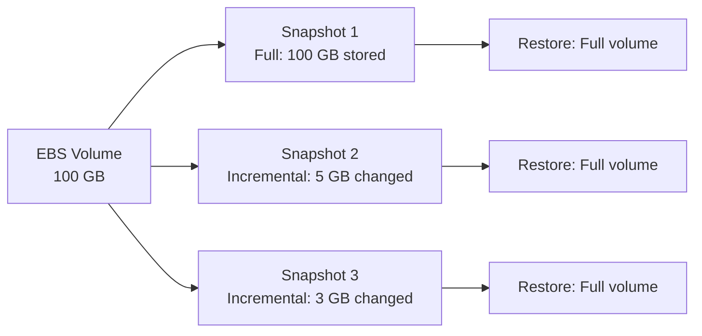

# How to Create EBS Snapshots for Backup

Author: [nawazdhandala](https://github.com/nawazdhandala)

Tags: AWS, EC2, EBS, Snapshots, Backup, Disaster Recovery

Description: Learn how to create, manage, and automate EBS snapshots for reliable backups of your EC2 instance data, including consistency tips and cost management.

---

EBS snapshots are point-in-time copies of your volumes stored in Amazon S3. They're the primary backup mechanism for EBS-backed EC2 instances and are essential for disaster recovery, data protection, and creating new volumes. Snapshots are incremental - after the first full snapshot, subsequent ones only store the blocks that changed, which saves both time and money.

This guide covers creating snapshots manually and automatically, ensuring data consistency, and managing snapshot costs.

## How Snapshots Work

When you create a snapshot:

1. AWS captures the state of the volume at that moment
2. The snapshot is stored in S3 (you don't see it in your S3 buckets - it's managed internally)
3. The first snapshot copies all data blocks
4. Subsequent snapshots only copy changed blocks (incremental)
5. Each snapshot is independently restorable - you don't need the chain



Even though snapshots are incremental, each one is a complete backup. Deleting Snapshot 1 doesn't affect Snapshot 2's ability to restore the full volume.

## Creating a Snapshot Manually

### Via the Console

1. Go to EC2 > Volumes
2. Select the volume you want to snapshot
3. Click "Actions" > "Create snapshot"
4. Add a description (e.g., "Pre-deployment backup 2026-02-12")
5. Optionally add tags
6. Click "Create snapshot"

### Via the CLI

```bash
# Create a snapshot of a volume
aws ec2 create-snapshot \
    --volume-id vol-0123456789abcdef0 \
    --description "Daily backup - webapp data volume" \
    --tag-specifications 'ResourceType=snapshot,Tags=[{Key=Name,Value=webapp-data-daily},{Key=Environment,Value=production},{Key=AutoDelete,Value=true}]'
```

The command returns immediately with a snapshot ID, but the snapshot isn't complete yet. It's created asynchronously:

```bash
# Check snapshot progress
aws ec2 describe-snapshots \
    --snapshot-ids snap-0123456789abcdef0 \
    --query 'Snapshots[0].{State:State,Progress:Progress}'

# Wait for completion
aws ec2 wait snapshot-completed --snapshot-ids snap-0123456789abcdef0
echo "Snapshot complete"
```

## Ensuring Data Consistency

Snapshots are crash-consistent by default - they capture whatever's on the volume at that instant, including data that might be in an inconsistent state if applications were writing when the snapshot started.

For critical data, you want application-consistent snapshots. Here's how:

### For Databases

Stop or freeze the database before taking the snapshot:

```bash
#!/bin/bash
# Create an application-consistent snapshot for a PostgreSQL database

VOLUME_ID="vol-0123456789abcdef0"

# Freeze the database (prevent writes temporarily)
echo "Freezing database..."
sudo -u postgres psql -c "SELECT pg_start_backup('snapshot_backup', true);"

# Sync filesystem
sync

# Create the snapshot
echo "Creating snapshot..."
SNAP_ID=$(aws ec2 create-snapshot \
    --volume-id $VOLUME_ID \
    --description "App-consistent backup - PostgreSQL" \
    --query 'SnapshotId' \
    --output text)

echo "Snapshot initiated: $SNAP_ID"

# Unfreeze the database immediately (don't wait for snapshot to complete)
echo "Unfreezing database..."
sudo -u postgres psql -c "SELECT pg_stop_backup();"

echo "Database unfrozen. Snapshot $SNAP_ID completing in background."
```

You don't need to wait for the snapshot to finish before unfreezing. The point-in-time capture happens at initiation.

### For Filesystems

Use filesystem freeze to ensure consistency:

```bash
# Freeze the filesystem
sudo fsfreeze -f /data

# Create snapshot
SNAP_ID=$(aws ec2 create-snapshot \
    --volume-id vol-0123456789abcdef0 \
    --description "Filesystem-consistent backup" \
    --query 'SnapshotId' \
    --output text)

# Unfreeze immediately
sudo fsfreeze -u /data

echo "Snapshot: $SNAP_ID"
```

The freeze/unfreeze happens in under a second for most filesystems, so the impact on your application is minimal.

## Multi-Volume Snapshots

If your instance has multiple volumes that need to be backed up together (e.g., a database with data on one volume and transaction logs on another), use multi-volume snapshots to ensure they're consistent with each other:

```bash
# Create crash-consistent snapshots across multiple volumes
aws ec2 create-snapshots \
    --instance-specification InstanceId=i-0123456789abcdef0 \
    --description "Multi-volume backup" \
    --copy-tags-from-source volume \
    --tag-specifications 'ResourceType=snapshot,Tags=[{Key=Name,Value=multi-vol-backup}]'
```

This creates snapshots of all volumes attached to the instance at the same point in time.

## Automating Snapshots with AWS Backup

For production environments, use AWS Backup to manage snapshot schedules:

### Create a Backup Plan

```bash
# Create a backup plan with daily snapshots, 30-day retention
aws backup create-backup-plan --backup-plan '{
    "BackupPlanName": "daily-ebs-snapshots",
    "Rules": [
        {
            "RuleName": "DailyBackup",
            "TargetBackupVaultName": "Default",
            "ScheduleExpression": "cron(0 3 * * ? *)",
            "Lifecycle": {
                "DeleteAfterDays": 30
            }
        }
    ]
}'
```

### Assign Resources

```bash
# Back up all volumes tagged with Backup=true
aws backup create-backup-selection \
    --backup-plan-id <plan-id> \
    --backup-selection '{
        "SelectionName": "tagged-volumes",
        "IamRoleArn": "arn:aws:iam::123456789012:role/AWSBackupRole",
        "ListOfTags": [
            {
                "ConditionType": "STRINGEQUALS",
                "ConditionKey": "Backup",
                "ConditionValue": "true"
            }
        ]
    }'
```

Now any volume with the tag `Backup=true` gets daily snapshots with 30-day retention, automatically.

## Automating with a Script

If you prefer more control than AWS Backup provides:

```bash
#!/bin/bash
# Automated snapshot creation with retention management

RETENTION_DAYS=14
TAG_KEY="AutoBackup"
TAG_VALUE="true"

echo "Creating snapshots for tagged volumes..."

# Find all volumes tagged for backup
VOLUMES=$(aws ec2 describe-volumes \
    --filters "Name=tag:${TAG_KEY},Values=${TAG_VALUE}" \
    --query 'Volumes[*].[VolumeId,Tags[?Key==`Name`].Value | [0]]' \
    --output text)

while IFS=$'\t' read -r VOL_ID VOL_NAME; do
    echo "Snapshotting $VOL_ID ($VOL_NAME)..."

    SNAP_ID=$(aws ec2 create-snapshot \
        --volume-id $VOL_ID \
        --description "Automated backup of $VOL_NAME" \
        --tag-specifications "ResourceType=snapshot,Tags=[{Key=Name,Value=auto-${VOL_NAME}-$(date +%Y%m%d)},{Key=AutoBackup,Value=true},{Key=SourceVolume,Value=$VOL_ID}]" \
        --query 'SnapshotId' \
        --output text)

    echo "  Created: $SNAP_ID"
done <<< "$VOLUMES"

# Clean up old snapshots
echo ""
echo "Cleaning up snapshots older than $RETENTION_DAYS days..."

CUTOFF=$(date -d "-${RETENTION_DAYS} days" +%Y-%m-%dT%H:%M:%S 2>/dev/null || \
    date -v-${RETENTION_DAYS}d +%Y-%m-%dT%H:%M:%S)

OLD_SNAPSHOTS=$(aws ec2 describe-snapshots \
    --owner-ids self \
    --filters "Name=tag:AutoBackup,Values=true" \
    --query "Snapshots[?StartTime<'${CUTOFF}'].[SnapshotId,StartTime,Description]" \
    --output text)

while IFS=$'\t' read -r SNAP_ID START_TIME DESCRIPTION; do
    if [ -n "$SNAP_ID" ]; then
        echo "Deleting old snapshot: $SNAP_ID (from $START_TIME)"
        aws ec2 delete-snapshot --snapshot-id $SNAP_ID
    fi
done <<< "$OLD_SNAPSHOTS"

echo "Done."
```

Run this daily via cron, Lambda, or a CI/CD pipeline.

## Snapshot Costs

Snapshot pricing is based on the actual data stored, not the volume size:

- **Standard storage**: ~$0.05 per GB-month
- **Archive tier**: ~$0.0125 per GB-month (for long-term retention)

Because snapshots are incremental, the cost is usually much less than the volume size. A 100 GB volume that changes 5 GB per day would cost roughly:
- First snapshot: $5.00/month (100 GB)
- Each daily incremental: $0.25/month (5 GB)

### Archive Old Snapshots

For snapshots you need to keep but rarely access:

```bash
# Move a snapshot to archive tier (90-day minimum retention)
aws ec2 modify-snapshot-tier \
    --snapshot-id snap-0123456789abcdef0 \
    --storage-tier archive
```

Archived snapshots cost 75% less but take 24-72 hours to restore.

## Listing and Managing Snapshots

```bash
# List all snapshots you own, sorted by date
aws ec2 describe-snapshots \
    --owner-ids self \
    --query 'Snapshots | sort_by(@, &StartTime) | [*].[SnapshotId,VolumeSize,StartTime,Description]' \
    --output table

# Calculate total snapshot storage
aws ec2 describe-snapshots \
    --owner-ids self \
    --query 'Snapshots[*].VolumeSize' \
    --output text | tr '\t' '\n' | awk '{sum += $1} END {
        printf "Total snapshot storage: %d GB\n", sum
        printf "Estimated cost: $%.2f/month\n", sum * 0.05
    }'
```

## Restoring from a Snapshot

To restore, create a new volume from the snapshot:

```bash
# Create a volume from a snapshot
aws ec2 create-volume \
    --snapshot-id snap-0123456789abcdef0 \
    --volume-type gp3 \
    --availability-zone us-east-1a \
    --tag-specifications 'ResourceType=volume,Tags=[{Key=Name,Value=restored-data}]'
```

For a full instance restoration guide, see our post on [restoring EC2 instances from EBS snapshots](https://oneuptime.com/blog/post/2026-02-12-restore-ec2-instance-from-ebs-snapshot/view).

## Best Practices

1. **Automate everything.** Manual snapshots are forgotten snapshots. Use AWS Backup or a scheduled script.

2. **Tag your snapshots.** Include the source volume, creation purpose, and retention policy. This makes cleanup and auditing much easier.

3. **Test your restores.** A backup you've never tested isn't a backup. Periodically restore from a snapshot and verify the data.

4. **Use application-consistent snapshots for databases.** Crash-consistent is usually fine for stateless services, but databases need the extra step.

5. **Manage retention actively.** Snapshots accumulate quickly and the costs add up. Define retention policies and enforce them automatically.

6. **Monitor snapshot operations.** Use [OneUptime](https://oneuptime.com) or CloudWatch to alert on failed snapshot jobs so you don't discover your backups are broken during a crisis.

EBS snapshots are reliable, cost-effective, and fast to create. There's no good excuse for not having them. Set up automated snapshots for every production volume and sleep better knowing your data is protected.
