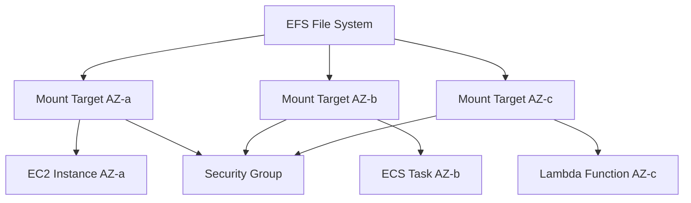

# How to Create EFS File Systems with Terraform

Author: [nawazdhandala](https://github.com/nawazdhandala)

Tags: AWS, EFS, Terraform, Storage

Description: Complete guide to provisioning AWS Elastic File System (EFS) with Terraform, covering mount targets, access points, security groups, and lifecycle policies.

---

Amazon Elastic File System gives you a shared file system that multiple EC2 instances, ECS containers, or Lambda functions can mount simultaneously. It's the go-to choice when your workloads need shared persistent storage that scales automatically. Setting it up involves more moving parts than you might expect though - file systems, mount targets, security groups, and access points all need to come together.

Let's walk through building a production-ready EFS setup with Terraform.

## How EFS Works

Before diving into code, it helps to understand the architecture. An EFS file system exists at the regional level, but to actually mount it from your instances, you need mount targets in each Availability Zone where your workloads run. Each mount target gets an ENI (Elastic Network Interface) in a subnet, and you control access through security groups.



## Creating a Basic EFS File System

Let's start with the file system itself and work outward.

This creates an encrypted EFS file system using general-purpose performance mode:

```hcl
resource "aws_efs_file_system" "main" {
  creation_token = "production-shared-storage"
  encrypted      = true

  performance_mode = "generalPurpose"  # or "maxIO" for highly parallel workloads
  throughput_mode  = "bursting"        # or "elastic" for unpredictable workloads

  lifecycle_policy {
    transition_to_ia = "AFTER_30_DAYS"  # Move files to Infrequent Access after 30 days
  }

  lifecycle_policy {
    transition_to_primary_storage_class = "AFTER_1_ACCESS"  # Move back on first access
  }

  tags = {
    Name        = "production-shared-storage"
    Environment = "production"
    ManagedBy   = "terraform"
  }
}
```

A few decisions here worth explaining:

- **`generalPurpose`** performance mode works for most workloads. Switch to `maxIO` only if you've got thousands of concurrent connections and can tolerate slightly higher latency.
- **`bursting`** throughput mode gives you a baseline throughput that scales with the size of your file system, plus burst credits. If your workloads are spiky and unpredictable, `elastic` mode charges per-request but doesn't require you to provision throughput.
- **Lifecycle policies** save money by automatically moving infrequently accessed files to the IA storage class, which costs about 92% less than standard storage.

## Setting Up Security Groups

Mount targets need a security group that allows NFS traffic (port 2049) from your application instances.

This security group allows NFS access from instances in the application security group:

```hcl
resource "aws_security_group" "efs" {
  name        = "efs-mount-target"
  description = "Allow NFS traffic for EFS mount targets"
  vpc_id      = var.vpc_id

  ingress {
    description     = "NFS from application instances"
    from_port       = 2049
    to_port         = 2049
    protocol        = "tcp"
    security_groups = [aws_security_group.application.id]
  }

  egress {
    from_port   = 0
    to_port     = 0
    protocol    = "-1"
    cidr_blocks = ["0.0.0.0/0"]
  }

  tags = {
    Name = "efs-mount-target-sg"
  }
}

# Your application security group (simplified)
resource "aws_security_group" "application" {
  name        = "application"
  description = "Application instances"
  vpc_id      = var.vpc_id

  tags = {
    Name = "application-sg"
  }
}
```

## Creating Mount Targets

You need one mount target per AZ. Using `for_each` over your subnets keeps this clean.

This creates a mount target in each private subnet:

```hcl
variable "private_subnet_ids" {
  type        = map(string)
  description = "Map of AZ to private subnet ID"
  default = {
    "us-east-1a" = "subnet-abc123"
    "us-east-1b" = "subnet-def456"
    "us-east-1c" = "subnet-ghi789"
  }
}

resource "aws_efs_mount_target" "main" {
  for_each = var.private_subnet_ids

  file_system_id  = aws_efs_file_system.main.id
  subnet_id       = each.value
  security_groups = [aws_security_group.efs.id]
}
```

## Access Points

Access points are like virtual entry points into your file system. They let you enforce a specific POSIX user, group, and root directory for each application. This is especially useful when multiple services share the same EFS file system.

This creates separate access points for two different applications sharing one file system:

```hcl
resource "aws_efs_access_point" "api" {
  file_system_id = aws_efs_file_system.main.id

  # Force all operations to use this POSIX identity
  posix_user {
    gid = 1000
    uid = 1000
  }

  # Create and use this directory as the root
  root_directory {
    path = "/api-data"
    creation_info {
      owner_gid   = 1000
      owner_uid   = 1000
      permissions = "755"
    }
  }

  tags = {
    Name    = "api-access-point"
    Service = "api"
  }
}

resource "aws_efs_access_point" "worker" {
  file_system_id = aws_efs_file_system.main.id

  posix_user {
    gid = 1001
    uid = 1001
  }

  root_directory {
    path = "/worker-data"
    creation_info {
      owner_gid   = 1001
      owner_uid   = 1001
      permissions = "755"
    }
  }

  tags = {
    Name    = "worker-access-point"
    Service = "worker"
  }
}
```

## EFS File System Policy

A resource policy on the file system adds another layer of access control. You can enforce encryption in transit and restrict access to specific IAM roles.

This policy requires TLS for all connections and restricts access to a specific IAM role:

```hcl
resource "aws_efs_file_system_policy" "main" {
  file_system_id = aws_efs_file_system.main.id

  policy = jsonencode({
    Version = "2012-10-17"
    Statement = [
      {
        Sid    = "EnforceEncryptionInTransit"
        Effect = "Deny"
        Principal = {
          AWS = "*"
        }
        Action = "*"
        Resource = aws_efs_file_system.main.arn
        Condition = {
          Bool = {
            "aws:SecureTransport" = "false"
          }
        }
      },
      {
        Sid    = "AllowSpecificRole"
        Effect = "Allow"
        Principal = {
          AWS = aws_iam_role.ecs_task.arn
        }
        Action = [
          "elasticfilesystem:ClientMount",
          "elasticfilesystem:ClientWrite"
        ]
        Resource = aws_efs_file_system.main.arn
      }
    ]
  })
}
```

## Using EFS with ECS

ECS Fargate supports EFS volumes natively. Here's how to wire it up in your task definition.

This ECS task definition mounts the EFS access point as a volume:

```hcl
resource "aws_ecs_task_definition" "app" {
  family                   = "my-app"
  requires_compatibilities = ["FARGATE"]
  network_mode             = "awsvpc"
  cpu                      = 256
  memory                   = 512
  execution_role_arn       = aws_iam_role.ecs_execution.arn
  task_role_arn            = aws_iam_role.ecs_task.arn

  volume {
    name = "shared-data"
    efs_volume_configuration {
      file_system_id          = aws_efs_file_system.main.id
      transit_encryption      = "ENABLED"
      authorization_config {
        access_point_id = aws_efs_access_point.api.id
        iam             = "ENABLED"
      }
    }
  }

  container_definitions = jsonencode([
    {
      name  = "app"
      image = "my-app:latest"
      mountPoints = [
        {
          sourceVolume  = "shared-data"
          containerPath = "/data"
          readOnly      = false
        }
      ]
    }
  ])
}
```

## Backup Configuration

EFS integrates with AWS Backup. While EFS has its own automatic backups, using AWS Backup gives you more control over retention and cross-region copying.

This sets up a backup plan for the EFS file system with a 35-day retention:

```hcl
resource "aws_backup_vault" "efs" {
  name = "efs-backup-vault"
}

resource "aws_backup_plan" "efs" {
  name = "efs-daily-backup"

  rule {
    rule_name         = "daily-backup"
    target_vault_name = aws_backup_vault.efs.name
    schedule          = "cron(0 3 * * ? *)"  # 3 AM UTC daily

    lifecycle {
      delete_after = 35  # Keep backups for 35 days
    }
  }
}

resource "aws_backup_selection" "efs" {
  name         = "efs-selection"
  plan_id      = aws_backup_plan.efs.id
  iam_role_arn = aws_iam_role.backup.arn

  resources = [
    aws_efs_file_system.main.arn
  ]
}
```

## CloudWatch Monitoring

EFS publishes metrics that you should be watching. The most important ones are `BurstCreditBalance` (for bursting throughput mode) and `PercentIOLimit` (for general-purpose mode).

These alarms notify you when your EFS is running low on burst credits or approaching IO limits:

```hcl
resource "aws_cloudwatch_metric_alarm" "burst_credits" {
  alarm_name          = "efs-low-burst-credits"
  comparison_operator = "LessThanThreshold"
  evaluation_periods  = 1
  metric_name         = "BurstCreditBalance"
  namespace           = "AWS/EFS"
  period              = 300
  statistic           = "Average"
  threshold           = 1000000000000  # 1 TB in bytes
  alarm_description   = "EFS burst credits running low"

  dimensions = {
    FileSystemId = aws_efs_file_system.main.id
  }

  alarm_actions = [var.sns_topic_arn]
}

resource "aws_cloudwatch_metric_alarm" "io_limit" {
  alarm_name          = "efs-high-io-percentage"
  comparison_operator = "GreaterThanThreshold"
  evaluation_periods  = 3
  metric_name         = "PercentIOLimit"
  namespace           = "AWS/EFS"
  period              = 300
  statistic           = "Average"
  threshold           = 80
  alarm_description   = "EFS approaching IO limit"

  dimensions = {
    FileSystemId = aws_efs_file_system.main.id
  }

  alarm_actions = [var.sns_topic_arn]
}
```

For a deeper look at monitoring your AWS storage and other infrastructure, check out our post on [setting up CloudWatch alarms with Terraform](https://oneuptime.com/blog/post/create-cloudwatch-alarms-terraform/view).

## Outputs

Don't forget to export the values other modules will need:

```hcl
output "efs_id" {
  value       = aws_efs_file_system.main.id
  description = "EFS file system ID"
}

output "efs_dns_name" {
  value       = aws_efs_file_system.main.dns_name
  description = "EFS DNS name for mounting"
}

output "access_point_ids" {
  value = {
    api    = aws_efs_access_point.api.id
    worker = aws_efs_access_point.worker.id
  }
  description = "Access point IDs by service"
}
```

## Wrapping Up

A production EFS setup involves more than just the file system resource. You need mount targets in every AZ, security groups scoped to NFS traffic, access points for multi-tenant isolation, a resource policy for encryption enforcement, and monitoring to catch performance issues before they affect your applications. The Terraform configuration in this guide covers all of these pieces and should give you a solid starting point for your own deployment.
