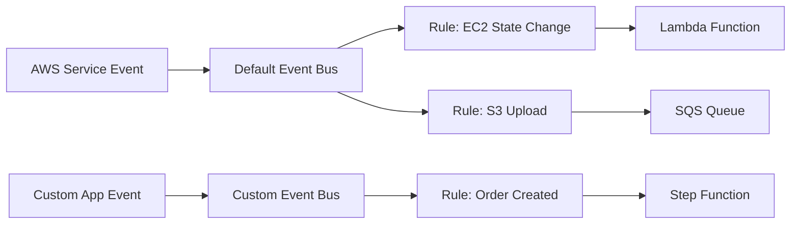

# How to Create EventBridge Rules with Terraform

Author: [nawazdhandala](https://github.com/nawazdhandala)

Tags: AWS, EventBridge, Terraform, Serverless

Description: A hands-on guide to building AWS EventBridge rules with Terraform, covering event patterns, scheduled rules, custom event buses, and Lambda targets.

---

Amazon EventBridge (formerly CloudWatch Events) is the event bus that ties AWS services together. When an EC2 instance changes state, when a CodePipeline deployment fails, when an S3 object is created - EventBridge can catch those events and route them to targets like Lambda functions, SQS queues, or Step Functions. It's also the service you use for cron-style scheduled tasks in AWS.

This guide walks through building EventBridge rules in Terraform, from simple schedules to complex event patterns with custom event buses.

## How EventBridge Works

EventBridge has three main concepts:

1. **Event Bus** - Where events arrive. The default bus receives all AWS service events. You can create custom buses for your own application events.
2. **Rules** - Pattern matchers that filter events on the bus.
3. **Targets** - Where matching events get sent (Lambda, SQS, SNS, Step Functions, etc.).



## Scheduled Rules (Cron Jobs)

The most common use case is replacing traditional cron jobs with EventBridge schedules that trigger Lambda functions.

This creates a rule that triggers a Lambda function every 5 minutes:

```hcl
resource "aws_cloudwatch_event_rule" "every_five_minutes" {
  name                = "every-five-minutes"
  description         = "Triggers cleanup Lambda every 5 minutes"
  schedule_expression = "rate(5 minutes)"

  tags = {
    Environment = "production"
    Purpose     = "scheduled-task"
  }
}

resource "aws_cloudwatch_event_target" "cleanup_lambda" {
  rule      = aws_cloudwatch_event_rule.every_five_minutes.name
  target_id = "cleanup-lambda"
  arn       = aws_lambda_function.cleanup.arn
}

# Lambda needs permission to be invoked by EventBridge
resource "aws_lambda_permission" "allow_eventbridge" {
  statement_id  = "AllowEventBridgeInvoke"
  action        = "lambda:InvokeFunction"
  function_name = aws_lambda_function.cleanup.function_name
  principal     = "events.amazonaws.com"
  source_arn    = aws_cloudwatch_event_rule.every_five_minutes.arn
}
```

For more specific schedules, use cron expressions. The syntax is slightly different from standard cron - there are 6 fields and you can't specify both day-of-month and day-of-week.

This rule fires at 8 AM UTC on weekdays:

```hcl
resource "aws_cloudwatch_event_rule" "weekday_morning" {
  name                = "weekday-morning-report"
  description         = "Generate daily report at 8 AM UTC on weekdays"
  schedule_expression = "cron(0 8 ? * MON-FRI *)"
}
```

And this one runs at midnight on the first day of every month:

```hcl
resource "aws_cloudwatch_event_rule" "monthly" {
  name                = "monthly-billing-check"
  description         = "Monthly billing report on the 1st"
  schedule_expression = "cron(0 0 1 * ? *)"
}
```

## Event Pattern Rules

Event pattern rules match on the structure of events flowing through the bus. Here's where EventBridge gets really powerful.

This rule catches EC2 instance state changes (specifically when instances stop or terminate):

```hcl
resource "aws_cloudwatch_event_rule" "ec2_state_change" {
  name        = "ec2-instance-stopped-terminated"
  description = "Catch EC2 instance stop and terminate events"

  event_pattern = jsonencode({
    source      = ["aws.ec2"]
    detail-type = ["EC2 Instance State-change Notification"]
    detail = {
      state = ["stopped", "terminated"]
    }
  })
}

resource "aws_cloudwatch_event_target" "notify_sns" {
  rule      = aws_cloudwatch_event_rule.ec2_state_change.name
  target_id = "notify-team"
  arn       = aws_sns_topic.alerts.arn
}

# SNS needs a resource policy to receive events from EventBridge
resource "aws_sns_topic_policy" "allow_eventbridge" {
  arn = aws_sns_topic.alerts.arn

  policy = jsonencode({
    Version = "2012-10-17"
    Statement = [{
      Sid    = "AllowEventBridge"
      Effect = "Allow"
      Principal = {
        Service = "events.amazonaws.com"
      }
      Action   = "SNS:Publish"
      Resource = aws_sns_topic.alerts.arn
    }]
  })
}

resource "aws_sns_topic" "alerts" {
  name = "infrastructure-alerts"
}
```

## Catching AWS Health Events

AWS Health events tell you about service disruptions that might affect your resources. Routing these to your alerting system is a best practice.

This rule catches any AWS Health event in your account:

```hcl
resource "aws_cloudwatch_event_rule" "aws_health" {
  name        = "aws-health-events"
  description = "Catch AWS Health events for our account"

  event_pattern = jsonencode({
    source      = ["aws.health"]
    detail-type = ["AWS Health Event"]
  })
}

resource "aws_cloudwatch_event_target" "health_to_sns" {
  rule      = aws_cloudwatch_event_rule.aws_health.name
  target_id = "health-notifications"
  arn       = aws_sns_topic.alerts.arn
}
```

## Custom Event Bus

For application-generated events, create a custom event bus. This keeps your events separate from AWS service events and lets you apply specific access policies.

This creates a custom event bus and a rule that matches order events:

```hcl
resource "aws_cloudwatch_event_bus" "orders" {
  name = "orders-bus"

  tags = {
    Service = "orders"
  }
}

# Policy allowing specific roles to put events on the bus
resource "aws_cloudwatch_event_bus_policy" "orders" {
  event_bus_name = aws_cloudwatch_event_bus.orders.name

  policy = jsonencode({
    Version = "2012-10-17"
    Statement = [{
      Sid    = "AllowOrderService"
      Effect = "Allow"
      Principal = {
        AWS = aws_iam_role.order_service.arn
      }
      Action   = "events:PutEvents"
      Resource = aws_cloudwatch_event_bus.orders.arn
    }]
  })
}

# Rule on the custom bus
resource "aws_cloudwatch_event_rule" "high_value_order" {
  name           = "high-value-order"
  description    = "Catch orders over $1000"
  event_bus_name = aws_cloudwatch_event_bus.orders.name

  event_pattern = jsonencode({
    source      = ["orders.service"]
    detail-type = ["Order Created"]
    detail = {
      amount = [{
        numeric = [">", 1000]
      }]
    }
  })
}

resource "aws_cloudwatch_event_target" "high_value_to_lambda" {
  rule           = aws_cloudwatch_event_rule.high_value_order.name
  event_bus_name = aws_cloudwatch_event_bus.orders.name
  target_id      = "process-high-value"
  arn            = aws_lambda_function.high_value_processor.arn
}
```

To publish events to the custom bus from your application:

```python
import boto3
import json

events_client = boto3.client("events")

# Publish a custom event to the orders bus
response = events_client.put_events(
    Entries=[
        {
            "Source": "orders.service",
            "DetailType": "Order Created",
            "Detail": json.dumps({
                "orderId": "ord-12345",
                "amount": 1500,
                "customerId": "cust-678"
            }),
            "EventBusName": "orders-bus"
        }
    ]
)
```

## Multiple Targets

A single rule can have up to five targets. This is useful when you want to fan out an event to multiple consumers.

This rule sends S3 upload events to both a Lambda function and an SQS queue:

```hcl
resource "aws_cloudwatch_event_rule" "s3_upload" {
  name = "s3-object-created"

  event_pattern = jsonencode({
    source      = ["aws.s3"]
    detail-type = ["Object Created"]
    detail = {
      bucket = {
        name = ["my-upload-bucket"]
      }
    }
  })
}

resource "aws_cloudwatch_event_target" "s3_to_lambda" {
  rule      = aws_cloudwatch_event_rule.s3_upload.name
  target_id = "process-upload"
  arn       = aws_lambda_function.process_upload.arn
}

resource "aws_cloudwatch_event_target" "s3_to_sqs" {
  rule      = aws_cloudwatch_event_rule.s3_upload.name
  target_id = "queue-upload"
  arn       = aws_sqs_queue.upload_queue.arn
}
```

## Input Transformation

By default, the entire event is passed to the target. Input transformers let you reshape the event before delivery.

This transforms an EC2 state change event into a clean message for SNS:

```hcl
resource "aws_cloudwatch_event_target" "transformed" {
  rule      = aws_cloudwatch_event_rule.ec2_state_change.name
  target_id = "transformed-notification"
  arn       = aws_sns_topic.alerts.arn

  input_transformer {
    input_paths = {
      instance = "$.detail.instance-id"
      state    = "$.detail.state"
      time     = "$.time"
    }

    input_template = "\"EC2 instance <instance> changed to <state> at <time>\""
  }
}
```

## Dead Letter Queues

When a target fails to process an event, you don't want to lose it silently. Configure a dead letter queue to catch failures.

This adds a DLQ to an EventBridge target:

```hcl
resource "aws_sqs_queue" "eventbridge_dlq" {
  name                      = "eventbridge-dlq"
  message_retention_seconds = 1209600  # 14 days
}

resource "aws_cloudwatch_event_target" "with_dlq" {
  rule      = aws_cloudwatch_event_rule.every_five_minutes.name
  target_id = "lambda-with-dlq"
  arn       = aws_lambda_function.cleanup.arn

  dead_letter_config {
    arn = aws_sqs_queue.eventbridge_dlq.arn
  }

  retry_policy {
    maximum_event_age_in_seconds = 3600   # Retry for up to 1 hour
    maximum_retry_attempts       = 3
  }
}
```

For monitoring your event-driven architecture end to end, take a look at our guide on [CloudWatch alarms with Terraform](https://oneuptime.com/blog/post/2026-02-12-create-cloudwatch-alarms-terraform/view) to set up alerts on failed invocations and DLQ depth.

## Wrapping Up

EventBridge is one of those AWS services that gets more useful the more you lean into it. Start with scheduled rules to replace cron, then add event patterns for AWS service events you care about. When your application architecture matures, custom event buses give you a clean way to decouple services. The Terraform configurations in this guide cover the most common patterns you'll encounter.
