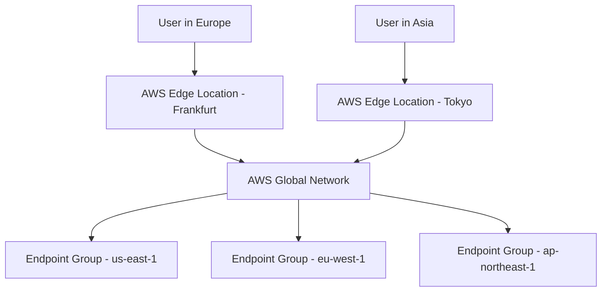

# How to Create Global Accelerator with Terraform

Author: [nawazdhandala](https://github.com/nawazdhandala)

Tags: AWS, Terraform, Global Accelerator, Networking, Performance

Description: Learn how to deploy AWS Global Accelerator with Terraform to improve application performance with anycast IP addresses, intelligent routing, and endpoint health checks.

---

AWS Global Accelerator gives your application static anycast IP addresses that route traffic through the AWS global network instead of the public internet. This means lower latency, better availability, and automatic failover between regions. Think of it as a performance and reliability upgrade for any TCP or UDP application.

If you're running a multi-region setup or just want consistent performance for users across different geographies, Global Accelerator is one of the easier wins. Let's set it up with Terraform.

## How Global Accelerator Works

When a user connects to your application through Global Accelerator, their traffic enters the AWS network at the nearest edge location (there are over 100 globally). From there, it travels over AWS's private backbone to the closest healthy endpoint. This avoids the unpredictable routing of the public internet.



## Creating the Accelerator

The accelerator itself is straightforward. It gives you two static anycast IP addresses:

```hcl
# Global Accelerator
resource "aws_globalaccelerator_accelerator" "main" {
  name            = "app-accelerator"
  ip_address_type = "IPV4"
  enabled         = true

  attributes {
    flow_logs_enabled   = true
    flow_logs_s3_bucket = aws_s3_bucket.flow_logs.id
    flow_logs_s3_prefix = "global-accelerator/"
  }

  tags = {
    Environment = var.environment
    ManagedBy   = "terraform"
  }
}
```

Flow logs are optional but highly recommended. They let you see traffic patterns, troubleshoot connectivity issues, and analyze usage across regions.

## Listeners

A listener specifies the ports and protocols that the accelerator accepts. You can have multiple listeners for different ports:

```hcl
# HTTP/HTTPS listener
resource "aws_globalaccelerator_listener" "http" {
  accelerator_arn = aws_globalaccelerator_accelerator.main.id
  protocol        = "TCP"

  port_range {
    from_port = 80
    to_port   = 80
  }

  port_range {
    from_port = 443
    to_port   = 443
  }
}

# Custom TCP listener (e.g., for a game server or API)
resource "aws_globalaccelerator_listener" "custom" {
  accelerator_arn = aws_globalaccelerator_accelerator.main.id
  protocol        = "TCP"

  port_range {
    from_port = 8080
    to_port   = 8080
  }
}

# UDP listener (e.g., for real-time applications)
resource "aws_globalaccelerator_listener" "udp" {
  accelerator_arn = aws_globalaccelerator_accelerator.main.id
  protocol        = "UDP"

  port_range {
    from_port = 5000
    to_port   = 5000
  }
}
```

## Endpoint Groups

Endpoint groups define the regions where your application runs. Each group contains endpoints (ALBs, NLBs, EC2 instances, or Elastic IPs) and has health check settings:

```hcl
# US East endpoint group
resource "aws_globalaccelerator_endpoint_group" "us_east" {
  listener_arn = aws_globalaccelerator_listener.http.id

  endpoint_group_region         = "us-east-1"
  health_check_interval_seconds = 10
  health_check_path             = "/health"
  health_check_port             = 443
  health_check_protocol         = "HTTPS"
  threshold_count               = 3
  traffic_dial_percentage       = 100

  endpoint_configuration {
    endpoint_id                    = var.alb_arn_us_east
    weight                         = 100
    client_ip_preservation_enabled = true
  }

  port_override {
    endpoint_port = 443
    listener_port = 443
  }

  port_override {
    endpoint_port = 80
    listener_port = 80
  }
}

# EU West endpoint group
resource "aws_globalaccelerator_endpoint_group" "eu_west" {
  listener_arn = aws_globalaccelerator_listener.http.id

  endpoint_group_region         = "eu-west-1"
  health_check_interval_seconds = 10
  health_check_path             = "/health"
  health_check_port             = 443
  health_check_protocol         = "HTTPS"
  threshold_count               = 3
  traffic_dial_percentage       = 100

  endpoint_configuration {
    endpoint_id                    = var.alb_arn_eu_west
    weight                         = 100
    client_ip_preservation_enabled = true
  }
}

# AP Northeast endpoint group
resource "aws_globalaccelerator_endpoint_group" "ap_northeast" {
  listener_arn = aws_globalaccelerator_listener.http.id

  endpoint_group_region         = "ap-northeast-1"
  health_check_interval_seconds = 10
  health_check_path             = "/health"
  health_check_port             = 443
  health_check_protocol         = "HTTPS"
  threshold_count               = 3
  traffic_dial_percentage       = 100

  endpoint_configuration {
    endpoint_id                    = var.alb_arn_ap_northeast
    weight                         = 100
    client_ip_preservation_enabled = true
  }
}
```

The `traffic_dial_percentage` is incredibly useful for deployments. Set it to 0 during maintenance or gradually increase it when adding a new region. The `weight` within an endpoint group lets you split traffic between multiple endpoints in the same region.

## Client IP Preservation

When `client_ip_preservation_enabled` is set to `true`, your application sees the actual client IP address instead of the accelerator's IP. This is essential for logging, rate limiting, and geo-targeting. It works with ALB and NLB endpoints but not with EC2 or Elastic IP endpoints.

## Using EC2 and Elastic IP Endpoints

You're not limited to load balancers. EC2 instances and Elastic IPs work too:

```hcl
# Endpoint group with EC2 instances
resource "aws_globalaccelerator_endpoint_group" "ec2_endpoints" {
  listener_arn          = aws_globalaccelerator_listener.custom.id
  endpoint_group_region = "us-east-1"

  health_check_port     = 8080
  health_check_protocol = "TCP"

  endpoint_configuration {
    endpoint_id = aws_instance.app_server_1.id
    weight      = 50
  }

  endpoint_configuration {
    endpoint_id = aws_instance.app_server_2.id
    weight      = 50
  }
}

# Endpoint group with Elastic IP
resource "aws_globalaccelerator_endpoint_group" "eip_endpoint" {
  listener_arn          = aws_globalaccelerator_listener.udp.id
  endpoint_group_region = "us-west-2"

  health_check_port     = 5000
  health_check_protocol = "TCP"

  endpoint_configuration {
    endpoint_id = aws_eip.game_server.id
    weight      = 100
  }
}
```

## DNS Setup

Point your domain to the accelerator's DNS name using a CNAME or Route 53 alias:

```hcl
# Route 53 alias record pointing to Global Accelerator
resource "aws_route53_record" "app" {
  zone_id = var.route53_zone_id
  name    = "app.${var.domain_name}"
  type    = "A"

  alias {
    name                   = aws_globalaccelerator_accelerator.main.dns_name
    zone_id                = aws_globalaccelerator_accelerator.main.hosted_zone_id
    evaluate_target_health = true
  }
}
```

## Flow Logs Storage

Set up an S3 bucket for flow logs:

```hcl
resource "aws_s3_bucket" "flow_logs" {
  bucket = "app-accelerator-flow-logs-${data.aws_caller_identity.current.account_id}"
}

resource "aws_s3_bucket_lifecycle_configuration" "flow_logs" {
  bucket = aws_s3_bucket.flow_logs.id

  rule {
    id     = "expire-old-logs"
    status = "Enabled"

    expiration {
      days = 30
    }

    transition {
      days          = 7
      storage_class = "GLACIER"
    }
  }
}

data "aws_caller_identity" "current" {}
```

## Variables and Outputs

```hcl
variable "environment" {
  type    = string
  default = "production"
}

variable "domain_name" {
  type = string
}

variable "route53_zone_id" {
  type = string
}

variable "alb_arn_us_east" {
  type = string
}

variable "alb_arn_eu_west" {
  type = string
}

variable "alb_arn_ap_northeast" {
  type = string
}

output "accelerator_ips" {
  description = "Static anycast IP addresses"
  value       = aws_globalaccelerator_accelerator.main.ip_sets
}

output "accelerator_dns" {
  description = "DNS name of the accelerator"
  value       = aws_globalaccelerator_accelerator.main.dns_name
}
```

## Monitoring

Monitor the accelerator's health and traffic distribution to make sure things are working as expected. For a comprehensive approach to multi-region monitoring, check out our post on [monitoring AWS infrastructure](https://oneuptime.com/blog/post/monitor-aws-infrastructure/view).

## Summary

Global Accelerator is a straightforward way to improve performance for global applications. The static IPs simplify DNS management, the health checks provide automatic failover, and the traffic dial gives you fine-grained control over regional traffic distribution. It pairs well with multi-region ALB setups and gives you the routing smarts without having to build your own anycast infrastructure.
