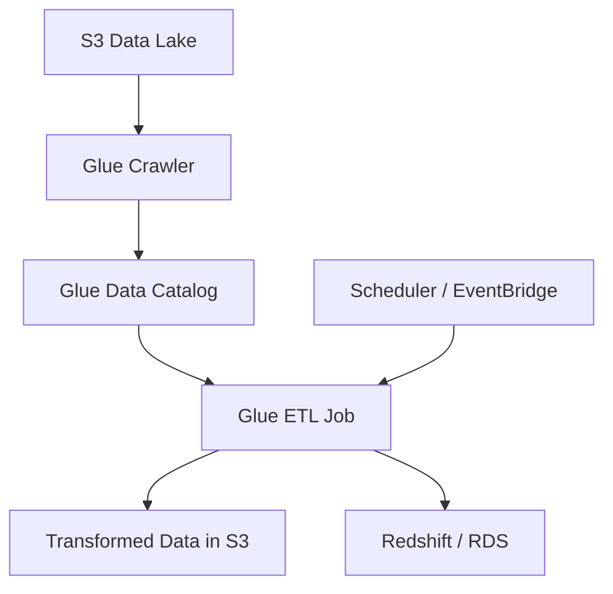

# How to Create Glue Jobs with Terraform

Author: [nawazdhandala](https://github.com/nawazdhandala)

Tags: AWS, Glue, Terraform, ETL

Description: Practical guide to creating AWS Glue ETL jobs with Terraform, covering Spark jobs, Python shell jobs, crawlers, data catalogs, and job scheduling.

---

AWS Glue is a serverless ETL (Extract, Transform, Load) service that handles data preparation and integration. You write your transformation logic in PySpark or Python, and Glue handles the infrastructure, auto-scaling, and job management. It also includes a data catalog that serves as a central metadata repository for your data lake.

Setting up Glue jobs through the console involves a lot of clicking around, and it's nearly impossible to reproduce consistently across environments. Terraform makes this manageable by codifying everything from the Glue catalog databases to the jobs themselves.

## Glue Components Overview



The typical workflow is: crawlers discover data in S3 and populate the data catalog, then ETL jobs use the catalog metadata to read, transform, and write data.

## IAM Role for Glue

Glue jobs need an IAM role with permissions to access S3, the data catalog, and any other services your job interacts with.

This creates an IAM role with the permissions Glue typically needs:

```hcl
resource "aws_iam_role" "glue" {
  name = "glue-service-role"

  assume_role_policy = jsonencode({
    Version = "2012-10-17"
    Statement = [{
      Action = "sts:AssumeRole"
      Effect = "Allow"
      Principal = {
        Service = "glue.amazonaws.com"
      }
    }]
  })
}

# AWS managed policy for Glue service
resource "aws_iam_role_policy_attachment" "glue_service" {
  role       = aws_iam_role.glue.name
  policy_arn = "arn:aws:iam::aws:policy/service-role/AWSGlueServiceRole"
}

# Custom policy for S3 access
resource "aws_iam_role_policy" "glue_s3" {
  role = aws_iam_role.glue.id

  policy = jsonencode({
    Version = "2012-10-17"
    Statement = [
      {
        Effect = "Allow"
        Action = [
          "s3:GetObject",
          "s3:PutObject",
          "s3:DeleteObject",
          "s3:ListBucket"
        ]
        Resource = [
          "arn:aws:s3:::my-data-lake",
          "arn:aws:s3:::my-data-lake/*",
          "arn:aws:s3:::my-etl-scripts",
          "arn:aws:s3:::my-etl-scripts/*"
        ]
      },
      {
        Effect = "Allow"
        Action = [
          "logs:CreateLogGroup",
          "logs:CreateLogStream",
          "logs:PutLogEvents"
        ]
        Resource = "arn:aws:logs:*:*:*"
      }
    ]
  })
}
```

## Glue Data Catalog Database

The data catalog organizes your metadata into databases and tables.

This creates a catalog database for your data lake:

```hcl
resource "aws_glue_catalog_database" "main" {
  name        = "production_data_lake"
  description = "Production data lake catalog"

  create_table_default_permission {
    permissions = ["ALL"]
    principal {
      data_lake_principal_identifier = "IAM_ALLOWED_PRINCIPALS"
    }
  }
}
```

## Glue Crawler

Crawlers automatically discover the schema of data in S3 and populate the data catalog.

This creates a crawler that scans an S3 path and populates the catalog:

```hcl
resource "aws_glue_crawler" "events" {
  database_name = aws_glue_catalog_database.main.name
  name          = "events-crawler"
  role          = aws_iam_role.glue.arn

  s3_target {
    path = "s3://my-data-lake/raw/events/"
  }

  schema_change_policy {
    delete_behavior = "LOG"
    update_behavior = "UPDATE_IN_DATABASE"
  }

  configuration = jsonencode({
    Version = 1.0
    Grouping = {
      TableGroupingPolicy = "CombineCompatibleSchemas"
    }
    CrawlerOutput = {
      Partitions = {
        AddOrUpdateBehavior = "InheritFromTable"
      }
    }
  })

  schedule = "cron(0 6 * * ? *)"  # Run daily at 6 AM UTC

  tags = {
    Environment = "production"
  }
}
```

## Spark ETL Job

Spark jobs are the heavy lifters. They process large datasets in parallel using PySpark.

This creates a Glue Spark ETL job:

```hcl
resource "aws_glue_job" "transform_events" {
  name     = "transform-events"
  role_arn = aws_iam_role.glue.arn

  command {
    name            = "glueetl"
    script_location = "s3://my-etl-scripts/jobs/transform_events.py"
    python_version  = "3"
  }

  glue_version      = "4.0"
  worker_type       = "G.1X"  # 4 vCPU, 16 GB RAM per worker
  number_of_workers = 10
  timeout           = 60  # minutes
  max_retries       = 1

  default_arguments = {
    "--enable-metrics"                = "true"
    "--enable-continuous-cloudwatch-log" = "true"
    "--enable-spark-ui"               = "true"
    "--spark-event-logs-path"         = "s3://my-etl-scripts/spark-logs/"
    "--job-language"                  = "python"
    "--TempDir"                       = "s3://my-etl-scripts/temp/"
    "--source_database"               = aws_glue_catalog_database.main.name
    "--source_table"                  = "events"
    "--output_path"                   = "s3://my-data-lake/transformed/events/"
  }

  execution_property {
    max_concurrent_runs = 1
  }

  tags = {
    Environment = "production"
    Pipeline    = "event-processing"
  }
}
```

And here's the corresponding PySpark script that you'd upload to S3:

```python
# transform_events.py - Glue ETL job for transforming raw event data
import sys
from awsglue.transforms import *
from awsglue.utils import getResolvedOptions
from awsglue.context import GlueContext
from awsglue.job import Job
from pyspark.context import SparkContext
from pyspark.sql.functions import col, year, month, dayofmonth

# Get job parameters
args = getResolvedOptions(sys.argv, [
    "JOB_NAME",
    "source_database",
    "source_table",
    "output_path"
])

sc = SparkContext()
glueContext = GlueContext(sc)
spark = glueContext.spark_session
job = Job(glueContext)
job.init(args["JOB_NAME"], args)

# Read from the Glue Data Catalog
datasource = glueContext.create_dynamic_frame.from_catalog(
    database=args["source_database"],
    table_name=args["source_table"]
)

# Convert to Spark DataFrame for easier manipulation
df = datasource.toDF()

# Transform: filter, add date columns, drop nulls
transformed = (
    df.filter(col("event_type").isNotNull())
    .withColumn("event_year", year(col("event_timestamp")))
    .withColumn("event_month", month(col("event_timestamp")))
    .withColumn("event_day", dayofmonth(col("event_timestamp")))
)

# Write partitioned output
transformed.write \
    .mode("overwrite") \
    .partitionBy("event_year", "event_month", "event_day") \
    .parquet(args["output_path"])

job.commit()
```

## Python Shell Job

For lighter tasks that don't need Spark's distributed processing, Python Shell jobs are simpler and cheaper.

This creates a Python Shell job for a lightweight data processing task:

```hcl
resource "aws_glue_job" "daily_report" {
  name     = "generate-daily-report"
  role_arn = aws_iam_role.glue.arn

  command {
    name            = "pythonshell"
    script_location = "s3://my-etl-scripts/jobs/daily_report.py"
    python_version  = "3.9"
  }

  max_capacity = 0.0625  # 1/16 DPU - smallest for Python Shell
  timeout      = 30
  max_retries  = 2

  default_arguments = {
    "--additional-python-modules" = "pandas,boto3"
    "--report_date"               = "YESTERDAY"
    "--output_bucket"             = "my-reports-bucket"
  }

  tags = {
    Environment = "production"
  }
}
```

## Job Triggers (Scheduling)

Trigger Glue jobs on a schedule or in response to other jobs completing.

This creates triggers for scheduling and chaining jobs:

```hcl
# Scheduled trigger - run the crawler daily at 5 AM
resource "aws_glue_trigger" "crawl_schedule" {
  name     = "daily-crawl"
  type     = "SCHEDULED"
  schedule = "cron(0 5 * * ? *)"

  actions {
    crawler_name = aws_glue_crawler.events.name
  }
}

# Conditional trigger - run the transform job after the crawler succeeds
resource "aws_glue_trigger" "after_crawl" {
  name = "transform-after-crawl"
  type = "CONDITIONAL"

  actions {
    job_name = aws_glue_job.transform_events.name
  }

  predicate {
    conditions {
      crawler_name = aws_glue_crawler.events.name
      crawl_state  = "SUCCEEDED"
    }
  }
}

# Conditional trigger - run report after transform completes
resource "aws_glue_trigger" "after_transform" {
  name = "report-after-transform"
  type = "CONDITIONAL"

  actions {
    job_name = aws_glue_job.daily_report.name
  }

  predicate {
    conditions {
      job_name = aws_glue_job.transform_events.name
      state    = "SUCCEEDED"
    }
  }
}
```

## Glue Workflow

For complex pipelines with multiple jobs and crawlers, use a Glue Workflow to orchestrate them as a single unit.

This creates a workflow that chains a crawler and two jobs:

```hcl
resource "aws_glue_workflow" "etl_pipeline" {
  name        = "daily-etl-pipeline"
  description = "Daily ETL: crawl -> transform -> report"

  default_run_properties = {
    "--environment" = "production"
  }
}

# Start trigger for the workflow
resource "aws_glue_trigger" "workflow_start" {
  name          = "workflow-start"
  type          = "SCHEDULED"
  workflow_name = aws_glue_workflow.etl_pipeline.name
  schedule      = "cron(0 5 * * ? *)"

  actions {
    crawler_name = aws_glue_crawler.events.name
  }
}

# Second step in the workflow
resource "aws_glue_trigger" "workflow_transform" {
  name          = "workflow-transform"
  type          = "CONDITIONAL"
  workflow_name = aws_glue_workflow.etl_pipeline.name

  actions {
    job_name = aws_glue_job.transform_events.name
  }

  predicate {
    conditions {
      crawler_name = aws_glue_crawler.events.name
      crawl_state  = "SUCCEEDED"
    }
  }
}
```

## Catalog Table

Instead of using a crawler, you can define tables directly in Terraform when you know the schema:

```hcl
resource "aws_glue_catalog_table" "events" {
  name          = "events"
  database_name = aws_glue_catalog_database.main.name

  table_type = "EXTERNAL_TABLE"

  parameters = {
    "classification" = "parquet"
  }

  storage_descriptor {
    location      = "s3://my-data-lake/raw/events/"
    input_format  = "org.apache.hadoop.hive.ql.io.parquet.MapredParquetInputFormat"
    output_format = "org.apache.hadoop.hive.ql.io.parquet.MapredParquetOutputFormat"

    ser_de_info {
      serialization_library = "org.apache.hadoop.hive.ql.io.parquet.serde.ParquetHiveSerDe"
    }

    columns {
      name = "event_id"
      type = "string"
    }

    columns {
      name = "event_type"
      type = "string"
    }

    columns {
      name = "event_timestamp"
      type = "timestamp"
    }

    columns {
      name = "user_id"
      type = "string"
    }

    columns {
      name = "payload"
      type = "string"
    }
  }

  partition_keys {
    name = "year"
    type = "string"
  }

  partition_keys {
    name = "month"
    type = "string"
  }
}
```

For monitoring your Glue jobs and getting alerted on failures, see our post on [EventBridge rules with Terraform](https://oneuptime.com/blog/post/create-eventbridge-rules-terraform/view) - Glue publishes job state change events to EventBridge.

## Wrapping Up

Glue jobs in Terraform give you reproducible, version-controlled ETL pipelines. Start with the IAM role and data catalog, add crawlers to discover schema automatically, then build your ETL jobs using either Spark (for big data) or Python Shell (for lightweight tasks). Workflows chain everything together into a coherent pipeline. The Spark UI logs (`--enable-spark-ui`) are invaluable for debugging performance issues in production jobs.
