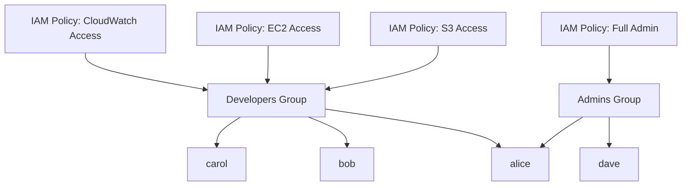

# How to Create IAM Groups and Add Users

Author: [nawazdhandala](https://github.com/nawazdhandala)

Tags: AWS, IAM, Security, Access Management

Description: Learn how to organize AWS IAM users into groups for streamlined permission management, with practical examples using the console, CLI, and infrastructure as code.

---

Managing permissions for individual IAM users doesn't scale. When you have five users, attaching policies one by one is manageable. When you have fifty, it's a nightmare. IAM groups solve this by letting you assign permissions to a group and then add users to that group. Everyone in the group inherits the same permissions automatically.

Let's go through creating groups, attaching policies, adding users, and organizing everything so it stays maintainable as your team grows.

## Why Groups Matter

Without groups, here's what happens when a new developer joins:

1. Create IAM user
2. Find another developer's user
3. Try to remember which policies they need
4. Attach 8 different policies one at a time
5. Miss one, get a support ticket a week later

With groups, it becomes:

1. Create IAM user
2. Add user to "Developers" group
3. Done

When policies need to change - say you need to grant access to a new service - you update the group policy once and everyone gets it. No hunting through individual users.



Notice that alice is in both groups. Users can belong to multiple groups and inherit permissions from all of them.

## Creating Groups via the Console

In the IAM console, click "User groups" in the sidebar, then "Create group."

Give the group a descriptive name. Good names describe the role: `Developers`, `DataEngineers`, `BillingAdmins`, `ReadOnlyAuditors`. Avoid generic names like `Group1`.

Next, attach policies. You can use AWS managed policies (like `PowerUserAccess` or `ReadOnlyAccess`) or custom policies you've created. Select the policies that match the group's responsibilities.

Finally, add users to the group. You can do this during creation or add them later.

## Creating Groups via the CLI

The CLI makes group management scriptable and repeatable:

```bash
# Create a new IAM group for developers
aws iam create-group --group-name Developers

# Create additional groups for different roles
aws iam create-group --group-name DataEngineers
aws iam create-group --group-name Admins
aws iam create-group --group-name ReadOnlyAuditors
```

Attach managed policies to the group:

```bash
# Give developers access to common development services
aws iam attach-group-policy \
  --group-name Developers \
  --policy-arn arn:aws:iam::aws:policy/AmazonS3FullAccess

aws iam attach-group-policy \
  --group-name Developers \
  --policy-arn arn:aws:iam::aws:policy/AmazonEC2FullAccess

aws iam attach-group-policy \
  --group-name Developers \
  --policy-arn arn:aws:iam::aws:policy/CloudWatchFullAccess
```

Add users to the group:

```bash
# Add users to the Developers group
aws iam add-user-to-group --group-name Developers --user-name alice
aws iam add-user-to-group --group-name Developers --user-name bob
aws iam add-user-to-group --group-name Developers --user-name carol

# Add alice to Admins too (she's the team lead)
aws iam add-user-to-group --group-name Admins --user-name alice
```

## Using Custom Policies

AWS managed policies are convenient but often too broad. A custom policy gives you fine-grained control:

```bash
# Create a custom policy for the Developers group
aws iam create-policy \
  --policy-name DeveloperAccess \
  --policy-document '{
    "Version": "2012-10-17",
    "Statement": [
      {
        "Sid": "AllowEC2InDevEnvironment",
        "Effect": "Allow",
        "Action": [
          "ec2:Describe*",
          "ec2:StartInstances",
          "ec2:StopInstances"
        ],
        "Resource": "*",
        "Condition": {
          "StringEquals": {
            "ec2:ResourceTag/Environment": "development"
          }
        }
      },
      {
        "Sid": "AllowS3DevBuckets",
        "Effect": "Allow",
        "Action": "s3:*",
        "Resource": [
          "arn:aws:s3:::dev-*",
          "arn:aws:s3:::dev-*/*"
        ]
      },
      {
        "Sid": "AllowCloudWatchReadOnly",
        "Effect": "Allow",
        "Action": [
          "cloudwatch:Get*",
          "cloudwatch:List*",
          "cloudwatch:Describe*",
          "logs:Get*",
          "logs:List*",
          "logs:Describe*",
          "logs:FilterLogEvents"
        ],
        "Resource": "*"
      }
    ]
  }'
```

Then attach it to the group:

```bash
# Attach the custom policy to the Developers group
aws iam attach-group-policy \
  --group-name Developers \
  --policy-arn arn:aws:iam::123456789012:policy/DeveloperAccess
```

This is much better than giving developers full access to everything. They can only manage EC2 instances tagged as "development" and S3 buckets with the "dev-" prefix. For more on writing precise policies, see our guide on [creating custom IAM policies from scratch](https://oneuptime.com/blog/post/create-custom-iam-policies-from-scratch/view).

## Managing Groups with Terraform

Terraform excels at defining group structures as code:

```hcl
# Define IAM groups and their policies in Terraform
resource "aws_iam_group" "developers" {
  name = "Developers"
  path = "/teams/"
}

resource "aws_iam_group" "data_engineers" {
  name = "DataEngineers"
  path = "/teams/"
}

resource "aws_iam_group" "admins" {
  name = "Admins"
  path = "/teams/"
}

# Attach policies to the developers group
resource "aws_iam_group_policy_attachment" "developers_s3" {
  group      = aws_iam_group.developers.name
  policy_arn = aws_iam_policy.developer_access.arn
}

resource "aws_iam_group_policy_attachment" "developers_cloudwatch" {
  group      = aws_iam_group.developers.name
  policy_arn = "arn:aws:iam::aws:policy/CloudWatchReadOnlyAccess"
}

# Add users to groups
resource "aws_iam_user_group_membership" "alice" {
  user = aws_iam_user.alice.name
  groups = [
    aws_iam_group.developers.name,
    aws_iam_group.admins.name,
  ]
}

resource "aws_iam_user_group_membership" "bob" {
  user = aws_iam_user.bob.name
  groups = [
    aws_iam_group.developers.name,
  ]
}
```

The beauty of this approach is that group memberships are version-controlled. When someone joins or leaves a team, the change goes through a pull request. There's a clear audit trail of who approved what.

## CloudFormation Approach

If you prefer CloudFormation:

```yaml
# CloudFormation template for IAM groups
AWSTemplateFormatVersion: '2010-09-09'
Description: IAM Groups Configuration

Resources:
  DevelopersGroup:
    Type: AWS::IAM::Group
    Properties:
      GroupName: Developers
      Path: /teams/
      ManagedPolicyArns:
        - !Ref DeveloperPolicy
        - arn:aws:iam::aws:policy/CloudWatchReadOnlyAccess

  DeveloperPolicy:
    Type: AWS::IAM::ManagedPolicy
    Properties:
      ManagedPolicyName: DeveloperAccess
      PolicyDocument:
        Version: '2012-10-17'
        Statement:
          - Effect: Allow
            Action:
              - 's3:*'
            Resource:
              - 'arn:aws:s3:::dev-*'
              - 'arn:aws:s3:::dev-*/*'

  AliceGroupMembership:
    Type: AWS::IAM::UserToGroupAddition
    Properties:
      GroupName: !Ref DevelopersGroup
      Users:
        - alice
        - bob
        - carol
```

## Useful Management Commands

Here are commands you'll use regularly:

```bash
# List all groups in the account
aws iam list-groups

# List users in a specific group
aws iam get-group --group-name Developers

# List policies attached to a group
aws iam list-attached-group-policies --group-name Developers

# List all groups a user belongs to
aws iam list-groups-for-user --user-name alice

# Remove a user from a group
aws iam remove-user-from-group \
  --group-name Developers \
  --user-name bob
```

## Organizing Your Group Structure

A typical organization might have groups like:

- **Admins** - Full account access, reserved for a small number of people
- **Developers** - Access to development resources, deploy pipelines
- **DataEngineers** - Access to data stores, analytics services, ETL tools
- **QA** - Read access to most things, write access to test environments
- **ReadOnlyAuditors** - Read-only access for compliance reviews
- **BillingAdmins** - Access to billing and cost management
- **SecurityTeam** - Access to security tools, GuardDuty, Security Hub

The key principle is that groups should map to job functions, not to individual AWS services. A "Developers" group is better than separate "S3Users" and "EC2Users" groups because people need access to multiple services to do their job.

## Limits to Keep in Mind

IAM has some limits around groups. A user can be in a maximum of 10 groups. A group can have up to 10 managed policies attached. If you hit these limits, consider consolidating your policies or using permission boundaries to delegate management.

## Wrapping Up

IAM groups are the foundation of scalable access management in AWS. They keep your permissions organized, make onboarding and offboarding simple, and create a clear audit trail when managed as code. Start by mapping your team structure to groups, attach least-privilege policies to each group, and add users based on their role. When someone moves teams, update their group memberships - don't touch individual policies.
