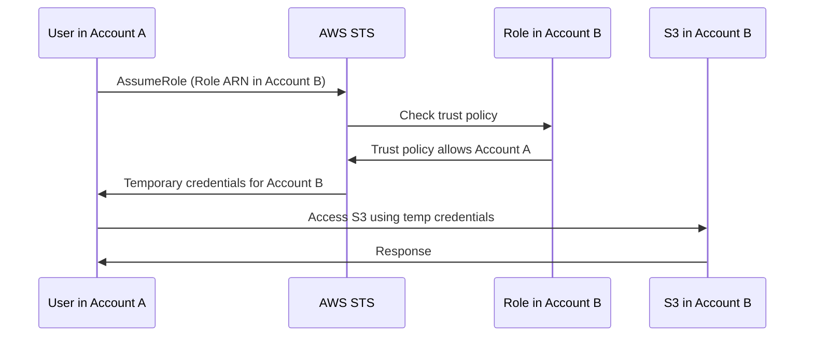

# How to Create IAM Roles for Cross-Account Access

Author: [nawazdhandala](https://github.com/nawazdhandala)

Tags: AWS, IAM, Security, Multi-Account

Description: Learn how to set up IAM roles for secure cross-account access in AWS, including trust policies, permission configuration, and best practices for multi-account environments.

---

Most organizations run multiple AWS accounts - separate accounts for production, staging, development, security, logging, and more. People need to work across these accounts without having IAM users in every single one. Cross-account IAM roles solve this by letting users in one account "assume" a role in another account, getting temporary credentials scoped to that account.

It's one of the most important patterns in AWS, and getting it right is essential for both security and usability.

## How Cross-Account Roles Work

The flow involves two accounts: the "source" account (where the user lives) and the "target" account (where the role lives). The user in the source account calls `sts:AssumeRole` with the ARN of the role in the target account. If the trust policy allows it, STS returns temporary credentials for the target account.



## Setting Up the Target Role

In the target account (Account B), create a role with a trust policy that allows the source account:

```bash
# In Account B: Create the trust policy
cat > trust-policy.json << 'EOF'
{
    "Version": "2012-10-17",
    "Statement": [
        {
            "Effect": "Allow",
            "Principal": {
                "AWS": "arn:aws:iam::111111111111:root"
            },
            "Action": "sts:AssumeRole",
            "Condition": {
                "Bool": {
                    "aws:MultiFactorAuthPresent": "true"
                }
            }
        }
    ]
}
EOF

# Create the role
aws iam create-role \
  --role-name CrossAccountAdmin \
  --assume-role-policy-document file://trust-policy.json \
  --max-session-duration 3600 \
  --description "Admin role for Account A users"
```

The `Principal` specifies which account can assume this role. Using the account root (`arn:aws:iam::111111111111:root`) means any user or role in that account can assume it, subject to their own IAM permissions. The MFA condition adds extra security - users must authenticate with MFA before assuming the role.

## Attaching Permissions to the Role

Attach the permissions that cross-account users should have:

```bash
# Attach admin access (for a full admin role)
aws iam attach-role-policy \
  --role-name CrossAccountAdmin \
  --policy-arn arn:aws:iam::aws:policy/AdministratorAccess

# Or create a more restricted policy
aws iam put-role-policy \
  --role-name CrossAccountReadOnly \
  --policy-name ReadOnlyAccess \
  --policy-document '{
    "Version": "2012-10-17",
    "Statement": [
        {
            "Effect": "Allow",
            "Action": [
                "s3:Get*",
                "s3:List*",
                "ec2:Describe*",
                "rds:Describe*",
                "cloudwatch:Get*",
                "cloudwatch:List*",
                "logs:Get*",
                "logs:Describe*",
                "logs:FilterLogEvents"
            ],
            "Resource": "*"
        }
    ]
  }'
```

## Granting Permission to Assume the Role

In the source account (Account A), users need permission to call `sts:AssumeRole`:

```bash
# In Account A: Create a policy allowing users to assume the role in Account B
aws iam create-policy \
  --policy-name AssumeAccountBRole \
  --policy-document '{
    "Version": "2012-10-17",
    "Statement": [
        {
            "Effect": "Allow",
            "Action": "sts:AssumeRole",
            "Resource": "arn:aws:iam::222222222222:role/CrossAccountAdmin"
        }
    ]
  }'

# Attach it to the appropriate group
aws iam attach-group-policy \
  --group-name Developers \
  --policy-arn arn:aws:iam::111111111111:policy/AssumeAccountBRole
```

Both sides need to agree: the target role must trust the source, and the source user must be allowed to assume the target role.

## Assuming the Role

From the CLI:

```bash
# Assume the cross-account role with MFA
aws sts assume-role \
  --role-arn arn:aws:iam::222222222222:role/CrossAccountAdmin \
  --role-session-name alice-admin \
  --serial-number arn:aws:iam::111111111111:mfa/alice \
  --token-code 123456 \
  --duration-seconds 3600
```

The response includes temporary credentials:

```json
{
    "Credentials": {
        "AccessKeyId": "ASIAEXAMPLE",
        "SecretAccessKey": "wJalrXUtnFEMI/K7MDENG/bPxRfiCYEXAMPLEKEY",
        "SessionToken": "FwoGZXIvYXdzEBYaDB...",
        "Expiration": "2026-02-12T15:00:00Z"
    },
    "AssumedRoleUser": {
        "AssumedRoleId": "AROA3XFRBF23:alice-admin",
        "Arn": "arn:aws:sts::222222222222:assumed-role/CrossAccountAdmin/alice-admin"
    }
}
```

## Using AWS CLI Profiles

Instead of manually exporting credentials, configure named profiles in `~/.aws/config`:

```ini
# ~/.aws/config - set up cross-account profiles
[profile account-b-admin]
role_arn = arn:aws:iam::222222222222:role/CrossAccountAdmin
source_profile = default
mfa_serial = arn:aws:iam::111111111111:mfa/alice
region = us-east-1
```

Then use the profile:

```bash
# Use the cross-account profile directly
aws s3 ls --profile account-b-admin

# The CLI prompts for MFA code automatically
```

This is much cleaner than manually managing temporary credentials.

## Restricting to Specific Users

Instead of trusting the entire source account, you can trust specific users or roles:

```json
{
    "Version": "2012-10-17",
    "Statement": [
        {
            "Effect": "Allow",
            "Principal": {
                "AWS": [
                    "arn:aws:iam::111111111111:user/alice",
                    "arn:aws:iam::111111111111:user/bob",
                    "arn:aws:iam::111111111111:role/CI-Pipeline"
                ]
            },
            "Action": "sts:AssumeRole"
        }
    ]
}
```

This is more secure than trusting the entire account because compromising any user in Account A doesn't automatically grant access to Account B.

## Terraform Configuration

Here's the complete cross-account setup in Terraform:

```hcl
# In Account B: Create the cross-account role
resource "aws_iam_role" "cross_account" {
  name               = "CrossAccountDeveloper"
  max_session_duration = 3600

  assume_role_policy = jsonencode({
    Version = "2012-10-17"
    Statement = [
      {
        Effect = "Allow"
        Principal = {
          AWS = "arn:aws:iam::111111111111:root"
        }
        Action = "sts:AssumeRole"
        Condition = {
          Bool = {
            "aws:MultiFactorAuthPresent" = "true"
          }
        }
      }
    ]
  })
}

resource "aws_iam_role_policy_attachment" "cross_account_readonly" {
  role       = aws_iam_role.cross_account.name
  policy_arn = "arn:aws:iam::aws:policy/ReadOnlyAccess"
}
```

```hcl
# In Account A: Allow users to assume the role
resource "aws_iam_policy" "assume_cross_account" {
  name = "AssumeCrossAccountDeveloper"

  policy = jsonencode({
    Version = "2012-10-17"
    Statement = [
      {
        Effect   = "Allow"
        Action   = "sts:AssumeRole"
        Resource = "arn:aws:iam::222222222222:role/CrossAccountDeveloper"
      }
    ]
  })
}

resource "aws_iam_group_policy_attachment" "developers_cross_account" {
  group      = aws_iam_group.developers.name
  policy_arn = aws_iam_policy.assume_cross_account.arn
}
```

## External ID for Third-Party Access

When a third party needs cross-account access (a vendor, SaaS provider, etc.), use an external ID to prevent the "confused deputy" problem:

```json
{
    "Version": "2012-10-17",
    "Statement": [
        {
            "Effect": "Allow",
            "Principal": {
                "AWS": "arn:aws:iam::333333333333:root"
            },
            "Action": "sts:AssumeRole",
            "Condition": {
                "StringEquals": {
                    "sts:ExternalId": "a1b2c3d4-unique-id-from-vendor"
                }
            }
        }
    ]
}
```

The external ID acts as a shared secret. Even if another customer of the same vendor knows your role ARN, they can't assume it without the external ID.

## Console Access via Role Switching

Users can switch roles in the AWS Console too. Click your username in the top-right corner, select "Switch Role," and enter the account ID and role name. You can bookmark frequently-used role switches.

The URL format is:

```
https://signin.aws.amazon.com/switchrole?account=222222222222&roleName=CrossAccountAdmin&displayName=Prod-Admin
```

## Wrapping Up

Cross-account roles are the backbone of multi-account AWS architectures. They eliminate the need for IAM users in every account, provide temporary credentials, and create clear audit trails in CloudTrail. Always require MFA for human access, use external IDs for third-party access, and restrict trust policies to specific principals when possible. For more on role assumption, check our guide on [assuming IAM roles using AWS STS](https://oneuptime.com/blog/post/2026-02-12-assume-an-iam-role-using-aws-sts/view).
