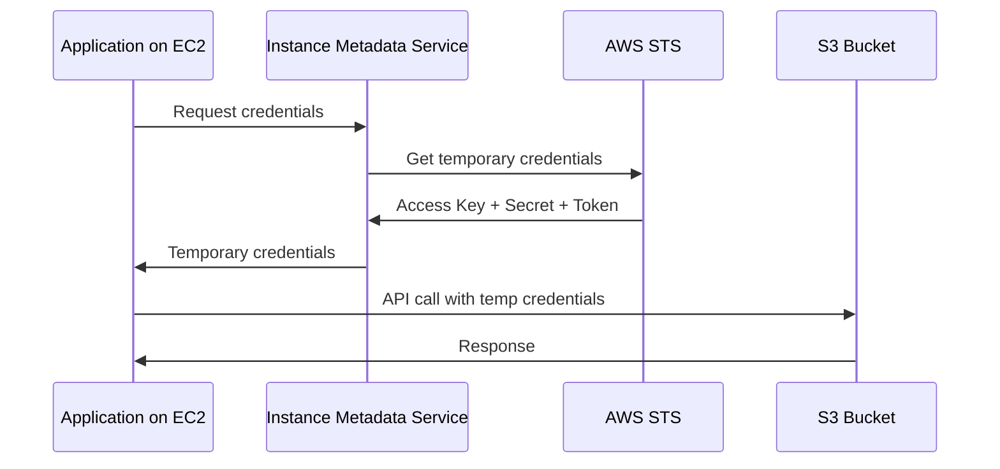

# How to Create IAM Roles for EC2 Instance Profiles

Author: [nawazdhandala](https://github.com/nawazdhandala)

Tags: AWS, IAM, EC2, Security

Description: Step-by-step guide to creating IAM roles and instance profiles for EC2 instances, enabling secure access to AWS services without hardcoded credentials.

---

Hardcoding AWS access keys on EC2 instances is one of the most common security mistakes in AWS. Keys sitting in environment variables or config files get leaked, shared, and forgotten about. IAM roles with instance profiles solve this completely - your EC2 instance gets temporary credentials that rotate automatically, and you never have to manage keys.

Let's set this up properly from start to finish.

## How Instance Profiles Work

When you attach an IAM role to an EC2 instance via an instance profile, the instance can access temporary credentials through the instance metadata service. The AWS SDK and CLI automatically retrieve and use these credentials. No access keys needed.



The credentials are rotated automatically before they expire. Your application code doesn't need to handle rotation - the SDK takes care of it.

## Creating the IAM Role

First, create a role with a trust policy that allows EC2 to assume it:

```bash
# Create the trust policy document
cat > trust-policy.json << 'EOF'
{
    "Version": "2012-10-17",
    "Statement": [
        {
            "Effect": "Allow",
            "Principal": {
                "Service": "ec2.amazonaws.com"
            },
            "Action": "sts:AssumeRole"
        }
    ]
}
EOF

# Create the IAM role with the trust policy
aws iam create-role \
  --role-name MyAppRole \
  --assume-role-policy-document file://trust-policy.json \
  --description "Role for application EC2 instances"
```

The trust policy is what allows EC2 to use this role. Without the `ec2.amazonaws.com` service principal, the instance can't assume the role.

## Attaching Permissions

Now attach the permissions your application needs. Be specific - don't give EC2 instances admin access:

```bash
# Attach a managed policy for CloudWatch monitoring
aws iam attach-role-policy \
  --role-name MyAppRole \
  --policy-arn arn:aws:iam::aws:policy/CloudWatchAgentServerPolicy

# Create and attach a custom policy for application-specific access
aws iam put-role-policy \
  --role-name MyAppRole \
  --policy-name AppAccess \
  --policy-document '{
    "Version": "2012-10-17",
    "Statement": [
        {
            "Sid": "S3Access",
            "Effect": "Allow",
            "Action": [
                "s3:GetObject",
                "s3:PutObject",
                "s3:ListBucket"
            ],
            "Resource": [
                "arn:aws:s3:::my-app-data",
                "arn:aws:s3:::my-app-data/*"
            ]
        },
        {
            "Sid": "SQSAccess",
            "Effect": "Allow",
            "Action": [
                "sqs:SendMessage",
                "sqs:ReceiveMessage",
                "sqs:DeleteMessage"
            ],
            "Resource": "arn:aws:sqs:us-east-1:123456789012:my-app-queue"
        },
        {
            "Sid": "SecretsManagerAccess",
            "Effect": "Allow",
            "Action": "secretsmanager:GetSecretValue",
            "Resource": "arn:aws:secretsmanager:us-east-1:123456789012:secret:my-app/*"
        }
    ]
  }'
```

## Creating the Instance Profile

An instance profile is a container for the IAM role. EC2 instances reference the instance profile, not the role directly:

```bash
# Create the instance profile
aws iam create-instance-profile --instance-profile-name MyAppProfile

# Add the role to the instance profile
aws iam add-role-to-instance-profile \
  --instance-profile-name MyAppProfile \
  --role-name MyAppRole
```

This is a quirk of the IAM API. When you use the console, it creates both automatically. With the CLI, you need to create them separately and link them.

## Launching an Instance with the Profile

Now launch an EC2 instance with the instance profile:

```bash
# Launch an EC2 instance with the instance profile attached
aws ec2 run-instances \
  --image-id ami-0abcdef1234567890 \
  --instance-type t3.medium \
  --iam-instance-profile Name=MyAppProfile \
  --key-name my-key \
  --subnet-id subnet-abc123 \
  --security-group-ids sg-abc123 \
  --tag-specifications 'ResourceType=instance,Tags=[{Key=Name,Value=MyApp},{Key=Environment,Value=production}]'
```

## Attaching a Profile to an Existing Instance

If you already have a running instance that needs a role:

```bash
# Attach an instance profile to an existing EC2 instance
aws ec2 associate-iam-instance-profile \
  --instance-id i-1234567890abcdef0 \
  --iam-instance-profile Name=MyAppProfile
```

The credentials become available within a few seconds. No reboot needed.

## Verifying the Setup

SSH into your instance and verify the credentials work:

```bash
# Check which role is attached to the instance
curl http://169.254.169.254/latest/meta-data/iam/security-credentials/

# Get the temporary credentials (for debugging only)
curl http://169.254.169.254/latest/meta-data/iam/security-credentials/MyAppRole

# Test by listing S3 bucket contents
aws s3 ls s3://my-app-data/
```

The first curl command shows the role name. The second shows the actual temporary credentials (access key, secret key, token, and expiration time). In production, you never need to call these directly - the SDK handles it.

## Terraform Setup

Here's the complete setup in Terraform:

```hcl
# Create the IAM role for EC2
resource "aws_iam_role" "app_role" {
  name = "MyAppRole"

  assume_role_policy = jsonencode({
    Version = "2012-10-17"
    Statement = [
      {
        Effect = "Allow"
        Principal = {
          Service = "ec2.amazonaws.com"
        }
        Action = "sts:AssumeRole"
      }
    ]
  })

  tags = {
    Application = "my-app"
    Environment = "production"
  }
}

# Create the instance profile
resource "aws_iam_instance_profile" "app_profile" {
  name = "MyAppProfile"
  role = aws_iam_role.app_role.name
}

# Attach permissions
resource "aws_iam_role_policy" "app_access" {
  name = "AppAccess"
  role = aws_iam_role.app_role.id

  policy = jsonencode({
    Version = "2012-10-17"
    Statement = [
      {
        Sid    = "S3Access"
        Effect = "Allow"
        Action = [
          "s3:GetObject",
          "s3:PutObject",
          "s3:ListBucket"
        ]
        Resource = [
          "arn:aws:s3:::my-app-data",
          "arn:aws:s3:::my-app-data/*"
        ]
      }
    ]
  })
}

# Attach CloudWatch agent policy
resource "aws_iam_role_policy_attachment" "cloudwatch" {
  role       = aws_iam_role.app_role.name
  policy_arn = "arn:aws:iam::aws:policy/CloudWatchAgentServerPolicy"
}

# Launch EC2 with the instance profile
resource "aws_instance" "app" {
  ami                  = "ami-0abcdef1234567890"
  instance_type        = "t3.medium"
  iam_instance_profile = aws_iam_instance_profile.app_profile.name
  subnet_id            = aws_subnet.private.id

  vpc_security_group_ids = [aws_security_group.app.id]

  tags = {
    Name        = "MyApp"
    Environment = "production"
  }
}
```

## Using IMDSv2

By default, EC2 allows both IMDSv1 (simple HTTP GET) and IMDSv2 (token-based). IMDSv2 is more secure because it requires a token, preventing certain SSRF attacks. Enforce IMDSv2:

```bash
# Require IMDSv2 for the instance
aws ec2 modify-instance-metadata-options \
  --instance-id i-1234567890abcdef0 \
  --http-tokens required \
  --http-endpoint enabled
```

In Terraform:

```hcl
# Enforce IMDSv2 in the instance configuration
resource "aws_instance" "app" {
  # ... other config ...

  metadata_options {
    http_tokens   = "required"
    http_endpoint = "enabled"
  }
}
```

With IMDSv2 required, credential retrieval requires a session token:

```bash
# Get a session token for IMDSv2
TOKEN=$(curl -X PUT "http://169.254.169.254/latest/api/token" \
  -H "X-aws-ec2-metadata-token-ttl-seconds: 21600")

# Use the token to retrieve credentials
curl -H "X-aws-ec2-metadata-token: $TOKEN" \
  http://169.254.169.254/latest/meta-data/iam/security-credentials/MyAppRole
```

Again, the AWS SDK handles this automatically. You only need to do this manually for debugging.

## Common Mistakes

**Giving too many permissions.** Start with the minimum and add as needed. Use CloudTrail to see what API calls your application actually makes, then write the policy to match.

**Not using IMDSv2.** IMDSv1 is vulnerable to SSRF attacks. Always require IMDSv2 for production instances.

**Confusing roles and instance profiles.** The role holds the permissions. The instance profile is the container that EC2 uses. They're separate resources but work together.

**Forgetting to handle credential rotation in custom code.** If you're not using the AWS SDK and are calling the metadata service directly, remember that credentials expire. Check the expiration time and refresh before they expire.

## Wrapping Up

Instance profiles are the right way to give EC2 instances access to AWS services. No keys to manage, no credentials to rotate, no secrets to leak. Create a role with least-privilege permissions, wrap it in an instance profile, attach it to your instance, and enforce IMDSv2. Your application code just uses the AWS SDK normally - the credentials are handled transparently. For monitoring your EC2 instances and their IAM activity, check our guide on [monitoring AWS infrastructure](https://oneuptime.com/blog/post/2026-02-02-pulumi-aws-infrastructure/view).
