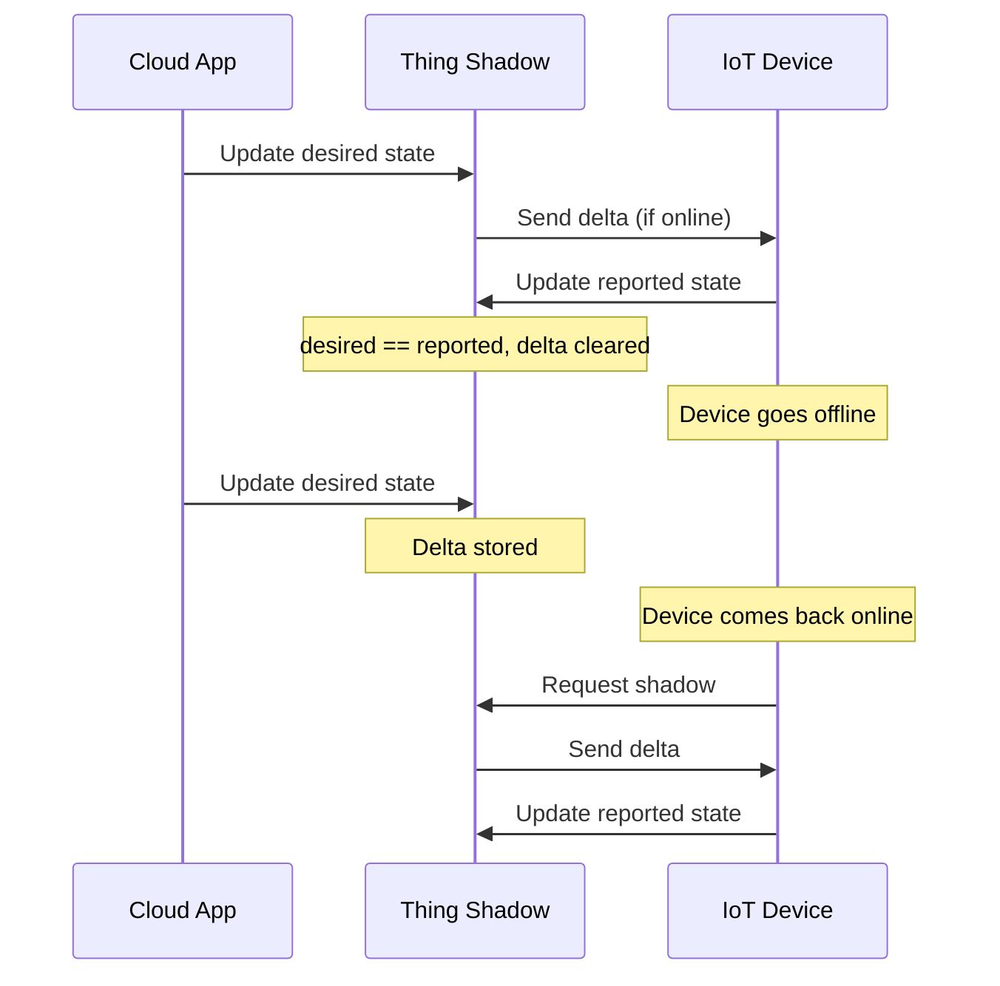

# How to Create IoT Core Thing Shadows

Author: [nawazdhandala](https://github.com/nawazdhandala)

Tags: AWS, IoT Core, Thing Shadows, Device State

Description: Learn how to use AWS IoT Core Thing Shadows to manage device state, synchronize desired and reported states, and handle offline devices with shadow documents.

---

Physical devices go offline. Networks drop. Firmware crashes. When you send a command to a device that's currently unreachable, what happens? Without a mechanism to store desired state, the command is lost. The device comes back online and has no idea it was supposed to do something.

AWS IoT Core Thing Shadows solve this problem. A shadow is a JSON document stored in the cloud that represents a device's current state and desired state. When the device reconnects, it checks its shadow and applies any pending changes. It's a simple concept that makes IoT systems dramatically more reliable.

## How Shadows Work

A Thing Shadow has three main sections:

- **reported**: The state the device last reported (what it's actually doing)
- **desired**: The state you want the device to be in (what it should be doing)
- **delta**: The difference between desired and reported (what needs to change)



## Creating a Classic Shadow

Every Thing in IoT Core can have one unnamed (classic) shadow and multiple named shadows. Let's start with the classic shadow.

```bash
# Update a thing shadow with initial state
aws iot-data update-thing-shadow \
    --thing-name "temperature-sensor-001" \
    --cli-binary-format raw-in-base64-out \
    --payload '{
        "state": {
            "reported": {
                "temperature": 22.5,
                "humidity": 45,
                "firmware_version": "1.2.0",
                "reporting_interval": 30
            }
        }
    }' output.json

# Read the shadow
aws iot-data get-thing-shadow \
    --thing-name "temperature-sensor-001" output.json
cat output.json
```

## Setting Desired State

When you want the device to change its behavior, update the desired state.

```bash
# Set desired state - change reporting interval to 10 seconds
aws iot-data update-thing-shadow \
    --thing-name "temperature-sensor-001" \
    --cli-binary-format raw-in-base64-out \
    --payload '{
        "state": {
            "desired": {
                "reporting_interval": 10
            }
        }
    }' output.json
```

IoT Core automatically computes the delta between desired and reported. If the device is online, it receives the delta immediately via MQTT. If it's offline, the delta waits in the shadow.

## The Shadow Document Structure

A complete shadow document looks like this.

```json
{
    "state": {
        "desired": {
            "reporting_interval": 10
        },
        "reported": {
            "temperature": 22.5,
            "humidity": 45,
            "firmware_version": "1.2.0",
            "reporting_interval": 30
        },
        "delta": {
            "reporting_interval": 10
        }
    },
    "metadata": {
        "desired": {
            "reporting_interval": {
                "timestamp": 1707750000
            }
        },
        "reported": {
            "temperature": {
                "timestamp": 1707749000
            }
        }
    },
    "version": 5,
    "timestamp": 1707750000
}
```

The `version` field increments with every update. It's crucial for handling conflicts - if two updates arrive simultaneously, the one with the outdated version is rejected.

## Device-Side Shadow Handling

Here's how to implement shadow handling on the device side using Python.

```python
# shadow_handler.py - Device-side shadow management
from awscrt import mqtt
from awsiot import iotshadow
from awsiot import mqtt_connection_builder
import json
import time

ENDPOINT = "abc123-ats.iot.us-east-1.amazonaws.com"
THING_NAME = "temperature-sensor-001"

# Current device state
device_state = {
    "temperature": 22.5,
    "humidity": 45,
    "firmware_version": "1.2.0",
    "reporting_interval": 30
}

# Build MQTT connection
mqtt_connection = mqtt_connection_builder.mtls_from_path(
    endpoint=ENDPOINT,
    cert_filepath="device-cert.pem",
    pri_key_filepath="private-key.pem",
    ca_filepath="AmazonRootCA1.pem",
    client_id=THING_NAME,
    clean_session=False,
    keep_alive_secs=30
)

mqtt_connection.connect().result()

# Create shadow client
shadow_client = iotshadow.IotShadowClient(mqtt_connection)

def on_shadow_delta(event):
    """Handle incoming shadow delta - apply desired state changes."""
    if event.state:
        print(f"Shadow delta received: {event.state}")

        # Apply each desired state change
        for key, value in event.state.items():
            if key in device_state:
                old_value = device_state[key]
                device_state[key] = value
                print(f"Updated {key}: {old_value} -> {value}")

        # Report the new state back to the shadow
        report_state()

def report_state():
    """Report current device state to the shadow."""
    request = iotshadow.UpdateShadowRequest(
        thing_name=THING_NAME,
        state=iotshadow.ShadowState(
            reported=device_state
        )
    )
    shadow_client.publish_update_shadow(request, mqtt.QoS.AT_LEAST_ONCE)
    print(f"Reported state: {device_state}")

def get_shadow():
    """Request the current shadow on startup."""
    request = iotshadow.GetShadowRequest(thing_name=THING_NAME)
    shadow_client.publish_get_shadow(request, mqtt.QoS.AT_LEAST_ONCE)

def on_get_shadow_accepted(response):
    """Handle the shadow document received on startup."""
    if response.state and response.state.delta:
        print(f"Pending delta found: {response.state.delta}")
        on_shadow_delta_event = type('obj', (object,), {'state': response.state.delta})
        on_shadow_delta(on_shadow_delta_event)
    else:
        print("No pending delta, device is in sync")

# Subscribe to shadow events
delta_sub = shadow_client.subscribe_to_shadow_delta_updated_events(
    request=iotshadow.ShadowDeltaUpdatedSubscriptionRequest(thing_name=THING_NAME),
    qos=mqtt.QoS.AT_LEAST_ONCE,
    callback=on_shadow_delta
)

get_accepted_sub = shadow_client.subscribe_to_get_shadow_accepted(
    request=iotshadow.GetShadowSubscriptionRequest(thing_name=THING_NAME),
    qos=mqtt.QoS.AT_LEAST_ONCE,
    callback=on_get_shadow_accepted
)

# On startup, request the current shadow to check for pending deltas
get_shadow()

# Report initial state
report_state()

# Main loop
try:
    while True:
        # Simulate sensor reading
        device_state["temperature"] = 22.5 + (time.time() % 5) / 10
        report_state()
        time.sleep(device_state["reporting_interval"])
except KeyboardInterrupt:
    mqtt_connection.disconnect().result()
```

## Named Shadows

Named shadows let you organize device state into logical groups. A thermostat might have separate shadows for "settings", "schedule", and "diagnostics".

```bash
# Create a named shadow for device settings
aws iot-data update-thing-shadow \
    --thing-name "thermostat-001" \
    --shadow-name "settings" \
    --cli-binary-format raw-in-base64-out \
    --payload '{
        "state": {
            "reported": {
                "target_temperature": 72,
                "mode": "auto",
                "fan_speed": "medium"
            }
        }
    }' output.json

# Create a named shadow for schedule
aws iot-data update-thing-shadow \
    --thing-name "thermostat-001" \
    --shadow-name "schedule" \
    --cli-binary-format raw-in-base64-out \
    --payload '{
        "state": {
            "reported": {
                "weekday_start": "07:00",
                "weekday_end": "22:00",
                "weekend_start": "09:00",
                "weekend_end": "23:00"
            }
        }
    }' output.json
```

Named shadows have their own MQTT topics.

```
$aws/things/{thing-name}/shadow/name/{shadow-name}/update
$aws/things/{thing-name}/shadow/name/{shadow-name}/get
$aws/things/{thing-name}/shadow/name/{shadow-name}/delete
```

## Shadow MQTT Topics

IoT Core uses reserved MQTT topics for shadow operations. Understanding these is important for debugging.

```
# Update shadow
$aws/things/temperature-sensor-001/shadow/update

# Update accepted/rejected responses
$aws/things/temperature-sensor-001/shadow/update/accepted
$aws/things/temperature-sensor-001/shadow/update/rejected

# Get shadow
$aws/things/temperature-sensor-001/shadow/get
$aws/things/temperature-sensor-001/shadow/get/accepted
$aws/things/temperature-sensor-001/shadow/get/rejected

# Delta notifications
$aws/things/temperature-sensor-001/shadow/update/delta

# Shadow deleted
$aws/things/temperature-sensor-001/shadow/delete
```

## Managing Shadows from the Cloud

From your backend application, interact with shadows through the AWS SDK.

```python
# cloud_shadow_manager.py - Manage shadows from a cloud application
import boto3
import json

iot_data = boto3.client('iot-data', region_name='us-east-1')

def set_desired_state(thing_name, desired_state, shadow_name=None):
    """Update the desired state for a device."""
    payload = json.dumps({
        "state": {
            "desired": desired_state
        }
    })

    kwargs = {
        "thingName": thing_name,
        "payload": payload
    }
    if shadow_name:
        kwargs["shadowName"] = shadow_name

    response = iot_data.update_thing_shadow(**kwargs)
    return json.loads(response['payload'].read())

def get_shadow(thing_name, shadow_name=None):
    """Get the current shadow document."""
    kwargs = {"thingName": thing_name}
    if shadow_name:
        kwargs["shadowName"] = shadow_name

    response = iot_data.get_thing_shadow(**kwargs)
    return json.loads(response['payload'].read())

def delete_shadow(thing_name, shadow_name=None):
    """Delete a shadow."""
    kwargs = {"thingName": thing_name}
    if shadow_name:
        kwargs["shadowName"] = shadow_name

    iot_data.delete_thing_shadow(**kwargs)

# Example: Change a thermostat's target temperature
set_desired_state("thermostat-001", {"target_temperature": 68}, "settings")

# Example: Check if the device has applied the change
shadow = get_shadow("thermostat-001", "settings")
delta = shadow.get("state", {}).get("delta", {})
if delta:
    print(f"Device hasn't applied changes yet: {delta}")
else:
    print("Device is in sync with desired state")
```

## Shadow Size Limits

Shadow documents have a maximum size of 8 KB. That's smaller than most people expect. If you're storing a lot of data in shadows, you'll need to be strategic.

**Do store**: Configuration settings, status flags, firmware versions, simple metrics.

**Don't store**: Historical data, large payloads, binary data. Use MQTT topics with rules engine to route those to DynamoDB or S3 instead.

## Wrapping Up

Thing Shadows are one of the most powerful features in IoT Core. They give you a reliable way to manage device state regardless of connectivity. The device reports what it's doing, your application sets what it should be doing, and IoT Core bridges the gap - even when the device is offline.

Start with the classic unnamed shadow for simple devices. As your device's state model gets more complex, use named shadows to separate concerns. And always implement delta handling on the device side so pending changes are applied when the device reconnects.

For processing shadow changes and triggering actions, check out our guide on the [IoT Core Rules Engine](https://oneuptime.com/blog/post/2026-02-12-use-iot-core-rules-engine/view).
