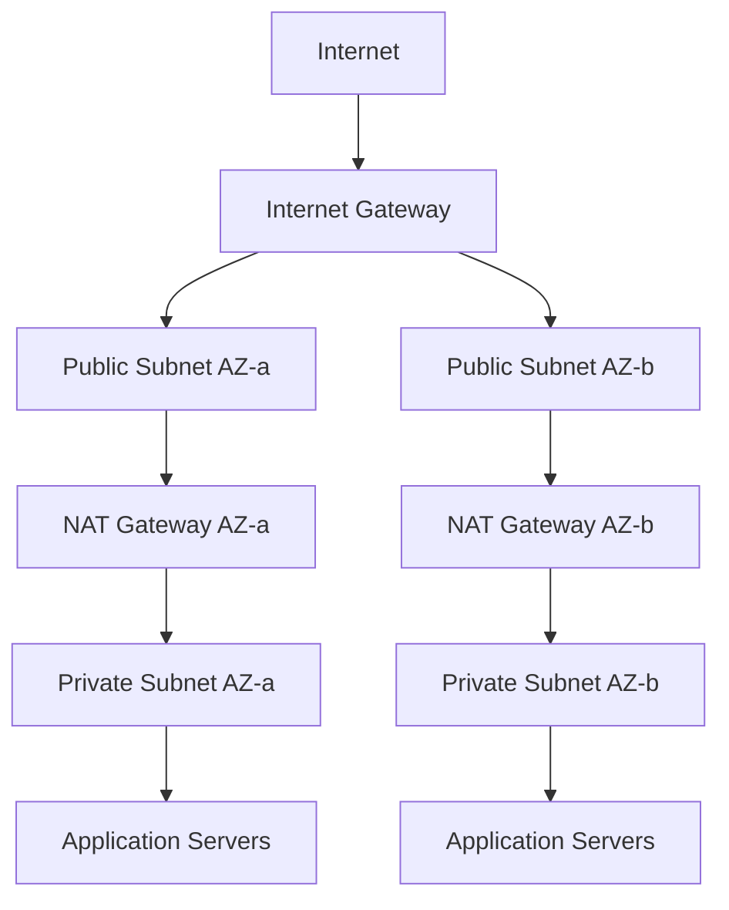

# How to Create NAT Gateways with Terraform

Author: [nawazdhandala](https://github.com/nawazdhandala)

Tags: AWS, VPC, Terraform, Networking

Description: Complete guide to creating AWS NAT Gateways with Terraform, covering high availability setups, route tables, cost optimization, and monitoring strategies.

---

NAT Gateways let resources in private subnets reach the internet for outbound traffic (software updates, API calls, etc.) without being directly accessible from the internet. They're a fundamental building block of AWS networking, sitting between your private subnets and the internet gateway.

The biggest decision with NAT Gateways is cost versus availability. A single NAT Gateway works but creates a single point of failure. One per AZ provides high availability but costs more. This guide covers both approaches and everything in between.

## How NAT Gateways Fit into a VPC

Here's the typical VPC architecture with NAT Gateways:



Traffic flow: private instance sends a request, it hits the route table, the route table sends it to the NAT Gateway, the NAT Gateway translates the private IP to its Elastic IP, and the request goes out through the internet gateway. Return traffic follows the reverse path.

## Single NAT Gateway (Simple Setup)

For development environments or cost-sensitive workloads where brief outages are acceptable, a single NAT Gateway works fine.

This creates a VPC with one NAT Gateway shared across all private subnets:

```hcl
# Elastic IP for the NAT Gateway
resource "aws_eip" "nat" {
  domain = "vpc"

  tags = {
    Name = "nat-gateway-eip"
  }
}

# NAT Gateway in the first public subnet
resource "aws_nat_gateway" "main" {
  allocation_id = aws_eip.nat.id
  subnet_id     = aws_subnet.public[0].id  # Must be in a public subnet

  tags = {
    Name = "main-nat-gateway"
  }

  # The NAT Gateway needs the Internet Gateway to exist first
  depends_on = [aws_internet_gateway.main]
}

# Route table for private subnets
resource "aws_route_table" "private" {
  vpc_id = aws_vpc.main.id

  route {
    cidr_block     = "0.0.0.0/0"
    nat_gateway_id = aws_nat_gateway.main.id
  }

  tags = {
    Name = "private-route-table"
  }
}

# Associate private subnets with the route table
resource "aws_route_table_association" "private" {
  count = length(var.private_subnet_ids)

  subnet_id      = var.private_subnet_ids[count.index]
  route_table_id = aws_route_table.private.id
}
```

## High-Availability NAT Gateways (One Per AZ)

For production workloads, deploy a NAT Gateway in each AZ. If one AZ goes down, instances in other AZs continue to have internet access.

This creates a NAT Gateway in each AZ with its own route table:

```hcl
variable "availability_zones" {
  type    = list(string)
  default = ["us-east-1a", "us-east-1b", "us-east-1c"]
}

# VPC
resource "aws_vpc" "main" {
  cidr_block           = "10.0.0.0/16"
  enable_dns_hostnames = true
  enable_dns_support   = true

  tags = {
    Name = "production-vpc"
  }
}

# Internet Gateway
resource "aws_internet_gateway" "main" {
  vpc_id = aws_vpc.main.id

  tags = {
    Name = "production-igw"
  }
}

# Public subnets (one per AZ)
resource "aws_subnet" "public" {
  count = length(var.availability_zones)

  vpc_id                  = aws_vpc.main.id
  cidr_block              = cidrsubnet(aws_vpc.main.cidr_block, 8, count.index)
  availability_zone       = var.availability_zones[count.index]
  map_public_ip_on_launch = true

  tags = {
    Name = "public-${var.availability_zones[count.index]}"
  }
}

# Private subnets (one per AZ)
resource "aws_subnet" "private" {
  count = length(var.availability_zones)

  vpc_id            = aws_vpc.main.id
  cidr_block        = cidrsubnet(aws_vpc.main.cidr_block, 8, count.index + 10)
  availability_zone = var.availability_zones[count.index]

  tags = {
    Name = "private-${var.availability_zones[count.index]}"
  }
}

# One EIP per NAT Gateway
resource "aws_eip" "nat" {
  count  = length(var.availability_zones)
  domain = "vpc"

  tags = {
    Name = "nat-eip-${var.availability_zones[count.index]}"
  }
}

# One NAT Gateway per AZ
resource "aws_nat_gateway" "per_az" {
  count = length(var.availability_zones)

  allocation_id = aws_eip.nat[count.index].id
  subnet_id     = aws_subnet.public[count.index].id

  tags = {
    Name = "nat-gw-${var.availability_zones[count.index]}"
  }

  depends_on = [aws_internet_gateway.main]
}

# One route table per AZ, pointing to that AZ's NAT Gateway
resource "aws_route_table" "private" {
  count = length(var.availability_zones)

  vpc_id = aws_vpc.main.id

  route {
    cidr_block     = "0.0.0.0/0"
    nat_gateway_id = aws_nat_gateway.per_az[count.index].id
  }

  tags = {
    Name = "private-rt-${var.availability_zones[count.index]}"
  }
}

# Associate each private subnet with its AZ's route table
resource "aws_route_table_association" "private" {
  count = length(var.availability_zones)

  subnet_id      = aws_subnet.private[count.index].id
  route_table_id = aws_route_table.private[count.index].id
}
```

## Public Subnet Route Table

Don't forget the public subnet route table pointing to the internet gateway:

```hcl
resource "aws_route_table" "public" {
  vpc_id = aws_vpc.main.id

  route {
    cidr_block = "0.0.0.0/0"
    gateway_id = aws_internet_gateway.main.id
  }

  tags = {
    Name = "public-route-table"
  }
}

resource "aws_route_table_association" "public" {
  count = length(var.availability_zones)

  subnet_id      = aws_subnet.public[count.index].id
  route_table_id = aws_route_table.public.id
}
```

## Cost Breakdown

NAT Gateways are one of the more expensive networking components in AWS. Here's what you're paying for:

- **Hourly charge**: ~$0.045/hour per NAT Gateway (~$32/month)
- **Data processing**: $0.045 per GB of data processed
- **Elastic IP**: Free while attached to a running NAT Gateway

For three AZs, you're looking at roughly $96/month just in hourly charges, plus data processing. This adds up quickly.

## Cost Optimization: Conditional HA

A practical pattern is to use a variable to control whether you deploy one or three NAT Gateways:

```hcl
variable "single_nat_gateway" {
  type        = bool
  default     = false
  description = "Use a single NAT Gateway instead of one per AZ"
}

locals {
  nat_gateway_count = var.single_nat_gateway ? 1 : length(var.availability_zones)
}

resource "aws_eip" "nat" {
  count  = local.nat_gateway_count
  domain = "vpc"
}

resource "aws_nat_gateway" "main" {
  count = local.nat_gateway_count

  allocation_id = aws_eip.nat[count.index].id
  subnet_id     = aws_subnet.public[count.index].id

  depends_on = [aws_internet_gateway.main]

  tags = {
    Name = "nat-gw-${count.index}"
  }
}

resource "aws_route_table" "private" {
  count = length(var.availability_zones)

  vpc_id = aws_vpc.main.id

  route {
    cidr_block     = "0.0.0.0/0"
    nat_gateway_id = aws_nat_gateway.main[var.single_nat_gateway ? 0 : count.index].id
  }

  tags = {
    Name = "private-rt-${count.index}"
  }
}
```

Now you can use `single_nat_gateway = true` for dev/staging and `false` for production.

## Monitoring NAT Gateways

NAT Gateways publish CloudWatch metrics that you should be watching, especially data transfer metrics to catch unexpected costs.

These alarms alert on high data transfer and connection drops:

```hcl
resource "aws_cloudwatch_metric_alarm" "nat_bytes_out" {
  count = local.nat_gateway_count

  alarm_name          = "nat-gw-high-data-out-${count.index}"
  comparison_operator = "GreaterThanThreshold"
  evaluation_periods  = 1
  metric_name         = "BytesOutToDestination"
  namespace           = "AWS/NATGateway"
  period              = 3600  # 1 hour
  statistic           = "Sum"
  threshold           = 1000000000  # 1 GB per hour
  alarm_description   = "NAT Gateway sending more than 1 GB/hour"

  dimensions = {
    NatGatewayId = aws_nat_gateway.main[count.index].id
  }

  alarm_actions = [var.sns_topic_arn]
}

resource "aws_cloudwatch_metric_alarm" "nat_error_port_allocation" {
  count = local.nat_gateway_count

  alarm_name          = "nat-gw-port-allocation-errors-${count.index}"
  comparison_operator = "GreaterThanThreshold"
  evaluation_periods  = 1
  metric_name         = "ErrorPortAllocation"
  namespace           = "AWS/NATGateway"
  period              = 300
  statistic           = "Sum"
  threshold           = 0
  alarm_description   = "NAT Gateway port allocation errors detected"

  dimensions = {
    NatGatewayId = aws_nat_gateway.main[count.index].id
  }

  alarm_actions = [var.sns_topic_arn]
}
```

Port allocation errors mean the NAT Gateway is running out of simultaneous connections to a single destination. If you see these, you may need to spread traffic across multiple NAT Gateways or use multiple destination IPs.

## VPC Flow Logs for NAT Gateway Debugging

When troubleshooting connectivity through NAT Gateways, VPC Flow Logs are invaluable:

```hcl
resource "aws_flow_log" "vpc" {
  vpc_id          = aws_vpc.main.id
  traffic_type    = "ALL"
  iam_role_arn    = aws_iam_role.flow_log.arn
  log_destination = aws_cloudwatch_log_group.flow_log.arn
}

resource "aws_cloudwatch_log_group" "flow_log" {
  name              = "/vpc/flow-logs"
  retention_in_days = 14
}
```

For more on setting up CloudWatch monitoring, check out our guide on [CloudWatch alarms with Terraform](https://oneuptime.com/blog/post/create-cloudwatch-alarms-terraform/view).

## Outputs

```hcl
output "nat_gateway_ids" {
  value = aws_nat_gateway.main[*].id
}

output "nat_gateway_public_ips" {
  value = aws_eip.nat[*].public_ip
}
```

## Wrapping Up

NAT Gateways are straightforward to set up but can become a significant cost item if you're not careful. The key decisions are how many to deploy (one for simplicity, one per AZ for production) and how to monitor data transfer. Use the conditional pattern to keep dev environments cheap while maintaining high availability in production. And always set up CloudWatch alarms on data transfer metrics - an unexpected spike in NAT Gateway traffic is often the first sign of something going wrong.
