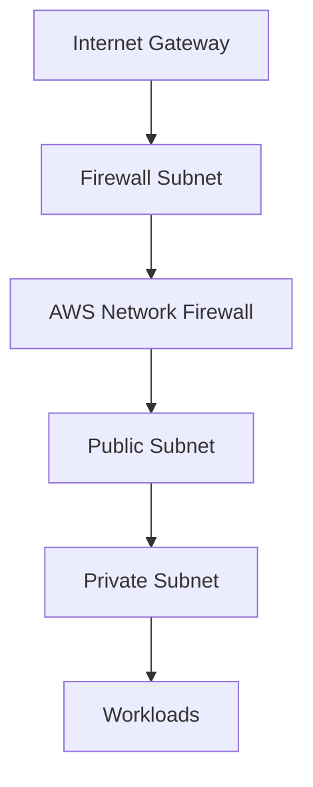

# How to Create Network Firewall with Terraform

Author: [nawazdhandala](https://github.com/nawazdhandala)

Tags: AWS, Terraform, Network Firewall, Security, VPC

Description: Complete guide to deploying AWS Network Firewall with Terraform, including firewall policies, rule groups, stateful and stateless rules, and logging.

---

AWS Network Firewall is a managed firewall service that sits in your VPC and inspects traffic at the network level. It supports stateless packet filtering, stateful deep packet inspection, and domain-based filtering. If you need more control than security groups and NACLs provide - like blocking specific domains, inspecting TLS traffic, or applying Suricata rules - Network Firewall is the tool for the job.

Setting it up involves several interconnected resources. Terraform makes this manageable by letting you define everything declaratively.

## How Network Firewall Fits in Your VPC

Network Firewall deploys into dedicated firewall subnets in your VPC. Traffic is routed through these subnets using VPC route tables. The typical pattern is:



You route ingress traffic from the internet gateway to the firewall subnet, then from the firewall to the public subnet. Egress traffic follows the reverse path.

## Creating the Firewall Subnets

The firewall needs its own subnets, separate from your application subnets:

```hcl
# Firewall subnets - one per AZ
resource "aws_subnet" "firewall" {
  count             = length(var.availability_zones)
  vpc_id            = aws_vpc.main.id
  cidr_block        = cidrsubnet(var.vpc_cidr, 8, count.index + 200)
  availability_zone = var.availability_zones[count.index]

  tags = {
    Name = "firewall-${var.availability_zones[count.index]}"
    Type = "firewall"
  }
}
```

## Stateless Rule Group

Stateless rules evaluate each packet individually without tracking connections. They're fast and good for basic allow/deny decisions:

```hcl
# Stateless rule group - basic packet filtering
resource "aws_networkfirewall_rule_group" "stateless" {
  capacity = 100
  name     = "basic-stateless-rules"
  type     = "STATELESS"

  rule_group {
    rules_source {
      stateless_rules_and_custom_actions {

        # Allow established TCP traffic
        stateless_rule {
          priority = 1
          rule_definition {
            actions = ["aws:pass"]
            match_attributes {
              protocols = [6]  # TCP
              source {
                address_definition = "10.0.0.0/8"
              }
              destination {
                address_definition = "0.0.0.0/0"
              }
            }
          }
        }

        # Drop all traffic from known bad CIDR ranges
        stateless_rule {
          priority = 10
          rule_definition {
            actions = ["aws:drop"]
            match_attributes {
              source {
                address_definition = "198.51.100.0/24"  # example bad range
              }
              destination {
                address_definition = "0.0.0.0/0"
              }
            }
          }
        }

        # Forward everything else to stateful rules
        stateless_rule {
          priority = 100
          rule_definition {
            actions = ["aws:forward_to_sfe"]
            match_attributes {
              source {
                address_definition = "0.0.0.0/0"
              }
              destination {
                address_definition = "0.0.0.0/0"
              }
            }
          }
        }
      }
    }
  }

  tags = {
    ManagedBy = "terraform"
  }
}
```

The priority matters - lower numbers are evaluated first. The common pattern is to drop obviously bad traffic with stateless rules, then forward everything else to stateful inspection.

## Stateful Rule Group - Domain Filtering

Stateful rules track connection state and can inspect application-layer protocols. Domain filtering is one of the most useful capabilities:

```hcl
# Stateful rule group - allow only specific domains
resource "aws_networkfirewall_rule_group" "domain_filter" {
  capacity = 100
  name     = "allowed-domains"
  type     = "STATEFUL"

  rule_group {
    rule_variables {
      ip_sets {
        key = "HOME_NET"
        ip_set {
          definition = ["10.0.0.0/8"]
        }
      }
    }

    rules_source {
      rules_source_list {
        generated_rules_type = "ALLOWLIST"
        target_types         = ["HTTP_HOST", "TLS_SNI"]

        targets = [
          ".amazonaws.com",
          ".github.com",
          ".docker.io",
          ".ubuntu.com",
          ".pypi.org",
          ".npmjs.org",
        ]
      }
    }
  }

  tags = {
    ManagedBy = "terraform"
  }
}
```

The leading dot in `.amazonaws.com` matches the domain and all its subdomains. `HTTP_HOST` inspects the Host header in HTTP traffic, and `TLS_SNI` inspects the Server Name Indication in TLS handshakes.

## Stateful Rule Group - Suricata Rules

For more advanced inspection, you can write Suricata-compatible rules directly:

```hcl
# Stateful rule group using Suricata syntax
resource "aws_networkfirewall_rule_group" "suricata" {
  capacity = 100
  name     = "suricata-rules"
  type     = "STATEFUL"

  rule_group {
    rules_source {
      rules_string = <<-EOT
        # Block SSH from outside the VPC
        drop tcp any any -> $HOME_NET 22 (msg:"Block external SSH"; sid:100001; rev:1;)

        # Alert on potential SQL injection attempts
        alert http any any -> $HOME_NET any (msg:"Possible SQL injection"; content:"UNION SELECT"; nocase; sid:100002; rev:1;)

        # Block cryptocurrency mining pools
        drop tls any any -> any any (tls.sni; content:"mining"; nocase; sid:100003; rev:1;)
      EOT
    }

    rule_variables {
      ip_sets {
        key = "HOME_NET"
        ip_set {
          definition = ["10.0.0.0/8"]
        }
      }
    }
  }
}
```

## Firewall Policy

The policy ties rule groups together and defines default actions:

```hcl
# Firewall policy - combines rule groups
resource "aws_networkfirewall_firewall_policy" "main" {
  name = "main-firewall-policy"

  firewall_policy {
    # Default action for stateless rules
    stateless_default_actions          = ["aws:forward_to_sfe"]
    stateless_fragment_default_actions = ["aws:forward_to_sfe"]

    # Reference stateless rule groups
    stateless_rule_group_reference {
      priority     = 1
      resource_arn = aws_networkfirewall_rule_group.stateless.arn
    }

    # Reference stateful rule groups
    stateful_rule_group_reference {
      resource_arn = aws_networkfirewall_rule_group.domain_filter.arn
    }

    stateful_rule_group_reference {
      resource_arn = aws_networkfirewall_rule_group.suricata.arn
    }

    # Stateful engine options
    stateful_engine_options {
      rule_order = "STRICT_ORDER"
    }
  }

  tags = {
    ManagedBy = "terraform"
  }
}
```

## The Firewall Resource

Now create the firewall itself, placing it in the firewall subnets:

```hcl
# The Network Firewall
resource "aws_networkfirewall_firewall" "main" {
  name                = "main-network-firewall"
  firewall_policy_arn = aws_networkfirewall_firewall_policy.main.arn
  vpc_id              = aws_vpc.main.id

  dynamic "subnet_mapping" {
    for_each = aws_subnet.firewall[*].id
    content {
      subnet_id = subnet_mapping.value
    }
  }

  tags = {
    Environment = var.environment
    ManagedBy   = "terraform"
  }
}
```

## Route Table Configuration

This is the part that trips people up. You need to route traffic through the firewall endpoints. The firewall creates a VPC endpoint in each firewall subnet:

```hcl
# Route table for the internet gateway - sends inbound traffic to firewall
resource "aws_route_table" "igw" {
  vpc_id = aws_vpc.main.id

  tags = {
    Name = "igw-route-table"
  }
}

resource "aws_route_table_association" "igw" {
  gateway_id     = aws_internet_gateway.main.id
  route_table_id = aws_route_table.igw.id
}

# Route public subnet traffic through the firewall endpoint
# You need one route per AZ pointing to that AZ's firewall endpoint
resource "aws_route" "igw_to_firewall" {
  count                  = length(var.availability_zones)
  route_table_id         = aws_route_table.igw.id
  destination_cidr_block = aws_subnet.public[count.index].cidr_block
  vpc_endpoint_id        = tolist(aws_networkfirewall_firewall.main.firewall_status[0].sync_states)[count.index].attachment[0].endpoint_id
}
```

## Logging Configuration

You'll want logs for visibility and compliance. Network Firewall supports flow logs and alert logs:

```hcl
# Logging to CloudWatch Logs
resource "aws_cloudwatch_log_group" "firewall_alert" {
  name              = "/aws/network-firewall/alert"
  retention_in_days = 30
}

resource "aws_cloudwatch_log_group" "firewall_flow" {
  name              = "/aws/network-firewall/flow"
  retention_in_days = 14
}

resource "aws_networkfirewall_logging_configuration" "main" {
  firewall_arn = aws_networkfirewall_firewall.main.arn

  logging_configuration {
    log_destination_config {
      log_destination = {
        logGroup = aws_cloudwatch_log_group.firewall_alert.name
      }
      log_destination_type = "CloudWatchLogs"
      log_type             = "ALERT"
    }

    log_destination_config {
      log_destination = {
        logGroup = aws_cloudwatch_log_group.firewall_flow.name
      }
      log_destination_type = "CloudWatchLogs"
      log_type             = "FLOW"
    }
  }
}
```

Alert logs capture traffic that matches rules with alert or drop actions. Flow logs capture all traffic passing through the firewall. If you're looking for centralized monitoring across your infrastructure, check out our post on [AWS monitoring strategies](https://oneuptime.com/blog/post/2026-02-02-pulumi-aws-infrastructure/view).

## Outputs

```hcl
output "firewall_arn" {
  value = aws_networkfirewall_firewall.main.arn
}

output "firewall_status" {
  value = aws_networkfirewall_firewall.main.firewall_status
}
```

## Key Takeaways

AWS Network Firewall fills the gap between security groups (instance-level) and NACLs (subnet-level) by providing deep packet inspection at the VPC level. The setup is more involved than most AWS services because of the routing complexity, but Terraform makes it reproducible. Start with domain filtering and basic stateless rules, then layer in Suricata rules as your security requirements grow. And always enable logging - you can't troubleshoot what you can't see.
