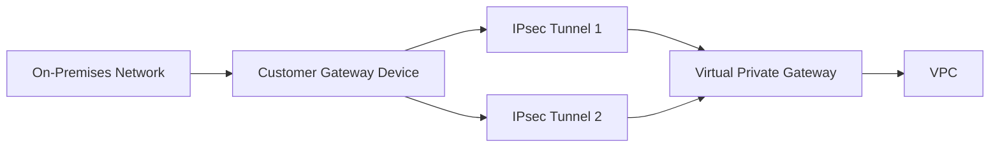

# How to Create Site-to-Site VPN with Terraform

Author: [nawazdhandala](https://github.com/nawazdhandala)

Tags: AWS, Terraform, VPN, Networking, Hybrid Cloud

Description: Learn how to set up an AWS Site-to-Site VPN connection using Terraform, covering customer gateways, VPN gateways, tunnels, and routing configurations.

---

An AWS Site-to-Site VPN connects your on-premises network to your AWS VPC through encrypted IPsec tunnels over the public internet. It's the quickest way to establish a hybrid connection and makes a solid backup path even if you have Direct Connect. With Terraform, you can define the entire VPN setup - customer gateway, VPN gateway, connection, and routes - in a single configuration.

Let's build a complete Site-to-Site VPN from scratch.

## Architecture Overview

A Site-to-Site VPN involves these components:

- **Customer Gateway (CGW)**: Represents your on-premises VPN device
- **Virtual Private Gateway (VGW)** or **Transit Gateway**: The AWS side of the VPN
- **VPN Connection**: The actual VPN tunnels (AWS always creates two for redundancy)
- **Route propagation**: How AWS routes learn about your on-premises networks



## Customer Gateway

The customer gateway is a representation of your physical VPN device in AWS. You need the public IP address of your on-premises VPN device and its BGP ASN:

```hcl
# Customer gateway - represents your on-prem VPN device
resource "aws_customer_gateway" "main" {
  bgp_asn    = 65000    # your on-premises BGP ASN
  ip_address = var.onprem_vpn_ip  # public IP of your VPN device
  type       = "ipsec.1"

  tags = {
    Name        = "onprem-cgw"
    Environment = var.environment
  }
}
```

If your VPN device is behind a NAT, you can use a private IP and set `ip_address` to the NAT device's public IP. You'll also need to configure NAT-Traversal (NAT-T) on your device.

## Virtual Private Gateway

The VGW attaches to your VPC and serves as the AWS endpoint for the VPN:

```hcl
# Virtual Private Gateway - AWS side of the VPN
resource "aws_vpn_gateway" "main" {
  vpc_id          = aws_vpc.main.id
  amazon_side_asn = 64512  # AWS BGP ASN

  tags = {
    Name = "main-vgw"
  }
}

# Enable route propagation so VPN routes appear in your route tables
resource "aws_vpn_gateway_route_propagation" "private" {
  vpn_gateway_id = aws_vpn_gateway.main.id
  route_table_id = aws_route_table.private.id
}
```

Route propagation is important. Without it, traffic won't know how to get to your on-premises networks. Enable it on every route table that needs access to on-premises resources.

## VPN Connection

Now create the VPN connection itself. AWS automatically provisions two tunnels for high availability:

```hcl
# VPN connection with two tunnels
resource "aws_vpn_connection" "main" {
  vpn_gateway_id      = aws_vpn_gateway.main.id
  customer_gateway_id = aws_customer_gateway.main.id
  type                = "ipsec.1"
  static_routes_only  = false  # use BGP for dynamic routing

  # Tunnel 1 options
  tunnel1_ike_versions                 = ["ikev2"]
  tunnel1_phase1_dh_group_numbers      = [14, 15, 16]
  tunnel1_phase1_encryption_algorithms = ["AES256"]
  tunnel1_phase1_integrity_algorithms  = ["SHA2-256"]
  tunnel1_phase2_dh_group_numbers      = [14, 15, 16]
  tunnel1_phase2_encryption_algorithms = ["AES256"]
  tunnel1_phase2_integrity_algorithms  = ["SHA2-256"]

  # Tunnel 2 options (same settings for consistency)
  tunnel2_ike_versions                 = ["ikev2"]
  tunnel2_phase1_dh_group_numbers      = [14, 15, 16]
  tunnel2_phase1_encryption_algorithms = ["AES256"]
  tunnel2_phase1_integrity_algorithms  = ["SHA2-256"]
  tunnel2_phase2_dh_group_numbers      = [14, 15, 16]
  tunnel2_phase2_encryption_algorithms = ["AES256"]
  tunnel2_phase2_integrity_algorithms  = ["SHA2-256"]

  tags = {
    Name = "onprem-to-aws-vpn"
  }
}
```

I've set `static_routes_only = false` because BGP is almost always the better choice. It automatically handles failover between the two tunnels and propagates route changes without manual intervention.

## Static Routes (If Not Using BGP)

If your VPN device doesn't support BGP, you'll need static routes:

```hcl
# Static routes - only needed if static_routes_only = true
resource "aws_vpn_connection_route" "onprem_network" {
  vpn_connection_id      = aws_vpn_connection.main.id
  destination_cidr_block = "192.168.0.0/16"  # your on-prem CIDR
}

resource "aws_vpn_connection_route" "onprem_network_2" {
  vpn_connection_id      = aws_vpn_connection.main.id
  destination_cidr_block = "10.100.0.0/16"
}
```

## Using Transit Gateway Instead

For multi-VPC environments, connecting the VPN to a Transit Gateway is usually better than a VGW. It gives you centralized routing:

```hcl
# Transit Gateway
resource "aws_ec2_transit_gateway" "main" {
  description                     = "Main transit gateway"
  default_route_table_association = "enable"
  default_route_table_propagation = "enable"
  vpn_ecmp_support                = "enable"

  tags = {
    Name = "main-tgw"
  }
}

# VPN connection to Transit Gateway
resource "aws_vpn_connection" "tgw" {
  customer_gateway_id = aws_customer_gateway.main.id
  transit_gateway_id  = aws_ec2_transit_gateway.main.id
  type                = "ipsec.1"
  static_routes_only  = false

  tags = {
    Name = "onprem-to-tgw-vpn"
  }
}
```

## Custom Tunnel Settings

You can customize the inside tunnel IP addresses and pre-shared keys. This is useful when your on-premises device has specific requirements:

```hcl
resource "aws_vpn_connection" "custom" {
  vpn_gateway_id      = aws_vpn_gateway.main.id
  customer_gateway_id = aws_customer_gateway.main.id
  type                = "ipsec.1"
  static_routes_only  = false

  # Custom inside tunnel CIDRs
  tunnel1_inside_cidr = "169.254.100.0/30"
  tunnel2_inside_cidr = "169.254.100.4/30"

  # Custom pre-shared keys (store these in Secrets Manager!)
  tunnel1_preshared_key = var.tunnel1_psk
  tunnel2_preshared_key = var.tunnel2_psk

  # Dead peer detection
  tunnel1_dpd_timeout_action = "restart"
  tunnel2_dpd_timeout_action = "restart"
  tunnel1_dpd_timeout_seconds = 30
  tunnel2_dpd_timeout_seconds = 30

  tags = {
    Name = "custom-vpn"
  }
}
```

Keep the pre-shared keys in a secrets manager, not in your Terraform code or state file. Use `var.tunnel1_psk` and pass it in at plan time.

## VPN Connection Outputs

After creating the VPN, you'll need tunnel details to configure your on-premises device:

```hcl
output "vpn_connection_id" {
  value = aws_vpn_connection.main.id
}

output "tunnel1_address" {
  description = "Public IP of VPN tunnel 1"
  value       = aws_vpn_connection.main.tunnel1_address
}

output "tunnel2_address" {
  description = "Public IP of VPN tunnel 2"
  value       = aws_vpn_connection.main.tunnel2_address
}

output "tunnel1_bgp_asn" {
  value = aws_vpn_connection.main.tunnel1_bgp_asn
}

output "tunnel1_inside_cidr" {
  value = aws_vpn_connection.main.tunnel1_vgw_inside_address
}

output "customer_gateway_configuration" {
  description = "XML config for your VPN device"
  value       = aws_vpn_connection.main.customer_gateway_configuration
  sensitive   = true
}
```

The `customer_gateway_configuration` output contains a full XML configuration for your VPN device. It's marked sensitive because it includes pre-shared keys.

## Monitoring VPN Tunnel Status

VPN tunnels go down. It happens. Set up monitoring so you know about it right away:

```hcl
# Alarm when a tunnel goes down
resource "aws_cloudwatch_metric_alarm" "vpn_tunnel1_down" {
  alarm_name          = "vpn-tunnel1-down"
  comparison_operator = "LessThanThreshold"
  evaluation_periods  = 2
  metric_name         = "TunnelState"
  namespace           = "AWS/VPN"
  period              = 300
  statistic           = "Maximum"
  threshold           = 1
  alarm_description   = "VPN Tunnel 1 is down"
  alarm_actions       = [aws_sns_topic.alerts.arn]

  dimensions = {
    VpnId    = aws_vpn_connection.main.id
    TunnelIpAddress = aws_vpn_connection.main.tunnel1_address
  }
}
```

Create a similar alarm for tunnel 2. For a complete monitoring setup, see our post on [monitoring infrastructure on AWS](https://oneuptime.com/blog/post/2026-02-02-pulumi-aws-infrastructure/view).

## Variables

```hcl
variable "environment" {
  type    = string
  default = "production"
}

variable "onprem_vpn_ip" {
  description = "Public IP of your on-premises VPN device"
  type        = string
}

variable "tunnel1_psk" {
  description = "Pre-shared key for tunnel 1"
  type        = string
  sensitive   = true
}

variable "tunnel2_psk" {
  description = "Pre-shared key for tunnel 2"
  type        = string
  sensitive   = true
}
```

## Tips for Production

A few things to keep in mind when running this in production:

1. **Always use both tunnels** - configure your on-premises device to use both tunnels with BGP failover
2. **Enable acceleration** - add `enable_acceleration = true` to the VPN connection for AWS Global Accelerator-backed tunnels
3. **Use IKEv2** - it's faster at re-establishing tunnels after failures
4. **Monitor both tunnels separately** - one tunnel being down might not affect traffic, but it means you've lost redundancy
5. **Consider VPN as Direct Connect backup** - a common pattern is Direct Connect primary with VPN failover

The Site-to-Site VPN is one of those services that's straightforward to set up but requires careful monitoring and testing of failover scenarios. Get the Terraform in place, configure your on-premises device, verify both tunnels are up, and then test what happens when one goes down.
