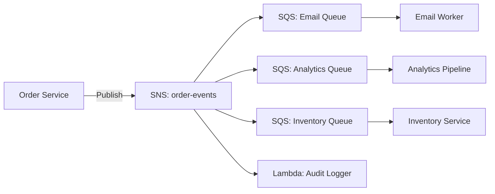

# How to Create SNS Topics with Terraform

Author: [nawazdhandala](https://github.com/nawazdhandala)

Tags: AWS, Terraform, SNS, Messaging

Description: A practical guide to creating Amazon SNS topics with Terraform, covering subscriptions, filtering, encryption, dead-letter queues, and fan-out patterns.

---

Amazon SNS is AWS's pub/sub messaging service. You publish a message to a topic, and SNS delivers it to all subscribers - whether that's SQS queues, Lambda functions, HTTP endpoints, or email addresses. It's the glue that holds event-driven architectures together.

Unlike SQS where a single consumer processes each message, SNS fans out messages to all subscribers. This makes it perfect for scenarios where multiple services need to react to the same event.

## Standard Topic

Let's start with a basic SNS topic:

```hcl
# Standard SNS topic
resource "aws_sns_topic" "order_events" {
  name = "order-events"

  tags = {
    Environment = "production"
    ManagedBy   = "terraform"
  }
}
```

That's the bare minimum. But a topic without subscribers isn't much use. Let's add some.

## Subscriptions

SNS supports several subscription protocols. Here are the most common ones.

### SQS Subscription

This subscribes an SQS queue to the SNS topic so every message gets delivered to the queue:

```hcl
# Subscribe an SQS queue to the topic
resource "aws_sns_topic_subscription" "order_queue" {
  topic_arn = aws_sns_topic.order_events.arn
  protocol  = "sqs"
  endpoint  = aws_sqs_queue.order_processing.arn

  # Enable raw message delivery (skip the SNS wrapper)
  raw_message_delivery = true
}

# The SQS queue needs a policy allowing SNS to send messages
resource "aws_sqs_queue_policy" "allow_sns" {
  queue_url = aws_sqs_queue.order_processing.id

  policy = jsonencode({
    Version = "2012-10-17"
    Statement = [
      {
        Sid       = "AllowSNS"
        Effect    = "Allow"
        Principal = {
          Service = "sns.amazonaws.com"
        }
        Action   = "sqs:SendMessage"
        Resource = aws_sqs_queue.order_processing.arn
        Condition = {
          ArnEquals = {
            "aws:SourceArn" = aws_sns_topic.order_events.arn
          }
        }
      }
    ]
  })
}
```

The `raw_message_delivery = true` option strips away the SNS metadata wrapper and delivers just your message body. Use it when you don't need the SNS metadata - it simplifies your consumer code.

### Lambda Subscription

This triggers a Lambda function for every message published to the topic:

```hcl
# Subscribe a Lambda function
resource "aws_sns_topic_subscription" "order_lambda" {
  topic_arn = aws_sns_topic.order_events.arn
  protocol  = "lambda"
  endpoint  = aws_lambda_function.order_notifier.arn
}

# Lambda needs permission to be invoked by SNS
resource "aws_lambda_permission" "sns_invoke" {
  statement_id  = "AllowSNSInvoke"
  action        = "lambda:InvokeFunction"
  function_name = aws_lambda_function.order_notifier.function_name
  principal     = "sns.amazonaws.com"
  source_arn    = aws_sns_topic.order_events.arn
}
```

### Email Subscription

Email subscriptions need manual confirmation, which makes them slightly awkward in Terraform:

```hcl
# Email subscription (requires manual confirmation)
resource "aws_sns_topic_subscription" "alerts_email" {
  topic_arn = aws_sns_topic.order_events.arn
  protocol  = "email"
  endpoint  = "team@example.com"
}
```

After applying, the recipient gets a confirmation email. Until they click the link, the subscription stays in `PendingConfirmation` status. Terraform can't complete this step for you.

### HTTPS Subscription

For webhook-style integrations:

```hcl
# HTTPS endpoint subscription
resource "aws_sns_topic_subscription" "webhook" {
  topic_arn            = aws_sns_topic.order_events.arn
  protocol             = "https"
  endpoint             = "https://api.example.com/webhooks/orders"
  endpoint_auto_confirms = true
  raw_message_delivery = true
}
```

## Message Filtering

Not every subscriber needs every message. SNS filter policies let subscribers receive only the messages they care about.

This filter only delivers messages where the `event_type` attribute is `order_placed` or `order_updated`:

```hcl
# Subscription with filter policy
resource "aws_sns_topic_subscription" "new_orders_only" {
  topic_arn = aws_sns_topic.order_events.arn
  protocol  = "sqs"
  endpoint  = aws_sqs_queue.new_orders.arn

  # Only receive messages with specific attributes
  filter_policy = jsonencode({
    event_type = ["order_placed", "order_updated"]
  })

  # Filter on message body instead of attributes
  filter_policy_scope = "MessageBody"
  raw_message_delivery = true
}

# Different subscriber that only cares about cancellations
resource "aws_sns_topic_subscription" "cancellations_only" {
  topic_arn = aws_sns_topic.order_events.arn
  protocol  = "sqs"
  endpoint  = aws_sqs_queue.cancellations.arn

  filter_policy = jsonencode({
    event_type = ["order_cancelled"]
  })

  raw_message_delivery = true
}
```

Filter policies are powerful - they support exact matching, prefix matching, numeric comparisons, and logical operators. Use them aggressively to reduce unnecessary processing in your consumers.

## FIFO Topic

When you need ordered, deduplicated message delivery, use a FIFO topic. The topic name must end with `.fifo`:

```hcl
# FIFO SNS topic
resource "aws_sns_topic" "transactions" {
  name                        = "payment-transactions.fifo"
  fifo_topic                  = true
  content_based_deduplication = true

  tags = {
    Environment = "production"
    ManagedBy   = "terraform"
  }
}

# FIFO topics can only subscribe to FIFO SQS queues
resource "aws_sns_topic_subscription" "transaction_queue" {
  topic_arn            = aws_sns_topic.transactions.arn
  protocol             = "sqs"
  endpoint             = aws_sqs_queue.transactions.arn  # Must be a FIFO queue
  raw_message_delivery = true
}
```

FIFO topics guarantee message ordering within a message group and prevent duplicate delivery within a 5-minute window. The trade-off is lower throughput - 300 messages per second (or 3,000 with high-throughput mode).

## Encryption

Encrypt your topics to protect message contents in transit through SNS:

```hcl
# Topic with KMS encryption
resource "aws_sns_topic" "sensitive" {
  name              = "sensitive-events"
  kms_master_key_id = aws_kms_key.sns.id

  tags = {
    Environment = "production"
    ManagedBy   = "terraform"
  }
}
```

When using KMS encryption, make sure your subscribers have permission to decrypt messages using the KMS key. Otherwise they'll fail silently.

## Topic Policy

Control who can publish to or subscribe to your topic:

```hcl
# Topic policy
resource "aws_sns_topic_policy" "order_events" {
  arn = aws_sns_topic.order_events.arn

  policy = jsonencode({
    Version = "2012-10-17"
    Statement = [
      {
        Sid       = "AllowPublishFromAccount"
        Effect    = "Allow"
        Principal = {
          AWS = "arn:aws:iam::123456789012:root"
        }
        Action   = "SNS:Publish"
        Resource = aws_sns_topic.order_events.arn
      },
      {
        Sid       = "AllowS3Notifications"
        Effect    = "Allow"
        Principal = {
          Service = "s3.amazonaws.com"
        }
        Action   = "SNS:Publish"
        Resource = aws_sns_topic.order_events.arn
        Condition = {
          ArnLike = {
            "aws:SourceArn" = "arn:aws:s3:::my-bucket"
          }
        }
      }
    ]
  })
}
```

## Dead-Letter Queue for Subscriptions

If SNS can't deliver a message to a subscriber (the endpoint is down, for example), it retries. If all retries fail, the message is lost unless you configure a DLQ for the subscription:

```hcl
# DLQ for failed SNS deliveries
resource "aws_sqs_queue" "sns_delivery_dlq" {
  name                      = "sns-delivery-failures"
  message_retention_seconds = 1209600
  sqs_managed_sse_enabled   = true
}

# Subscription with DLQ
resource "aws_sns_topic_subscription" "with_dlq" {
  topic_arn = aws_sns_topic.order_events.arn
  protocol  = "https"
  endpoint  = "https://api.example.com/webhook"

  redrive_policy = jsonencode({
    deadLetterTargetArn = aws_sqs_queue.sns_delivery_dlq.arn
  })
}
```

## Fan-Out Pattern

The most common SNS pattern is fan-out: one event triggers multiple independent actions.



Each subscriber processes the message independently. If the analytics service goes down, orders still get processed and emails still get sent.

For setting up the SQS queues in this pattern, check out our post on [creating SQS queues with Terraform](https://oneuptime.com/blog/post/create-sqs-queues-with-terraform/view).

## Wrapping Up

SNS is deceptively simple - create a topic, add subscribers, and publish messages. But the real power comes from combining it with filter policies, fan-out patterns, and dead-letter queues. Use filter policies to route messages efficiently, always add DLQs to catch delivery failures, and consider FIFO topics when ordering matters. It's the backbone of event-driven architectures on AWS.
