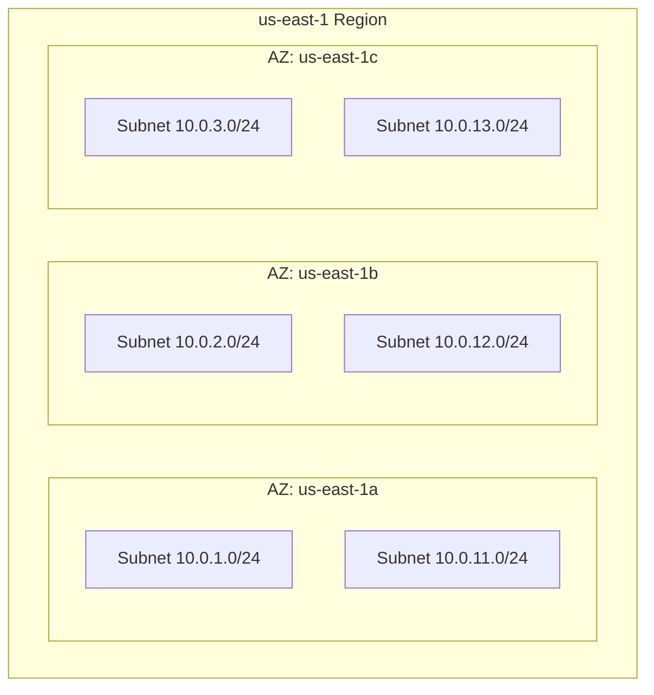

# How to Create Subnets Across Multiple Availability Zones

Author: [nawazdhandala](https://github.com/nawazdhandala)

Tags: AWS, VPC, Networking, High Availability

Description: Learn how to distribute subnets across multiple AWS availability zones for high availability, fault tolerance, and compliance with AWS service requirements.

---

If all your resources live in a single availability zone, you're one power outage away from a complete outage. AWS availability zones are physically separate data centers within a region, designed so that a failure in one zone doesn't affect the others. Spreading your subnets across multiple AZs is the simplest and most effective way to build resilient infrastructure.

Many AWS services actually require multi-AZ subnets. RDS Multi-AZ deployments, ECS services, Application Load Balancers - they all need subnets in at least two availability zones. So this isn't just about best practices. It's often a hard requirement.

## How Availability Zones Work

Each AWS region has at least three availability zones. They're connected by high-bandwidth, low-latency networking but are physically isolated from each other. When you create a subnet, you assign it to exactly one AZ. To cover multiple AZs, you create multiple subnets.

Here's the concept:



## Planning Your Subnet Layout

Before creating subnets, decide on three things:

1. **How many AZs?** Two is the minimum for most HA setups. Three gives you better resilience and is required for some services. I typically use three.

2. **How many subnet types?** Public, private app, private data - that's three types across three AZs, giving you nine subnets total.

3. **CIDR sizing.** A `/24` gives you 251 usable IPs per subnet. That's usually plenty for most workloads. If you're running Kubernetes with lots of pods, consider `/20` or larger.

Here's a practical CIDR layout:

```
VPC: 10.0.0.0/16

Public subnets (one per AZ):
  10.0.1.0/24  - us-east-1a  (251 hosts)
  10.0.2.0/24  - us-east-1b  (251 hosts)
  10.0.3.0/24  - us-east-1c  (251 hosts)

Private subnets (one per AZ):
  10.0.11.0/24 - us-east-1a  (251 hosts)
  10.0.12.0/24 - us-east-1b  (251 hosts)
  10.0.13.0/24 - us-east-1c  (251 hosts)

Data subnets (one per AZ):
  10.0.21.0/24 - us-east-1a  (251 hosts)
  10.0.22.0/24 - us-east-1b  (251 hosts)
  10.0.23.0/24 - us-east-1c  (251 hosts)
```

AWS reserves 5 IP addresses in each subnet (first 4 and last 1), which is why a `/24` with 256 addresses only gives you 251 usable ones.

## Creating Multi-AZ Subnets with AWS CLI

Let's create this layout from the command line. First, you need to know which AZs are available in your region:

```bash
# List available AZs in your current region
aws ec2 describe-availability-zones \
  --query 'AvailabilityZones[?State==`available`].ZoneName' \
  --output table
```

Now create the subnets. Here's a script that builds all nine:

```bash
#!/bin/bash
# create-subnets.sh - Creates multi-AZ subnet layout

VPC_ID="vpc-0abc123def456789"  # Replace with your VPC ID
REGION="us-east-1"

# Get available AZs
AZS=($(aws ec2 describe-availability-zones \
  --region $REGION \
  --query 'AvailabilityZones[?State==`available`].ZoneName' \
  --output text))

echo "Using AZs: ${AZS[0]}, ${AZS[1]}, ${AZS[2]}"

# Create public subnets
for i in 0 1 2; do
  AZ=${AZS[$i]}
  CIDR="10.0.$((i+1)).0/24"
  SUBNET_ID=$(aws ec2 create-subnet \
    --vpc-id $VPC_ID \
    --cidr-block $CIDR \
    --availability-zone $AZ \
    --query 'Subnet.SubnetId' \
    --output text)

  # Tag the subnet for easy identification
  aws ec2 create-tags \
    --resources $SUBNET_ID \
    --tags Key=Name,Value="public-${AZ}" Key=Tier,Value=public

  echo "Created public subnet $SUBNET_ID in $AZ ($CIDR)"
done

# Create private app subnets
for i in 0 1 2; do
  AZ=${AZS[$i]}
  CIDR="10.0.$((i+11)).0/24"
  SUBNET_ID=$(aws ec2 create-subnet \
    --vpc-id $VPC_ID \
    --cidr-block $CIDR \
    --availability-zone $AZ \
    --query 'Subnet.SubnetId' \
    --output text)

  aws ec2 create-tags \
    --resources $SUBNET_ID \
    --tags Key=Name,Value="private-${AZ}" Key=Tier,Value=private

  echo "Created private subnet $SUBNET_ID in $AZ ($CIDR)"
done

# Create data subnets
for i in 0 1 2; do
  AZ=${AZS[$i]}
  CIDR="10.0.$((i+21)).0/24"
  SUBNET_ID=$(aws ec2 create-subnet \
    --vpc-id $VPC_ID \
    --cidr-block $CIDR \
    --availability-zone $AZ \
    --query 'Subnet.SubnetId' \
    --output text)

  aws ec2 create-tags \
    --resources $SUBNET_ID \
    --tags Key=Name,Value="data-${AZ}" Key=Tier,Value=data

  echo "Created data subnet $SUBNET_ID in $AZ ($CIDR)"
done
```

## CloudFormation with Dynamic AZ Selection

Hardcoding AZ names is fragile. CloudFormation can dynamically select AZs using the `!GetAZs` intrinsic function:

```yaml
# multi-az-subnets.yaml
AWSTemplateFormatVersion: '2010-09-09'
Description: Multi-AZ subnet creation with dynamic AZ selection

Parameters:
  VpcId:
    Type: AWS::EC2::VPC::Id
  NumberOfAZs:
    Type: Number
    Default: 3
    AllowedValues: [2, 3]

Conditions:
  ThreeAZs: !Equals [!Ref NumberOfAZs, 3]

Resources:
  PublicSubnet1:
    Type: AWS::EC2::Subnet
    Properties:
      VpcId: !Ref VpcId
      # Select the first AZ dynamically
      AvailabilityZone: !Select [0, !GetAZs '']
      CidrBlock: 10.0.1.0/24
      MapPublicIpOnLaunch: true
      Tags:
        - Key: Name
          Value: public-az1

  PublicSubnet2:
    Type: AWS::EC2::Subnet
    Properties:
      VpcId: !Ref VpcId
      AvailabilityZone: !Select [1, !GetAZs '']
      CidrBlock: 10.0.2.0/24
      MapPublicIpOnLaunch: true
      Tags:
        - Key: Name
          Value: public-az2

  PublicSubnet3:
    Type: AWS::EC2::Subnet
    # Only create if we want three AZs
    Condition: ThreeAZs
    Properties:
      VpcId: !Ref VpcId
      AvailabilityZone: !Select [2, !GetAZs '']
      CidrBlock: 10.0.3.0/24
      MapPublicIpOnLaunch: true
      Tags:
        - Key: Name
          Value: public-az3

  PrivateSubnet1:
    Type: AWS::EC2::Subnet
    Properties:
      VpcId: !Ref VpcId
      AvailabilityZone: !Select [0, !GetAZs '']
      CidrBlock: 10.0.11.0/24
      Tags:
        - Key: Name
          Value: private-az1

  PrivateSubnet2:
    Type: AWS::EC2::Subnet
    Properties:
      VpcId: !Ref VpcId
      AvailabilityZone: !Select [1, !GetAZs '']
      CidrBlock: 10.0.12.0/24
      Tags:
        - Key: Name
          Value: private-az2

  PrivateSubnet3:
    Type: AWS::EC2::Subnet
    Condition: ThreeAZs
    Properties:
      VpcId: !Ref VpcId
      AvailabilityZone: !Select [2, !GetAZs '']
      CidrBlock: 10.0.13.0/24
      Tags:
        - Key: Name
          Value: private-az3

Outputs:
  PublicSubnetIds:
    Value: !If
      - ThreeAZs
      - !Join [',', [!Ref PublicSubnet1, !Ref PublicSubnet2, !Ref PublicSubnet3]]
      - !Join [',', [!Ref PublicSubnet1, !Ref PublicSubnet2]]

  PrivateSubnetIds:
    Value: !If
      - ThreeAZs
      - !Join [',', [!Ref PrivateSubnet1, !Ref PrivateSubnet2, !Ref PrivateSubnet3]]
      - !Join [',', [!Ref PrivateSubnet1, !Ref PrivateSubnet2]]
```

## Tagging Strategy

Good tagging is critical when you have dozens of subnets. Here's a tagging scheme that works:

```bash
# Tag subnets so Kubernetes and other services can discover them
aws ec2 create-tags --resources $SUBNET_ID --tags \
  Key=Name,Value="prod-private-us-east-1a" \
  Key=Environment,Value=production \
  Key=Tier,Value=private \
  Key=kubernetes.io/role/internal-elb,Value=1 \
  Key=kubernetes.io/cluster/my-cluster,Value=shared
```

The Kubernetes-specific tags are essential if you're running EKS. The cluster's load balancer controller uses these tags to know which subnets to place load balancers in. Without them, your services won't get external endpoints.

## Verifying Your Setup

After creating all the subnets, verify the layout:

```bash
# List all subnets in your VPC, sorted by AZ
aws ec2 describe-subnets \
  --filters "Name=vpc-id,Values=$VPC_ID" \
  --query 'Subnets[].{AZ:AvailabilityZone,CIDR:CidrBlock,Name:Tags[?Key==`Name`].Value|[0],ID:SubnetId}' \
  --output table
```

This gives you a nice table view showing each subnet's AZ, CIDR block, name tag, and ID.

## Common Pitfalls

**Forgetting to enable auto-assign public IPs on public subnets.** Instances launched into public subnets won't get public IPs by default:

```bash
# Enable auto-assign public IP for a public subnet
aws ec2 modify-subnet-attribute \
  --subnet-id $PUBLIC_SUBNET_ID \
  --map-public-ip-on-launch
```

**Overlapping CIDR blocks.** AWS will reject a subnet creation if its CIDR overlaps with an existing subnet in the same VPC. Plan your address space carefully.

**Not associating subnets with the right route table.** Subnets use the main route table by default, which typically has no internet route. You need to explicitly associate public subnets with a route table that has an internet gateway route. For details on route table configuration, see [configuring route tables in a VPC](https://oneuptime.com/blog/post/configure-route-tables-in-vpc/view).

**Unbalanced AZ distribution.** If you put 3 instances in AZ-a and 1 in AZ-b, losing AZ-a takes out 75% of your capacity. Distribute evenly.

## Wrapping Up

Multi-AZ subnets are non-negotiable for production workloads. The setup takes a bit more planning upfront, but the resilience payoff is massive. Start with two AZs if budget is tight, but target three for production. And always, always use infrastructure as code so your network is reproducible and version-controlled.
