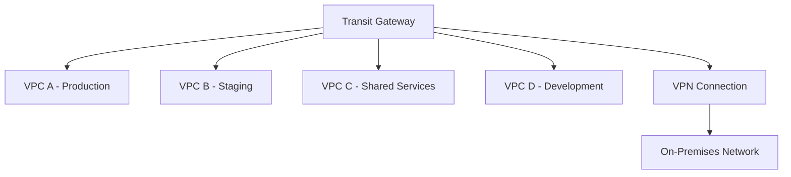

# How to Create Transit Gateways with Terraform

Author: [nawazdhandala](https://github.com/nawazdhandala)

Tags: AWS, Transit Gateway, Terraform, Networking

Description: Learn how to create and configure AWS Transit Gateways with Terraform for connecting multiple VPCs, on-premises networks, and implementing hub-and-spoke architecture.

---

AWS Transit Gateway is a network hub that connects multiple VPCs, VPN connections, and Direct Connect gateways through a single central point. Before Transit Gateway, connecting N VPCs required N*(N-1)/2 peering connections. With Transit Gateway, each VPC just connects to the hub. Once you've got more than two or three VPCs, Transit Gateway is the way to go.

This guide covers creating a Transit Gateway, attaching VPCs, configuring route tables, and building a hub-and-spoke architecture with Terraform.

## The Hub-and-Spoke Model

Transit Gateway replaces the mesh of VPC peering connections with a centralized hub:



## Creating the Transit Gateway

The Transit Gateway itself is simple to create. The configuration options control its default behavior.

This creates a Transit Gateway with auto-accept for attachments within the same account:

```hcl
resource "aws_ec2_transit_gateway" "main" {
  description                     = "Main transit gateway"
  amazon_side_asn                 = 64512  # BGP ASN for the gateway
  auto_accept_shared_attachments  = "enable"
  default_route_table_association = "enable"
  default_route_table_propagation = "enable"
  dns_support                     = "enable"
  vpn_ecmp_support                = "enable"

  tags = {
    Name      = "main-transit-gateway"
    ManagedBy = "terraform"
  }
}
```

Key settings explained:

- **`auto_accept_shared_attachments`**: When enabled, attachments from other accounts (via RAM sharing) are automatically accepted.
- **`default_route_table_association`**: Automatically associates new attachments with the default route table.
- **`default_route_table_propagation`**: Automatically propagates routes from new attachments to the default route table.
- **`vpn_ecmp_support`**: Enables Equal-Cost Multi-Path routing across VPN tunnels for better throughput.

## Attaching VPCs

Each VPC connects to the Transit Gateway through an attachment. The attachment specifies which subnets in the VPC should have routes to the Transit Gateway.

This attaches three VPCs to the Transit Gateway:

```hcl
# Production VPC attachment
resource "aws_ec2_transit_gateway_vpc_attachment" "production" {
  subnet_ids         = var.production_subnet_ids
  transit_gateway_id = aws_ec2_transit_gateway.main.id
  vpc_id             = var.production_vpc_id

  transit_gateway_default_route_table_association = true
  transit_gateway_default_route_table_propagation = true

  tags = {
    Name = "production-vpc-attachment"
  }
}

# Staging VPC attachment
resource "aws_ec2_transit_gateway_vpc_attachment" "staging" {
  subnet_ids         = var.staging_subnet_ids
  transit_gateway_id = aws_ec2_transit_gateway.main.id
  vpc_id             = var.staging_vpc_id

  tags = {
    Name = "staging-vpc-attachment"
  }
}

# Shared services VPC attachment
resource "aws_ec2_transit_gateway_vpc_attachment" "shared" {
  subnet_ids         = var.shared_subnet_ids
  transit_gateway_id = aws_ec2_transit_gateway.main.id
  vpc_id             = var.shared_vpc_id

  tags = {
    Name = "shared-services-vpc-attachment"
  }
}
```

## VPC Route Tables

After attaching VPCs, you need to add routes in each VPC's route table pointing to the Transit Gateway for cross-VPC traffic.

This adds routes in each VPC pointing to the Transit Gateway:

```hcl
# Production VPC: route to staging and shared services
resource "aws_route" "production_to_staging" {
  route_table_id         = var.production_route_table_id
  destination_cidr_block = "10.1.0.0/16"  # Staging VPC CIDR
  transit_gateway_id     = aws_ec2_transit_gateway.main.id
}

resource "aws_route" "production_to_shared" {
  route_table_id         = var.production_route_table_id
  destination_cidr_block = "10.2.0.0/16"  # Shared services VPC CIDR
  transit_gateway_id     = aws_ec2_transit_gateway.main.id
}

# Staging VPC: route to production and shared services
resource "aws_route" "staging_to_production" {
  route_table_id         = var.staging_route_table_id
  destination_cidr_block = "10.0.0.0/16"  # Production VPC CIDR
  transit_gateway_id     = aws_ec2_transit_gateway.main.id
}

resource "aws_route" "staging_to_shared" {
  route_table_id         = var.staging_route_table_id
  destination_cidr_block = "10.2.0.0/16"
  transit_gateway_id     = aws_ec2_transit_gateway.main.id
}

# Shared services VPC: route to all other VPCs
resource "aws_route" "shared_to_all" {
  route_table_id         = var.shared_route_table_id
  destination_cidr_block = "10.0.0.0/8"  # Supernet covering all VPCs
  transit_gateway_id     = aws_ec2_transit_gateway.main.id
}
```

## Custom Route Tables for Isolation

The default route table allows all-to-all communication. For security, you might want to isolate certain VPCs. Custom Transit Gateway route tables let you control which VPCs can reach each other.

This creates separate route tables to isolate staging from production while both can reach shared services:

```hcl
# Route table for production - can reach shared services only
resource "aws_ec2_transit_gateway_route_table" "production" {
  transit_gateway_id = aws_ec2_transit_gateway.main.id

  tags = {
    Name = "production-route-table"
  }
}

# Route table for staging - can reach shared services only
resource "aws_ec2_transit_gateway_route_table" "staging" {
  transit_gateway_id = aws_ec2_transit_gateway.main.id

  tags = {
    Name = "staging-route-table"
  }
}

# Route table for shared services - can reach everything
resource "aws_ec2_transit_gateway_route_table" "shared" {
  transit_gateway_id = aws_ec2_transit_gateway.main.id

  tags = {
    Name = "shared-services-route-table"
  }
}

# Associate attachments with their route tables
resource "aws_ec2_transit_gateway_route_table_association" "production" {
  transit_gateway_attachment_id  = aws_ec2_transit_gateway_vpc_attachment.production.id
  transit_gateway_route_table_id = aws_ec2_transit_gateway_route_table.production.id
}

resource "aws_ec2_transit_gateway_route_table_association" "staging" {
  transit_gateway_attachment_id  = aws_ec2_transit_gateway_vpc_attachment.staging.id
  transit_gateway_route_table_id = aws_ec2_transit_gateway_route_table.staging.id
}

resource "aws_ec2_transit_gateway_route_table_association" "shared" {
  transit_gateway_attachment_id  = aws_ec2_transit_gateway_vpc_attachment.shared.id
  transit_gateway_route_table_id = aws_ec2_transit_gateway_route_table.shared.id
}

# Propagate shared services routes to production and staging route tables
resource "aws_ec2_transit_gateway_route_table_propagation" "shared_to_production" {
  transit_gateway_attachment_id  = aws_ec2_transit_gateway_vpc_attachment.shared.id
  transit_gateway_route_table_id = aws_ec2_transit_gateway_route_table.production.id
}

resource "aws_ec2_transit_gateway_route_table_propagation" "shared_to_staging" {
  transit_gateway_attachment_id  = aws_ec2_transit_gateway_vpc_attachment.shared.id
  transit_gateway_route_table_id = aws_ec2_transit_gateway_route_table.staging.id
}

# Propagate production and staging to shared route table
resource "aws_ec2_transit_gateway_route_table_propagation" "production_to_shared" {
  transit_gateway_attachment_id  = aws_ec2_transit_gateway_vpc_attachment.production.id
  transit_gateway_route_table_id = aws_ec2_transit_gateway_route_table.shared.id
}

resource "aws_ec2_transit_gateway_route_table_propagation" "staging_to_shared" {
  transit_gateway_attachment_id  = aws_ec2_transit_gateway_vpc_attachment.staging.id
  transit_gateway_route_table_id = aws_ec2_transit_gateway_route_table.shared.id
}
```

With this configuration, production can reach shared services and vice versa. Staging can reach shared services and vice versa. But production and staging can't reach each other directly.

## Cross-Account Sharing with RAM

In multi-account setups, share the Transit Gateway using AWS Resource Access Manager.

This shares the Transit Gateway with another AWS account:

```hcl
resource "aws_ram_resource_share" "transit_gateway" {
  name                      = "transit-gateway-share"
  allow_external_principals = true  # Required for cross-account sharing

  tags = {
    Name = "transit-gateway-share"
  }
}

resource "aws_ram_resource_association" "transit_gateway" {
  resource_arn       = aws_ec2_transit_gateway.main.arn
  resource_share_arn = aws_ram_resource_share.transit_gateway.arn
}

resource "aws_ram_principal_association" "other_account" {
  principal          = "111111111111"  # Target account ID
  resource_share_arn = aws_ram_resource_share.transit_gateway.arn
}
```

## Static Routes

Sometimes you need static routes for specific destinations, like sending traffic to a specific VPC attachment for inspection.

This adds a static route pointing all traffic to a firewall VPC:

```hcl
resource "aws_ec2_transit_gateway_route" "to_firewall" {
  destination_cidr_block         = "0.0.0.0/0"
  transit_gateway_attachment_id  = aws_ec2_transit_gateway_vpc_attachment.firewall.id
  transit_gateway_route_table_id = aws_ec2_transit_gateway_route_table.production.id
}

# Blackhole route to drop traffic to specific ranges
resource "aws_ec2_transit_gateway_route" "blackhole" {
  destination_cidr_block         = "192.168.0.0/16"
  blackhole                      = true
  transit_gateway_route_table_id = aws_ec2_transit_gateway_route_table.production.id
}
```

## Monitoring

Transit Gateway publishes metrics to CloudWatch. Monitor bytes transferred and packet drops to catch connectivity issues.

For comprehensive monitoring of your network infrastructure, check our guide on [CloudWatch alarms with Terraform](https://oneuptime.com/blog/post/2026-02-12-create-cloudwatch-alarms-terraform/view).

## Outputs

```hcl
output "transit_gateway_id" {
  value = aws_ec2_transit_gateway.main.id
}

output "transit_gateway_arn" {
  value = aws_ec2_transit_gateway.main.arn
}

output "attachment_ids" {
  value = {
    production = aws_ec2_transit_gateway_vpc_attachment.production.id
    staging    = aws_ec2_transit_gateway_vpc_attachment.staging.id
    shared     = aws_ec2_transit_gateway_vpc_attachment.shared.id
  }
}
```

## Wrapping Up

Transit Gateway simplifies multi-VPC networking dramatically. The key concepts are attachments (how VPCs connect), route tables (which VPCs can reach each other), and propagations (how routes spread automatically). For production setups, use custom route tables to enforce network isolation between environments. The hourly cost per attachment ($0.05/hour) adds up across many VPCs, so plan your architecture accordingly.
