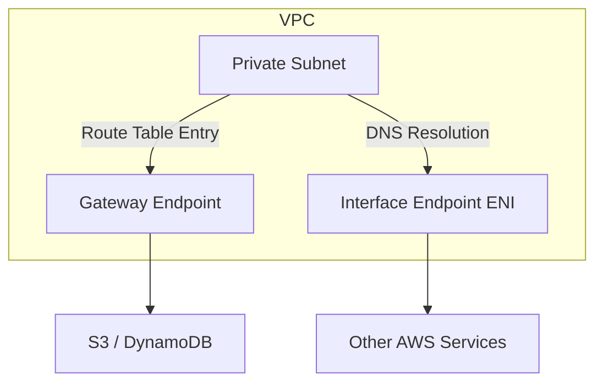

# How to Create VPC Endpoints with Terraform

Author: [nawazdhandala](https://github.com/nawazdhandala)

Tags: AWS, VPC, Terraform, Networking, Security

Description: Practical guide to creating AWS VPC Endpoints with Terraform, covering gateway endpoints, interface endpoints, endpoint policies, and private DNS configuration.

---

VPC Endpoints let your resources in private subnets access AWS services without going through the internet. Instead of routing traffic out through a NAT Gateway to reach S3, DynamoDB, or any other AWS API, the traffic stays on the AWS network. This has three benefits: it's more secure (no internet exposure), it's faster (lower latency), and it saves money (no NAT Gateway data processing charges).

There are two types of endpoints, and which one you need depends on the service you're connecting to. This guide covers both types, their configuration, and the cost considerations that should drive your decisions.

## Two Types of VPC Endpoints

**Gateway Endpoints** are for S3 and DynamoDB only. They're free, they modify your route tables, and there's no reason not to use them. Always create these.

**Interface Endpoints** are for everything else (ECR, CloudWatch, Secrets Manager, SQS, SNS, KMS, etc.). They create ENIs in your subnets with private IP addresses and cost $0.01/hour per AZ plus data processing charges.



## Gateway Endpoints: S3 and DynamoDB

These are free and straightforward. There's no valid reason to skip them.

This creates gateway endpoints for S3 and DynamoDB:

```hcl
# S3 Gateway Endpoint
resource "aws_vpc_endpoint" "s3" {
  vpc_id       = aws_vpc.main.id
  service_name = "com.amazonaws.us-east-1.s3"

  route_table_ids = [
    aws_route_table.private_a.id,
    aws_route_table.private_b.id,
    aws_route_table.private_c.id,
  ]

  tags = {
    Name = "s3-gateway-endpoint"
  }
}

# DynamoDB Gateway Endpoint
resource "aws_vpc_endpoint" "dynamodb" {
  vpc_id       = aws_vpc.main.id
  service_name = "com.amazonaws.us-east-1.dynamodb"

  route_table_ids = [
    aws_route_table.private_a.id,
    aws_route_table.private_b.id,
    aws_route_table.private_c.id,
  ]

  tags = {
    Name = "dynamodb-gateway-endpoint"
  }
}
```

The gateway endpoint adds a route to the specified route tables automatically. Traffic to S3 or DynamoDB now stays within the AWS network.

## Gateway Endpoint Policies

You can restrict what actions are allowed through a gateway endpoint. This is useful for preventing data exfiltration - only allow access to your own S3 buckets.

This endpoint policy restricts S3 access to specific buckets:

```hcl
resource "aws_vpc_endpoint" "s3_restricted" {
  vpc_id       = aws_vpc.main.id
  service_name = "com.amazonaws.us-east-1.s3"

  route_table_ids = [aws_route_table.private.id]

  policy = jsonencode({
    Version = "2012-10-17"
    Statement = [
      {
        Sid       = "AllowSpecificBuckets"
        Effect    = "Allow"
        Principal = "*"
        Action    = "s3:*"
        Resource = [
          "arn:aws:s3:::my-app-data",
          "arn:aws:s3:::my-app-data/*",
          "arn:aws:s3:::my-app-logs",
          "arn:aws:s3:::my-app-logs/*"
        ]
      },
      {
        Sid       = "AllowECRBuckets"
        Effect    = "Allow"
        Principal = "*"
        Action    = "s3:GetObject"
        Resource  = "arn:aws:s3:::prod-us-east-1-starport-layer-bucket/*"
      }
    ]
  })

  tags = {
    Name = "s3-restricted-endpoint"
  }
}
```

Be careful with S3 endpoint policies. Services like ECR use S3 under the hood to store image layers. If you restrict the policy too tightly, ECR pulls will break. The `prod-*-starport-layer-bucket` pattern in the example above handles this.

## Interface Endpoints

Interface endpoints create network interfaces in your subnets. They're more complex to set up and they cost money, but they're the only option for most AWS services.

This creates interface endpoints for the most commonly needed services:

```hcl
# Security group for interface endpoints
resource "aws_security_group" "vpc_endpoints" {
  name        = "vpc-endpoints"
  description = "Security group for VPC interface endpoints"
  vpc_id      = aws_vpc.main.id

  ingress {
    description = "HTTPS from VPC"
    from_port   = 443
    to_port     = 443
    protocol    = "tcp"
    cidr_blocks = [aws_vpc.main.cidr_block]
  }

  tags = {
    Name = "vpc-endpoints-sg"
  }
}

# ECR API endpoint (for docker login and image manifest operations)
resource "aws_vpc_endpoint" "ecr_api" {
  vpc_id              = aws_vpc.main.id
  service_name        = "com.amazonaws.us-east-1.ecr.api"
  vpc_endpoint_type   = "Interface"
  private_dns_enabled = true

  subnet_ids         = var.private_subnet_ids
  security_group_ids = [aws_security_group.vpc_endpoints.id]

  tags = {
    Name = "ecr-api-endpoint"
  }
}

# ECR Docker endpoint (for docker pull/push)
resource "aws_vpc_endpoint" "ecr_dkr" {
  vpc_id              = aws_vpc.main.id
  service_name        = "com.amazonaws.us-east-1.ecr.dkr"
  vpc_endpoint_type   = "Interface"
  private_dns_enabled = true

  subnet_ids         = var.private_subnet_ids
  security_group_ids = [aws_security_group.vpc_endpoints.id]

  tags = {
    Name = "ecr-dkr-endpoint"
  }
}

# CloudWatch Logs endpoint
resource "aws_vpc_endpoint" "logs" {
  vpc_id              = aws_vpc.main.id
  service_name        = "com.amazonaws.us-east-1.logs"
  vpc_endpoint_type   = "Interface"
  private_dns_enabled = true

  subnet_ids         = var.private_subnet_ids
  security_group_ids = [aws_security_group.vpc_endpoints.id]

  tags = {
    Name = "cloudwatch-logs-endpoint"
  }
}

# Secrets Manager endpoint
resource "aws_vpc_endpoint" "secretsmanager" {
  vpc_id              = aws_vpc.main.id
  service_name        = "com.amazonaws.us-east-1.secretsmanager"
  vpc_endpoint_type   = "Interface"
  private_dns_enabled = true

  subnet_ids         = var.private_subnet_ids
  security_group_ids = [aws_security_group.vpc_endpoints.id]

  tags = {
    Name = "secretsmanager-endpoint"
  }
}

# KMS endpoint (needed for encryption/decryption operations)
resource "aws_vpc_endpoint" "kms" {
  vpc_id              = aws_vpc.main.id
  service_name        = "com.amazonaws.us-east-1.kms"
  vpc_endpoint_type   = "Interface"
  private_dns_enabled = true

  subnet_ids         = var.private_subnet_ids
  security_group_ids = [aws_security_group.vpc_endpoints.id]

  tags = {
    Name = "kms-endpoint"
  }
}

# STS endpoint (needed for IAM role assumption)
resource "aws_vpc_endpoint" "sts" {
  vpc_id              = aws_vpc.main.id
  service_name        = "com.amazonaws.us-east-1.sts"
  vpc_endpoint_type   = "Interface"
  private_dns_enabled = true

  subnet_ids         = var.private_subnet_ids
  security_group_ids = [aws_security_group.vpc_endpoints.id]

  tags = {
    Name = "sts-endpoint"
  }
}
```

## Using a Module Pattern

When you've got many interface endpoints, the repetition gets tedious. A `for_each` pattern cleans this up.

This creates multiple interface endpoints from a list:

```hcl
variable "interface_endpoint_services" {
  type = map(string)
  default = {
    ecr_api        = "com.amazonaws.us-east-1.ecr.api"
    ecr_dkr        = "com.amazonaws.us-east-1.ecr.dkr"
    logs           = "com.amazonaws.us-east-1.logs"
    monitoring     = "com.amazonaws.us-east-1.monitoring"
    secretsmanager = "com.amazonaws.us-east-1.secretsmanager"
    kms            = "com.amazonaws.us-east-1.kms"
    sts            = "com.amazonaws.us-east-1.sts"
    ssm            = "com.amazonaws.us-east-1.ssm"
    sqs            = "com.amazonaws.us-east-1.sqs"
    sns            = "com.amazonaws.us-east-1.sns"
  }
}

resource "aws_vpc_endpoint" "interface" {
  for_each = var.interface_endpoint_services

  vpc_id              = aws_vpc.main.id
  service_name        = each.value
  vpc_endpoint_type   = "Interface"
  private_dns_enabled = true

  subnet_ids         = var.private_subnet_ids
  security_group_ids = [aws_security_group.vpc_endpoints.id]

  tags = {
    Name = "${each.key}-endpoint"
  }
}
```

## ECS-Specific Endpoints

If you're running ECS Fargate tasks in private subnets, you need a specific set of endpoints for tasks to pull images and send logs. Without these, your tasks won't start.

The minimum set for ECS Fargate in private subnets:
- `ecr.api` - ECR API calls
- `ecr.dkr` - Docker image pulls
- `s3` (gateway) - ECR image layers stored in S3
- `logs` - CloudWatch Logs for container logging

## Cost Considerations

Interface endpoints cost $0.01/hour per AZ. If you deploy an endpoint across 3 AZs, that's $0.03/hour or about $22/month per endpoint. With 10 endpoints, you're at $220/month.

Compare this to NAT Gateway costs: $0.045/hour per gateway plus $0.045/GB data processing. If your services make a lot of API calls to AWS, VPC endpoints can actually be cheaper than routing through NAT.

The rule of thumb: create gateway endpoints always (they're free). Create interface endpoints for services your workloads call frequently, especially if the data volume is significant.

For more on managing your networking infrastructure and costs, see our guide on [creating NAT Gateways with Terraform](https://oneuptime.com/blog/post/create-nat-gateways-terraform/view).

## Wrapping Up

VPC Endpoints are a security and cost optimization tool rolled into one. Gateway endpoints for S3 and DynamoDB are free and should always be created. Interface endpoints cost money but keep your traffic private and can reduce NAT Gateway costs for high-volume AWS API calls. Use the `for_each` pattern to manage many endpoints cleanly, and don't forget the security group allowing HTTPS from your VPC CIDR.
