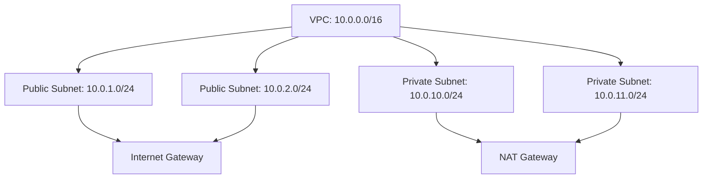

# How to Create a VPC from Scratch in AWS

Author: [nawazdhandala](https://github.com/nawazdhandala)

Tags: AWS, VPC, Networking

Description: A step-by-step guide to creating an Amazon VPC from scratch, covering CIDR blocks, subnets, route tables, and internet gateways.

---

Every serious AWS deployment starts with a VPC. It's your own private network within AWS, isolated from every other customer's resources. Think of it as the foundation of your cloud infrastructure - get it right, and everything else falls into place. Get it wrong, and you'll be fighting networking issues for months.

The default VPC that AWS creates in each region works for experimenting, but production workloads deserve a purpose-built network. Let's build one from scratch.

## Planning Your VPC

Before touching the console or writing any code, plan your CIDR block. This defines the IP address range for your entire VPC.

Common choices:
- `10.0.0.0/16` - gives you 65,536 IP addresses
- `172.16.0.0/16` - another popular private range
- `192.168.0.0/16` - familiar from home networks

For most workloads, a `/16` block is plenty. If you're planning VPC peering later, make sure your CIDR blocks don't overlap with other VPCs. This is a mistake that's surprisingly easy to make and painful to fix.

Here's how the network breaks down:



## Creating the VPC with AWS CLI

Let's do this with the CLI so it's repeatable. You can always use the console later, but having the commands documented means you can script the whole thing.

First, create the VPC itself:

```bash
# Create a VPC with a /16 CIDR block and DNS support enabled
aws ec2 create-vpc \
  --cidr-block 10.0.0.0/16 \
  --tag-specifications 'ResourceType=vpc,Tags=[{Key=Name,Value=my-production-vpc}]'
```

This returns a VPC ID. Save it - you'll need it for everything else. Let's store it in a variable:

```bash
# Capture the VPC ID for use in subsequent commands
VPC_ID=$(aws ec2 create-vpc \
  --cidr-block 10.0.0.0/16 \
  --query 'Vpc.VpcId' \
  --output text)

echo "Created VPC: $VPC_ID"
```

Enable DNS hostnames so your instances get readable DNS names:

```bash
# Enable DNS hostnames for the VPC
aws ec2 modify-vpc-attribute \
  --vpc-id $VPC_ID \
  --enable-dns-hostnames '{"Value": true}'
```

## Creating Subnets

A VPC without subnets is useless. Let's create two public and two private subnets across two availability zones:

```bash
# Create public subnet in AZ-a
PUBLIC_SUBNET_1=$(aws ec2 create-subnet \
  --vpc-id $VPC_ID \
  --cidr-block 10.0.1.0/24 \
  --availability-zone us-east-1a \
  --tag-specifications 'ResourceType=subnet,Tags=[{Key=Name,Value=public-subnet-1a}]' \
  --query 'Subnet.SubnetId' \
  --output text)

# Create public subnet in AZ-b
PUBLIC_SUBNET_2=$(aws ec2 create-subnet \
  --vpc-id $VPC_ID \
  --cidr-block 10.0.2.0/24 \
  --availability-zone us-east-1b \
  --tag-specifications 'ResourceType=subnet,Tags=[{Key=Name,Value=public-subnet-1b}]' \
  --query 'Subnet.SubnetId' \
  --output text)

# Create private subnet in AZ-a
PRIVATE_SUBNET_1=$(aws ec2 create-subnet \
  --vpc-id $VPC_ID \
  --cidr-block 10.0.10.0/24 \
  --availability-zone us-east-1a \
  --tag-specifications 'ResourceType=subnet,Tags=[{Key=Name,Value=private-subnet-1a}]' \
  --query 'Subnet.SubnetId' \
  --output text)

# Create private subnet in AZ-b
PRIVATE_SUBNET_2=$(aws ec2 create-subnet \
  --vpc-id $VPC_ID \
  --cidr-block 10.0.11.0/24 \
  --availability-zone us-east-1b \
  --tag-specifications 'ResourceType=subnet,Tags=[{Key=Name,Value=private-subnet-1b}]' \
  --query 'Subnet.SubnetId' \
  --output text)
```

## Setting Up the Internet Gateway

Public subnets need a path to the internet. That's what an internet gateway provides:

```bash
# Create an internet gateway
IGW_ID=$(aws ec2 create-internet-gateway \
  --tag-specifications 'ResourceType=internet-gateway,Tags=[{Key=Name,Value=my-vpc-igw}]' \
  --query 'InternetGateway.InternetGatewayId' \
  --output text)

# Attach it to the VPC
aws ec2 attach-internet-gateway \
  --internet-gateway-id $IGW_ID \
  --vpc-id $VPC_ID
```

## Configuring Route Tables

Each subnet needs a route table that tells traffic where to go. Public subnets route to the internet gateway. Private subnets route through a NAT gateway (which we'll set up next).

```bash
# Create a route table for public subnets
PUBLIC_RT=$(aws ec2 create-route-table \
  --vpc-id $VPC_ID \
  --tag-specifications 'ResourceType=route-table,Tags=[{Key=Name,Value=public-rt}]' \
  --query 'RouteTable.RouteTableId' \
  --output text)

# Add a route to the internet via the internet gateway
aws ec2 create-route \
  --route-table-id $PUBLIC_RT \
  --destination-cidr-block 0.0.0.0/0 \
  --gateway-id $IGW_ID

# Associate public subnets with the public route table
aws ec2 associate-route-table \
  --route-table-id $PUBLIC_RT \
  --subnet-id $PUBLIC_SUBNET_1

aws ec2 associate-route-table \
  --route-table-id $PUBLIC_RT \
  --subnet-id $PUBLIC_SUBNET_2
```

## Setting Up NAT Gateway

Private subnets can't reach the internet directly, but they often need outbound access for things like software updates and API calls. A NAT gateway handles this:

```bash
# Allocate an Elastic IP for the NAT gateway
EIP_ALLOC=$(aws ec2 allocate-address \
  --domain vpc \
  --query 'AllocationId' \
  --output text)

# Create the NAT gateway in a public subnet
NAT_GW=$(aws ec2 create-nat-gateway \
  --subnet-id $PUBLIC_SUBNET_1 \
  --allocation-id $EIP_ALLOC \
  --tag-specifications 'ResourceType=natgateway,Tags=[{Key=Name,Value=my-nat-gateway}]' \
  --query 'NatGateway.NatGatewayId' \
  --output text)

# Wait for the NAT gateway to become available
aws ec2 wait nat-gateway-available --nat-gateway-ids $NAT_GW

# Create a route table for private subnets
PRIVATE_RT=$(aws ec2 create-route-table \
  --vpc-id $VPC_ID \
  --tag-specifications 'ResourceType=route-table,Tags=[{Key=Name,Value=private-rt}]' \
  --query 'RouteTable.RouteTableId' \
  --output text)

# Route internet-bound traffic through the NAT gateway
aws ec2 create-route \
  --route-table-id $PRIVATE_RT \
  --destination-cidr-block 0.0.0.0/0 \
  --nat-gateway-id $NAT_GW

# Associate private subnets with the private route table
aws ec2 associate-route-table \
  --route-table-id $PRIVATE_RT \
  --subnet-id $PRIVATE_SUBNET_1

aws ec2 associate-route-table \
  --route-table-id $PRIVATE_RT \
  --subnet-id $PRIVATE_SUBNET_2
```

## Doing It with CloudFormation

CLI commands are great for learning, but infrastructure as code is better for production. Here's the same VPC as a CloudFormation template:

```yaml
# vpc.yaml - Complete VPC with public and private subnets
AWSTemplateFormatVersion: '2010-09-09'
Description: Production VPC with public and private subnets

Parameters:
  VpcCidr:
    Type: String
    Default: 10.0.0.0/16

Resources:
  VPC:
    Type: AWS::EC2::VPC
    Properties:
      CidrBlock: !Ref VpcCidr
      EnableDnsSupport: true
      EnableDnsHostnames: true
      Tags:
        - Key: Name
          Value: production-vpc

  InternetGateway:
    Type: AWS::EC2::InternetGateway

  AttachGateway:
    Type: AWS::EC2::VPCGatewayAttachment
    Properties:
      VpcId: !Ref VPC
      InternetGatewayId: !Ref InternetGateway

  PublicSubnet1:
    Type: AWS::EC2::Subnet
    Properties:
      VpcId: !Ref VPC
      CidrBlock: 10.0.1.0/24
      AvailabilityZone: !Select [0, !GetAZs '']
      MapPublicIpOnLaunch: true
      Tags:
        - Key: Name
          Value: public-subnet-1

  PublicSubnet2:
    Type: AWS::EC2::Subnet
    Properties:
      VpcId: !Ref VPC
      CidrBlock: 10.0.2.0/24
      AvailabilityZone: !Select [1, !GetAZs '']
      MapPublicIpOnLaunch: true
      Tags:
        - Key: Name
          Value: public-subnet-2

Outputs:
  VpcId:
    Value: !Ref VPC
    Export:
      Name: ProductionVpcId
```

## Security Groups

Before you launch anything into your new VPC, set up security groups. They act as virtual firewalls for your instances:

```bash
# Create a security group that allows HTTP and SSH
SG_ID=$(aws ec2 create-security-group \
  --group-name web-server-sg \
  --description "Allow HTTP and SSH" \
  --vpc-id $VPC_ID \
  --query 'GroupId' \
  --output text)

# Allow inbound HTTP from anywhere
aws ec2 authorize-security-group-ingress \
  --group-id $SG_ID \
  --protocol tcp \
  --port 80 \
  --cidr 0.0.0.0/0

# Allow inbound SSH from your IP only
aws ec2 authorize-security-group-ingress \
  --group-id $SG_ID \
  --protocol tcp \
  --port 22 \
  --cidr YOUR_IP/32
```

## What's Next

With your VPC in place, you're ready to start deploying resources. For more advanced network designs, look into [designing a VPC with public and private subnets](https://oneuptime.com/blog/post/design-vpc-with-public-and-private-subnets/view) or [setting up a three-tier VPC architecture](https://oneuptime.com/blog/post/set-up-three-tier-vpc-architecture/view).

The VPC is just the beginning. A well-designed network makes everything else - load balancers, auto-scaling groups, databases, containers - work smoothly. Take the time to get it right early, and you'll save yourself countless headaches down the road.
