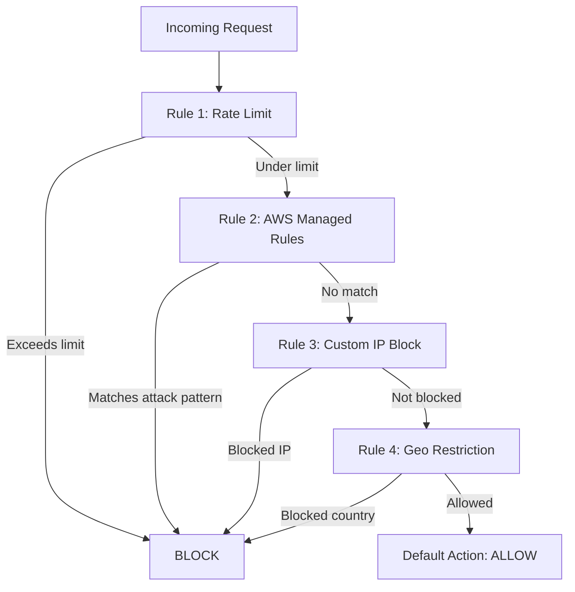

# How to Create WAF Web ACLs with Terraform

Author: [nawazdhandala](https://github.com/nawazdhandala)

Tags: AWS, WAF, Terraform, Security

Description: Learn how to create and configure AWS WAF Web ACLs with Terraform, including managed rule groups, custom rules, rate limiting, and CloudFront integration.

---

AWS WAF sits in front of your ALB, CloudFront, or API Gateway and filters incoming requests based on rules you define. It blocks SQL injection, cross-site scripting, bad bots, and other common attacks. The configuration can get complex quickly, but Terraform makes it manageable and version-controlled.

This guide covers creating Web ACLs, using AWS managed rule groups, writing custom rules, implementing rate limiting, and associating WAFs with your resources.

## Web ACL Structure

A Web ACL is basically an ordered list of rules. Each incoming request is evaluated against these rules in priority order. Each rule can COUNT, ALLOW, or BLOCK the request. If no rule matches, the default action applies.



## Basic Web ACL with Managed Rules

AWS provides pre-built rule groups that cover the most common threats. The AWSManagedRulesCommonRuleSet alone catches SQL injection, XSS, and other OWASP Top 10 attack vectors.

This creates a Web ACL with the core AWS managed rule groups:

```hcl
resource "aws_wafv2_web_acl" "main" {
  name        = "production-web-acl"
  description = "Production WAF rules"
  scope       = "REGIONAL"  # Use "CLOUDFRONT" for CloudFront distributions

  default_action {
    allow {}
  }

  # AWS Common Rule Set - covers OWASP Top 10
  rule {
    name     = "aws-managed-common"
    priority = 10

    override_action {
      none {}  # Use the rule group's own actions
    }

    statement {
      managed_rule_group_statement {
        name        = "AWSManagedRulesCommonRuleSet"
        vendor_name = "AWS"
      }
    }

    visibility_config {
      cloudwatch_metrics_enabled = true
      metric_name                = "aws-managed-common"
      sampled_requests_enabled   = true
    }
  }

  # SQL Injection protection
  rule {
    name     = "aws-managed-sqli"
    priority = 20

    override_action {
      none {}
    }

    statement {
      managed_rule_group_statement {
        name        = "AWSManagedRulesSQLiRuleSet"
        vendor_name = "AWS"
      }
    }

    visibility_config {
      cloudwatch_metrics_enabled = true
      metric_name                = "aws-managed-sqli"
      sampled_requests_enabled   = true
    }
  }

  # Known bad inputs
  rule {
    name     = "aws-managed-known-bad-inputs"
    priority = 30

    override_action {
      none {}
    }

    statement {
      managed_rule_group_statement {
        name        = "AWSManagedRulesKnownBadInputsRuleSet"
        vendor_name = "AWS"
      }
    }

    visibility_config {
      cloudwatch_metrics_enabled = true
      metric_name                = "aws-managed-known-bad-inputs"
      sampled_requests_enabled   = true
    }
  }

  # Bot control
  rule {
    name     = "aws-managed-bot-control"
    priority = 40

    override_action {
      none {}
    }

    statement {
      managed_rule_group_statement {
        name        = "AWSManagedRulesBotControlRuleSet"
        vendor_name = "AWS"
      }
    }

    visibility_config {
      cloudwatch_metrics_enabled = true
      metric_name                = "aws-managed-bot-control"
      sampled_requests_enabled   = true
    }
  }

  visibility_config {
    cloudwatch_metrics_enabled = true
    metric_name                = "production-web-acl"
    sampled_requests_enabled   = true
  }

  tags = {
    Environment = "production"
    ManagedBy   = "terraform"
  }
}
```

## Rate Limiting

Rate-based rules are essential for protecting against DDoS and brute force attacks. They track the rate of requests from each IP address and block those exceeding your threshold.

This rule blocks any IP that sends more than 2000 requests in a 5-minute window:

```hcl
rule {
  name     = "rate-limit"
  priority = 1  # Evaluate first

  action {
    block {}
  }

  statement {
    rate_based_statement {
      limit              = 2000
      aggregate_key_type = "IP"
    }
  }

  visibility_config {
    cloudwatch_metrics_enabled = true
    metric_name                = "rate-limit"
    sampled_requests_enabled   = true
  }
}
```

You can also scope rate limiting to specific paths. This is useful for protecting login endpoints more aggressively:

```hcl
rule {
  name     = "rate-limit-login"
  priority = 2

  action {
    block {}
  }

  statement {
    rate_based_statement {
      limit              = 100  # Much lower for login attempts
      aggregate_key_type = "IP"

      scope_down_statement {
        byte_match_statement {
          search_string         = "/api/login"
          positional_constraint = "STARTS_WITH"
          field_to_match {
            uri_path {}
          }
          text_transformation {
            priority = 0
            type     = "LOWERCASE"
          }
        }
      }
    }
  }

  visibility_config {
    cloudwatch_metrics_enabled = true
    metric_name                = "rate-limit-login"
    sampled_requests_enabled   = true
  }
}
```

## IP Blocklist and Allowlist

For blocking known malicious IPs or allowing trusted partners, use IP sets.

This creates IP sets for blocking and allowing, then adds rules that reference them:

```hcl
resource "aws_wafv2_ip_set" "blocklist" {
  name               = "ip-blocklist"
  description        = "Blocked IP addresses"
  scope              = "REGIONAL"
  ip_address_version = "IPV4"

  addresses = [
    "192.0.2.0/24",
    "198.51.100.0/24",
  ]
}

resource "aws_wafv2_ip_set" "allowlist" {
  name               = "ip-allowlist"
  description        = "Trusted IP addresses - bypass WAF rules"
  scope              = "REGIONAL"
  ip_address_version = "IPV4"

  addresses = [
    "203.0.113.0/24",  # Office IP range
  ]
}
```

Then reference these in your Web ACL rules. The allowlist should have the highest priority (lowest number) so trusted IPs skip all other checks:

```hcl
# Allow trusted IPs (add this to your web_acl rules)
rule {
  name     = "allow-trusted-ips"
  priority = 0

  action {
    allow {}
  }

  statement {
    ip_set_reference_statement {
      arn = aws_wafv2_ip_set.allowlist.arn
    }
  }

  visibility_config {
    cloudwatch_metrics_enabled = true
    metric_name                = "allow-trusted-ips"
    sampled_requests_enabled   = true
  }
}

# Block known bad IPs
rule {
  name     = "block-bad-ips"
  priority = 5

  action {
    block {}
  }

  statement {
    ip_set_reference_statement {
      arn = aws_wafv2_ip_set.blocklist.arn
    }
  }

  visibility_config {
    cloudwatch_metrics_enabled = true
    metric_name                = "block-bad-ips"
    sampled_requests_enabled   = true
  }
}
```

## Geo-Restriction

Block traffic from specific countries:

```hcl
rule {
  name     = "geo-restriction"
  priority = 6

  action {
    block {}
  }

  statement {
    geo_match_statement {
      country_codes = ["CN", "RU", "KP"]  # Adjust to your requirements
    }
  }

  visibility_config {
    cloudwatch_metrics_enabled = true
    metric_name                = "geo-restriction"
    sampled_requests_enabled   = true
  }
}
```

## Custom Rule for Header Validation

Sometimes you need custom rules that check specific headers or query parameters.

This rule blocks requests that don't include a required API key header:

```hcl
rule {
  name     = "require-api-key"
  priority = 50

  action {
    block {}
  }

  statement {
    not_statement {
      statement {
        byte_match_statement {
          search_string         = ""
          positional_constraint = "CONTAINS"
          field_to_match {
            single_header {
              name = "x-api-key"
            }
          }
          text_transformation {
            priority = 0
            type     = "NONE"
          }
        }
      }
    }
  }

  visibility_config {
    cloudwatch_metrics_enabled = true
    metric_name                = "require-api-key"
    sampled_requests_enabled   = true
  }
}
```

## Associating the Web ACL

After creating the Web ACL, associate it with your ALB, API Gateway, or other supported resource.

This attaches the Web ACL to an Application Load Balancer:

```hcl
resource "aws_wafv2_web_acl_association" "alb" {
  resource_arn = aws_lb.main.arn
  web_acl_arn  = aws_wafv2_web_acl.main.arn
}
```

## WAF Logging

Enable logging to see what's being blocked and why. WAF logs go to CloudWatch, S3, or Kinesis Data Firehose.

This configures WAF logging to CloudWatch with a filter that only logs blocked requests:

```hcl
resource "aws_cloudwatch_log_group" "waf_logs" {
  name              = "aws-waf-logs-production"  # Must start with "aws-waf-logs-"
  retention_in_days = 30
}

resource "aws_wafv2_web_acl_logging_configuration" "main" {
  log_destination_configs = [aws_cloudwatch_log_group.waf_logs.arn]
  resource_arn            = aws_wafv2_web_acl.main.arn

  logging_filter {
    default_behavior = "DROP"

    filter {
      behavior    = "KEEP"
      requirement = "MEETS_ANY"

      condition {
        action_condition {
          action = "BLOCK"
        }
      }
    }
  }
}
```

## Testing with Count Mode

When deploying new rules, start in COUNT mode to see what would be blocked without actually blocking anything. This is crucial for avoiding false positives in production.

Override a managed rule group to COUNT mode:

```hcl
override_action {
  count {}  # Log matches but don't block
}
```

Once you're confident the rules aren't catching legitimate traffic, switch to `none {}` to enforce the rule group's native actions.

For monitoring your WAF alongside other infrastructure, check out our guide on [CloudWatch alarms with Terraform](https://oneuptime.com/blog/post/2026-02-12-create-cloudwatch-alarms-terraform/view).

## Wrapping Up

A well-configured WAF is your first line of defense against web attacks. Start with the AWS managed rule groups in COUNT mode, monitor the results for a week, then switch to enforcement. Add rate limiting for your most sensitive endpoints, and use IP sets for known threats. The Terraform configurations here give you a comprehensive starting point that covers the most common protection scenarios.
