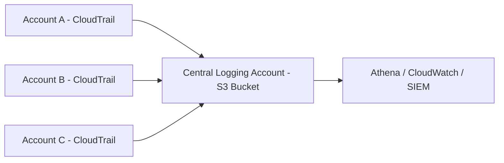

# How to Set Up Cross-Account CloudTrail Aggregation

Author: [nawazdhandala](https://github.com/nawazdhandala)

Tags: AWS, CloudTrail, Security, Multi-Account, Logging

Description: Step-by-step guide to aggregating CloudTrail logs from multiple AWS accounts into a central S3 bucket for unified audit logging.

---

When you're running a multi-account AWS setup - and honestly, most organizations beyond a handful of people should be - one of the first things you need to sort out is centralized logging. Every AWS account generates its own CloudTrail events, and having them scattered across 15 or 50 different accounts makes incident investigation painful and compliance audits a nightmare.

The solution is cross-account CloudTrail aggregation: funneling all your trail logs into a single S3 bucket in a dedicated logging account. Let's set it up from scratch.

## Architecture Overview

The pattern is straightforward. You have a central logging account that owns the S3 bucket. Every other account in your organization runs a CloudTrail trail that ships logs to that bucket. The bucket policy grants write access to all member accounts.



You've got two approaches: using an Organization trail (recommended) or setting up individual trails per account. We'll cover both.

## Option 1: Organization Trail (Recommended)

If you're using AWS Organizations, this is the easiest path. An organization trail automatically covers all accounts, including any new ones added later.

### Step 1: Create the Central S3 Bucket

First, create the bucket in your logging account.

This creates the S3 bucket with encryption and versioning enabled:

```bash
# Create the bucket in the logging account
aws s3api create-bucket \
  --bucket org-cloudtrail-logs-central \
  --region us-east-1

# Enable versioning for log integrity
aws s3api put-bucket-versioning \
  --bucket org-cloudtrail-logs-central \
  --versioning-configuration Status=Enabled

# Enable default encryption
aws s3api put-bucket-encryption \
  --bucket org-cloudtrail-logs-central \
  --server-side-encryption-configuration '{
    "Rules": [
      {
        "ApplyServerSideEncryptionByDefault": {
          "SSEAlgorithm": "aws:kms",
          "KMSMasterKeyID": "alias/cloudtrail-key"
        }
      }
    ]
  }'
```

### Step 2: Set the Bucket Policy

The bucket policy needs to allow CloudTrail from the organization to write logs. Replace the organization ID and bucket name with your own.

This policy allows CloudTrail to check bucket ACL and write log files from any account in your organization:

```json
{
  "Version": "2012-10-17",
  "Statement": [
    {
      "Sid": "AWSCloudTrailAclCheck",
      "Effect": "Allow",
      "Principal": {
        "Service": "cloudtrail.amazonaws.com"
      },
      "Action": "s3:GetBucketAcl",
      "Resource": "arn:aws:s3:::org-cloudtrail-logs-central",
      "Condition": {
        "StringEquals": {
          "aws:SourceArn": "arn:aws:cloudtrail:us-east-1:111111111111:trail/org-trail"
        }
      }
    },
    {
      "Sid": "AWSCloudTrailWrite",
      "Effect": "Allow",
      "Principal": {
        "Service": "cloudtrail.amazonaws.com"
      },
      "Action": "s3:PutObject",
      "Resource": "arn:aws:s3:::org-cloudtrail-logs-central/AWSLogs/o-exampleorgid/*",
      "Condition": {
        "StringEquals": {
          "s3:x-amz-acl": "bucket-owner-full-control",
          "aws:SourceArn": "arn:aws:cloudtrail:us-east-1:111111111111:trail/org-trail"
        }
      }
    }
  ]
}
```

Apply the policy:

```bash
aws s3api put-bucket-policy \
  --bucket org-cloudtrail-logs-central \
  --policy file://bucket-policy.json
```

### Step 3: Create the Organization Trail

Run this from the management account (not the logging account).

This creates an organization-wide trail that logs events from every account and sends them to the central bucket:

```bash
# Create the organization trail from the management account
aws cloudtrail create-trail \
  --name org-trail \
  --s3-bucket-name org-cloudtrail-logs-central \
  --is-organization-trail \
  --is-multi-region-trail \
  --enable-log-file-validation \
  --kms-key-id arn:aws:kms:us-east-1:111111111111:key/your-kms-key-id

# Start logging
aws cloudtrail start-logging --name org-trail
```

The `--enable-log-file-validation` flag is critical. It generates digest files that let you verify logs haven't been tampered with - important for compliance.

## Option 2: Individual Account Trails

If you're not using Organizations or need more granular control, set up trails individually in each account.

### Bucket Policy for Multiple Accounts

This policy explicitly lists each account that can write to the central bucket:

```json
{
  "Version": "2012-10-17",
  "Statement": [
    {
      "Sid": "AWSCloudTrailAclCheck",
      "Effect": "Allow",
      "Principal": {
        "Service": "cloudtrail.amazonaws.com"
      },
      "Action": "s3:GetBucketAcl",
      "Resource": "arn:aws:s3:::org-cloudtrail-logs-central"
    },
    {
      "Sid": "AWSCloudTrailWrite",
      "Effect": "Allow",
      "Principal": {
        "Service": "cloudtrail.amazonaws.com"
      },
      "Action": "s3:PutObject",
      "Resource": [
        "arn:aws:s3:::org-cloudtrail-logs-central/AWSLogs/111111111111/*",
        "arn:aws:s3:::org-cloudtrail-logs-central/AWSLogs/222222222222/*",
        "arn:aws:s3:::org-cloudtrail-logs-central/AWSLogs/333333333333/*"
      ],
      "Condition": {
        "StringEquals": {
          "s3:x-amz-acl": "bucket-owner-full-control"
        }
      }
    }
  ]
}
```

Then in each member account, create a trail pointing to the central bucket:

```bash
# Run in each member account
aws cloudtrail create-trail \
  --name account-trail \
  --s3-bucket-name org-cloudtrail-logs-central \
  --is-multi-region-trail \
  --enable-log-file-validation

aws cloudtrail start-logging --name account-trail
```

## Adding CloudWatch Logs Integration

Sending trails to CloudWatch Logs gives you real-time alerting capabilities. This requires a CloudWatch Logs group and an IAM role.

This IAM policy allows CloudTrail to write to CloudWatch Logs:

```json
{
  "Version": "2012-10-17",
  "Statement": [
    {
      "Effect": "Allow",
      "Action": [
        "logs:CreateLogStream",
        "logs:PutLogEvents"
      ],
      "Resource": "arn:aws:logs:us-east-1:111111111111:log-group:CloudTrail/Logs:*"
    }
  ]
}
```

Update the trail to include CloudWatch:

```bash
# Create log group
aws logs create-log-group --log-group-name CloudTrail/Logs

# Update trail with CloudWatch integration
aws cloudtrail update-trail \
  --name org-trail \
  --cloud-watch-logs-log-group-arn arn:aws:logs:us-east-1:111111111111:log-group:CloudTrail/Logs:* \
  --cloud-watch-logs-role-arn arn:aws:iam::111111111111:role/CloudTrailToCloudWatchRole
```

## Querying Aggregated Logs with Athena

Once logs are flowing in, you'll want to query them. Athena makes this easy without running any servers.

This creates an Athena table that maps to the CloudTrail log structure in your S3 bucket:

```sql
CREATE EXTERNAL TABLE cloudtrail_logs (
    eventversion STRING,
    useridentity STRUCT<
        type:STRING,
        principalid:STRING,
        arn:STRING,
        accountid:STRING,
        invokedby:STRING,
        accesskeyid:STRING,
        userName:STRING,
        sessioncontext:STRUCT<
            attributes:STRUCT<
                mfaauthenticated:STRING,
                creationdate:STRING>,
            sessionissuer:STRUCT<
                type:STRING,
                principalid:STRING,
                arn:STRING,
                accountid:STRING,
                userName:STRING>>>,
    eventtime STRING,
    eventsource STRING,
    eventname STRING,
    awsregion STRING,
    sourceipaddress STRING,
    useragent STRING,
    errorcode STRING,
    errormessage STRING,
    requestparameters STRING,
    responseelements STRING,
    additionaleventdata STRING,
    requestid STRING,
    eventid STRING,
    resources ARRAY<STRUCT<
        ARN:STRING,
        accountId:STRING,
        type:STRING>>,
    eventtype STRING,
    recipientaccountid STRING,
    sharedEventID STRING
)
PARTITIONED BY (account STRING, region STRING, year STRING, month STRING, day STRING)
ROW FORMAT SERDE 'org.apache.hive.hcatalog.data.JsonSerDe'
LOCATION 's3://org-cloudtrail-logs-central/AWSLogs/';
```

Now you can run queries across all accounts:

```sql
-- Find all console logins across all accounts in the last 24 hours
SELECT
    useridentity.accountid,
    useridentity.username,
    sourceipaddress,
    eventtime,
    errorcode
FROM cloudtrail_logs
WHERE eventname = 'ConsoleLogin'
    AND eventtime > date_format(date_add('hour', -24, now()), '%Y-%m-%dT%H:%i:%sZ')
ORDER BY eventtime DESC;
```

## Setting Up Lifecycle Policies

Don't let logs accumulate forever. Set up lifecycle rules based on your compliance requirements.

This lifecycle policy transitions logs to cheaper storage classes over time and deletes them after a year:

```json
{
  "Rules": [
    {
      "ID": "CloudTrailLifecycle",
      "Status": "Enabled",
      "Transitions": [
        {
          "Days": 90,
          "StorageClass": "STANDARD_IA"
        },
        {
          "Days": 180,
          "StorageClass": "GLACIER"
        }
      ],
      "Expiration": {
        "Days": 365
      }
    }
  ]
}
```

## Monitoring Your Trail

It's surprisingly common for trails to silently stop working. Set up a CloudWatch alarm to catch this.

```bash
# Create metric filter for trail delivery errors
aws logs put-metric-filter \
  --log-group-name CloudTrail/Logs \
  --filter-name TrailDeliveryErrors \
  --filter-pattern '{ $.errorCode = "TrailNotFoundException" }' \
  --metric-transformations \
    metricName=TrailErrors,metricNamespace=CloudTrail,metricValue=1
```

For a more robust monitoring setup, consider integrating your aggregated CloudTrail data with [OneUptime](https://oneuptime.com) for real-time alerts on suspicious API activity across all your accounts.

## Key Takeaways

Cross-account CloudTrail aggregation is a foundational piece of any multi-account security strategy. The organization trail approach is simpler and self-maintaining, so use it if you can. Whichever path you choose, make sure you enable log file validation, encrypt with KMS, and set up proper lifecycle policies. And don't forget to actually query and alert on those logs - collecting them without looking at them is just expensive storage.

For related security setup, check out our guide on [AWS Config multi-account data aggregation](https://oneuptime.com/blog/post/2026-02-12-aws-config-multi-account-multi-region-data-aggregation/view) to complement your CloudTrail setup with configuration compliance monitoring.
