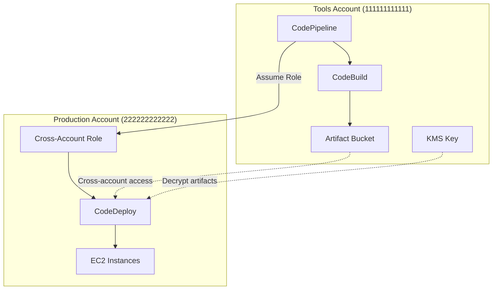

# How to Set Up Cross-Account CodePipeline Deployments

Author: [nawazdhandala](https://github.com/nawazdhandala)

Tags: AWS, CodePipeline, Cross-Account, DevOps, IAM

Description: Step-by-step guide to configuring AWS CodePipeline to deploy across multiple AWS accounts, covering IAM roles, KMS keys, and S3 bucket policies.

---

Most organizations eventually end up with multiple AWS accounts - one for development, one for staging, one for production. It's a security best practice recommended by AWS itself. But it creates a challenge: how do you build a CI/CD pipeline in one account that deploys to another?

Cross-account CodePipeline deployments solve this. Your pipeline runs in a central "tools" or "dev" account and deploys to target accounts. It requires careful IAM configuration, a shared KMS key, and cross-account S3 access. It's not trivial to set up, but once it's working, it's rock solid.

## The Architecture



The pipeline in the tools account assumes a role in the production account to trigger deployments. The production account also needs access to read artifacts from the tools account's S3 bucket and decrypt them with the shared KMS key.

## Step 1: Create a KMS Key for Artifact Encryption

CodePipeline encrypts artifacts in S3 with a KMS key. For cross-account deployments, the target account needs permission to use this key.

```bash
# Create a KMS key in the tools account
aws kms create-key \
  --description "CodePipeline cross-account artifact encryption key" \
  --policy '{
    "Version": "2012-10-17",
    "Statement": [
      {
        "Sid": "Enable IAM User Permissions",
        "Effect": "Allow",
        "Principal": {"AWS": "arn:aws:iam::111111111111:root"},
        "Action": "kms:*",
        "Resource": "*"
      },
      {
        "Sid": "Allow production account to use the key",
        "Effect": "Allow",
        "Principal": {"AWS": "arn:aws:iam::222222222222:root"},
        "Action": [
          "kms:Decrypt",
          "kms:DescribeKey"
        ],
        "Resource": "*"
      }
    ]
  }'

# Create an alias for easier reference
aws kms create-alias \
  --alias-name alias/codepipeline-cross-account \
  --target-key-id <key-id-from-above>
```

## Step 2: Configure the S3 Artifact Bucket

The artifact bucket in the tools account needs a policy allowing the production account to read objects:

```bash
# Update the artifact bucket policy
aws s3api put-bucket-policy \
  --bucket my-pipeline-artifacts \
  --policy '{
    "Version": "2012-10-17",
    "Statement": [
      {
        "Sid": "AllowProductionAccountAccess",
        "Effect": "Allow",
        "Principal": {
          "AWS": "arn:aws:iam::222222222222:root"
        },
        "Action": [
          "s3:GetObject",
          "s3:GetObjectVersion",
          "s3:GetBucketVersioning",
          "s3:ListBucket"
        ],
        "Resource": [
          "arn:aws:s3:::my-pipeline-artifacts",
          "arn:aws:s3:::my-pipeline-artifacts/*"
        ]
      }
    ]
  }'
```

## Step 3: Create the Cross-Account Role in the Production Account

This is the role that CodePipeline in the tools account will assume to perform actions in the production account.

Switch to the production account and create the role:

```bash
# In the PRODUCTION account - create the cross-account role
aws iam create-role \
  --role-name CrossAccountCodePipelineRole \
  --assume-role-policy-document '{
    "Version": "2012-10-17",
    "Statement": [
      {
        "Effect": "Allow",
        "Principal": {
          "AWS": "arn:aws:iam::111111111111:root"
        },
        "Action": "sts:AssumeRole",
        "Condition": {
          "StringEquals": {
            "sts:ExternalId": "codepipeline-deploy"
          }
        }
      }
    ]
  }'
```

Attach policies granting permissions for what CodePipeline needs to do:

```json
{
  "Version": "2012-10-17",
  "Statement": [
    {
      "Effect": "Allow",
      "Action": [
        "codedeploy:CreateDeployment",
        "codedeploy:GetApplication",
        "codedeploy:GetApplicationRevision",
        "codedeploy:GetDeployment",
        "codedeploy:GetDeploymentConfig",
        "codedeploy:RegisterApplicationRevision"
      ],
      "Resource": "*"
    },
    {
      "Effect": "Allow",
      "Action": [
        "s3:GetObject",
        "s3:GetObjectVersion",
        "s3:GetBucketVersioning"
      ],
      "Resource": [
        "arn:aws:s3:::my-pipeline-artifacts",
        "arn:aws:s3:::my-pipeline-artifacts/*"
      ]
    },
    {
      "Effect": "Allow",
      "Action": [
        "kms:Decrypt",
        "kms:DescribeKey"
      ],
      "Resource": "arn:aws:kms:us-east-1:111111111111:key/<key-id>"
    }
  ]
}
```

```bash
# Attach the policy to the cross-account role
aws iam put-role-policy \
  --role-name CrossAccountCodePipelineRole \
  --policy-name CrossAccountDeployPolicy \
  --policy-document file://cross-account-policy.json
```

## Step 4: Update the Pipeline Role in the Tools Account

Back in the tools account, the CodePipeline service role needs permission to assume the cross-account role:

```bash
# In the TOOLS account - add assume role permission
aws iam put-role-policy \
  --role-name CodePipelineServiceRole \
  --policy-name AssumeProductionRole \
  --policy-document '{
    "Version": "2012-10-17",
    "Statement": [
      {
        "Effect": "Allow",
        "Action": "sts:AssumeRole",
        "Resource": "arn:aws:iam::222222222222:role/CrossAccountCodePipelineRole"
      }
    ]
  }'
```

## Step 5: Configure the Pipeline

Now update your pipeline to use the cross-account role for the deploy stage:

```json
{
  "pipeline": {
    "name": "cross-account-pipeline",
    "roleArn": "arn:aws:iam::111111111111:role/CodePipelineServiceRole",
    "artifactStore": {
      "type": "S3",
      "location": "my-pipeline-artifacts",
      "encryptionKey": {
        "id": "arn:aws:kms:us-east-1:111111111111:key/<key-id>",
        "type": "KMS"
      }
    },
    "stages": [
      {
        "name": "Source",
        "actions": [
          {
            "name": "GitHub",
            "actionTypeId": {
              "category": "Source",
              "owner": "AWS",
              "provider": "CodeStarSourceConnection",
              "version": "1"
            },
            "configuration": {
              "ConnectionArn": "arn:aws:codestar-connections:us-east-1:111111111111:connection/abc-123",
              "FullRepositoryId": "my-org/my-repo",
              "BranchName": "main"
            },
            "outputArtifacts": [{"name": "SourceOutput"}]
          }
        ]
      },
      {
        "name": "Build",
        "actions": [
          {
            "name": "Build",
            "actionTypeId": {
              "category": "Build",
              "owner": "AWS",
              "provider": "CodeBuild",
              "version": "1"
            },
            "configuration": {"ProjectName": "my-app-build"},
            "inputArtifacts": [{"name": "SourceOutput"}],
            "outputArtifacts": [{"name": "BuildOutput"}]
          }
        ]
      },
      {
        "name": "Deploy-Production",
        "actions": [
          {
            "name": "CrossAccountDeploy",
            "actionTypeId": {
              "category": "Deploy",
              "owner": "AWS",
              "provider": "CodeDeploy",
              "version": "1"
            },
            "configuration": {
              "ApplicationName": "MyApp",
              "DeploymentGroupName": "Production"
            },
            "inputArtifacts": [{"name": "BuildOutput"}],
            "roleArn": "arn:aws:iam::222222222222:role/CrossAccountCodePipelineRole"
          }
        ]
      }
    ]
  }
}
```

The critical part is the `roleArn` on the deploy action. This tells CodePipeline to assume that role in the production account before executing the action.

## Step 6: Set Up CodeDeploy in the Production Account

The production account needs its own CodeDeploy application and deployment group:

```bash
# In the PRODUCTION account
aws deploy create-application \
  --application-name MyApp \
  --compute-platform Server

aws deploy create-deployment-group \
  --application-name MyApp \
  --deployment-group-name Production \
  --ec2-tag-filters Key=Environment,Value=Production,Type=KEY_AND_VALUE \
  --service-role-arn arn:aws:iam::222222222222:role/CodeDeployServiceRole \
  --auto-rollback-configuration enabled=true,events=DEPLOYMENT_FAILURE
```

## Multi-Account Pipeline

For deploying to multiple accounts (dev, staging, production), extend the pattern:

```json
{
  "stages": [
    {"name": "Source", "actions": ["..."]},
    {"name": "Build", "actions": ["..."]},
    {
      "name": "Deploy-Dev",
      "actions": [{
        "roleArn": "arn:aws:iam::333333333333:role/CrossAccountCodePipelineRole",
        "configuration": {"ApplicationName": "MyApp", "DeploymentGroupName": "Dev"}
      }]
    },
    {
      "name": "Approve-Staging",
      "actions": [{"Manual Approval action"}]
    },
    {
      "name": "Deploy-Staging",
      "actions": [{
        "roleArn": "arn:aws:iam::444444444444:role/CrossAccountCodePipelineRole",
        "configuration": {"ApplicationName": "MyApp", "DeploymentGroupName": "Staging"}
      }]
    },
    {
      "name": "Approve-Production",
      "actions": [{"Manual Approval action"}]
    },
    {
      "name": "Deploy-Production",
      "actions": [{
        "roleArn": "arn:aws:iam::222222222222:role/CrossAccountCodePipelineRole",
        "configuration": {"ApplicationName": "MyApp", "DeploymentGroupName": "Production"}
      }]
    }
  ]
}
```

## Troubleshooting

Cross-account deployments have more moving parts, so there are more things that can go wrong:

- **"Access Denied" on S3** - The bucket policy, IAM role, and KMS key all need to be aligned. Check all three.
- **"Unable to assume role"** - Verify the trust policy on the cross-account role lists the correct tools account ID.
- **"KMS Decrypt failed"** - The KMS key policy must explicitly allow the production account to decrypt.
- **Deployment artifacts not found** - Make sure the artifact bucket uses the custom KMS key, not the default AWS-managed key.

For monitoring cross-account pipelines and getting alerted when deployments fail in any environment, [OneUptime](https://oneuptime.com) provides centralized monitoring across multiple AWS accounts. Also check our guide on [troubleshooting CodePipeline failures](https://oneuptime.com/blog/post/2026-02-12-troubleshoot-codepipeline-failures/view) for general debugging techniques.
