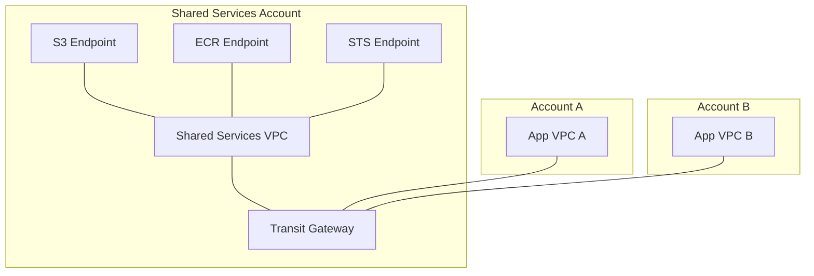

# How to Configure Cross-Account VPC Endpoint Sharing

Author: [nawazdhandala](https://github.com/nawazdhandala)

Tags: AWS, VPC, Endpoint, Cross-Account, PrivateLink

Description: Learn how to share VPC endpoints across AWS accounts to centralize access to AWS services and reduce costs in multi-account environments.

---

In multi-account AWS environments, every account typically creates its own VPC endpoints for services like S3, DynamoDB, and ECR. That means if you have 20 accounts, you might have 20 copies of the same endpoint. Each interface endpoint costs about $7.20 per month per AZ, and you're paying for data processing on every one of them. It adds up.

Cross-account VPC endpoint sharing lets you create endpoints once in a central account and share them across your organization. Other accounts route their traffic through the shared endpoints, reducing both cost and management overhead. Let's set this up.

## Understanding the Architecture

There are two patterns for cross-account endpoint sharing:

1. **Shared VPC with RAM**: Share the entire subnet containing the endpoint using AWS Resource Access Manager. Other accounts launch resources in the shared subnet.

2. **PrivateLink via Transit Gateway**: Centralize endpoints in a shared services VPC and route traffic from spoke VPCs through a transit gateway.


```mermaid
graph TB
    subgraph "Shared Services Account"
        SharedVPC[Shared Services VPC]
        EP1[S3 Endpoint]
        EP2[ECR Endpoint]
        EP3[STS Endpoint]
        TGW[Transit Gateway]
    end
    subgraph "Account A"
        VPCA[App VPC A]
    end
    subgraph "Account B"
        VPCB[App VPC B]
    end
    EP1 --- SharedVPC
    EP2 --- SharedVPC
    EP3 --- SharedVPC
    SharedVPC --- TGW
    VPCA --- TGW
    VPCB --- TGW
```

The transit gateway approach is more flexible and doesn't require sharing subnets, so that's what we'll focus on.

## Setting Up the Shared Services VPC

Create a VPC dedicated to hosting your centralized endpoints.

Create the shared services VPC with endpoint subnets:

```bash
# Create the shared services VPC

aws ec2 create-vpc \
  --cidr-block 10.0.0.0/16 \
  --tag-specifications 'ResourceType=vpc,Tags=[{Key=Name,Value=shared-services-vpc}]'

# Enable DNS support and hostnames
aws ec2 modify-vpc-attribute \
  --vpc-id vpc-shared001 \
  --enable-dns-support '{"Value":true}'

aws ec2 modify-vpc-attribute \
  --vpc-id vpc-shared001 \
  --enable-dns-hostnames '{"Value":true}'

# Create subnets in each AZ for the endpoints
aws ec2 create-subnet \
  --vpc-id vpc-shared001 \
  --cidr-block 10.0.1.0/24 \
  --availability-zone us-east-1a \
  --tag-specifications 'ResourceType=subnet,Tags=[{Key=Name,Value=endpoint-az1}]'

aws ec2 create-subnet \
  --vpc-id vpc-shared001 \
  --cidr-block 10.0.2.0/24 \
  --availability-zone us-east-1b \
  --tag-specifications 'ResourceType=subnet,Tags=[{Key=Name,Value=endpoint-az2}]'
```

## Creating Centralized VPC Endpoints

Create interface endpoints in the shared services VPC.

Create endpoints for commonly used services:

```bash
# Security group for endpoints
aws ec2 create-security-group \
  --group-name "vpc-endpoints-sg" \
  --description "Allow HTTPS from all VPCs" \
  --vpc-id vpc-shared001

aws ec2 authorize-security-group-ingress \
  --group-id sg-endpoints123 \
  --protocol tcp \
  --port 443 \
  --cidr-block 10.0.0.0/8

# Create interface endpoints
# S3 interface endpoint
aws ec2 create-vpc-endpoint \
  --vpc-id vpc-shared001 \
  --vpc-endpoint-type Interface \
  --service-name com.amazonaws.us-east-1.s3 \
  --subnet-ids subnet-ep-az1 subnet-ep-az2 \
  --security-group-ids sg-endpoints123 \
  --no-private-dns-enabled \
  --tag-specifications 'ResourceType=vpc-endpoint,Tags=[{Key=Name,Value=s3-endpoint}]'

# ECR API endpoint
aws ec2 create-vpc-endpoint \
  --vpc-id vpc-shared001 \
  --vpc-endpoint-type Interface \
  --service-name com.amazonaws.us-east-1.ecr.api \
  --subnet-ids subnet-ep-az1 subnet-ep-az2 \
  --security-group-ids sg-endpoints123 \
  --no-private-dns-enabled \
  --tag-specifications 'ResourceType=vpc-endpoint,Tags=[{Key=Name,Value=ecr-api-endpoint}]'

# ECR DKR endpoint (for docker pull)
aws ec2 create-vpc-endpoint \
  --vpc-id vpc-shared001 \
  --vpc-endpoint-type Interface \
  --service-name com.amazonaws.us-east-1.ecr.dkr \
  --subnet-ids subnet-ep-az1 subnet-ep-az2 \
  --security-group-ids sg-endpoints123 \
  --no-private-dns-enabled \
  --tag-specifications 'ResourceType=vpc-endpoint,Tags=[{Key=Name,Value=ecr-dkr-endpoint}]'

# STS endpoint
aws ec2 create-vpc-endpoint \
  --vpc-id vpc-shared001 \
  --vpc-endpoint-type Interface \
  --service-name com.amazonaws.us-east-1.sts \
  --subnet-ids subnet-ep-az1 subnet-ep-az2 \
  --security-group-ids sg-endpoints123 \
  --no-private-dns-enabled \
  --tag-specifications 'ResourceType=vpc-endpoint,Tags=[{Key=Name,Value=sts-endpoint}]'
```

## Setting Up Transit Gateway

Create a transit gateway and attach both the shared services VPC and application VPCs.

Create the transit gateway:

```bash
# Create the transit gateway
aws ec2 create-transit-gateway \
  --description "Shared Services TGW" \
  --options '{
    "AmazonSideAsn": 64512,
    "AutoAcceptSharedAttachments": "enable",
    "DefaultRouteTableAssociation": "enable",
    "DefaultRouteTablePropagation": "enable",
    "DnsSupport": "enable"
  }' \
  --tag-specifications 'ResourceType=transit-gateway,Tags=[{Key=Name,Value=shared-services-tgw}]'

# Attach the shared services VPC
aws ec2 create-transit-gateway-vpc-attachment \
  --transit-gateway-id tgw-shared123 \
  --vpc-id vpc-shared001 \
  --subnet-ids subnet-ep-az1 subnet-ep-az2 \
  --tag-specifications 'ResourceType=transit-gateway-attachment,Tags=[{Key=Name,Value=shared-services}]'
```

Share the transit gateway with other accounts using RAM:

```bash
# Share the transit gateway with your organization
aws ram create-resource-share \
  --name "shared-services-tgw" \
  --resource-arns arn:aws:ec2:us-east-1:123456789012:transit-gateway/tgw-shared123 \
  --principals arn:aws:organizations::123456789012:organization/o-org123 \
  --tags Key=Purpose,Value=SharedEndpoints
```

## Configuring Spoke Accounts

In each spoke account, attach the VPC to the shared transit gateway and set up DNS routing.

Spoke account configuration:

```bash
# Accept the RAM share (if not using auto-accept in Organizations)
aws ram accept-resource-share-invitation \
  --resource-share-invitation-arn arn:aws:ram:us-east-1:111111111111:resource-share-invitation/inv-abc123

# Attach the spoke VPC to the transit gateway
aws ec2 create-transit-gateway-vpc-attachment \
  --transit-gateway-id tgw-shared123 \
  --vpc-id vpc-spoke001 \
  --subnet-ids subnet-spoke-az1 subnet-spoke-az2

# Add a route to the shared services VPC CIDR via transit gateway
aws ec2 create-route \
  --route-table-id rtb-spoke \
  --destination-cidr-block 10.0.0.0/16 \
  --transit-gateway-id tgw-shared123

# In the shared services VPC route table, add a return route to the spoke VPC
aws ec2 create-route \
  --route-table-id rtb-shared-services \
  --destination-cidr-block 10.10.0.0/16 \
  --transit-gateway-id tgw-shared123
```

## DNS Resolution for Shared Endpoints

The trickiest part is DNS. Interface endpoints create DNS records in the shared services VPC, but the AWS-managed private DNS zone is only available inside that VPC. For VPC-to-VPC sharing, disable private DNS on the centralized endpoints and create Route 53 private hosted zones with alias records that point to the endpoint's regional DNS name. Then associate those private hosted zones with the spoke VPCs.

Set up Route 53 private hosted zones for endpoint DNS. Repeat this for each endpoint service name; for `dkr.ecr`, create the alias as a wildcard record such as `*.dkr.ecr.us-east-1.amazonaws.com`.

```bash
# Look up the regional DNS name and hosted zone ID for the endpoint
aws ec2 describe-vpc-endpoints \
  --vpc-endpoint-ids vpce-s3abc123 \
  --query 'VpcEndpoints[0].DnsEntries[0]'

# Create a private hosted zone for the AWS service endpoint name
aws route53 create-hosted-zone \
  --name "s3.us-east-1.amazonaws.com" \
  --caller-reference "s3-endpoint-zone-001" \
  --vpc VPCRegion=us-east-1,VPCId=vpc-shared001 \
  --hosted-zone-config PrivateZone=true,Comment="S3 shared endpoint DNS"

# Create an alias record that points to the interface endpoint regional DNS name
aws route53 change-resource-record-sets \
  --hosted-zone-id Z1234567890ABC \
  --change-batch '{
    "Changes": [
      {
        "Action": "CREATE",
        "ResourceRecordSet": {
          "Name": "s3.us-east-1.amazonaws.com",
          "Type": "A",
          "AliasTarget": {
            "HostedZoneId": "ZVPCENDPOINTZONE",
            "DNSName": "vpce-s3abc123-abcdefgh.s3.us-east-1.vpce.amazonaws.com",
            "EvaluateTargetHealth": false
          }
        }
      }
    ]
  }'
```

For cross-account VPCs, authorize the spoke account to associate its VPC with the private hosted zone:

```bash
# In the shared services account
aws route53 create-vpc-association-authorization \
  --hosted-zone-id Z1234567890ABC \
  --vpc VPCRegion=us-east-1,VPCId=vpc-spoke001

# In the spoke account
aws route53 associate-vpc-with-hosted-zone \
  --hosted-zone-id Z1234567890ABC \
  --vpc VPCRegion=us-east-1,VPCId=vpc-spoke001
```

Now when applications in the spoke VPC make API calls to S3, ECR, or STS, DNS resolves to the endpoint IPs in the shared services VPC, and traffic routes through the transit gateway.

## CloudFormation for the Shared Services Stack

```yaml
AWSTemplateFormatVersion: '2010-09-09'
Description: Centralized VPC Endpoint Sharing

Parameters:
  VpcCidr:
    Type: String
    Default: "10.0.0.0/16"

Resources:
  SharedVPC:
    Type: AWS::EC2::VPC
    Properties:
      CidrBlock: !Ref VpcCidr
      EnableDnsSupport: true
      EnableDnsHostnames: true
      Tags:
        - Key: Name
          Value: shared-services

  SubnetAZ1:
    Type: AWS::EC2::Subnet
    Properties:
      VpcId: !Ref SharedVPC
      CidrBlock: 10.0.1.0/24
      AvailabilityZone: !Select [0, !GetAZs ""]
      Tags:
        - Key: Name
          Value: endpoint-az1

  SubnetAZ2:
    Type: AWS::EC2::Subnet
    Properties:
      VpcId: !Ref SharedVPC
      CidrBlock: 10.0.2.0/24
      AvailabilityZone: !Select [1, !GetAZs ""]
      Tags:
        - Key: Name
          Value: endpoint-az2

  EndpointSecurityGroup:
    Type: AWS::EC2::SecurityGroup
    Properties:
      GroupDescription: VPC Endpoints
      VpcId: !Ref SharedVPC
      SecurityGroupIngress:
        - IpProtocol: tcp
          FromPort: 443
          ToPort: 443
          CidrIp: 10.0.0.0/8

  S3Endpoint:
    Type: AWS::EC2::VPCEndpoint
    Properties:
      VpcId: !Ref SharedVPC
      VpcEndpointType: Interface
      ServiceName: !Sub "com.amazonaws.${AWS::Region}.s3"
      SubnetIds:
        - !Ref SubnetAZ1
        - !Ref SubnetAZ2
      SecurityGroupIds:
        - !Ref EndpointSecurityGroup
      PrivateDnsEnabled: false

  STSEndpoint:
    Type: AWS::EC2::VPCEndpoint
    Properties:
      VpcId: !Ref SharedVPC
      VpcEndpointType: Interface
      ServiceName: !Sub "com.amazonaws.${AWS::Region}.sts"
      SubnetIds:
        - !Ref SubnetAZ1
        - !Ref SubnetAZ2
      SecurityGroupIds:
        - !Ref EndpointSecurityGroup
      PrivateDnsEnabled: false
```

## Cost Savings Analysis

Let's do the math. Assume you have 15 spoke accounts, each needing endpoints for S3, ECR (api + dkr), STS, and CloudWatch Logs (5 endpoints total) across 2 AZs.

```text
Without sharing:
- 15 accounts x 5 endpoints x 2 AZs = 150 endpoint interfaces
- 150 x $7.20/month = $1,080/month

With sharing:
- 1 account x 5 endpoints x 2 AZs = 10 endpoint interfaces
- 10 x $7.20/month = $72/month
- Transit gateway: ~$36/month per attachment
- 16 attachments x $36 = $576/month
- Total: $648/month

Monthly savings: $432 (40% reduction)
```

The savings grow as you add more accounts and endpoints. With 50 accounts, the difference becomes substantial.

## Endpoint Policies for Multi-Account Access

Make sure your endpoint policies allow access from all spoke accounts:

```json
{
  "Version": "2012-10-17",
  "Statement": [
    {
      "Effect": "Allow",
      "Principal": "*",
      "Action": "s3:*",
      "Resource": "*",
      "Condition": {
        "StringEquals": {
          "aws:PrincipalOrgID": "o-org123"
        }
      }
    }
  ]
}
```

This restricts endpoint access to principals within your AWS Organization, adding a security boundary even on shared endpoints.

For related multi-account networking, see our post on [VPC IP Address Manager](https://oneuptime.com/blog/post/2026-02-12-vpc-ip-address-manager-ipam/view).
