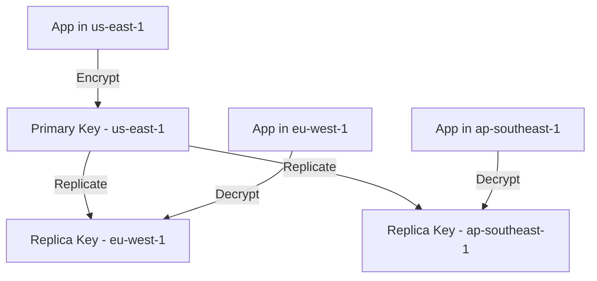

# How to Set Up Cross-Region KMS Keys for Encryption

Author: [nawazdhandala](https://github.com/nawazdhandala)

Tags: AWS, KMS, Encryption, Multi-Region, Security

Description: Configure AWS KMS multi-region keys to encrypt and decrypt data seamlessly across AWS regions without re-encrypting or copying key material.

---

Encryption in AWS has always been regional. You create a KMS key in us-east-1, and it stays in us-east-1. If you need to decrypt data in eu-west-1, you either copy the plaintext (defeating the purpose of encrypting at rest) or re-encrypt with a different key in the target region (adding complexity and latency). For global applications, this regional limitation was a real headache.

KMS multi-region keys fix this. You create a primary key in one region and replicate it to other regions. The replicas share the same key material, so data encrypted in one region can be decrypted in another without any re-encryption step. The keys are interchangeable cryptographically but managed independently in each region. Let's set them up.

## How Multi-Region Keys Work

A multi-region key set consists of one primary key and one or more replica keys. They share the same key ID (the `mrk-` prefix distinguishes them from single-region keys) and the same key material. But each key is a fully independent KMS resource in its region - it has its own ARN, its own key policy, and can be enabled/disabled independently.



When you encrypt data with the primary key and transfer the ciphertext to another region, the replica key there can decrypt it directly. No cross-region API calls, no additional latency.

## Creating a Multi-Region Primary Key

This creates a multi-region primary key in us-east-1:

```bash
# Create multi-region primary key
aws kms create-key \
  --region us-east-1 \
  --multi-region \
  --description "Multi-region key for global encryption" \
  --key-usage ENCRYPT_DECRYPT \
  --key-spec SYMMETRIC_DEFAULT \
  --tags TagKey=Purpose,TagValue=GlobalEncryption
```

Note the key ID from the output - it'll start with `mrk-`. Create an alias for easier reference:

```bash
# Create an alias
aws kms create-alias \
  --region us-east-1 \
  --alias-name alias/global-encrypt \
  --target-key-id mrk-abc123def456
```

## Replicating to Other Regions

Now replicate the key to every region where you need to encrypt or decrypt data.

This replicates the primary key to EU and Asia Pacific regions:

```bash
# Replicate to eu-west-1
aws kms replicate-key \
  --key-id mrk-abc123def456 \
  --replica-region eu-west-1 \
  --description "Global encryption key - EU replica" \
  --tags TagKey=Purpose,TagValue=GlobalEncryption

# Replicate to ap-southeast-1
aws kms replicate-key \
  --key-id mrk-abc123def456 \
  --replica-region ap-southeast-1 \
  --description "Global encryption key - APAC replica" \
  --tags TagKey=Purpose,TagValue=GlobalEncryption
```

Create aliases in each replica region too:

```bash
aws kms create-alias \
  --region eu-west-1 \
  --alias-name alias/global-encrypt \
  --target-key-id mrk-abc123def456

aws kms create-alias \
  --region ap-southeast-1 \
  --alias-name alias/global-encrypt \
  --target-key-id mrk-abc123def456
```

## Using Multi-Region Keys

### Encrypt in One Region, Decrypt in Another

This demonstrates encrypting data in us-east-1 and decrypting in eu-west-1:

```python
import boto3
import base64

# Encrypt in us-east-1
kms_east = boto3.client('kms', region_name='us-east-1')

encrypt_response = kms_east.encrypt(
    KeyId='alias/global-encrypt',
    Plaintext=b'sensitive data for global application'
)
ciphertext = encrypt_response['CiphertextBlob']
print(f"Encrypted in us-east-1: {base64.b64encode(ciphertext).decode()}")

# Transfer the ciphertext to eu-west-1 (e.g., through DynamoDB Global Tables, S3 replication)

# Decrypt in eu-west-1 using the replica key
kms_west = boto3.client('kms', region_name='eu-west-1')

decrypt_response = kms_west.decrypt(
    KeyId='alias/global-encrypt',  # Same alias, different region
    CiphertextBlob=ciphertext
)
plaintext = decrypt_response['Plaintext']
print(f"Decrypted in eu-west-1: {plaintext.decode()}")
```

### With S3 Cross-Region Replication

Multi-region keys are perfect for S3 Cross-Region Replication (CRR) with server-side encryption.

Create encrypted buckets in both regions using the multi-region key:

```bash
# Source bucket - us-east-1
aws s3api put-bucket-encryption \
  --region us-east-1 \
  --bucket my-global-bucket-east \
  --server-side-encryption-configuration '{
    "Rules": [{
      "ApplyServerSideEncryptionByDefault": {
        "SSEAlgorithm": "aws:kms",
        "KMSMasterKeyID": "alias/global-encrypt"
      },
      "BucketKeyEnabled": true
    }]
  }'

# Destination bucket - eu-west-1
aws s3api put-bucket-encryption \
  --region eu-west-1 \
  --bucket my-global-bucket-west \
  --server-side-encryption-configuration '{
    "Rules": [{
      "ApplyServerSideEncryptionByDefault": {
        "SSEAlgorithm": "aws:kms",
        "KMSMasterKeyID": "alias/global-encrypt"
      },
      "BucketKeyEnabled": true
    }]
  }'
```

The CRR replication rule specifies the replica key for the destination:

```json
{
  "Rules": [
    {
      "ID": "CrossRegionReplication",
      "Status": "Enabled",
      "Destination": {
        "Bucket": "arn:aws:s3:::my-global-bucket-west",
        "EncryptionConfiguration": {
          "ReplicaKmsKeyID": "arn:aws:kms:eu-west-1:111111111111:key/mrk-abc123def456"
        }
      },
      "SourceSelectionCriteria": {
        "SseKmsEncryptedObjects": {
          "Status": "Enabled"
        }
      }
    }
  ]
}
```

### With DynamoDB Global Tables

Encrypt DynamoDB tables with the multi-region key in each region:

```bash
# Create table in us-east-1 with MRK encryption
aws dynamodb create-table \
  --region us-east-1 \
  --table-name global-sessions \
  --attribute-definitions AttributeName=session_id,AttributeType=S \
  --key-schema AttributeName=session_id,KeyType=HASH \
  --billing-mode PAY_PER_REQUEST \
  --sse-specification Enabled=true,SSEType=KMS,KMSMasterKeyId=alias/global-encrypt
```

## Terraform Configuration

Here's the complete Terraform setup for multi-region keys:

```hcl
# Primary key in us-east-1
resource "aws_kms_key" "primary" {
  provider = aws.us_east_1

  description         = "Multi-region key for global encryption"
  multi_region        = true
  enable_key_rotation = true

  policy = data.aws_iam_policy_document.key_policy.json
}

resource "aws_kms_alias" "primary" {
  provider = aws.us_east_1

  name          = "alias/global-encrypt"
  target_key_id = aws_kms_key.primary.key_id
}

# Replica in eu-west-1
resource "aws_kms_replica_key" "eu" {
  provider = aws.eu_west_1

  description             = "Global encryption key - EU replica"
  primary_key_arn         = aws_kms_key.primary.arn
  enabled                 = true
}

resource "aws_kms_alias" "eu" {
  provider = aws.eu_west_1

  name          = "alias/global-encrypt"
  target_key_id = aws_kms_replica_key.eu.key_id
}

# Replica in ap-southeast-1
resource "aws_kms_replica_key" "apac" {
  provider = aws.ap_southeast_1

  description             = "Global encryption key - APAC replica"
  primary_key_arn         = aws_kms_key.primary.arn
  enabled                 = true
}

resource "aws_kms_alias" "apac" {
  provider = aws.ap_southeast_1

  name          = "alias/global-encrypt"
  target_key_id = aws_kms_replica_key.apac.key_id
}

# Key policy
data "aws_iam_policy_document" "key_policy" {
  statement {
    sid    = "EnableRootAccountAccess"
    effect = "Allow"
    principals {
      type        = "AWS"
      identifiers = ["arn:aws:iam::111111111111:root"]
    }
    actions   = ["kms:*"]
    resources = ["*"]
  }

  statement {
    sid    = "AllowApplicationAccess"
    effect = "Allow"
    principals {
      type        = "AWS"
      identifiers = [aws_iam_role.application.arn]
    }
    actions = [
      "kms:Encrypt",
      "kms:Decrypt",
      "kms:GenerateDataKey",
      "kms:DescribeKey"
    ]
    resources = ["*"]
  }
}
```

## Key Policies for Replica Keys

Each replica key can have its own key policy. This is useful when different teams manage different regions.

```bash
# Set a specific policy on the EU replica
aws kms put-key-policy \
  --region eu-west-1 \
  --key-id mrk-abc123def456 \
  --policy-name default \
  --policy '{
    "Version": "2012-10-17",
    "Statement": [
      {
        "Sid": "EnableRootAccess",
        "Effect": "Allow",
        "Principal": {"AWS": "arn:aws:iam::111111111111:root"},
        "Action": "kms:*",
        "Resource": "*"
      },
      {
        "Sid": "AllowEUTeam",
        "Effect": "Allow",
        "Principal": {"AWS": "arn:aws:iam::111111111111:role/EUApplicationRole"},
        "Action": ["kms:Decrypt", "kms:Encrypt", "kms:GenerateDataKey"],
        "Resource": "*"
      }
    ]
  }'
```

## Key Rotation

Multi-region keys support automatic key rotation, just like single-region keys:

```bash
# Enable automatic rotation on the primary key
aws kms enable-key-rotation \
  --region us-east-1 \
  --key-id mrk-abc123def456
```

Rotation happens only on the primary key. The new key material automatically propagates to all replicas. You don't need to enable rotation on replica keys separately.

## Monitoring

Track key usage across regions:

```bash
# Check key usage in each region
for REGION in us-east-1 eu-west-1 ap-southeast-1; do
  echo "Region: $REGION"
  aws cloudwatch get-metric-statistics \
    --region $REGION \
    --namespace AWS/KMS \
    --metric-name NumberOfEncryptRequests \
    --dimensions Name=KeyId,Value=mrk-abc123def456 \
    --start-time 2026-02-11T00:00:00Z \
    --end-time 2026-02-12T00:00:00Z \
    --period 86400 \
    --statistics Sum
done
```

## Primary Key Failover

If the primary key's region goes down, you can promote a replica to become the new primary:

```bash
# Promote EU replica to primary
aws kms update-primary-region \
  --key-id mrk-abc123def456 \
  --primary-region eu-west-1
```

This is crucial for disaster recovery scenarios.

## Best Practices

**Use aliases consistently.** Use the same alias name in every region (like `alias/global-encrypt`). This lets your application code reference the key by alias without caring which region it's in.

**Enable key rotation.** Just like single-region keys, rotate multi-region keys automatically.

**Set per-region policies.** Different regions may have different access patterns. Tailor key policies to each region's needs.

**Plan for DR.** Know your primary key promotion process. Practice it before you need it.

**Monitor across regions.** Track encryption and decryption operations in every region. Feed metrics into [OneUptime](https://oneuptime.com) for a unified view of your encryption operations.

For hardware-backed key management, check out our guide on [CloudHSM](https://oneuptime.com/blog/post/cloudhsm-hardware-key-management/view). And for securing data in transit, see our post on [TLS 1.3 on AWS Load Balancers](https://oneuptime.com/blog/post/configure-tls-1-3-aws-load-balancers/view).
