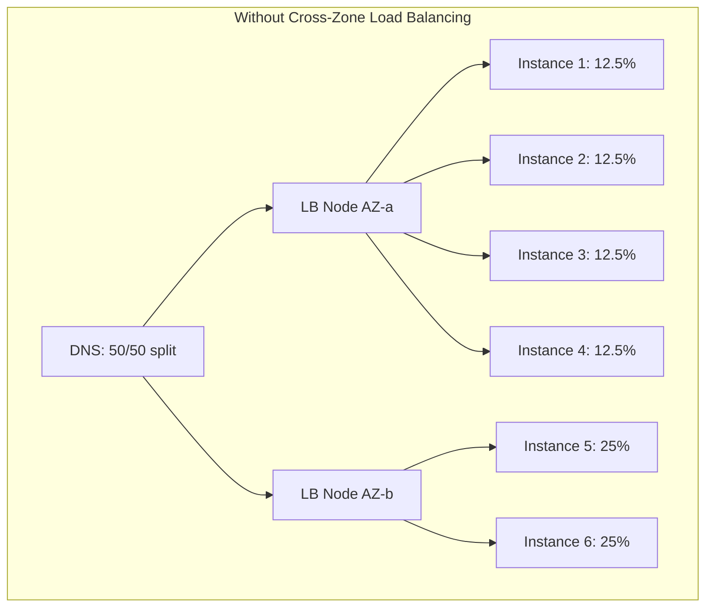
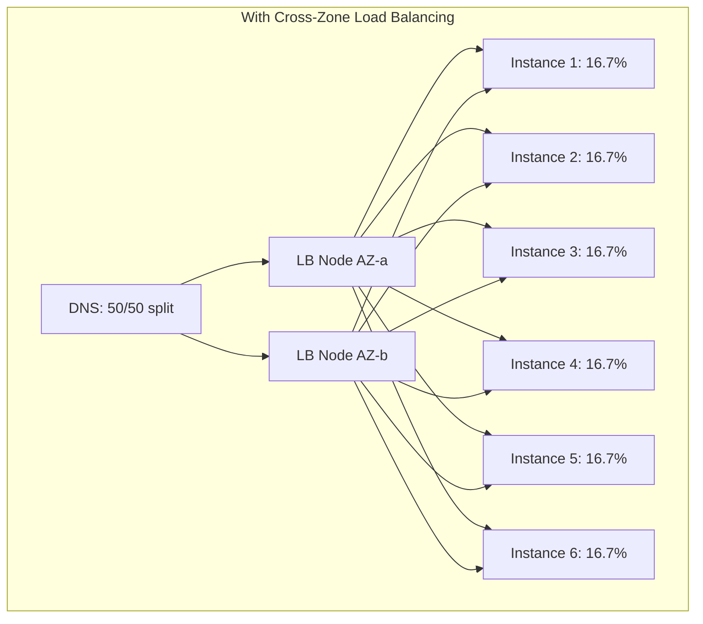

# How to Set Up Cross-Zone Load Balancing

Author: [nawazdhandala](https://github.com/nawazdhandala)

Tags: AWS, EC2, Load Balancing, Cross-Zone, High Availability, ALB, NLB

Description: Learn how cross-zone load balancing works on AWS and how to configure it for even traffic distribution across Availability Zones.

---

By default, a load balancer node in one Availability Zone only distributes traffic to targets in that same AZ. If you have 8 instances in AZ-a and 2 in AZ-b, and DNS sends 50% of traffic to each AZ, those 2 instances in AZ-b are getting hammered while AZ-a instances are underutilized.

Cross-zone load balancing fixes this. When enabled, each load balancer node distributes traffic across all registered targets in all AZs, not just the targets in its own AZ.

## The Problem Without Cross-Zone

Let's visualize the imbalance:



DNS sends 50% of traffic to each AZ's load balancer node. AZ-a's node splits its 50% across 4 instances (12.5% each). AZ-b's node splits its 50% across only 2 instances (25% each). Instance 5 and 6 are getting twice the load of instances 1-4.

## The Fix With Cross-Zone



Now both LB nodes can send traffic to all 6 instances. Each instance gets roughly 16.7% of total traffic regardless of which AZ it's in.

## Cross-Zone Behavior by Load Balancer Type

Different load balancer types handle cross-zone load balancing differently:

| Load Balancer | Cross-Zone Default | Cost Impact |
|---------------|-------------------|-------------|
| ALB | Always enabled (can't disable) | No extra charge |
| NLB | Disabled by default | Cross-AZ data transfer charges |
| Classic LB | Disabled by default | No extra charge |
| Gateway LB | Disabled by default | No extra charge |

The key takeaway: ALBs always do cross-zone load balancing. NLBs don't by default, and enabling it costs money because of cross-AZ data transfer.

## Enabling Cross-Zone on NLB

Since ALBs have it enabled automatically, the main configuration task is for NLBs.

Enable cross-zone load balancing on an NLB:

```bash
# Enable cross-zone load balancing on NLB
aws elbv2 modify-load-balancer-attributes \
  --load-balancer-arn arn:aws:elasticloadbalancing:us-east-1:123456789012:loadbalancer/net/my-nlb/1234567890 \
  --attributes Key=load_balancing.cross_zone.enabled,Value=true
```

Verify the current setting:

```bash
# Check cross-zone status
aws elbv2 describe-load-balancer-attributes \
  --load-balancer-arn arn:aws:elasticloadbalancing:us-east-1:123456789012:loadbalancer/net/my-nlb/1234567890 \
  --query 'Attributes[?Key==`load_balancing.cross_zone.enabled`]'
```

You can also configure cross-zone at the target group level for NLBs, giving you per-service control:

```bash
# Enable cross-zone for a specific target group
aws elbv2 modify-target-group-attributes \
  --target-group-arn arn:aws:elasticloadbalancing:us-east-1:123456789012:targetgroup/my-tg/1234567890 \
  --attributes Key=load_balancing.cross_zone.enabled,Value=true
```

Target group settings override load balancer settings. This lets you enable cross-zone for some services and keep it disabled for others.

## Terraform Configuration

Here's how to configure cross-zone load balancing in Terraform for both ALB and NLB:

```hcl
# ALB - cross-zone is always enabled, nothing to configure
resource "aws_lb" "web" {
  name               = "web-alb"
  internal           = false
  load_balancer_type = "application"
  subnets            = var.public_subnet_ids
  security_groups    = [aws_security_group.alb.id]

  # Cross-zone is always on for ALB
  # No configuration needed
}

# NLB - enable cross-zone explicitly
resource "aws_lb" "tcp" {
  name               = "tcp-nlb"
  internal           = false
  load_balancer_type = "network"
  subnets            = var.public_subnet_ids

  enable_cross_zone_load_balancing = true
}

# Or control at the target group level
resource "aws_lb_target_group" "tcp_cross_zone" {
  name        = "tcp-targets"
  port        = 8080
  protocol    = "TCP"
  vpc_id      = var.vpc_id
  target_type = "instance"

  # Target group level cross-zone (overrides LB setting)
  connection_termination = false
}
```

## When to Enable Cross-Zone

**Enable cross-zone when:**

- You have uneven instance distribution across AZs (common during scaling events, deployments, or AZ capacity issues)
- Your Auto Scaling group is spread across AZs but doesn't always maintain equal counts per AZ
- You want the simplest possible load distribution
- You're using an ALB (it's on by default and you don't have a choice)

**Consider keeping it disabled when:**

- You're using an NLB and want to minimize cross-AZ data transfer costs
- Your instances are evenly distributed and you want to keep traffic local
- Your application benefits from AZ locality (lower latency within the same AZ)
- You're using NLB for latency-sensitive workloads where cross-AZ hops add measurable latency

## Cost Implications

Cross-AZ data transfer charges apply when an NLB with cross-zone enabled sends traffic to a target in a different AZ. As of 2026, inter-AZ data transfer costs $0.01 per GB in most regions.

Here's a quick cost estimate:

```
Scenario: 100 GB/day of traffic through NLB
Without cross-zone: $0 extra (traffic stays in-AZ)
With cross-zone: ~50% crosses AZs = 50 GB x $0.01 = $0.50/day = $15/month
```

For most workloads, $15/month is negligible compared to the benefit of even load distribution. But for high-throughput workloads processing terabytes per day, it adds up.

## Ensuring Even Instance Distribution

The best way to avoid cross-zone imbalance problems is to maintain an even number of instances across AZs.

Configure your Auto Scaling group to balance across AZs:

```bash
# ASG automatically balances across AZs
aws autoscaling create-auto-scaling-group \
  --auto-scaling-group-name balanced-asg \
  --launch-template LaunchTemplateId=lt-0123456789abcdef0,Version='$Latest' \
  --min-size 6 \
  --max-size 18 \
  --desired-capacity 6 \
  --vpc-zone-identifier "subnet-az-a,subnet-az-b,subnet-az-c"
```

Auto Scaling groups try to maintain equal instances per AZ by default. When scaling out, new instances go to the AZ with the fewest instances. When scaling in, instances are removed from the AZ with the most.

## Monitoring Cross-Zone Distribution

Check how traffic is distributed across your targets:

```bash
# View target health and AZ distribution
aws elbv2 describe-target-health \
  --target-group-arn $TG_ARN \
  --query 'TargetHealthDescriptions[].{
    ID:Target.Id,
    AZ:Target.AvailabilityZone,
    Health:TargetHealth.State
  }' --output table
```

Use CloudWatch to monitor per-target request counts and identify imbalance:

```bash
# Check request count per target
aws cloudwatch get-metric-data \
  --metric-data-queries '[
    {
      "Id": "healthy",
      "MetricStat": {
        "Metric": {
          "Namespace": "AWS/ApplicationELB",
          "MetricName": "HealthyHostCount",
          "Dimensions": [
            {"Name": "TargetGroup", "Value": "targetgroup/web-targets/1234567890"},
            {"Name": "LoadBalancer", "Value": "app/my-alb/1234567890"},
            {"Name": "AvailabilityZone", "Value": "us-east-1a"}
          ]
        },
        "Period": 300,
        "Stat": "Average"
      }
    }
  ]' \
  --start-time $(date -u -d '1 hour ago' +%Y-%m-%dT%H:%M:%S) \
  --end-time $(date -u +%Y-%m-%dT%H:%M:%S)
```

## Handling AZ Failures

Cross-zone load balancing helps during AZ failures. If all targets in one AZ become unhealthy, the LB node in that AZ can still route traffic to healthy targets in other AZs.

Without cross-zone, if AZ-b's targets all fail, the LB node in AZ-b has nowhere to send traffic, and clients routed to that node get errors. With cross-zone, that LB node seamlessly sends traffic to targets in AZ-a and AZ-c.

This makes cross-zone a key part of your high availability strategy:

```bash
# Simulate AZ failure: check what happens when all targets in one AZ are unhealthy
# First, check healthy host count per AZ
aws cloudwatch get-metric-statistics \
  --namespace AWS/ApplicationELB \
  --metric-name HealthyHostCount \
  --dimensions \
    Name=TargetGroup,Value=targetgroup/web-targets/1234567890 \
    Name=LoadBalancer,Value=app/my-alb/1234567890 \
    Name=AvailabilityZone,Value=us-east-1a \
  --start-time $(date -u -d '1 hour ago' +%Y-%m-%dT%H:%M:%S) \
  --end-time $(date -u +%Y-%m-%dT%H:%M:%S) \
  --period 300 \
  --statistics Average
```

## Classic Load Balancer Configuration

If you're still running Classic Load Balancers (you should migrate), here's how to enable cross-zone:

```bash
# Enable cross-zone on Classic LB
aws elb modify-load-balancer-attributes \
  --load-balancer-name my-classic-lb \
  --load-balancer-attributes '{
    "CrossZoneLoadBalancing": {
      "Enabled": true
    }
  }'
```

## Summary

Cross-zone load balancing ensures even traffic distribution regardless of how your instances are spread across AZs. ALBs have it enabled by default. For NLBs, enable it unless you have specific cost or latency reasons not to. The small cross-AZ data transfer cost is usually worth the improved load distribution and better AZ failure resilience. Pair cross-zone load balancing with Auto Scaling groups that balance instances across AZs for the most reliable setup. For comprehensive monitoring of your load balancer health and traffic distribution, check out [configuring health checks for EC2 behind a load balancer](https://oneuptime.com/blog/post/configure-health-checks-ec2-load-balancer/view).
