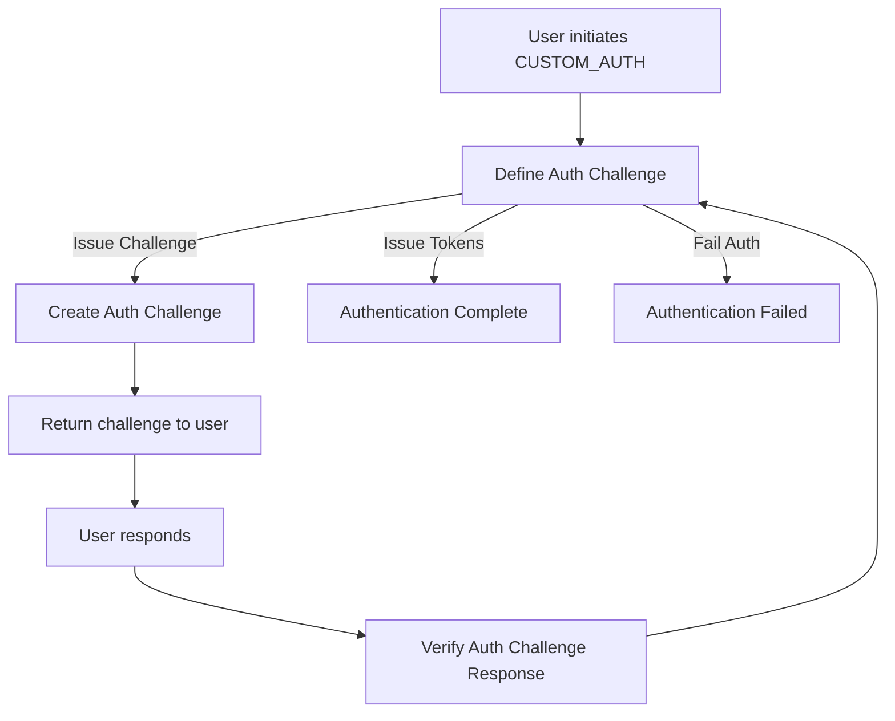

# How to Implement Custom Authentication Flows in Cognito

Author: [nawazdhandala](https://github.com/nawazdhandala)

Tags: AWS, Cognito, Authentication, Lambda, Serverless

Description: A complete guide to building custom authentication flows in AWS Cognito using Lambda triggers for passwordless login, multi-factor verification, and more.

---

Standard authentication flows work fine for most applications - a user enters their email and password, and they're in. But real-world applications often need something different. You might want passwordless login via email magic links, TOTP verification after password entry, CAPTCHA challenges for suspicious logins, or entirely custom multi-step verification processes. Cognito's custom authentication flow feature lets you build all of these.

The custom auth flow in Cognito relies on three Lambda triggers working together. Once you understand how they interact, you can design almost any authentication sequence you can think of.

## The Three-Trigger Architecture

Custom authentication in Cognito uses three Lambda triggers that work in a loop:

1. **Define Auth Challenge** - the orchestrator that decides what challenge to issue next or whether authentication is complete
2. **Create Auth Challenge** - generates the actual challenge (creates an OTP, prepares a CAPTCHA, etc.)
3. **Verify Auth Challenge Response** - checks if the user's answer to a challenge is correct



These triggers run in a cycle. After each verification, the Define trigger checks the session history and decides: issue another challenge, grant tokens, or fail the authentication.

## Setting Up a Passwordless Email OTP Flow

Let's build a complete passwordless authentication flow where users receive a one-time code via email instead of using a password. This is one of the most requested custom auth patterns.

### Define Auth Challenge Lambda

This trigger controls the flow logic. It reads the session array and decides what to do next.

Here's the Define Auth Challenge implementation:

```javascript
// define-auth-challenge/index.js
exports.handler = async (event) => {
    const session = event.request.session;

    // If no session entries exist, start the custom challenge
    if (session.length === 0) {
        event.response.challengeName = 'CUSTOM_CHALLENGE';
        event.response.issueTokens = false;
        event.response.failAuthentication = false;
        return event;
    }

    // Check the last challenge result
    const lastChallenge = session[session.length - 1];

    if (lastChallenge.challengeName === 'CUSTOM_CHALLENGE') {
        if (lastChallenge.challengeResult === true) {
            // User answered correctly - issue tokens
            event.response.issueTokens = true;
            event.response.failAuthentication = false;
        } else if (session.length >= 3) {
            // Three failed attempts - block the user
            event.response.issueTokens = false;
            event.response.failAuthentication = true;
        } else {
            // Wrong answer but attempts remain - retry
            event.response.challengeName = 'CUSTOM_CHALLENGE';
            event.response.issueTokens = false;
            event.response.failAuthentication = false;
        }
    }

    return event;
};
```

### Create Auth Challenge Lambda

This trigger generates the OTP and sends it to the user. You'll use SES or SNS to deliver the code.

Here's the Create Auth Challenge implementation that generates and emails an OTP:

```javascript
// create-auth-challenge/index.js
const { SESClient, SendEmailCommand } = require('@aws-sdk/client-ses');
const crypto = require('crypto');

const ses = new SESClient({ region: 'us-east-1' });

exports.handler = async (event) => {
    // Generate a 6-digit OTP
    const otp = crypto.randomInt(100000, 999999).toString();

    // Send the OTP via email
    const email = event.request.userAttributes.email;

    await ses.send(new SendEmailCommand({
        Source: 'noreply@yourapp.com',
        Destination: { ToAddresses: [email] },
        Message: {
            Subject: { Data: 'Your verification code' },
            Body: {
                Text: { Data: `Your login code is: ${otp}. It expires in 5 minutes.` }
            }
        }
    }));

    // Set the expected answer (Cognito passes this to Verify trigger)
    event.response.privateChallengeParameters = {
        answer: otp
    };

    // Public parameters are sent to the client app
    event.response.publicChallengeParameters = {
        email: maskEmail(email),
        codeLength: '6'
    };

    // Metadata helps Define trigger identify the challenge type
    event.response.challengeMetadata = 'OTP_EMAIL_CHALLENGE';

    return event;
};

function maskEmail(email) {
    const [name, domain] = email.split('@');
    const masked = name.charAt(0) + '***' + name.charAt(name.length - 1);
    return `${masked}@${domain}`;
}
```

### Verify Auth Challenge Response Lambda

This trigger checks whether the user's answer matches the expected OTP.

Here's the verification logic:

```javascript
// verify-auth-challenge/index.js
exports.handler = async (event) => {
    const expectedAnswer = event.request.privateChallengeParameters.answer;
    const userAnswer = event.request.challengeAnswer;

    // Compare the user's response to the expected answer
    event.response.answerCorrect = (userAnswer === expectedAnswer);

    return event;
};
```

## Client-Side Integration

On the frontend, you initiate auth with the `CUSTOM_AUTH` flow instead of `USER_SRP_AUTH`.

Here's how to wire up the client to handle custom auth:

```javascript
const {
    CognitoIdentityProviderClient,
    InitiateAuthCommand,
    RespondToAuthChallengeCommand
} = require('@aws-sdk/client-cognito-identity-provider');

const cognitoClient = new CognitoIdentityProviderClient({
    region: 'us-east-1'
});

const CLIENT_ID = 'your-app-client-id';

async function signInWithOTP(username) {
    // Step 1: Initiate the custom auth flow
    const initResponse = await cognitoClient.send(new InitiateAuthCommand({
        AuthFlow: 'CUSTOM_AUTH',
        ClientId: CLIENT_ID,
        AuthParameters: {
            USERNAME: username
        }
    }));

    if (initResponse.ChallengeName === 'CUSTOM_CHALLENGE') {
        const maskedEmail = initResponse.ChallengeParameters.email;
        console.log(`OTP sent to ${maskedEmail}`);

        // Step 2: Get OTP from user (via your UI)
        const otpCode = await promptUserForOTP();

        // Step 3: Submit the answer
        const authResponse = await cognitoClient.send(
            new RespondToAuthChallengeCommand({
                ChallengeName: 'CUSTOM_CHALLENGE',
                ClientId: CLIENT_ID,
                Session: initResponse.Session,
                ChallengeResponses: {
                    USERNAME: username,
                    ANSWER: otpCode
                }
            })
        );

        if (authResponse.AuthenticationResult) {
            console.log('Authenticated!');
            return authResponse.AuthenticationResult;
        }
    }
}
```

## Password Plus OTP: Combining Built-In and Custom Flows

You can combine Cognito's built-in SRP authentication with custom challenges. This is useful when you want traditional password verification followed by a second factor.

Here's a Define Auth Challenge that chains SRP with a custom OTP step:

```javascript
exports.handler = async (event) => {
    const session = event.request.session;

    if (session.length === 0) {
        // Start with SRP password verification
        event.response.challengeName = 'SRP_A';
        event.response.issueTokens = false;
        event.response.failAuthentication = false;
    } else if (
        session.length === 1 &&
        session[0].challengeName === 'SRP_A'
    ) {
        // Continue SRP flow
        event.response.challengeName = 'PASSWORD_VERIFIER';
        event.response.issueTokens = false;
        event.response.failAuthentication = false;
    } else if (
        session.length === 2 &&
        session[1].challengeName === 'PASSWORD_VERIFIER' &&
        session[1].challengeResult === true
    ) {
        // Password correct - now issue custom OTP challenge
        event.response.challengeName = 'CUSTOM_CHALLENGE';
        event.response.issueTokens = false;
        event.response.failAuthentication = false;
    } else if (
        session.length === 3 &&
        session[2].challengeName === 'CUSTOM_CHALLENGE' &&
        session[2].challengeResult === true
    ) {
        // Both password and OTP passed
        event.response.issueTokens = true;
        event.response.failAuthentication = false;
    } else {
        event.response.issueTokens = false;
        event.response.failAuthentication = true;
    }

    return event;
};
```

## Deploying the Triggers

You need to attach all three triggers to your user pool. Here's how with the AWS CLI.

Run these commands to configure all three Lambda triggers:

```bash
# Update the user pool with all three custom auth triggers
aws cognito-idp update-user-pool \
    --user-pool-id us-east-1_XXXXXXXXX \
    --lambda-config \
        DefineAuthChallenge=arn:aws:lambda:us-east-1:123456789:function:define-auth \
        CreateAuthChallenge=arn:aws:lambda:us-east-1:123456789:function:create-auth \
        VerifyAuthChallengeResponse=arn:aws:lambda:us-east-1:123456789:function:verify-auth

# Grant Cognito permission to invoke each function
for func in define-auth create-auth verify-auth; do
    aws lambda add-permission \
        --function-name $func \
        --statement-id cognito-trigger \
        --action lambda:InvokeFunction \
        --principal cognito-idp.amazonaws.com \
        --source-arn arn:aws:cognito-idp:us-east-1:123456789:userpool/us-east-1_XXXXXXXXX
done
```

For infrastructure-as-code approaches, see the guides on [setting up Cognito with Terraform](https://oneuptime.com/blog/post/2026-02-12-cognito-terraform/view) or [Cognito with CDK](https://oneuptime.com/blog/post/2026-02-12-cognito-cdk/view).

## Important Considerations

**Session expiry**: Cognito's custom auth session has a default timeout of 3 minutes. If your OTP delivery is slow, users might time out. You can extend this to up to 15 minutes in the user pool settings.

**Cold starts**: All three Lambda functions fire during a single authentication attempt. Cold starts on any of them add up. Keep your functions lightweight and consider provisioned concurrency for the Define trigger since it runs multiple times per flow.

**Security**: Never put sensitive data in `publicChallengeParameters` - that data is sent to the client. Use `privateChallengeParameters` for the expected answers. The private parameters are only visible to the Verify trigger.

**Rate limiting**: Cognito has default throttling limits on authentication API calls. If you're expecting high traffic, request a limit increase before launch.

## Wrapping Up

Custom authentication flows in Cognito give you flexibility that most managed auth services don't offer. The three-trigger architecture takes some getting used to, but once you internalize the pattern - Define decides, Create generates, Verify checks - you can compose almost any authentication sequence. Start with a simple single-step flow, test thoroughly with real email delivery, and build up from there. The session array is your best debugging tool since it tells you exactly where your flow is at any point.
