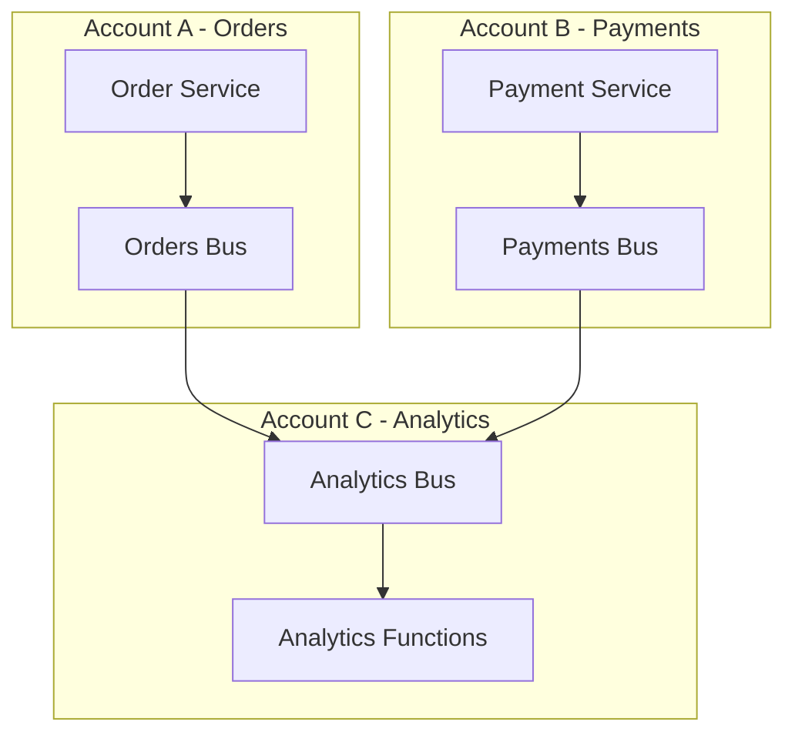

# Create Custom EventBridge Event Buses

Author: [nawazdhandala](https://github.com/nawazdhandala)

Tags: AWS, EventBridge, Event-Driven Architecture, Serverless

Description: Learn how to create and manage custom Amazon EventBridge event buses for isolating event streams and building multi-tenant architectures.

---

Every AWS account comes with a default EventBridge event bus. For simple applications, the default bus works fine. But as your system grows, you'll want custom event buses to separate concerns, manage access control, and organize events by domain or team.

Think of it like having separate message queues for different parts of your business instead of dumping everything into one.

## Why Custom Event Buses?

The default bus receives all AWS service events (EC2 state changes, S3 notifications, etc.) plus your custom events. This creates a few problems at scale.

First, security. If your billing team publishes events to the default bus, your analytics team can write rules that match those events, even if they shouldn't have access to billing data. Custom buses let you use IAM policies to control who can publish and subscribe.

Second, organization. When you have 50 rules on the default bus, finding the one that's not working becomes tedious. Separate buses for separate domains keeps things manageable.

Third, cross-account sharing. Custom buses can receive events from other AWS accounts, which is essential for microservice architectures spanning multiple accounts.



## Creating a Custom Event Bus

Creating a bus is straightforward.

This creates a custom event bus for order-related events:

```bash
aws events create-event-bus --name orders-bus
```

That's it. Now you can publish events to this bus and create rules on it.

## Publishing Events to a Custom Bus

When publishing events, specify the bus name in the `EventBusName` field.

This function publishes events to your custom bus:

```javascript
// publishToCustomBus.js - Sends events to a specific event bus
const { EventBridgeClient, PutEventsCommand }
  = require('@aws-sdk/client-eventbridge');

const ebClient = new EventBridgeClient({});

async function publishOrderEvent(eventType, orderData) {
  const result = await ebClient.send(new PutEventsCommand({
    Entries: [
      {
        EventBusName: 'orders-bus', // Custom bus name
        Source: 'orders.service',
        DetailType: eventType,
        Detail: JSON.stringify(orderData)
      }
    ]
  }));

  // Check for failed entries
  if (result.FailedEntryCount > 0) {
    console.error('Failed to publish event:', result.Entries);
    throw new Error('Event publishing failed');
  }

  return result;
}

// Usage examples
await publishOrderEvent('OrderCreated', {
  orderId: '12345',
  customerId: 'cust-789',
  total: 149.99
});

await publishOrderEvent('OrderShipped', {
  orderId: '12345',
  trackingNumber: 'TRACK-ABC-123'
});
```

## Creating Rules on Custom Buses

Rules on custom buses work exactly like rules on the default bus, but you specify the bus name.

This creates a rule on the custom orders bus:

```bash
aws events put-rule \
  --name high-value-order-alert \
  --event-bus-name orders-bus \
  --event-pattern '{
    "source": ["orders.service"],
    "detail-type": ["OrderCreated"],
    "detail": {
      "total": [{ "numeric": [">=", 500] }]
    }
  }' \
  --description "Alerts on orders over $500"
```

Add targets the same way:

```bash
aws events put-targets \
  --rule high-value-order-alert \
  --event-bus-name orders-bus \
  --targets '[{
    "Id": "notify-sales",
    "Arn": "arn:aws:lambda:us-east-1:123456789:function:notify-sales-team"
  }]'
```

## Resource Policies for Access Control

Custom buses support resource policies that control which accounts and principals can publish events.

This policy allows another AWS account to publish events to your bus:

```json
{
  "Version": "2012-10-17",
  "Statement": [
    {
      "Sid": "AllowCrossAccountPublish",
      "Effect": "Allow",
      "Principal": {
        "AWS": "arn:aws:iam::987654321:root"
      },
      "Action": "events:PutEvents",
      "Resource": "arn:aws:events:us-east-1:123456789:event-bus/orders-bus"
    }
  ]
}
```

Apply it with:

```bash
aws events put-permission \
  --event-bus-name orders-bus \
  --policy '{
    "Version": "2012-10-17",
    "Statement": [{
      "Sid": "AllowPartnerAccount",
      "Effect": "Allow",
      "Principal": { "AWS": "987654321" },
      "Action": "events:PutEvents",
      "Resource": "arn:aws:events:us-east-1:123456789:event-bus/orders-bus"
    }]
  }'
```

## Cross-Account Event Routing

In a multi-account setup, you might want events from one account to flow to a bus in another account. This is common in hub-and-spoke architectures where a central account aggregates events.

First, the receiving account creates the bus and grants permission (shown above). Then the sending account creates a rule on its default bus that forwards events to the remote bus.

This rule forwards matching events to another account's bus:

```bash
# In the sending account
aws events put-rule \
  --name forward-orders \
  --event-pattern '{
    "source": ["orders.service"]
  }'

aws events put-targets \
  --rule forward-orders \
  --targets '[{
    "Id": "central-bus",
    "Arn": "arn:aws:events:us-east-1:123456789:event-bus/orders-bus",
    "RoleArn": "arn:aws:iam::987654321:role/EventBridgeCrossAccountRole"
  }]'
```

## Organizing Buses by Domain

A good pattern is one event bus per business domain. Here's what that might look like for an e-commerce platform.

This creates buses for each business domain:

```bash
# Create domain-specific buses
aws events create-event-bus --name orders-bus
aws events create-event-bus --name payments-bus
aws events create-event-bus --name inventory-bus
aws events create-event-bus --name notifications-bus
aws events create-event-bus --name analytics-bus
```

Each team owns their bus and publishes events to it. Other teams subscribe to events they need. The analytics team might have rules on every bus that forward events to their analytics pipeline.

## SAM Template with Custom Buses

Here's a SAM template that creates a custom bus with rules and targets.

This template sets up an order events architecture:

```yaml
AWSTemplateFormatVersion: '2010-09-09'
Transform: AWS::Serverless-2016-10-31

Resources:
  OrdersBus:
    Type: AWS::Events::EventBus
    Properties:
      Name: orders-bus

  # Rule for all order events going to analytics
  AnalyticsRule:
    Type: AWS::Events::Rule
    Properties:
      EventBusName: !Ref OrdersBus
      EventPattern:
        source:
          - orders.service
      Targets:
        - Id: analytics-queue
          Arn: !GetAtt AnalyticsQueue.Arn

  # Rule for high-value orders
  HighValueRule:
    Type: AWS::Events::Rule
    Properties:
      EventBusName: !Ref OrdersBus
      EventPattern:
        source:
          - orders.service
        detail-type:
          - OrderCreated
        detail:
          total:
            - numeric:
                - ">="
                - 1000
      Targets:
        - Id: high-value-handler
          Arn: !GetAtt HighValueFunction.Arn

  HighValueFunction:
    Type: AWS::Serverless::Function
    Properties:
      Handler: highValue.handler
      Runtime: nodejs20.x

  AnalyticsQueue:
    Type: AWS::SQS::Queue
    Properties:
      QueueName: order-analytics

  # SQS queue policy to allow EventBridge to send messages
  AnalyticsQueuePolicy:
    Type: AWS::SQS::QueuePolicy
    Properties:
      Queues:
        - !Ref AnalyticsQueue
      PolicyDocument:
        Statement:
          - Effect: Allow
            Principal:
              Service: events.amazonaws.com
            Action: sqs:SendMessage
            Resource: !GetAtt AnalyticsQueue.Arn
```

## Tagging and Cost Allocation

Tag your custom buses to track costs by domain or team.

This adds cost allocation tags to your bus:

```bash
aws events tag-resource \
  --resource-arn arn:aws:events:us-east-1:123456789:event-bus/orders-bus \
  --tags '[
    { "Key": "Team", "Value": "orders" },
    { "Key": "Environment", "Value": "production" },
    { "Key": "CostCenter", "Value": "CC-1234" }
  ]'
```

## Monitoring Custom Buses

Each custom bus gets its own CloudWatch metrics. Monitor `PutEvents` failures and invocation counts per rule. If events are being dropped, you'll see it in the `FailedInvocations` metric.

For a broader view of event-driven monitoring, check out our post on [EventBridge archive and replay for debugging](https://oneuptime.com/blog/post/eventbridge-archive-replay-event-debugging/view).

## Wrapping Up

Custom event buses are the organizational layer of your event-driven architecture. They provide isolation, access control, and clarity that the default bus can't offer at scale. Start with one custom bus per domain, add resource policies for cross-account access, and use tags for cost tracking. As your architecture grows, the separation you built early will pay off in maintainability and security.
