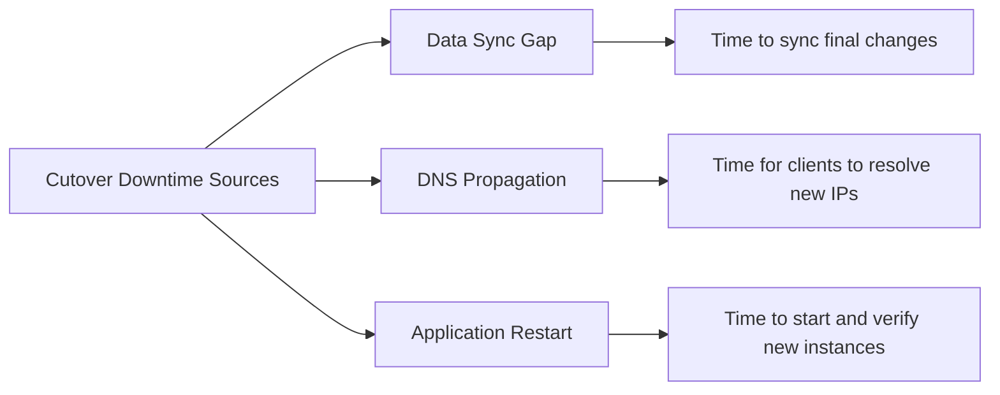
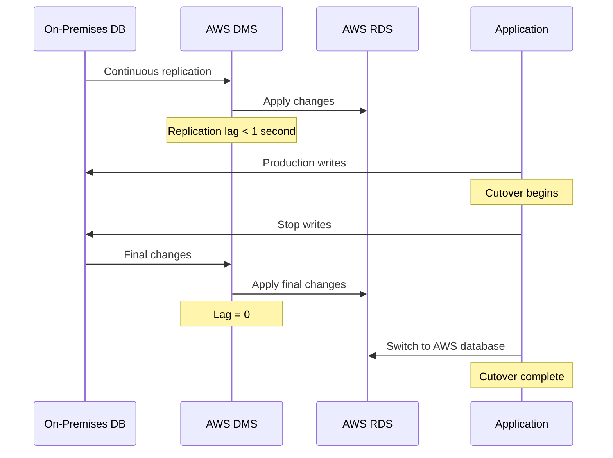

# How to Cut Over from On-Premises to AWS with Minimal Downtime

Author: [nawazdhandala](https://github.com/nawazdhandala)

Tags: AWS, Migration, Cutover, Downtime, DNS, Database Replication

Description: Proven strategies to minimize downtime during on-premises to AWS migration cutover including DNS strategies, database replication, and blue-green approaches.

---

The cutover is the moment of truth in any migration. Everything you have planned, tested, and rehearsed comes down to the window where you switch production traffic from on-premises to AWS. The goal is to make that window as small as possible - ideally minutes, not hours.

## Understanding Cutover Downtime

Downtime during cutover comes from three sources:



Your strategy needs to address all three. Solving one while ignoring the others still leaves you with an extended outage.

## Strategy 1: DNS-Based Cutover

The simplest approach uses DNS to redirect traffic. It works well when your application is stateless or when you can tolerate a brief period of split traffic.

### Preparation (Days Before Cutover)

Lower your DNS TTL well in advance. Most resolvers honor TTL, but some cache aggressively.

```bash
# Lower TTL to 60 seconds at least 48 hours before cutover
# This ensures all cached records expire before the migration window
aws route53 change-resource-record-sets \
    --hosted-zone-id Z1234567890 \
    --change-batch '{
        "Changes": [{
            "Action": "UPSERT",
            "ResourceRecordSet": {
                "Name": "app.example.com",
                "Type": "A",
                "TTL": 60,
                "ResourceRecords": [{"Value": "10.0.1.50"}]
            }
        }]
    }'
```

### During Cutover

```bash
# Switch DNS to the AWS ALB
aws route53 change-resource-record-sets \
    --hosted-zone-id Z1234567890 \
    --change-batch '{
        "Changes": [{
            "Action": "UPSERT",
            "ResourceRecordSet": {
                "Name": "app.example.com",
                "Type": "A",
                "AliasTarget": {
                    "HostedZoneId": "Z35SXDOTRQ7X7K",
                    "DNSName": "my-alb-123456.us-east-1.elb.amazonaws.com",
                    "EvaluateTargetHealth": true
                }
            }
        }]
    }'
```

### Limitation

Even with a 60-second TTL, some clients and resolvers will hold onto the old IP longer. Expect 5-10 minutes for full propagation, and plan for some traffic hitting both environments during that window.

## Strategy 2: Weighted DNS Cutover

A more controlled approach uses Route 53 weighted routing to gradually shift traffic.

```bash
# Start with 100% weight on on-premises
aws route53 change-resource-record-sets \
    --hosted-zone-id Z1234567890 \
    --change-batch '{
        "Changes": [
            {
                "Action": "UPSERT",
                "ResourceRecordSet": {
                    "Name": "app.example.com",
                    "Type": "A",
                    "SetIdentifier": "onprem",
                    "Weight": 100,
                    "TTL": 60,
                    "ResourceRecords": [{"Value": "10.0.1.50"}]
                }
            },
            {
                "Action": "UPSERT",
                "ResourceRecordSet": {
                    "Name": "app.example.com",
                    "Type": "A",
                    "SetIdentifier": "aws",
                    "Weight": 0,
                    "AliasTarget": {
                        "HostedZoneId": "Z35SXDOTRQ7X7K",
                        "DNSName": "my-alb-123456.us-east-1.elb.amazonaws.com",
                        "EvaluateTargetHealth": true
                    }
                }
            }
        ]
    }'
```

Then shift traffic in stages:

```bash
# Shift to 10% AWS traffic
# Update the weights: onprem=90, aws=10
# Monitor for 30 minutes

# Shift to 50% AWS traffic
# Update the weights: onprem=50, aws=50
# Monitor for 30 minutes

# Shift to 100% AWS traffic
# Update the weights: onprem=0, aws=100
```

This approach lets you catch problems with a small percentage of traffic before committing fully. The downside is that both environments need to be fully operational, and you need a strategy for database writes from both locations.

## Strategy 3: Database Replication for Zero-Downtime Data Sync

The database is usually the hardest piece. You cannot just copy it and switch - you need continuous replication right up until the cutover moment.



### Setting Up AWS DMS for Continuous Replication

```bash
# Create a DMS replication instance
aws dms create-replication-instance \
    --replication-instance-identifier migration-ri \
    --replication-instance-class dms.r5.xlarge \
    --allocated-storage 100 \
    --vpc-security-group-ids sg-0123456789abcdef0 \
    --replication-subnet-group-identifier my-subnet-group

# Create source endpoint (on-premises)
aws dms create-endpoint \
    --endpoint-identifier source-onprem \
    --endpoint-type source \
    --engine-name postgres \
    --server-name 10.0.1.100 \
    --port 5432 \
    --database-name orderdb \
    --username dms_user \
    --password "$DMS_PASSWORD"

# Create target endpoint (RDS)
aws dms create-endpoint \
    --endpoint-identifier target-rds \
    --endpoint-type target \
    --engine-name postgres \
    --server-name orderdb.abc123.us-east-1.rds.amazonaws.com \
    --port 5432 \
    --database-name orderdb \
    --username dms_user \
    --password "$DMS_PASSWORD"

# Create replication task with CDC (Change Data Capture)
aws dms create-replication-task \
    --replication-task-identifier full-load-and-cdc \
    --source-endpoint-arn arn:aws:dms:us-east-1:123456789012:endpoint:source-onprem \
    --target-endpoint-arn arn:aws:dms:us-east-1:123456789012:endpoint:target-rds \
    --replication-instance-arn arn:aws:dms:us-east-1:123456789012:rep:migration-ri \
    --migration-type full-load-and-cdc \
    --table-mappings file://table-mappings.json
```

### The Critical Cutover Sequence

During the actual cutover, the sequence is:

1. Stop application writes to the source database
2. Wait for DMS replication lag to reach zero
3. Verify data counts match between source and target
4. Stop the DMS task
5. Point the application to the new database
6. Resume traffic

The database cutover downtime is typically 2-5 minutes with this approach.

## Strategy 4: Blue-Green with Global Accelerator

For the lowest possible downtime, use AWS Global Accelerator to shift traffic at the network level rather than DNS level. Traffic shifts happen in seconds, not minutes.

```bash
# Create an accelerator
aws globalaccelerator create-accelerator \
    --name migration-accelerator \
    --ip-address-type IPV4 \
    --enabled

# Create a listener
aws globalaccelerator create-listener \
    --accelerator-arn arn:aws:globalaccelerator::123456789012:accelerator/abc123 \
    --port-ranges FromPort=443,ToPort=443 \
    --protocol TCP

# Create endpoint groups - one for on-prem (via NLB), one for AWS
# Initially, all traffic goes to on-prem endpoint group with weight 100
# During cutover, shift weight to AWS endpoint group
```

Global Accelerator uses anycast IPs that do not change, so there is no DNS propagation delay.

## Strategy 5: Application-Level Routing

If you control the client applications or use a reverse proxy, you can implement cutover at the application layer.

```nginx
# Nginx configuration for gradual cutover
upstream onprem_backend {
    server 10.0.1.50:8080;
}

upstream aws_backend {
    server internal-alb-123.us-east-1.elb.amazonaws.com:443;
}

# Split traffic using a map directive
split_clients "${remote_addr}" $backend {
    10%   aws_backend;     # Start with 10% to AWS
    *     onprem_backend;  # Rest to on-premises
}

server {
    listen 443 ssl;
    server_name app.example.com;

    location / {
        proxy_pass http://$backend;
        proxy_set_header Host $host;
        proxy_set_header X-Real-IP $remote_addr;
    }
}
```

## The Cutover Checklist

Regardless of which strategy you choose, follow this checklist:

```markdown
## Pre-Cutover (T-2h)
- [ ] Confirm all team members on bridge call
- [ ] Verify AWS environment health
- [ ] Confirm database replication lag < 1 second
- [ ] Verify rollback procedure is ready
- [ ] Notify stakeholders of upcoming maintenance

## Cutover Execution
- [ ] Enable maintenance page (if applicable)
- [ ] Stop writes to source database
- [ ] Wait for replication to catch up (lag = 0)
- [ ] Run data validation queries
- [ ] Switch traffic to AWS
- [ ] Verify AWS environment receiving traffic
- [ ] Run smoke tests
- [ ] Disable maintenance page

## Post-Cutover (T+1h)
- [ ] Monitor error rates and latency
- [ ] Verify all integrations working
- [ ] Confirm no traffic hitting old environment
- [ ] Notify stakeholders of successful cutover
```

For building a complete migration plan, see our guide on [creating an AWS migration runbook](https://oneuptime.com/blog/post/2026-02-12-create-an-aws-migration-runbook/view).

## Measuring Your Cutover

Track these metrics to understand how your cutover actually went:

- **Total downtime**: Time from first user impact to full recovery
- **Data loss window**: Any transactions lost during the switch (should be zero)
- **Error rate spike**: How much did errors increase, and for how long?
- **Rollback events**: Did you need to roll back at any point?

## Conclusion

Minimal downtime cutovers require preparation that starts weeks before the actual migration window. Lower DNS TTLs early, set up continuous database replication, rehearse the cutover sequence, and always have a tested rollback plan. The actual cutover should be the most boring part of the migration - if you have done the preparation right.
