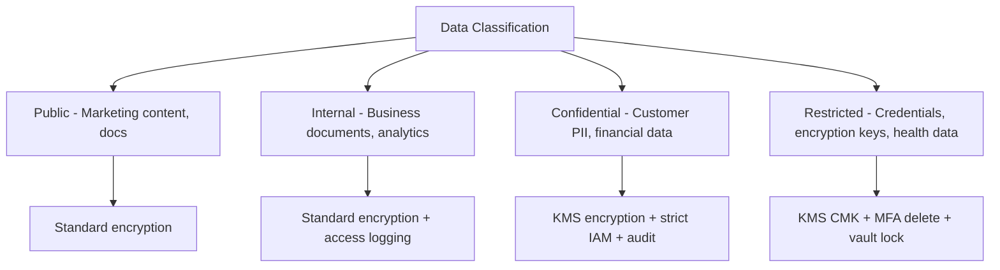

# How to Implement Data Protection Best Practices on AWS

Author: [nawazdhandala](https://github.com/nawazdhandala)

Tags: AWS, Data Protection, Security, Compliance, KMS

Description: A comprehensive guide to protecting data on AWS covering classification, encryption, access controls, data loss prevention, and compliance requirements.

---

Data is the reason your infrastructure exists. It's also the thing attackers want most. A misconfigured S3 bucket, an unencrypted database, or an overly permissive IAM policy can expose millions of records in seconds. Data breaches don't just cost money in fines - they destroy customer trust, which is much harder to rebuild.

Data protection on AWS goes beyond just encryption. It includes knowing what data you have, where it lives, who can access it, and how it's protected at every stage of its lifecycle.

## Data Classification

You can't protect data properly if you don't know what you have. Start by classifying your data.



Use Amazon Macie to automatically discover and classify sensitive data in your S3 buckets.

This Terraform configuration enables Macie for automated data discovery.

```hcl
resource "aws_macie2_account" "main" {}

resource "aws_macie2_classification_job" "pii_scan" {
  depends_on = [aws_macie2_account.main]

  job_type = "SCHEDULED"
  name     = "pii-discovery-scan"

  s3_job_definition {
    bucket_definitions {
      account_id = data.aws_caller_identity.current.account_id
      buckets    = [
        aws_s3_bucket.customer_data.id,
        aws_s3_bucket.application_data.id
      ]
    }

    scoping {
      includes {
        and {
          simple_scope_term {
            comparator = "STARTS_WITH"
            key        = "OBJECT_KEY"
            values     = ["customer/", "orders/", "users/"]
          }
        }
      }
    }
  }

  schedule_frequency_details {
    weekly_schedule = "MONDAY"
  }

  sampling_percentage = 100

  custom_data_identifier_ids = [
    aws_macie2_custom_data_identifier.account_number.id
  ]
}

# Custom data identifier for account numbers
resource "aws_macie2_custom_data_identifier" "account_number" {
  name        = "account-number"
  regex       = "ACC-[0-9]{10}"
  description = "Matches internal account number format"

  depends_on = [aws_macie2_account.main]
}
```

## Encryption Strategy

Different data classifications need different encryption approaches.

Here's a complete encryption setup using KMS with key hierarchies.

```hcl
# Key hierarchy for different data classifications

# Confidential data key - stricter controls
resource "aws_kms_key" "confidential" {
  description             = "Key for confidential data (PII, financial)"
  deletion_window_in_days = 30
  enable_key_rotation     = true

  policy = jsonencode({
    Version = "2012-10-17"
    Statement = [
      {
        Sid    = "KeyAdministration"
        Effect = "Allow"
        Principal = {
          AWS = "arn:aws:iam::${var.account_id}:role/SecurityAdmin"
        }
        Action = [
          "kms:Create*", "kms:Describe*", "kms:Enable*",
          "kms:List*", "kms:Put*", "kms:Update*",
          "kms:Revoke*", "kms:Disable*", "kms:Get*",
          "kms:Delete*", "kms:ScheduleKeyDeletion",
          "kms:CancelKeyDeletion"
        ]
        Resource = "*"
      },
      {
        Sid    = "KeyUsageByApprovedRoles"
        Effect = "Allow"
        Principal = {
          AWS = [
            "arn:aws:iam::${var.account_id}:role/DataProcessingRole",
            "arn:aws:iam::${var.account_id}:role/BackupRole"
          ]
        }
        Action = [
          "kms:Encrypt", "kms:Decrypt",
          "kms:ReEncrypt*", "kms:GenerateDataKey*"
        ]
        Resource = "*"
        Condition = {
          StringEquals = {
            "kms:ViaService" = [
              "s3.${var.region}.amazonaws.com",
              "rds.${var.region}.amazonaws.com"
            ]
          }
        }
      }
    ]
  })
}

# Restricted data key - most stringent controls
resource "aws_kms_key" "restricted" {
  description             = "Key for restricted data (credentials, health records)"
  deletion_window_in_days = 30
  enable_key_rotation     = true

  policy = jsonencode({
    Version = "2012-10-17"
    Statement = [
      {
        Sid    = "KeyAdministration"
        Effect = "Allow"
        Principal = {
          AWS = "arn:aws:iam::${var.account_id}:role/SecurityAdmin"
        }
        Action = ["kms:Create*", "kms:Describe*", "kms:Enable*", "kms:List*",
                  "kms:Put*", "kms:Update*", "kms:Revoke*", "kms:Disable*",
                  "kms:Get*", "kms:Delete*", "kms:ScheduleKeyDeletion"]
        Resource = "*"
        Condition = {
          Bool = {
            "aws:MultiFactorAuthPresent" = "true"
          }
        }
      },
      {
        Sid    = "RestrictedKeyUsage"
        Effect = "Allow"
        Principal = {
          AWS = "arn:aws:iam::${var.account_id}:role/RestrictedDataRole"
        }
        Action = ["kms:Decrypt"]
        Resource = "*"
        Condition = {
          IpAddress = {
            "aws:SourceIp" = var.corporate_ip_range
          }
        }
      }
    ]
  })
}
```

## S3 Data Protection

S3 is the most common data store on AWS, and it needs multiple layers of protection.

```hcl
# Secure S3 bucket for confidential data
resource "aws_s3_bucket" "confidential_data" {
  bucket = "${var.account_id}-confidential-data"
}

# Versioning for data recovery
resource "aws_s3_bucket_versioning" "confidential_data" {
  bucket = aws_s3_bucket.confidential_data.id
  versioning_configuration {
    status     = "Enabled"
    mfa_delete = "Enabled"  # Require MFA to delete versions
  }
}

# Default encryption with customer-managed KMS key
resource "aws_s3_bucket_server_side_encryption_configuration" "confidential_data" {
  bucket = aws_s3_bucket.confidential_data.id

  rule {
    apply_server_side_encryption_by_default {
      sse_algorithm     = "aws:kms"
      kms_master_key_id = aws_kms_key.confidential.arn
    }
    bucket_key_enabled = true
  }
}

# Block all public access
resource "aws_s3_bucket_public_access_block" "confidential_data" {
  bucket = aws_s3_bucket.confidential_data.id

  block_public_acls       = true
  block_public_policy     = true
  ignore_public_acls      = true
  restrict_public_buckets = true
}

# Object lock for immutable storage
resource "aws_s3_bucket_object_lock_configuration" "confidential_data" {
  bucket = aws_s3_bucket.confidential_data.id

  rule {
    default_retention {
      mode = "COMPLIANCE"
      days = 90
    }
  }
}

# Lifecycle rules for data management
resource "aws_s3_bucket_lifecycle_configuration" "confidential_data" {
  bucket = aws_s3_bucket.confidential_data.id

  rule {
    id     = "transition-to-ia"
    status = "Enabled"

    transition {
      days          = 90
      storage_class = "STANDARD_IA"
    }

    transition {
      days          = 365
      storage_class = "GLACIER"
    }

    noncurrent_version_expiration {
      noncurrent_days = 90
    }
  }
}

# Access logging
resource "aws_s3_bucket_logging" "confidential_data" {
  bucket = aws_s3_bucket.confidential_data.id

  target_bucket = aws_s3_bucket.access_logs.id
  target_prefix = "confidential-data/"
}
```

## Data Access Controls

Use a combination of IAM policies and S3 access points to control who can access what data.

```hcl
# S3 Access Point for different teams
resource "aws_s3_access_point" "analytics" {
  bucket = aws_s3_bucket.confidential_data.id
  name   = "analytics-access"

  # VPC restriction - only accessible from within the VPC
  vpc_configuration {
    vpc_id = aws_vpc.main.id
  }

  public_access_block_configuration {
    block_public_acls       = true
    block_public_policy     = true
    ignore_public_acls      = true
    restrict_public_buckets = true
  }
}

# Access point policy - analytics team can only read specific prefixes
resource "aws_s3control_access_point_policy" "analytics" {
  access_point_arn = aws_s3_access_point.analytics.arn

  policy = jsonencode({
    Version = "2012-10-17"
    Statement = [
      {
        Effect = "Allow"
        Principal = {
          AWS = "arn:aws:iam::${var.account_id}:role/AnalyticsTeamRole"
        }
        Action = ["s3:GetObject", "s3:ListBucket"]
        Resource = [
          "${aws_s3_access_point.analytics.arn}",
          "${aws_s3_access_point.analytics.arn}/object/aggregated/*"
        ]
      }
    ]
  })
}
```

## Data Loss Prevention

Prevent sensitive data from leaving your environment through unauthorized channels.

```python
import boto3
import json

def check_s3_data_exfiltration(event, context):
    """Monitor for potential data exfiltration from S3."""
    s3_event = event['detail']
    bucket = s3_event['requestParameters']['bucketName']
    action = s3_event['eventName']
    principal = s3_event['userIdentity']['arn']

    # Flag suspicious activities
    suspicious = False
    reason = ""

    # Large number of GetObject calls from unusual principal
    if action == 'GetObject':
        cloudwatch = boto3.client('cloudwatch')
        # Check if this principal has made an unusual number of reads
        # This would use a custom metric or CloudTrail Insights

        pass

    # Detect attempts to make bucket public
    if action in ['PutBucketAcl', 'PutBucketPolicy']:
        s3 = boto3.client('s3')
        # Check if the new policy allows public access
        try:
            policy = s3.get_bucket_policy(Bucket=bucket)
            policy_doc = json.loads(policy['Policy'])
            for statement in policy_doc.get('Statement', []):
                principal = statement.get('Principal', '')
                if principal == '*' or principal == {'AWS': '*'}:
                    suspicious = True
                    reason = f"Attempt to make {bucket} public via {action}"
        except Exception:
            pass

    # Detect cross-account replication to unknown accounts
    if action == 'PutBucketReplication':
        suspicious = True
        reason = f"Replication configuration changed on {bucket}"

    if suspicious:
        sns = boto3.client('sns')
        sns.publish(
            TopicArn=os.environ['SECURITY_TOPIC'],
            Subject=f'Data Protection Alert: {reason}',
            Message=json.dumps({
                'bucket': bucket,
                'action': action,
                'principal': principal,
                'reason': reason
            })
        )
```

## Data Retention and Deletion

Implement proper data lifecycle management. Don't keep data longer than you need to.

```python
import boto3
from datetime import datetime, timedelta

def enforce_data_retention():
    """Delete data that has exceeded its retention period."""
    s3 = boto3.client('s3')

    retention_policies = {
        'session-data': 30,       # 30 days
        'application-logs': 90,   # 90 days
        'user-analytics': 365,    # 1 year
        'financial-records': 2555 # 7 years
    }

    for prefix, retention_days in retention_policies.items():
        cutoff_date = datetime.now() - timedelta(days=retention_days)

        paginator = s3.get_paginator('list_objects_v2')
        pages = paginator.paginate(
            Bucket='data-lake-bucket',
            Prefix=f'{prefix}/'
        )

        objects_to_delete = []
        for page in pages:
            for obj in page.get('Contents', []):
                if obj['LastModified'].replace(tzinfo=None) < cutoff_date:
                    objects_to_delete.append({'Key': obj['Key']})

        # Delete in batches of 1000
        for i in range(0, len(objects_to_delete), 1000):
            batch = objects_to_delete[i:i+1000]
            s3.delete_objects(
                Bucket='data-lake-bucket',
                Delete={'Objects': batch}
            )
            print(f"Deleted {len(batch)} objects from {prefix}/")

        print(f"{prefix}: {len(objects_to_delete)} objects past retention")

enforce_data_retention()
```

## Summary

Data protection is a discipline that spans your entire architecture. Classify your data so you know what needs the most protection. Encrypt everything. Control access with fine-grained IAM policies and S3 access points. Monitor for anomalies that could indicate a breach. And implement proper lifecycle management so you're not keeping data longer than necessary.

The cost of prevention is always less than the cost of a breach. Invest the time to get data protection right from the start.

For related topics, see [encryption everywhere on AWS](https://oneuptime.com/blog/post/encryption-everywhere-aws/view) and [database security best practices on AWS](https://oneuptime.com/blog/post/database-security-best-practices-aws/view).
