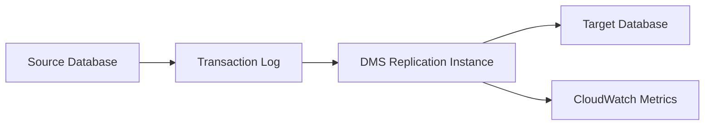

# How to Use Database Migration Service (DMS) for Ongoing Replication

Author: [nawazdhandala](https://github.com/nawazdhandala)

Tags: AWS, DMS, Database Migration, Replication, Cloud

Description: Learn how to set up AWS Database Migration Service for ongoing data replication between databases, covering source and target configuration, CDC, monitoring, and troubleshooting.

---

AWS Database Migration Service (DMS) does more than one-time migrations. It can maintain continuous replication between databases, keeping a target in sync with a source in near real-time. This is invaluable for cross-region replication, migration testing, feeding data warehouses, or maintaining read replicas across different database engines.

This guide focuses on the ongoing replication use case - setting up DMS to continuously capture changes from a source database and apply them to a target.

## How CDC Works in DMS

Change Data Capture (CDC) is the mechanism DMS uses for ongoing replication. After performing an initial full load of your data, DMS reads the source database's transaction log (binlog for MySQL, WAL for PostgreSQL, redo log for Oracle) and applies those changes to the target.



The replication instance sits between source and target, reading changes and applying them continuously.

## Step 1: Create a Replication Instance

The replication instance is the compute that processes your data. Size it based on the volume of changes per second.

```bash
# Create a replication instance
aws dms create-replication-instance \
  --replication-instance-identifier prod-replicator \
  --replication-instance-class dms.r5.xlarge \
  --allocated-storage 200 \
  --vpc-security-group-ids sg-12345678 \
  --replication-subnet-group-identifier my-dms-subnet-group \
  --multi-az \
  --publicly-accessible false
```

For production, always use `--multi-az` to ensure the replication instance fails over automatically. Size the storage based on how much change data you expect to buffer during target outages.

Before creating the instance, you need a subnet group.

```bash
# Create a subnet group for DMS
aws dms create-replication-subnet-group \
  --replication-subnet-group-identifier my-dms-subnet-group \
  --replication-subnet-group-description "DMS subnet group" \
  --subnet-ids subnet-abc123 subnet-def456
```

## Step 2: Configure Source Endpoint

The source endpoint tells DMS how to connect to your source database and which CDC method to use.

### MySQL Source

```bash
# Create a MySQL source endpoint
aws dms create-endpoint \
  --endpoint-identifier source-mysql \
  --endpoint-type source \
  --engine-name mysql \
  --server-name my-mysql-server.example.com \
  --port 3306 \
  --username dms_user \
  --password 'SecurePassword!' \
  --database-name myapp
```

Make sure binary logging is enabled on your MySQL source and the DMS user has the required privileges.

```sql
-- Grant necessary permissions to the DMS user on MySQL
GRANT SELECT, REPLICATION CLIENT, REPLICATION SLAVE ON *.* TO 'dms_user'@'%';
FLUSH PRIVILEGES;
```

### PostgreSQL Source

```bash
# Create a PostgreSQL source endpoint with logical replication
aws dms create-endpoint \
  --endpoint-identifier source-postgres \
  --endpoint-type source \
  --engine-name postgres \
  --server-name my-postgres-server.example.com \
  --port 5432 \
  --username dms_user \
  --password 'SecurePassword!' \
  --database-name myapp \
  --extra-connection-attributes "PluginName=pglogical"
```

For PostgreSQL, you need to configure logical replication.

```sql
-- PostgreSQL: enable logical replication in postgresql.conf
-- wal_level = logical
-- max_replication_slots = 5
-- max_wal_senders = 5

-- Create a replication slot for DMS
SELECT pg_create_logical_replication_slot('dms_slot', 'test_decoding');

-- Grant necessary permissions
GRANT rds_replication TO dms_user;
```

### RDS or Aurora Source

If your source is an RDS instance, DMS can connect directly. Just make sure the security groups allow traffic from the DMS replication instance.

```bash
# Create an endpoint for an RDS Aurora MySQL source
aws dms create-endpoint \
  --endpoint-identifier source-aurora \
  --endpoint-type source \
  --engine-name aurora \
  --server-name my-aurora-cluster.cluster-xxxxx.us-east-1.rds.amazonaws.com \
  --port 3306 \
  --username dms_user \
  --password 'SecurePassword!' \
  --database-name myapp
```

## Step 3: Configure Target Endpoint

The target can be a different database engine entirely. Here are common configurations.

```bash
# Target: Amazon Redshift
aws dms create-endpoint \
  --endpoint-identifier target-redshift \
  --endpoint-type target \
  --engine-name redshift \
  --server-name analytics.xxxxx.us-east-1.redshift.amazonaws.com \
  --port 5439 \
  --username admin \
  --password 'RedshiftPassword!' \
  --database-name warehouse

# Target: Amazon S3 (for data lake ingestion)
aws dms create-endpoint \
  --endpoint-identifier target-s3 \
  --endpoint-type target \
  --engine-name s3 \
  --s3-settings '{
    "ServiceAccessRoleArn": "arn:aws:iam::123456789:role/DMSAccessS3",
    "BucketName": "my-data-lake",
    "BucketFolder": "cdc-data",
    "DataFormat": "parquet",
    "ParquetVersion": "parquet-2-0",
    "EnableStatistics": true,
    "TimestampColumnName": "cdc_timestamp"
  }'

# Target: Amazon DynamoDB
aws dms create-endpoint \
  --endpoint-identifier target-dynamodb \
  --endpoint-type target \
  --engine-name dynamodb \
  --dynamo-db-settings '{
    "ServiceAccessRoleArn": "arn:aws:iam::123456789:role/DMSAccessDynamoDB"
  }'
```

## Step 4: Test Connections

Always test endpoints before creating a replication task.

```bash
# Test source endpoint connectivity
aws dms test-connection \
  --replication-instance-arn arn:aws:dms:us-east-1:123456789:rep:prod-replicator \
  --endpoint-arn arn:aws:dms:us-east-1:123456789:endpoint:source-mysql

# Check test status
aws dms describe-connections \
  --filter "Name=endpoint-arn,Values=arn:aws:dms:us-east-1:123456789:endpoint:source-mysql"
```

## Step 5: Create the Replication Task

This is where you define what gets replicated and how.

```bash
# Create a replication task with full load + CDC
aws dms create-replication-task \
  --replication-task-identifier mysql-to-redshift \
  --source-endpoint-arn arn:aws:dms:us-east-1:123456789:endpoint:source-mysql \
  --target-endpoint-arn arn:aws:dms:us-east-1:123456789:endpoint:target-redshift \
  --replication-instance-arn arn:aws:dms:us-east-1:123456789:rep:prod-replicator \
  --migration-type full-load-and-cdc \
  --table-mappings file://table-mappings.json \
  --replication-task-settings file://task-settings.json
```

The table mappings file controls which tables to include and any transformations.

```json
{
  "rules": [
    {
      "rule-type": "selection",
      "rule-id": "1",
      "rule-name": "include-all-tables",
      "object-locator": {
        "schema-name": "myapp",
        "table-name": "%"
      },
      "rule-action": "include"
    },
    {
      "rule-type": "selection",
      "rule-id": "2",
      "rule-name": "exclude-temp-tables",
      "object-locator": {
        "schema-name": "myapp",
        "table-name": "tmp_%"
      },
      "rule-action": "exclude"
    },
    {
      "rule-type": "transformation",
      "rule-id": "3",
      "rule-name": "add-schema-prefix",
      "rule-action": "rename",
      "rule-target": "schema",
      "object-locator": {
        "schema-name": "myapp"
      },
      "value": "source_myapp"
    }
  ]
}
```

The task settings file configures error handling, logging, and performance.

```json
{
  "TargetMetadata": {
    "TargetSchema": "",
    "SupportLobs": true,
    "LimitedSizeLobMode": true,
    "LobMaxSize": 32
  },
  "Logging": {
    "EnableLogging": true,
    "LogComponents": [
      {"Id": "SOURCE_UNLOAD", "Severity": "LOGGER_SEVERITY_DEFAULT"},
      {"Id": "TARGET_LOAD", "Severity": "LOGGER_SEVERITY_DEFAULT"},
      {"Id": "SOURCE_CAPTURE", "Severity": "LOGGER_SEVERITY_DEFAULT"},
      {"Id": "TARGET_APPLY", "Severity": "LOGGER_SEVERITY_DEFAULT"}
    ]
  },
  "ErrorBehavior": {
    "DataErrorPolicy": "LOG_ERROR",
    "TableErrorPolicy": "SUSPEND_TABLE"
  },
  "ChangeProcessingTuning": {
    "BatchApplyEnabled": true,
    "MinTransactionSize": 1000,
    "CommitTimeout": 10
  }
}
```

## Step 6: Start and Monitor Replication

```bash
# Start the replication task
aws dms start-replication-task \
  --replication-task-arn arn:aws:dms:us-east-1:123456789:task:mysql-to-redshift \
  --start-replication-task-type start-replication

# Check task status
aws dms describe-replication-tasks \
  --filters "Name=replication-task-arn,Values=arn:aws:dms:us-east-1:123456789:task:mysql-to-redshift" \
  --query 'ReplicationTasks[0].{Status:Status,CDCLatency:ReplicationTaskStats.CDCLatencySource}'
```

## Monitoring Ongoing Replication

Watch these CloudWatch metrics to ensure replication stays healthy:

- **CDCLatencySource** - how far behind the source the replication is (in seconds)
- **CDCLatencyTarget** - how far behind the target is in applying changes
- **CDCIncomingChanges** - number of change events waiting to be applied
- **CDCThroughputBandwidthSource** - throughput of change data being read

```bash
# Set up an alarm for replication lag
aws cloudwatch put-metric-alarm \
  --alarm-name dms-replication-lag \
  --metric-name CDCLatencySource \
  --namespace AWS/DMS \
  --statistic Average \
  --period 300 \
  --threshold 300 \
  --comparison-operator GreaterThanThreshold \
  --evaluation-periods 3 \
  --dimensions Name=ReplicationInstanceIdentifier,Value=prod-replicator \
  --alarm-actions arn:aws:sns:us-east-1:123456789:alerts
```

## Troubleshooting Common Issues

**Replication lag keeps growing** - Your replication instance might be undersized. Check CPU and memory usage. Scale up the instance class if needed.

**Tables stuck in "Error" state** - Check the task logs in CloudWatch for specific errors. Common causes are schema mismatches, data type issues, or LOB handling problems.

**Full load takes too long** - Increase the replication instance size and adjust the `MaxFullLoadSubTasks` setting to parallelize table loads.

```bash
# View replication task logs
aws dms describe-replication-task-assessment-results \
  --replication-task-arn arn:aws:dms:us-east-1:123456789:task:mysql-to-redshift
```

## Wrapping Up

DMS ongoing replication is a robust way to keep databases in sync across different engines and regions. The setup takes some effort, but once running, it's largely hands-off. Monitor your CDC latency, set up alerts for when lag exceeds your tolerance, and keep the replication instance sized appropriately. For migrating database schemas alongside the data, check out our guide on using the [Schema Conversion Tool](https://oneuptime.com/blog/post/schema-conversion-tool-sct-migration/view).
