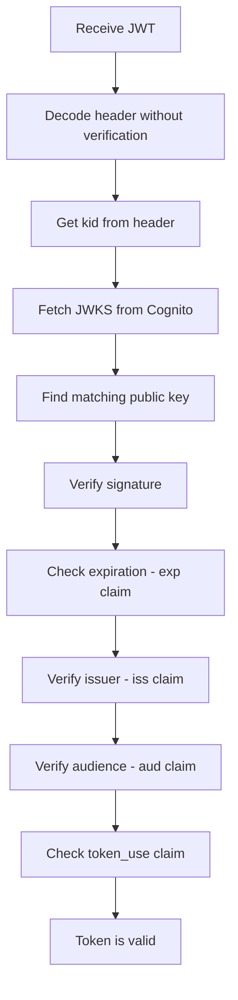

# How to Decode and Validate Cognito JWT Tokens

Author: [nawazdhandala](https://github.com/nawazdhandala)

Tags: AWS, Cognito, JWT, Security, Authentication

Description: A practical guide to decoding, validating, and verifying AWS Cognito JWT tokens in your application, including signature verification, claim checks, and common pitfalls.

---

Every time a user authenticates with Cognito, they get back three tokens: an ID token, an access token, and a refresh token. The first two are JWTs (JSON Web Tokens), and your application needs to validate them before trusting any claims they contain. Getting this wrong means your API is vulnerable to token forgery, expired credentials, or cross-application token reuse.

Let's walk through exactly how Cognito JWTs work and how to properly validate them in your backend.

## Understanding Cognito JWT Structure

A JWT has three parts separated by dots: header, payload, and signature. Each part is Base64URL-encoded.

Here's what a decoded Cognito ID token looks like:

```json
// Header
{
    "kid": "abcdef1234567890",
    "alg": "RS256"
}

// Payload
{
    "sub": "a1b2c3d4-e5f6-7890-abcd-ef1234567890",
    "iss": "https://cognito-idp.us-east-1.amazonaws.com/us-east-1_XXXXXXXXX",
    "aud": "your-app-client-id",
    "token_use": "id",
    "auth_time": 1707750000,
    "exp": 1707753600,
    "iat": 1707750000,
    "email": "user@example.com",
    "cognito:username": "johndoe",
    "cognito:groups": ["Admins", "Users"]
}
```

The access token looks similar but has different claims - it includes `scope` and `client_id` instead of user attributes, and its `token_use` is "access" instead of "id".

## The Validation Steps

Token validation isn't just checking if the JWT decodes properly. You need to verify multiple things in a specific order:



1. **Verify the signature** using the public key from Cognito's JWKS endpoint
2. **Check the expiration** (`exp` claim)
3. **Verify the issuer** (`iss` claim matches your user pool)
4. **Verify the audience** (`aud` claim matches your app client ID)
5. **Check the token use** (`token_use` matches what you expect)

## Step 1: Fetch the JSON Web Key Set (JWKS)

Cognito publishes its public keys at a well-known URL. You'll use these keys to verify token signatures.

The JWKS URL follows this pattern:

```
https://cognito-idp.{region}.amazonaws.com/{userPoolId}/.well-known/jwks.json
```

Fetch and cache the JWKS - it doesn't change often:

```javascript
const https = require('https');

const REGION = 'us-east-1';
const USER_POOL_ID = 'us-east-1_XXXXXXXXX';
const JWKS_URL = `https://cognito-idp.${REGION}.amazonaws.com/${USER_POOL_ID}/.well-known/jwks.json`;

// Cache the JWKS to avoid fetching on every request
let cachedJWKS = null;
let cacheExpiry = 0;

async function getJWKS() {
    const now = Date.now();

    // Cache for 1 hour
    if (cachedJWKS && now < cacheExpiry) {
        return cachedJWKS;
    }

    return new Promise((resolve, reject) => {
        https.get(JWKS_URL, (res) => {
            let data = '';
            res.on('data', chunk => data += chunk);
            res.on('end', () => {
                cachedJWKS = JSON.parse(data);
                cacheExpiry = now + 3600000; // 1 hour
                resolve(cachedJWKS);
            });
        }).on('error', reject);
    });
}
```

## Step 2: Full Validation with jsonwebtoken and jwks-rsa

The most common Node.js approach uses the `jsonwebtoken` and `jwks-rsa` libraries together. This handles signature verification, expiration checks, and claim validation.

Install the dependencies:

```bash
npm install jsonwebtoken jwks-rsa
```

Here's a complete token validation function:

```javascript
const jwt = require('jsonwebtoken');
const jwksClient = require('jwks-rsa');

const REGION = 'us-east-1';
const USER_POOL_ID = 'us-east-1_XXXXXXXXX';
const APP_CLIENT_ID = 'your-app-client-id';

// Initialize the JWKS client with caching
const client = jwksClient({
    jwksUri: `https://cognito-idp.${REGION}.amazonaws.com/${USER_POOL_ID}/.well-known/jwks.json`,
    cache: true,
    cacheMaxEntries: 5,
    cacheMaxAge: 600000 // 10 minutes
});

// Helper to get the signing key by kid
function getSigningKey(kid) {
    return new Promise((resolve, reject) => {
        client.getSigningKey(kid, (err, key) => {
            if (err) return reject(err);
            resolve(key.getPublicKey());
        });
    });
}

// Main validation function
async function validateCognitoToken(token, tokenUse = 'id') {
    // Step 1: Decode the header to get the kid
    const decoded = jwt.decode(token, { complete: true });

    if (!decoded || !decoded.header || !decoded.header.kid) {
        throw new Error('Invalid token format');
    }

    // Step 2: Get the signing key
    const publicKey = await getSigningKey(decoded.header.kid);

    // Step 3: Verify signature and standard claims
    const payload = jwt.verify(token, publicKey, {
        issuer: `https://cognito-idp.${REGION}.amazonaws.com/${USER_POOL_ID}`,
        algorithms: ['RS256'],
        maxAge: '1h'
    });

    // Step 4: Verify token_use
    if (payload.token_use !== tokenUse) {
        throw new Error(`Expected ${tokenUse} token but got ${payload.token_use}`);
    }

    // Step 5: Verify audience (only for ID tokens - access tokens use client_id)
    if (tokenUse === 'id' && payload.aud !== APP_CLIENT_ID) {
        throw new Error('Token audience does not match app client');
    }

    if (tokenUse === 'access' && payload.client_id !== APP_CLIENT_ID) {
        throw new Error('Token client_id does not match app client');
    }

    return payload;
}
```

## Express Middleware Example

Here's how to turn the validation into reusable Express middleware:

```javascript
// auth-middleware.js
async function cognitoAuth(req, res, next) {
    const authHeader = req.headers.authorization;

    if (!authHeader || !authHeader.startsWith('Bearer ')) {
        return res.status(401).json({ error: 'Missing or invalid Authorization header' });
    }

    const token = authHeader.substring(7); // Remove 'Bearer '

    try {
        // Validate the access token for API requests
        const payload = await validateCognitoToken(token, 'access');

        req.user = {
            sub: payload.sub,
            username: payload.username,
            groups: payload['cognito:groups'] || [],
            scopes: payload.scope ? payload.scope.split(' ') : [],
            clientId: payload.client_id
        };

        next();
    } catch (error) {
        console.error('Token validation failed:', error.message);

        if (error.name === 'TokenExpiredError') {
            return res.status(401).json({ error: 'Token expired' });
        }

        return res.status(401).json({ error: 'Invalid token' });
    }
}

module.exports = { cognitoAuth };
```

## Python Validation

If you're working with Python, here's the equivalent using `python-jose` and `requests`.

Install the Python packages:

```bash
pip install python-jose requests
```

Here's the Python validation implementation:

```python
import time
import requests
from jose import jwt, JWTError

REGION = 'us-east-1'
USER_POOL_ID = 'us-east-1_XXXXXXXXX'
APP_CLIENT_ID = 'your-app-client-id'
JWKS_URL = f'https://cognito-idp.{REGION}.amazonaws.com/{USER_POOL_ID}/.well-known/jwks.json'
ISSUER = f'https://cognito-idp.{REGION}.amazonaws.com/{USER_POOL_ID}'

# Cache JWKS keys
_jwks_cache = None
_jwks_cache_time = 0

def get_jwks():
    global _jwks_cache, _jwks_cache_time
    now = time.time()

    # Refresh cache every 10 minutes
    if _jwks_cache and (now - _jwks_cache_time) < 600:
        return _jwks_cache

    response = requests.get(JWKS_URL)
    _jwks_cache = response.json()
    _jwks_cache_time = now
    return _jwks_cache

def validate_cognito_token(token, token_use='access'):
    # Get the key ID from the token header
    headers = jwt.get_unverified_headers(token)
    kid = headers.get('kid')

    if not kid:
        raise ValueError('No kid in token header')

    # Find the matching key in JWKS
    jwks = get_jwks()
    key = None
    for k in jwks.get('keys', []):
        if k['kid'] == kid:
            key = k
            break

    if not key:
        raise ValueError('Public key not found in JWKS')

    # Verify and decode the token
    try:
        payload = jwt.decode(
            token,
            key,
            algorithms=['RS256'],
            audience=APP_CLIENT_ID if token_use == 'id' else None,
            issuer=ISSUER,
        )
    except JWTError as e:
        raise ValueError(f'Token verification failed: {str(e)}')

    # Check token_use
    if payload.get('token_use') != token_use:
        raise ValueError(f'Expected {token_use} token')

    # For access tokens, check client_id
    if token_use == 'access' and payload.get('client_id') != APP_CLIENT_ID:
        raise ValueError('Client ID mismatch')

    return payload
```

## Common Mistakes to Avoid

**Don't just decode without verifying.** Calling `jwt.decode()` without signature verification is like reading a letter without checking the seal. Anyone can create a JWT with any claims.

**Don't hardcode public keys.** Cognito rotates its signing keys periodically. Always fetch from the JWKS endpoint and cache.

**Don't skip token_use validation.** If your API expects an access token but accepts an ID token, an attacker could use an ID token (which is easier to obtain in some flows) to access protected resources.

**Don't ignore clock skew.** If your server clock is slightly off, valid tokens might fail expiration checks. Most JWT libraries accept a small clock tolerance - use it.

```javascript
// Allow 30 seconds of clock skew
jwt.verify(token, publicKey, {
    clockTolerance: 30, // seconds
    issuer: expectedIssuer
});
```

## Quick Decode for Debugging

During development, you might want to quickly inspect a token without full validation. This is fine for debugging but never use this in production code paths.

A helper function for decoding tokens during development:

```javascript
function quickDecode(token) {
    const parts = token.split('.');
    if (parts.length !== 3) {
        throw new Error('Invalid JWT format');
    }

    const header = JSON.parse(Buffer.from(parts[0], 'base64url').toString());
    const payload = JSON.parse(Buffer.from(parts[1], 'base64url').toString());

    // Show human-readable expiration
    payload._expiresAt = new Date(payload.exp * 1000).toISOString();
    payload._issuedAt = new Date(payload.iat * 1000).toISOString();
    payload._isExpired = Date.now() > payload.exp * 1000;

    return { header, payload };
}
```

For managing what goes into these tokens before they're issued, check out [using Cognito Lambda triggers for Pre Token Generation](https://oneuptime.com/blog/post/cognito-lambda-triggers-pre-token-generation/view). And if you need to handle token refresh when they expire, see the guide on [handling Cognito token refresh in applications](https://oneuptime.com/blog/post/cognito-token-refresh-applications/view).

## Wrapping Up

Validating Cognito JWTs correctly is a non-negotiable security requirement. Skip any of the validation steps and you're opening the door to token forgery or replay attacks. The good news is that libraries like `jsonwebtoken` and `python-jose` handle most of the heavy lifting. Your job is to configure them correctly - right issuer, right audience, right token_use - and cache the JWKS keys so you're not making HTTP calls on every request.
