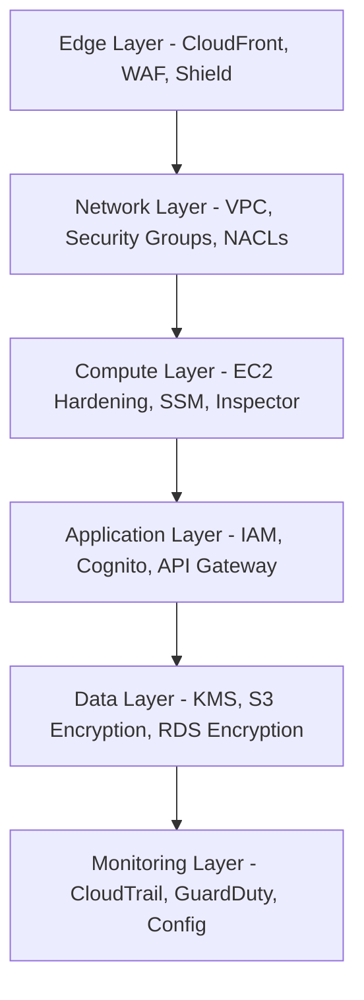

# How to Implement Defense in Depth on AWS

Author: [nawazdhandala](https://github.com/nawazdhandala)

Tags: AWS, Security, Cloud Architecture, Best Practices

Description: Learn how to implement a defense in depth strategy on AWS by layering multiple security controls across your infrastructure for comprehensive protection.

---

Defense in depth isn't a new concept. It's been around since medieval castle builders figured out that one wall wasn't enough - you needed moats, drawbridges, inner walls, and archers on the towers. The same principle applies to cloud security. If you rely on a single security control and it fails, you're completely exposed. Layering multiple controls means an attacker has to bypass every single one of them, which dramatically reduces your risk.

On AWS, defense in depth translates to applying security controls at every layer of your architecture - from the network edge all the way down to the data itself. Let's walk through how to build this properly.

## Understanding the Layers

Before diving into implementation, it helps to visualize what defense in depth looks like on AWS.



Each layer serves as an independent barrier. If an attacker gets past your WAF rules, they still have to deal with security groups, IAM policies, encryption, and monitoring that can detect and respond to the intrusion.

## Layer 1: Edge Protection

Your first line of defense is at the network edge. AWS provides several services that work together here.

This CloudFormation template sets up a CloudFront distribution with AWS WAF and Shield Advanced protection.

```yaml
# CloudFormation template for edge protection
AWSTemplateFormatVersion: '2010-09-09'
Resources:
  # WAF Web ACL with common rule sets
  WebACL:
    Type: AWS::WAFv2::WebACL
    Properties:
      Name: defense-in-depth-waf
      Scope: CLOUDFRONT
      DefaultAction:
        Allow: {}
      Rules:
        # Block common attack patterns
        - Name: AWSManagedRulesCommonRuleSet
          Priority: 1
          OverrideAction:
            None: {}
          Statement:
            ManagedRuleGroupStatement:
              VendorName: AWS
              Name: AWSManagedRulesCommonRuleSet
          VisibilityConfig:
            SampledRequestsEnabled: true
            CloudWatchMetricsEnabled: true
            MetricName: CommonRuleSetMetric
        # Block known bad inputs
        - Name: AWSManagedRulesKnownBadInputsRuleSet
          Priority: 2
          OverrideAction:
            None: {}
          Statement:
            ManagedRuleGroupStatement:
              VendorName: AWS
              Name: AWSManagedRulesKnownBadInputsRuleSet
          VisibilityConfig:
            SampledRequestsEnabled: true
            CloudWatchMetricsEnabled: true
            MetricName: KnownBadInputsMetric
      VisibilityConfig:
        SampledRequestsEnabled: true
        CloudWatchMetricsEnabled: true
        MetricName: WebACLMetric
```

AWS WAF managed rules cover the OWASP Top 10 vulnerabilities out of the box. You don't need to write custom rules from scratch - start with the managed rule groups and add custom rules as needed.

## Layer 2: Network Security

Inside your VPC, you've got two main tools: Network ACLs (stateless) and Security Groups (stateful). Use both.

Here's a Terraform configuration that creates a properly segmented VPC with strict network controls.

```hcl
# VPC with public, private, and isolated subnets
resource "aws_vpc" "main" {
  cidr_block           = "10.0.0.0/16"
  enable_dns_hostnames = true
  enable_dns_support   = true

  tags = {
    Name = "defense-in-depth-vpc"
  }
}

# Network ACL for private subnets - stateless firewall
resource "aws_network_acl" "private" {
  vpc_id     = aws_vpc.main.id
  subnet_ids = [aws_subnet.private_a.id, aws_subnet.private_b.id]

  # Allow inbound traffic only from the VPC CIDR
  ingress {
    protocol   = -1
    rule_no    = 100
    action     = "allow"
    cidr_block = "10.0.0.0/16"
    from_port  = 0
    to_port    = 0
  }

  # Deny all other inbound traffic
  ingress {
    protocol   = -1
    rule_no    = 200
    action     = "deny"
    cidr_block = "0.0.0.0/0"
    from_port  = 0
    to_port    = 0
  }

  # Allow outbound to VPC and HTTPS to internet
  egress {
    protocol   = "tcp"
    rule_no    = 100
    action     = "allow"
    cidr_block = "0.0.0.0/0"
    from_port  = 443
    to_port    = 443
  }
}

# Security Group - stateful firewall for application instances
resource "aws_security_group" "app" {
  name_prefix = "app-"
  vpc_id      = aws_vpc.main.id

  # Only allow traffic from the load balancer
  ingress {
    from_port       = 8080
    to_port         = 8080
    protocol        = "tcp"
    security_groups = [aws_security_group.alb.id]
  }

  # Allow outbound HTTPS only
  egress {
    from_port   = 443
    to_port     = 443
    protocol    = "tcp"
    cidr_blocks = ["0.0.0.0/0"]
  }
}
```

The key principle is least privilege networking. Your application servers should only accept traffic from the load balancer, not from the entire internet. Your database should only accept traffic from the application layer.

## Layer 3: Compute Security

Harden your compute instances. Use AWS Systems Manager instead of SSH, run Amazon Inspector for vulnerability scanning, and make sure your AMIs are patched regularly.

This SSM document enforces security baselines on EC2 instances.

```yaml
# SSM Automation document for security hardening
schemaVersion: '2.2'
description: Security hardening for EC2 instances
mainSteps:
  - action: aws:runShellScript
    name: hardenInstance
    inputs:
      runCommand:
        # Disable root SSH login
        - sed -i 's/PermitRootLogin yes/PermitRootLogin no/' /etc/ssh/sshd_config
        # Disable password authentication
        - sed -i 's/#PasswordAuthentication yes/PasswordAuthentication no/' /etc/ssh/sshd_config
        # Enable automatic security updates
        - yum install -y yum-cron
        - sed -i 's/update_cmd = default/update_cmd = security/' /etc/yum/yum-cron.conf
        - systemctl enable yum-cron
        - systemctl start yum-cron
        # Set proper file permissions
        - chmod 600 /etc/ssh/sshd_config
        - systemctl restart sshd
```

## Layer 4: Application and Identity

IAM is the backbone of AWS security. Every API call goes through IAM, which makes it the most powerful control you have.

This IAM policy demonstrates the principle of least privilege for an application that needs to read from S3 and write to DynamoDB.

```json
{
  "Version": "2012-10-17",
  "Statement": [
    {
      "Sid": "ReadSpecificS3Bucket",
      "Effect": "Allow",
      "Action": [
        "s3:GetObject",
        "s3:ListBucket"
      ],
      "Resource": [
        "arn:aws:s3:::my-app-data-bucket",
        "arn:aws:s3:::my-app-data-bucket/*"
      ]
    },
    {
      "Sid": "WriteToDynamoDB",
      "Effect": "Allow",
      "Action": [
        "dynamodb:PutItem",
        "dynamodb:UpdateItem"
      ],
      "Resource": "arn:aws:dynamodb:us-east-1:123456789012:table/my-app-table"
    }
  ]
}
```

Never use wildcard permissions in production. Every `*` in an IAM policy is a potential security hole. Take the time to scope down to exactly what's needed.

## Layer 5: Data Protection

Encrypt everything - at rest and in transit. AWS KMS makes this straightforward.

This creates a KMS key with automatic rotation and uses it to encrypt an S3 bucket.

```hcl
# KMS key with automatic rotation
resource "aws_kms_key" "data_key" {
  description             = "Key for encrypting application data"
  deletion_window_in_days = 30
  enable_key_rotation     = true

  policy = jsonencode({
    Version = "2012-10-17"
    Statement = [
      {
        Sid    = "AllowKeyAdministration"
        Effect = "Allow"
        Principal = {
          AWS = "arn:aws:iam::${data.aws_caller_identity.current.account_id}:role/KeyAdminRole"
        }
        Action   = ["kms:Create*", "kms:Describe*", "kms:Enable*", "kms:List*", "kms:Put*"]
        Resource = "*"
      }
    ]
  })
}

# S3 bucket with default encryption using KMS
resource "aws_s3_bucket_server_side_encryption_configuration" "data" {
  bucket = aws_s3_bucket.data.id

  rule {
    apply_server_side_encryption_by_default {
      sse_algorithm     = "aws:kms"
      kms_master_key_id = aws_kms_key.data_key.arn
    }
    bucket_key_enabled = true
  }
}
```

For more on encryption practices, check out our post on [encryption everywhere on AWS](https://oneuptime.com/blog/post/encryption-everywhere-aws/view).

## Layer 6: Detection and Response

All the preventive controls in the world won't help if you can't detect when something goes wrong. Enable GuardDuty, CloudTrail, and AWS Config across all accounts and regions.

This Python script enables GuardDuty with automated response through EventBridge.

```python
import boto3
import json

# Enable GuardDuty in all regions
def enable_guardduty_all_regions():
    ec2 = boto3.client('ec2')
    regions = [r['RegionName'] for r in ec2.describe_regions()['Regions']]

    for region in regions:
        gd = boto3.client('guardduty', region_name=region)
        try:
            gd.create_detector(
                Enable=True,
                FindingPublishingFrequency='FIFTEEN_MINUTES',
                DataSources={
                    'S3Logs': {'Enable': True},
                    'Kubernetes': {'AuditLogs': {'Enable': True}},
                    'MalwareProtection': {
                        'ScanEc2InstanceWithFindings': {
                            'EbsVolumes': True
                        }
                    }
                }
            )
            print(f"GuardDuty enabled in {region}")
        except gd.exceptions.BadRequestException:
            print(f"GuardDuty already enabled in {region}")
```

## Putting It All Together

Defense in depth isn't about buying every security tool AWS offers. It's about thoughtfully layering controls so that no single failure compromises your entire environment. Start with the basics - IAM, encryption, VPC segmentation, and logging. Then add more sophisticated controls like GuardDuty threat detection and automated remediation.

The goal is to make an attacker's job as difficult as possible at every step. Even if they find an exposed service, they hit a locked-down security group. Even if they bypass that, they face strict IAM policies. Even if they get past IAM, the data is encrypted. And the whole time, your monitoring systems are watching.

For monitoring your defense in depth strategy effectively, take a look at our guide on [logging and monitoring best practices on AWS](https://oneuptime.com/blog/post/logging-monitoring-best-practices-aws/view). Visibility into what's happening across all these layers is what ties the whole strategy together.
