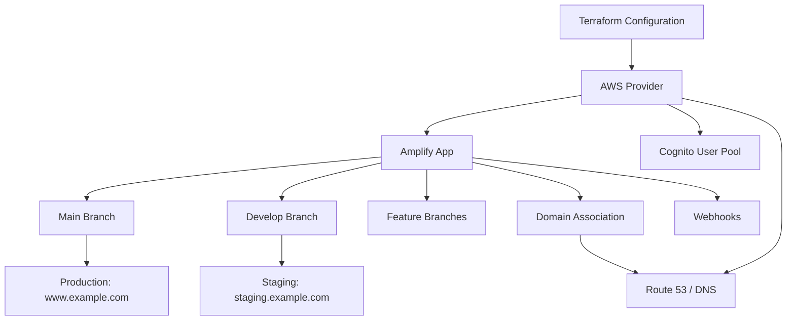

# How to Deploy Amplify Backend Resources with Terraform

Author: [nawazdhandala](https://github.com/nawazdhandala)

Tags: AWS, Amplify, Terraform, Infrastructure as Code, IaC, DevOps, CI/CD

Description: Use Terraform to provision and manage AWS Amplify backend resources including hosting, branches, and environment configuration

---

AWS Amplify is great for developers who want a managed hosting experience, but enterprise teams often need their infrastructure defined in Terraform alongside everything else. Instead of clicking through the Amplify console or using the Amplify CLI separately from your other infrastructure, you can manage Amplify resources entirely through Terraform.

This guide covers provisioning Amplify apps, branches, domain associations, webhooks, and backend environments using Terraform. By the end, your entire Amplify setup will be reproducible and version-controlled.

## Why Terraform for Amplify?

If your organization already uses Terraform for VPCs, databases, and other AWS resources, managing Amplify separately creates a gap in your infrastructure-as-code strategy. Using Terraform for Amplify gives you:

- A single source of truth for all infrastructure
- Consistent state management across resources
- Drift detection and automated reconciliation
- The ability to create identical environments with `terraform workspace`
- Integration with your existing CI/CD pipelines

## Prerequisites

You need:

- Terraform 1.0 or later installed
- AWS credentials configured
- A Git repository with your frontend application
- A GitHub personal access token (for repository connection)

## Step 1: Configure the AWS Provider

Start with your Terraform configuration:

```hcl
# providers.tf - AWS provider configuration
terraform {
  required_version = ">= 1.0"

  required_providers {
    aws = {
      source  = "hashicorp/aws"
      version = "~> 5.0"
    }
  }

  # Use S3 backend for state management
  backend "s3" {
    bucket = "my-terraform-state"
    key    = "amplify/terraform.tfstate"
    region = "us-east-1"
  }
}

provider "aws" {
  region = var.aws_region
}
```

## Step 2: Create the Amplify App Resource

The `aws_amplify_app` resource creates the Amplify application:

```hcl
# amplify.tf - Main Amplify app configuration
resource "aws_amplify_app" "main" {
  name       = var.app_name
  repository = var.repository_url

  # GitHub personal access token for repository access
  access_token = var.github_access_token

  # Build specification
  build_spec = <<-EOT
    version: 1
    frontend:
      phases:
        preBuild:
          commands:
            - npm ci
        build:
          commands:
            - npm run build
      artifacts:
        baseDirectory: build
        files:
          - '**/*'
      cache:
        paths:
          - node_modules/**/*
  EOT

  # Environment variables shared across all branches
  environment_variables = {
    NEXT_PUBLIC_APP_NAME = var.app_name
    NODE_ENV             = "production"
    _LIVE_UPDATES = jsonencode([
      {
        pkg     = "node"
        type    = "nvm"
        version = "18"
      }
    ])
  }

  # Enable branch auto-detection
  enable_branch_auto_build = true

  # Auto-detect framework
  platform = "WEB_COMPUTE"

  # Custom rewrite rules
  custom_rule {
    source = "/<*>"
    status = "200"
    target = "/index.html"
  }

  custom_rule {
    source = "</^[^.]+$|\\.(?!(css|gif|ico|jpg|js|png|txt|svg|woff|woff2|ttf|map|json|webp)$)([^.]+$)/>"
    status = "200"
    target = "/index.html"
  }

  tags = var.tags
}
```

## Step 3: Configure Branches

Define each branch deployment as a Terraform resource:

```hcl
# branches.tf - Branch configurations

# Production branch
resource "aws_amplify_branch" "main" {
  app_id      = aws_amplify_app.main.id
  branch_name = "main"

  # Production-specific settings
  framework = "Next.js - SSR"
  stage     = "PRODUCTION"

  environment_variables = {
    API_URL      = var.production_api_url
    DATABASE_URL = var.production_database_url
  }

  # Enable performance mode for production
  enable_performance_mode = true

  tags = merge(var.tags, {
    Environment = "production"
  })
}

# Staging branch
resource "aws_amplify_branch" "develop" {
  app_id      = aws_amplify_app.main.id
  branch_name = "develop"

  framework = "Next.js - SSR"
  stage     = "DEVELOPMENT"

  environment_variables = {
    API_URL      = var.staging_api_url
    DATABASE_URL = var.staging_database_url
  }

  # Password protect staging
  enable_basic_auth      = true
  basic_auth_credentials = base64encode("${var.staging_username}:${var.staging_password}")

  tags = merge(var.tags, {
    Environment = "staging"
  })
}

# Feature branch pattern
resource "aws_amplify_branch" "feature" {
  for_each = toset(var.feature_branches)

  app_id      = aws_amplify_app.main.id
  branch_name = each.value

  framework = "Next.js - SSR"
  stage     = "DEVELOPMENT"

  environment_variables = {
    API_URL      = var.dev_api_url
    DATABASE_URL = var.dev_database_url
  }

  enable_basic_auth      = true
  basic_auth_credentials = base64encode("${var.dev_username}:${var.dev_password}")
}
```

## Step 4: Configure Custom Domain

Set up a custom domain with SSL:

```hcl
# domain.tf - Custom domain configuration
resource "aws_amplify_domain_association" "main" {
  app_id      = aws_amplify_app.main.id
  domain_name = var.domain_name

  # Map the production branch to the apex domain
  sub_domain {
    branch_name = aws_amplify_branch.main.branch_name
    prefix      = ""
  }

  # Map the production branch to www subdomain
  sub_domain {
    branch_name = aws_amplify_branch.main.branch_name
    prefix      = "www"
  }

  # Map the staging branch to a subdomain
  sub_domain {
    branch_name = aws_amplify_branch.develop.branch_name
    prefix      = "staging"
  }

  # Wait for SSL certificate verification
  wait_for_verification = true
}
```

After applying this, you need to add the CNAME records to your DNS provider. Terraform outputs the verification records:

```hcl
# outputs.tf - DNS records needed
output "domain_verification_records" {
  description = "DNS records to add for domain verification"
  value       = aws_amplify_domain_association.main.certificate_verification_dns_record
}

output "subdomain_records" {
  description = "DNS records for subdomains"
  value = {
    for sd in aws_amplify_domain_association.main.sub_domain :
    sd.prefix => sd.dns_record
  }
}
```

## Step 5: Set Up Webhooks

Create webhooks for triggering builds from external systems:

```hcl
# webhooks.tf - Build trigger webhooks
resource "aws_amplify_webhook" "main" {
  app_id      = aws_amplify_app.main.id
  branch_name = aws_amplify_branch.main.branch_name
  description = "Production build trigger"
}

resource "aws_amplify_webhook" "develop" {
  app_id      = aws_amplify_app.main.id
  branch_name = aws_amplify_branch.develop.branch_name
  description = "Staging build trigger"
}

output "webhook_urls" {
  description = "Webhook URLs for triggering builds"
  value = {
    production = aws_amplify_webhook.main.url
    staging    = aws_amplify_webhook.develop.url
  }
  sensitive = true
}
```

## Step 6: Add Backend Environment Resources

If your Amplify app needs backend resources (Cognito, AppSync, DynamoDB), define them alongside the Amplify app:

```hcl
# backend.tf - Backend resources for Amplify

# Cognito User Pool
resource "aws_cognito_user_pool" "main" {
  name = "${var.app_name}-users"

  password_policy {
    minimum_length    = 8
    require_lowercase = true
    require_numbers   = true
    require_symbols   = false
    require_uppercase = true
  }

  auto_verified_attributes = ["email"]

  schema {
    attribute_data_type = "String"
    name                = "email"
    required            = true
    mutable             = true
  }
}

resource "aws_cognito_user_pool_client" "main" {
  name         = "${var.app_name}-client"
  user_pool_id = aws_cognito_user_pool.main.id

  explicit_auth_flows = [
    "ALLOW_USER_SRP_AUTH",
    "ALLOW_REFRESH_TOKEN_AUTH",
  ]
}

# Pass Cognito IDs to Amplify as environment variables
resource "aws_amplify_app" "main" {
  # ... existing configuration ...

  environment_variables = {
    NEXT_PUBLIC_USER_POOL_ID     = aws_cognito_user_pool.main.id
    NEXT_PUBLIC_USER_POOL_CLIENT = aws_cognito_user_pool_client.main.id
  }
}
```

## Step 7: Define Variables

```hcl
# variables.tf - Input variables
variable "aws_region" {
  description = "AWS region"
  type        = string
  default     = "us-east-1"
}

variable "app_name" {
  description = "Name of the Amplify application"
  type        = string
}

variable "repository_url" {
  description = "GitHub repository URL"
  type        = string
}

variable "github_access_token" {
  description = "GitHub personal access token"
  type        = string
  sensitive   = true
}

variable "domain_name" {
  description = "Custom domain name"
  type        = string
}

variable "production_api_url" {
  description = "Production API URL"
  type        = string
}

variable "production_database_url" {
  description = "Production database URL"
  type        = string
  sensitive   = true
}

variable "staging_api_url" {
  description = "Staging API URL"
  type        = string
}

variable "staging_database_url" {
  description = "Staging database URL"
  type        = string
  sensitive   = true
}

variable "tags" {
  description = "Resource tags"
  type        = map(string)
  default     = {}
}
```

## Step 8: Deploy with Terraform

```bash
# Initialize Terraform
terraform init

# Preview changes
terraform plan -var-file="production.tfvars"

# Apply changes
terraform apply -var-file="production.tfvars"
```

## Architecture Diagram



## CI/CD Integration

Add Terraform to your CI/CD pipeline so infrastructure changes are applied automatically:

```yaml
# .github/workflows/terraform.yml
name: Terraform
on:
  push:
    branches: [main]
    paths: ['terraform/**']

jobs:
  apply:
    runs-on: ubuntu-latest
    steps:
      - uses: actions/checkout@v4
      - uses: hashicorp/setup-terraform@v3

      - name: Terraform Init
        run: terraform init
        working-directory: terraform/

      - name: Terraform Apply
        run: terraform apply -auto-approve -var-file="production.tfvars"
        working-directory: terraform/
        env:
          TF_VAR_github_access_token: ${{ secrets.GITHUB_TOKEN }}
```

## Common Issues

**State conflicts**: If you created Amplify resources through the console first, import them into Terraform state before managing them:

```bash
terraform import aws_amplify_app.main d1234abcde
terraform import aws_amplify_branch.main d1234abcde/main
```

**Access token rotation**: GitHub access tokens expire. Use a GitHub App installation token instead for longer-lived credentials.

**Domain verification timeout**: SSL certificate verification can take up to 48 hours. Set `wait_for_verification = false` initially and verify separately.

For related infrastructure-as-code patterns, see our guide on [building a full-stack app with Amplify Gen 2](https://oneuptime.com/blog/post/build-a-full-stack-app-with-amplify-gen-2/view).

## Wrapping Up

Managing Amplify through Terraform brings your frontend hosting into the same infrastructure-as-code workflow as the rest of your AWS resources. You get reproducible environments, drift detection, and the ability to spin up identical staging environments with a single `terraform apply`. For teams that already live in Terraform, this eliminates the last piece of manual console configuration.
