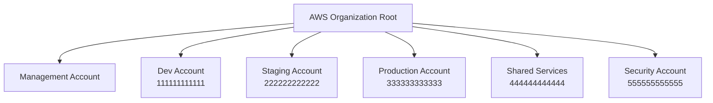

# How to Deploy CDK Apps to Multiple AWS Accounts and Regions

Author: [nawazdhandala](https://github.com/nawazdhandala)

Tags: AWS, CDK, Multi-Account, DevOps

Description: Learn strategies for deploying CDK applications across multiple AWS accounts and regions, including cross-account bootstrapping, trust policies, and pipeline-based deployments.

---

Real-world AWS setups don't use a single account. You've got separate accounts for dev, staging, and production at minimum, and often separate accounts for security, logging, and shared services. Deploying CDK apps across these accounts - and sometimes across multiple regions - requires some extra setup, but CDK handles it well once you understand the pieces.

## Why Multiple Accounts?

Before diving into the how, let's clarify the why. Multiple AWS accounts give you blast radius isolation (a runaway process in dev can't affect production), independent billing, separate IAM boundaries, and easier compliance. AWS Organizations makes managing many accounts straightforward.

A typical account structure looks like this.



## Bootstrapping Multiple Accounts

CDK bootstrap must be run in each account/region combination you want to deploy to. When deploying from a CI/CD pipeline in one account to target accounts, you need to set up trust relationships during bootstrapping.

```bash
# Bootstrap the deployment account (where your pipeline runs)
cdk bootstrap aws://444444444444/us-east-1

# Bootstrap target accounts with trust to the deployment account
cdk bootstrap aws://111111111111/us-east-1 \
  --trust 444444444444 \
  --cloudformation-execution-policies arn:aws:iam::aws:policy/AdministratorAccess

cdk bootstrap aws://222222222222/us-east-1 \
  --trust 444444444444 \
  --cloudformation-execution-policies arn:aws:iam::aws:policy/AdministratorAccess

cdk bootstrap aws://333333333333/us-west-2 \
  --trust 444444444444 \
  --cloudformation-execution-policies arn:aws:iam::aws:policy/AdministratorAccess
```

The `--trust` flag tells the target account's CDK bootstrap stack to allow the specified account to assume the deployment role. The `--cloudformation-execution-policies` flag controls what CloudFormation can do in the target account. For production, you should use a more restrictive policy than AdministratorAccess.

```bash
# Bootstrap with a custom execution policy for production
cdk bootstrap aws://333333333333/us-west-2 \
  --trust 444444444444 \
  --cloudformation-execution-policies arn:aws:iam::333333333333:policy/CDKDeploymentPolicy \
  --qualifier prod
```

## Defining Multi-Account Environments

In your CDK app, define environments for each account/region combination.

```typescript
// bin/app.ts - Multi-account deployment configuration
import * as cdk from 'aws-cdk-lib';

// Define account/region pairs
const accounts = {
  dev: { account: '111111111111', region: 'us-east-1' },
  staging: { account: '222222222222', region: 'us-east-1' },
  production: { account: '333333333333', region: 'us-west-2' },
  // Production in EU for data residency requirements
  productionEu: { account: '333333333333', region: 'eu-west-1' },
};

const app = new cdk.App();

// Deploy to dev
new ApplicationStack(app, 'Dev-Application', {
  env: accounts.dev,
  stageName: 'dev',
  instanceSize: 'small',
  enableAlarming: false,
});

// Deploy to staging
new ApplicationStack(app, 'Staging-Application', {
  env: accounts.staging,
  stageName: 'staging',
  instanceSize: 'medium',
  enableAlarming: true,
});

// Deploy to production (US)
new ApplicationStack(app, 'Prod-US-Application', {
  env: accounts.production,
  stageName: 'production',
  instanceSize: 'xlarge',
  enableAlarming: true,
});

// Deploy to production (EU)
new ApplicationStack(app, 'Prod-EU-Application', {
  env: accounts.productionEu,
  stageName: 'production',
  instanceSize: 'xlarge',
  enableAlarming: true,
});
```

## Cross-Account Resource Access

Sometimes resources in one account need to access resources in another. For example, a Lambda in the dev account reading from an S3 bucket in a shared services account.

```typescript
// In the shared services account - export bucket ARN
export class SharedStorageStack extends cdk.Stack {
  constructor(scope: Construct, id: string, props?: cdk.StackProps) {
    super(scope, id, props);

    const sharedBucket = new s3.Bucket(this, 'SharedBucket', {
      bucketName: 'mycompany-shared-artifacts',
    });

    // Allow cross-account access via bucket policy
    sharedBucket.addToResourcePolicy(new iam.PolicyStatement({
      effect: iam.Effect.ALLOW,
      principals: [
        new iam.AccountPrincipal('111111111111'),  // Dev
        new iam.AccountPrincipal('222222222222'),  // Staging
        new iam.AccountPrincipal('333333333333'),  // Production
      ],
      actions: ['s3:GetObject', 's3:ListBucket'],
      resources: [
        sharedBucket.bucketArn,
        `${sharedBucket.bucketArn}/*`,
      ],
    }));

    // Output the bucket ARN for other accounts to reference
    new cdk.CfnOutput(this, 'SharedBucketArn', {
      value: sharedBucket.bucketArn,
      exportName: 'SharedArtifactsBucketArn',
    });
  }
}
```

In the consuming account, reference the shared bucket by ARN.

```typescript
// In the dev account - reference the shared bucket
export class DevApplicationStack extends cdk.Stack {
  constructor(scope: Construct, id: string, props?: cdk.StackProps) {
    super(scope, id, props);

    // Import the shared bucket by ARN
    const sharedBucket = s3.Bucket.fromBucketArn(
      this, 'SharedBucket',
      'arn:aws:s3:::mycompany-shared-artifacts'
    );

    const myFunction = new lambda.Function(this, 'MyFunction', {
      // ... function config
    });

    // Grant read access - CDK adds the IAM policy to the function's role
    sharedBucket.grantRead(myFunction);
  }
}
```

## Multi-Region Deployments

For multi-region deployments, the main considerations are region-specific resources (like certificates in us-east-1 for CloudFront) and data replication.

```typescript
// Deploy the same app to multiple regions
const regions = ['us-east-1', 'us-west-2', 'eu-west-1'];

for (const region of regions) {
  new ApplicationStack(app, `App-${region}`, {
    env: { account: '333333333333', region },
    stageName: 'production',
  });
}
```

For resources that must be in a specific region (like ACM certificates for CloudFront), create a separate stack in that region.

```typescript
// Certificate must be in us-east-1 for CloudFront
const certStack = new CertificateStack(app, 'Certificate', {
  env: { account: '333333333333', region: 'us-east-1' },
  domainName: 'app.example.com',
});

// Main application can be in any region
const appStack = new ApplicationStack(app, 'Application', {
  env: { account: '333333333333', region: 'eu-west-1' },
  certificateArn: certStack.certificate.certificateArn,
});
```

## Using CDK Pipelines for Multi-Account Deployment

CDK Pipelines is the recommended way to deploy across multiple accounts. It creates a CodePipeline that automatically deploys your stacks through stages.

```typescript
// A CDK Pipeline that deploys across accounts
import { CodePipeline, CodePipelineSource, ShellStep } from 'aws-cdk-lib/pipelines';

const pipeline = new CodePipeline(this, 'Pipeline', {
  pipelineName: 'MyAppPipeline',
  synth: new ShellStep('Synth', {
    input: CodePipelineSource.gitHub('myorg/myrepo', 'main'),
    commands: [
      'npm ci',
      'npm run build',
      'npx cdk synth',
    ],
  }),
  crossAccountKeys: true,  // Enable cross-account deployments
});

// Add deployment stages
pipeline.addStage(new DeployStage(this, 'Dev', {
  env: accounts.dev,
}));

pipeline.addStage(new DeployStage(this, 'Staging', {
  env: accounts.staging,
}), {
  pre: [
    // Run integration tests before deploying to staging
    new ShellStep('IntegrationTests', {
      commands: ['npm run test:integration'],
    }),
  ],
});

pipeline.addStage(new DeployStage(this, 'Production', {
  env: accounts.production,
}), {
  pre: [
    // Manual approval before production
    new ManualApprovalStep('ApproveProduction'),
  ],
});
```

## Deployment Commands

When deploying from the CLI to multiple accounts, use AWS profiles.

```bash
# Deploy to dev using the dev profile
cdk deploy 'Dev-*' --profile dev-account

# Deploy to production using the production profile
cdk deploy 'Prod-*' --profile prod-account

# Deploy all stacks (if you have cross-account roles configured)
cdk deploy --all
```

Multi-account CDK gets easier once the bootstrapping and trust relationships are in place. The initial setup is the hardest part. For a deeper dive into automated deployment pipelines, check out the post on [CDK Pipelines](https://oneuptime.com/blog/post/2026-02-12-cdk-pipelines-automated-deployments/view). And for organizing the stacks within those accounts, see [CDK stacks and environments](https://oneuptime.com/blog/post/2026-02-12-cdk-stacks-and-environments/view).
