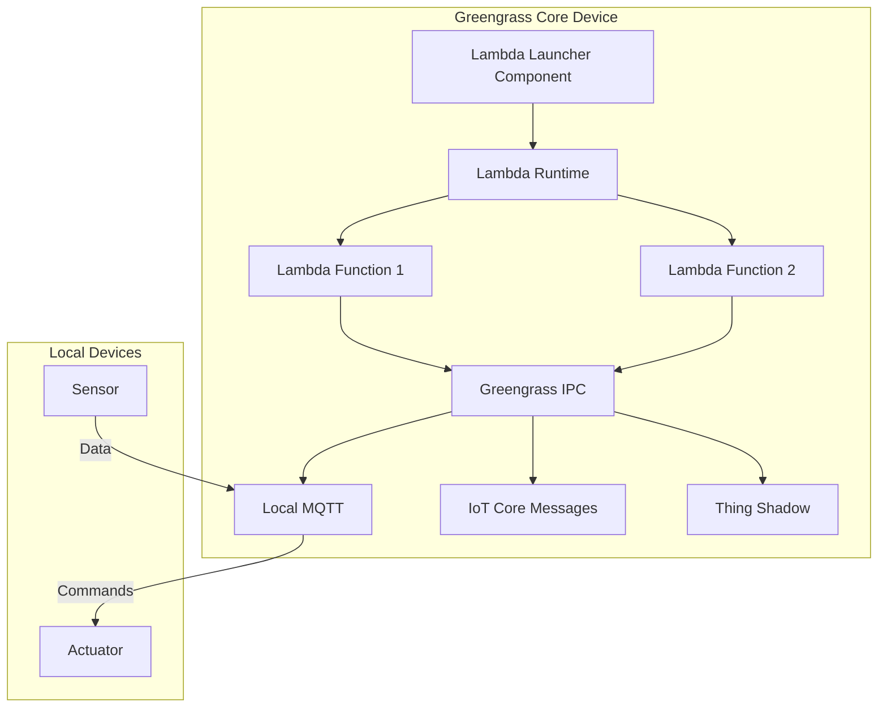

# How to Deploy Lambda Functions to Edge with IoT Greengrass

Author: [nawazdhandala](https://github.com/nawazdhandala)

Tags: AWS, IoT Greengrass, Lambda, Edge Computing, Serverless, IoT

Description: Deploy AWS Lambda functions to edge devices using IoT Greengrass v2 for local data processing, filtering, and real-time inference without cloud latency

---

Lambda functions are not just for the cloud. With IoT Greengrass, you can deploy Lambda functions directly to edge devices, where they run locally with access to device hardware, local network resources, and inter-process communication. This gives you the familiar Lambda programming model at the edge, with the ability to process data locally before sending filtered results to the cloud.

This guide covers how to create Lambda functions for Greengrass, deploy them to edge devices, and connect them to local event sources.

## Why Run Lambda at the Edge?

Running Lambda on edge devices makes sense when you need:

- **Low latency**: Process sensor data in milliseconds, not the hundreds of milliseconds a cloud round-trip takes
- **Bandwidth reduction**: Filter, aggregate, or compress data locally before sending to the cloud
- **Offline operation**: Continue running even when connectivity is intermittent
- **Local integration**: Access local hardware, databases, or network resources
- **Privacy**: Process sensitive data locally without sending it to the cloud

## How Lambda Works in Greengrass

In Greengrass v2, Lambda functions run as components. The `aws.greengrass.LambdaLauncher` component manages the Lambda runtime on the device.



## Step 1: Create a Lambda Function

Write your Lambda function as you normally would, but with awareness that it will run on an edge device.

### Python Lambda for Edge Processing

```python
# lambda_function.py - Edge data processor
import json
import logging
import os
import time

logger = logging.getLogger()
logger.setLevel(logging.INFO)

# Thresholds for local alerting
TEMP_THRESHOLD = float(os.environ.get('TEMP_THRESHOLD', '35'))
HUMIDITY_THRESHOLD = float(os.environ.get('HUMIDITY_THRESHOLD', '80'))

# Track state for windowed aggregation
readings_buffer = []
BUFFER_SIZE = 10

def lambda_handler(event, context):
    """
    Process sensor data at the edge.

    This function runs on the Greengrass device and:
    1. Validates incoming sensor data
    2. Computes rolling averages
    3. Publishes alerts for threshold violations
    4. Batches data before sending to the cloud
    """
    logger.info(f"Received event: {json.dumps(event)}")

    # Parse the incoming sensor data
    temperature = event.get('temperature')
    humidity = event.get('humidity')
    device_id = event.get('device_id', 'unknown')
    timestamp = event.get('timestamp', int(time.time() * 1000))

    if temperature is None:
        logger.warning("Missing temperature in event")
        return

    # Add to rolling buffer
    readings_buffer.append({
        'temperature': temperature,
        'humidity': humidity,
        'timestamp': timestamp
    })

    # Keep only the last N readings
    while len(readings_buffer) > BUFFER_SIZE:
        readings_buffer.pop(0)

    # Calculate rolling average
    avg_temp = sum(r['temperature'] for r in readings_buffer) / len(readings_buffer)
    avg_humidity = sum(r['humidity'] for r in readings_buffer if r['humidity']) / max(1, sum(1 for r in readings_buffer if r['humidity']))

    # Check for alert conditions
    alerts = []
    if temperature > TEMP_THRESHOLD:
        alerts.append({
            'type': 'HIGH_TEMPERATURE',
            'value': temperature,
            'threshold': TEMP_THRESHOLD,
            'severity': 'HIGH' if temperature > TEMP_THRESHOLD + 10 else 'MEDIUM'
        })

    if humidity and humidity > HUMIDITY_THRESHOLD:
        alerts.append({
            'type': 'HIGH_HUMIDITY',
            'value': humidity,
            'threshold': HUMIDITY_THRESHOLD,
            'severity': 'MEDIUM'
        })

    # Build the processed result
    result = {
        'device_id': device_id,
        'timestamp': timestamp,
        'temperature': temperature,
        'humidity': humidity,
        'avg_temperature': round(avg_temp, 1),
        'avg_humidity': round(avg_humidity, 1),
        'readings_in_window': len(readings_buffer),
        'alerts': alerts,
        'processed_at_edge': True
    }

    logger.info(f"Processed result: {json.dumps(result)}")
    return result
```

### Package and Deploy to AWS Lambda

```bash
# Package the function
zip -j function.zip lambda_function.py

# Create the Lambda function in AWS
aws lambda create-function \
  --function-name EdgeSensorProcessor \
  --runtime python3.11 \
  --handler lambda_function.lambda_handler \
  --zip-file fileb://function.zip \
  --role arn:aws:iam::123456789:role/LambdaEdgeRole \
  --timeout 25 \
  --memory-size 128 \
  --environment "Variables={TEMP_THRESHOLD=35,HUMIDITY_THRESHOLD=80}"

# Publish a version (Greengrass requires a published version, not $LATEST)
aws lambda publish-version \
  --function-name EdgeSensorProcessor \
  --description "v1 - edge sensor processing"
```

### Create an Alias for the Published Version

```bash
# Create an alias pointing to the published version
aws lambda create-alias \
  --function-name EdgeSensorProcessor \
  --name edge \
  --function-version 1
```

## Step 2: Create the Greengrass Component from Lambda

In Greengrass v2, you wrap the Lambda function in a component definition.

```bash
# Create a Greengrass component from the Lambda function
aws greengrassv2 create-component-version \
  --inline-recipe '{
    "RecipeFormatVersion": "2020-01-25",
    "ComponentName": "com.example.EdgeSensorProcessor",
    "ComponentVersion": "1.0.0",
    "ComponentType": "aws.greengrass.lambda",
    "ComponentDependencies": {
      "aws.greengrass.LambdaLauncher": {
        "VersionRequirement": ">=2.0.0"
      },
      "aws.greengrass.LambdaRuntimes": {
        "VersionRequirement": ">=2.0.0"
      },
      "aws.greengrass.TokenExchangeService": {
        "VersionRequirement": ">=2.0.0"
      }
    },
    "ComponentConfiguration": {
      "DefaultConfiguration": {
        "lambdaExecutionParameters": {
          "EnvironmentVariables": {
            "TEMP_THRESHOLD": "35",
            "HUMIDITY_THRESHOLD": "80"
          }
        },
        "containerMode": "NoContainer",
        "inputPayloadEncodingType": "json",
        "timeoutInSeconds": 25,
        "maxIdleTimeInSeconds": 60,
        "maxInstancesCount": 5,
        "pinned": true,
        "pubsubTopics": {
          "0": {
            "topic": "devices/+/raw-telemetry",
            "type": "IOT_CORE"
          }
        }
      }
    },
    "ComponentSource": "arn:aws:lambda:us-east-1:123456789:function:EdgeSensorProcessor:1"
  }'
```

Key configuration options:

- **containerMode**: `NoContainer` runs the function as a process. Use `GreengrassContainer` for isolation.
- **pinned**: `true` means the function runs continuously (long-lived). `false` means it is invoked on demand.
- **maxInstancesCount**: How many concurrent instances can run.
- **pubsubTopics**: MQTT topics that trigger the function.

## Step 3: Deploy to the Edge Device

```bash
# Deploy the Lambda component to a device
aws greengrassv2 create-deployment \
  --target-arn "arn:aws:iot:us-east-1:123456789:thing/my-greengrass-core" \
  --deployment-name "EdgeLambdaDeployment" \
  --components '{
    "com.example.EdgeSensorProcessor": {
      "componentVersion": "1.0.0",
      "configurationUpdate": {
        "merge": "{\"lambdaExecutionParameters\":{\"EnvironmentVariables\":{\"TEMP_THRESHOLD\":\"30\"}}}"
      }
    },
    "aws.greengrass.LambdaLauncher": {
      "componentVersion": "2.0.0"
    },
    "aws.greengrass.LambdaRuntimes": {
      "componentVersion": "2.0.0"
    }
  }'
```

## Step 4: Connect the Lambda to Local Event Sources

### Subscribe to Local MQTT Topics

The Lambda function can subscribe to both IoT Core topics and local topics.

```python
# Enhanced lambda with Greengrass SDK for local pub/sub
import greengrasssdk
import json
import logging

logger = logging.getLogger()
client = greengrasssdk.client('iot-data')

def lambda_handler(event, context):
    """Process sensor data and publish results."""
    # Process the incoming data
    result = process_sensor_data(event)

    # Publish filtered results to IoT Core
    client.publish(
        topic=f"devices/{event.get('device_id', 'unknown')}/processed",
        queueFullPolicy='AllOrException',
        payload=json.dumps(result)
    )

    # If there are alerts, publish to a local alert topic too
    if result.get('alerts'):
        client.publish(
            topic='local/alerts',
            queueFullPolicy='AllOrException',
            payload=json.dumps({
                'device_id': event.get('device_id'),
                'alerts': result['alerts']
            })
        )

    return result

def process_sensor_data(event):
    """Filter and enrich sensor data."""
    return {
        'device_id': event.get('device_id'),
        'temperature': event.get('temperature'),
        'processed_at_edge': True,
        'alerts': check_thresholds(event)
    }

def check_thresholds(event):
    alerts = []
    if event.get('temperature', 0) > 35:
        alerts.append({'type': 'HIGH_TEMP', 'value': event['temperature']})
    return alerts
```

### Long-Lived Lambda for Continuous Processing

For long-running processing, use a pinned Lambda function that runs continuously.

```python
# long_lived_processor.py - Runs continuously on the edge
import greengrasssdk
import json
import time
import logging

logger = logging.getLogger()
client = greengrasssdk.client('iot-data')

def lambda_handler(event, context):
    """
    Long-lived Lambda that continuously processes data.
    Called once and runs indefinitely.
    """
    logger.info("Starting long-lived edge processor")

    while True:
        try:
            # Read from local sensors, files, or APIs
            data = read_local_data()

            # Aggregate and filter
            if should_send_to_cloud(data):
                client.publish(
                    topic='edge/aggregated-data',
                    payload=json.dumps(data)
                )
                logger.info(f"Sent aggregated data to cloud")

        except Exception as e:
            logger.error(f"Processing error: {e}")

        time.sleep(30)  # Process every 30 seconds

def read_local_data():
    """Read from local data source."""
    # Replace with actual sensor reading logic
    return {'source': 'local', 'timestamp': int(time.time())}

def should_send_to_cloud(data):
    """Only send significant data to reduce bandwidth."""
    return True  # Replace with actual filtering logic

# Entry point for long-lived function
lambda_handler(None, None)
```

## Step 5: Access Local Resources

Greengrass Lambda functions can access local hardware resources like GPIO pins, serial ports, and cameras.

```python
# Access GPIO on a Raspberry Pi
import RPi.GPIO as GPIO
import greengrasssdk
import json
import time

client = greengrasssdk.client('iot-data')
LED_PIN = 18
SENSOR_PIN = 4

GPIO.setmode(GPIO.BCM)
GPIO.setup(LED_PIN, GPIO.OUT)
GPIO.setup(SENSOR_PIN, GPIO.IN)

def lambda_handler(event, context):
    """Read a GPIO sensor and control an LED."""
    # Read sensor value
    sensor_value = GPIO.input(SENSOR_PIN)

    # Control LED based on received command
    if event.get('action') == 'led_on':
        GPIO.output(LED_PIN, GPIO.HIGH)
    elif event.get('action') == 'led_off':
        GPIO.output(LED_PIN, GPIO.LOW)

    # Report sensor state
    client.publish(
        topic='devices/rpi-01/gpio',
        payload=json.dumps({
            'sensor': sensor_value,
            'led': GPIO.input(LED_PIN)
        })
    )
```

## Updating Lambda Functions

To update a Lambda function running on edge devices:

```bash
# Update the function code
aws lambda update-function-code \
  --function-name EdgeSensorProcessor \
  --zip-file fileb://updated-function.zip

# Publish a new version
aws lambda publish-version \
  --function-name EdgeSensorProcessor \
  --description "v2 - improved filtering"

# Update the Greengrass component to use the new version
aws greengrassv2 create-component-version \
  --inline-recipe '...(updated recipe pointing to version 2)...'

# Deploy the updated component
aws greengrassv2 create-deployment \
  --target-arn "arn:aws:iot:us-east-1:123456789:thinggroup/edge-devices" \
  --components '{
    "com.example.EdgeSensorProcessor": {
      "componentVersion": "2.0.0"
    }
  }'
```

## Monitoring Edge Lambda Functions

Check function execution on the device:

```bash
# View Lambda component logs on the device
sudo tail -f /greengrass/v2/logs/com.example.EdgeSensorProcessor.log

# Check component status
sudo /greengrass/v2/bin/greengrass-cli component list

# Restart a component
sudo /greengrass/v2/bin/greengrass-cli component restart \
  --names com.example.EdgeSensorProcessor
```

From the cloud, check device status:

```bash
# Check the core device status
aws greengrassv2 get-core-device \
  --core-device-thing-name my-greengrass-core

# List installed components
aws greengrassv2 list-installed-components \
  --core-device-thing-name my-greengrass-core
```

## Wrapping Up

Deploying Lambda functions to the edge with Greengrass gives you the best of both worlds - the simplicity of serverless with the benefits of local execution. Use pinned Lambda functions for continuous processing, on-demand functions for event-driven logic, and take advantage of local pub/sub for inter-component communication. Start with simple data filtering at the edge and gradually move more processing closer to your devices.

For setting up the Greengrass runtime itself, see our guide on [setting up IoT Greengrass v2 on edge devices](https://oneuptime.com/blog/post/iot-greengrass-v2-edge-devices/view). For the cloud side, see our guide on [using the IoT Core message broker with MQTT](https://oneuptime.com/blog/post/iot-core-message-broker-mqtt/view).
