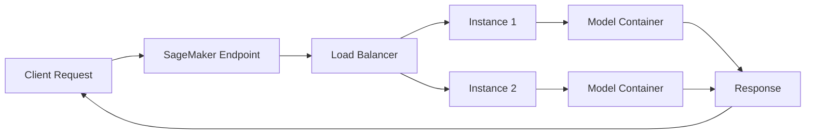

# How to Deploy a Model Endpoint with SageMaker

Author: [nawazdhandala](https://github.com/nawazdhandala)

Tags: AWS, SageMaker, Machine Learning, Model Deployment, MLOps

Description: Step-by-step guide to deploying machine learning models as real-time endpoints on Amazon SageMaker, including configuration, testing, and monitoring.

---

You've trained a model. It performs well on your validation set. Now what? The model needs to be accessible to your application, and that means deploying it as an API endpoint. Amazon SageMaker makes this straightforward - you can go from a trained model to a production endpoint in a handful of lines of code.

This guide covers the full deployment workflow: creating model artifacts, configuring endpoints, testing predictions, and managing your deployed models.

## How SageMaker Endpoints Work

When you deploy a model endpoint on SageMaker, here's what happens behind the scenes.



SageMaker provisions one or more instances, loads your model into a Docker container on each instance, and puts a load balancer in front of them. Your application sends HTTP requests to the endpoint, and SageMaker routes them to an available instance. Auto-scaling can add or remove instances based on traffic.

## Deploying Directly from a Training Job

The simplest way to deploy is right after training. If you just ran a training job with a SageMaker estimator, you can deploy the resulting model in one call.

```python
import sagemaker
from sagemaker import Session

session = Session()
role = sagemaker.get_execution_role()

# Assuming you just trained a model with xgb_estimator
# (see our training guide for the full setup)
predictor = xgb_estimator.deploy(
    initial_instance_count=1,
    instance_type='ml.m5.xlarge',
    endpoint_name='xgb-classification-endpoint',
    serializer=sagemaker.serializers.CSVSerializer(),
    deserializer=sagemaker.deserializers.JSONDeserializer()
)

print(f"Endpoint name: {predictor.endpoint_name}")
```

That's it. SageMaker creates the model, the endpoint configuration, and the endpoint itself. After a few minutes, your model is live and ready for predictions.

## Deploying a Pre-Trained Model from S3

More often, you'll want to deploy a model that was trained earlier - maybe days or weeks ago. In that case, you need to create a Model object pointing to your artifacts in S3.

```python
from sagemaker.model import Model
from sagemaker import image_uris

# Get the container image for XGBoost inference
xgb_image = image_uris.retrieve(
    framework='xgboost',
    region='us-east-1',
    version='1.7-1'
)

# Create a Model object from existing artifacts
model = Model(
    image_uri=xgb_image,
    model_data='s3://my-bucket/models/xgb-model/output/model.tar.gz',
    role=role,
    sagemaker_session=session,
    name='xgb-classification-model'
)

# Deploy the model
predictor = model.deploy(
    initial_instance_count=1,
    instance_type='ml.m5.large',
    endpoint_name='xgb-from-s3-endpoint',
    serializer=sagemaker.serializers.CSVSerializer(),
    deserializer=sagemaker.deserializers.JSONDeserializer()
)
```

## Deploying a Custom Model with Inference Code

When you need custom preprocessing or postprocessing logic, you'll want to provide your own inference script. SageMaker calls specific functions in your script to handle different parts of the request lifecycle.

Here's a custom inference script for a scikit-learn model.

```python
# inference.py - Deployed alongside your model

import joblib
import os
import json
import numpy as np

def model_fn(model_dir):
    """Load the model from the model directory."""
    model_path = os.path.join(model_dir, 'model.joblib')
    model = joblib.load(model_path)
    return model

def input_fn(request_body, request_content_type):
    """Parse the incoming request data."""
    if request_content_type == 'application/json':
        data = json.loads(request_body)
        return np.array(data['features'])
    elif request_content_type == 'text/csv':
        lines = request_body.strip().split('\n')
        return np.array([
            [float(val) for val in line.split(',')]
            for line in lines
        ])
    else:
        raise ValueError(f"Unsupported content type: {request_content_type}")

def predict_fn(input_data, model):
    """Run prediction on the parsed input data."""
    predictions = model.predict(input_data)
    probabilities = model.predict_proba(input_data)
    return {
        'predictions': predictions.tolist(),
        'probabilities': probabilities.tolist()
    }

def output_fn(prediction, response_content_type):
    """Format the prediction output."""
    if response_content_type == 'application/json':
        return json.dumps(prediction)
    raise ValueError(f"Unsupported response type: {response_content_type}")
```

Deploy this custom model like so.

```python
from sagemaker.sklearn import SKLearnModel

# Create a model with custom inference code
sklearn_model = SKLearnModel(
    model_data='s3://my-bucket/models/sklearn-model/output/model.tar.gz',
    role=role,
    entry_point='inference.py',
    source_dir='./inference_scripts',
    framework_version='1.2-1',
    py_version='py3',
    sagemaker_session=session
)

# Deploy it
predictor = sklearn_model.deploy(
    initial_instance_count=1,
    instance_type='ml.m5.large',
    endpoint_name='sklearn-custom-endpoint'
)
```

## Testing Your Endpoint

Once the endpoint is live, send it some test data to make sure everything works.

```python
import json
import boto3

# Using the SageMaker runtime client
runtime = boto3.client('sagemaker-runtime')

# Prepare a test payload
test_data = {
    'features': [[1.5, 2.3, 0.7, 4.1, 3.2, 0.9, 1.8, 2.1, 3.5, 0.4,
                   2.7, 1.1, 3.8, 0.6, 2.9, 1.4, 3.3, 0.8, 2.0, 1.6]]
}

# Invoke the endpoint
response = runtime.invoke_endpoint(
    EndpointName='sklearn-custom-endpoint',
    ContentType='application/json',
    Body=json.dumps(test_data)
)

# Parse the response
result = json.loads(response['Body'].read().decode())
print(f"Prediction: {result['predictions']}")
print(f"Probabilities: {result['probabilities']}")
```

## Configuring Auto-Scaling

For production endpoints, you don't want to manually adjust capacity. Set up auto-scaling so SageMaker adds instances when traffic increases and removes them when it drops.

```python
import boto3

# Create an auto-scaling client
asg_client = boto3.client('application-autoscaling')

# Register the endpoint variant as a scalable target
asg_client.register_scalable_target(
    ServiceNamespace='sagemaker',
    ResourceId='endpoint/xgb-classification-endpoint/variant/AllTraffic',
    ScalableDimension='sagemaker:variant:DesiredInstanceCount',
    MinCapacity=1,
    MaxCapacity=10
)

# Create a scaling policy based on invocations per instance
asg_client.put_scaling_policy(
    PolicyName='invocations-scaling-policy',
    ServiceNamespace='sagemaker',
    ResourceId='endpoint/xgb-classification-endpoint/variant/AllTraffic',
    ScalableDimension='sagemaker:variant:DesiredInstanceCount',
    PolicyType='TargetTrackingScaling',
    TargetTrackingScalingPolicyConfiguration={
        'TargetValue': 1000.0,  # Target invocations per instance per minute
        'PredefinedMetricSpecification': {
            'PredefinedMetricType': 'SageMakerVariantInvocationsPerInstance'
        },
        'ScaleInCooldown': 300,   # Wait 5 min before scaling in
        'ScaleOutCooldown': 60    # Wait 1 min before scaling out
    }
)

print("Auto-scaling configured!")
```

## Updating an Endpoint

Sometimes you need to update a running endpoint - maybe with a new model version or different instance types. SageMaker supports blue/green deployments for zero-downtime updates.

```python
from sagemaker.model import Model

# Create the new model version
new_model = Model(
    image_uri=xgb_image,
    model_data='s3://my-bucket/models/xgb-model-v2/output/model.tar.gz',
    role=role,
    sagemaker_session=session,
    name='xgb-classification-model-v2'
)

# Create a new endpoint config
new_model.create(instance_type='ml.m5.large')

client = boto3.client('sagemaker')

client.create_endpoint_config(
    EndpointConfigName='xgb-endpoint-config-v2',
    ProductionVariants=[{
        'VariantName': 'AllTraffic',
        'ModelName': 'xgb-classification-model-v2',
        'InitialInstanceCount': 2,
        'InstanceType': 'ml.m5.large',
        'InitialVariantWeight': 1.0
    }]
)

# Update the endpoint - SageMaker does a rolling deployment
client.update_endpoint(
    EndpointName='xgb-classification-endpoint',
    EndpointConfigName='xgb-endpoint-config-v2'
)
```

## Cleaning Up

Endpoints incur charges as long as they're running. Always clean up endpoints you no longer need.

```python
# Delete the endpoint, endpoint config, and model
predictor.delete_endpoint(delete_endpoint_config=True)

# Or use the boto3 client for more control
client = boto3.client('sagemaker')
client.delete_endpoint(EndpointName='xgb-classification-endpoint')
client.delete_endpoint_config(EndpointConfigName='xgb-endpoint-config-v2')
client.delete_model(ModelName='xgb-classification-model-v2')
```

## Monitoring Deployed Endpoints

Production endpoints need monitoring. Track latency, error rates, and invocation counts. SageMaker publishes metrics to CloudWatch, and you can pipe those into [OneUptime](https://oneuptime.com/blog/post/2026-02-13-aws-cloudwatch-alerting-best-practices/view) for unified observability across your entire stack.

Key metrics to watch:

- **Invocations** - Total number of requests
- **ModelLatency** - Time the model takes to respond
- **OverheadLatency** - Time SageMaker adds on top of model latency
- **Invocation4XXErrors** and **Invocation5XXErrors** - Client and server errors

## Wrapping Up

Deploying models with SageMaker is one of those things that's simple in concept but has a lot of depth when you need it. Start with the basic `.deploy()` call for quick experiments, and layer on custom inference code, auto-scaling, and blue/green deployments as your requirements grow. If you're considering alternatives to real-time endpoints, check out our guide on [SageMaker inference options](https://oneuptime.com/blog/post/2026-02-12-sagemaker-real-time-vs-batch-vs-async-inference/view) to see what fits your use case best.
