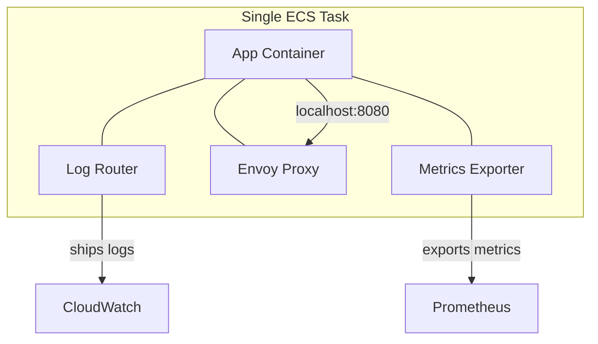
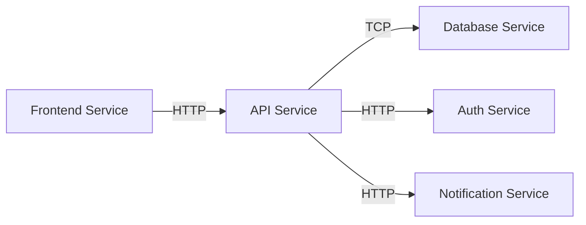

# How to Deploy Multi-Container Applications on ECS

Author: [nawazdhandala](https://github.com/nawazdhandala)

Tags: AWS, ECS, Docker, Microservices, Containers

Description: Learn how to design and deploy multi-container applications on Amazon ECS, including task definitions, networking, shared volumes, and service configurations.

---

Most real-world applications aren't just a single container. You've got your main application, maybe a reverse proxy in front of it, a log shipper on the side, a cache warmer running periodically, and a metrics exporter collecting data. Orchestrating all of these containers so they work together reliably is what ECS does well - if you set it up correctly.

This guide covers the patterns and practical steps for deploying multi-container applications on ECS, from task definitions to service configurations.

## Multi-Container Architecture Patterns

There are two main ways to run multiple containers on ECS:

### Pattern 1: Multiple Containers in One Task

Containers that need to share resources (network, storage, lifecycle) go in the same task definition. This is the sidecar pattern.



Use this when containers need to:
- Communicate over localhost
- Share files via volumes
- Start and stop together
- Share the same lifecycle

### Pattern 2: Separate Tasks in Separate Services

Containers that are independently scalable and have different lifecycles go in separate task definitions and services.



Use this when containers need to:
- Scale independently
- Deploy independently
- Have different resource requirements
- Tolerate independent failures

Most multi-container apps use a mix of both patterns. Each microservice is its own ECS service, but individual services may include sidecars in their task definitions.

## Building a Multi-Container Task Definition

Let's build a complete task definition for a web application with an Nginx reverse proxy, the app server, and a Fluent Bit log router.

```json
{
  "family": "webapp-full",
  "networkMode": "awsvpc",
  "requiresCompatibilities": ["FARGATE"],
  "cpu": "1024",
  "memory": "2048",
  "executionRoleArn": "arn:aws:iam::123456789012:role/ecsTaskExecutionRole",
  "taskRoleArn": "arn:aws:iam::123456789012:role/webappTaskRole",
  "volumes": [
    {
      "name": "nginx-config"
    },
    {
      "name": "static-assets"
    }
  ],
  "containerDefinitions": [
    {
      "name": "nginx",
      "image": "my-registry/nginx-proxy:latest",
      "essential": true,
      "portMappings": [
        {"containerPort": 80, "protocol": "tcp"}
      ],
      "mountPoints": [
        {"sourceVolume": "nginx-config", "containerPath": "/etc/nginx/conf.d"},
        {"sourceVolume": "static-assets", "containerPath": "/usr/share/nginx/html", "readOnly": true}
      ],
      "dependsOn": [
        {"containerName": "app", "condition": "HEALTHY"}
      ],
      "memory": 256,
      "logConfiguration": {
        "logDriver": "awsfirelens",
        "options": {
          "Name": "cloudwatch",
          "region": "us-east-1",
          "log_group_name": "/ecs/webapp/nginx",
          "log_stream_prefix": "nginx-"
        }
      }
    },
    {
      "name": "app",
      "image": "my-registry/webapp:latest",
      "essential": true,
      "healthCheck": {
        "command": ["CMD-SHELL", "curl -f http://localhost:3000/health || exit 1"],
        "interval": 10,
        "timeout": 5,
        "retries": 3,
        "startPeriod": 30
      },
      "mountPoints": [
        {"sourceVolume": "static-assets", "containerPath": "/app/public"}
      ],
      "environment": [
        {"name": "NODE_ENV", "value": "production"},
        {"name": "PORT", "value": "3000"}
      ],
      "secrets": [
        {
          "name": "DATABASE_URL",
          "valueFrom": "arn:aws:secretsmanager:us-east-1:123456789012:secret:webapp/db-url"
        }
      ],
      "memory": 1024,
      "logConfiguration": {
        "logDriver": "awsfirelens",
        "options": {
          "Name": "cloudwatch",
          "region": "us-east-1",
          "log_group_name": "/ecs/webapp/app",
          "log_stream_prefix": "app-"
        }
      }
    },
    {
      "name": "log-router",
      "image": "amazon/aws-for-fluent-bit:latest",
      "essential": true,
      "firelensConfiguration": {
        "type": "fluentbit"
      },
      "memory": 128
    }
  ]
}
```

Let's break down the important decisions in this definition.

### Container Dependencies

Nginx depends on the app container being healthy. We use `dependsOn` with the `HEALTHY` condition so that Nginx only starts accepting traffic once the app is ready:

```json
"dependsOn": [
  {"containerName": "app", "condition": "HEALTHY"}
]
```

The app container has a health check that validates it's responding on port 3000. Nginx won't start until this check passes.

### Shared Volumes

Two volumes connect the containers:

1. **nginx-config** - Could be populated by an init container with dynamic Nginx configuration
2. **static-assets** - The app container writes static files, and Nginx serves them directly

This is a common pattern: let the application generate or compile static assets, and let Nginx serve them without proxying through the application server.

### Memory Allocation

Total task memory is 2048 MB, split as:
- Nginx: 256 MB (hard limit)
- App: 1024 MB (hard limit)
- Log router: 128 MB (hard limit)
- Remaining ~640 MB: Available as buffer

This leaves some headroom. On Fargate, you want the sum of container hard limits to be somewhat less than the task limit to avoid OOM issues during spikes.

## Deploying Multiple Services

For a complete application, you'll typically have multiple ECS services that communicate with each other. Here's how to set that up.

### Service Discovery with Cloud Map

ECS integrates with AWS Cloud Map for service discovery. Each service registers itself and can be found by other services via DNS:

```bash
# Create a Cloud Map namespace
aws servicediscovery create-private-dns-namespace \
  --name app.local \
  --vpc vpc-abc123

# Create an ECS service with service discovery
aws ecs create-service \
  --cluster production \
  --service-name api-service \
  --task-definition api-service:5 \
  --desired-count 3 \
  --launch-type FARGATE \
  --network-configuration '{
    "awsvpcConfiguration": {
      "subnets": ["subnet-abc123", "subnet-def456"],
      "securityGroups": ["sg-abc123"],
      "assignPublicIp": "DISABLED"
    }
  }' \
  --service-registries '[
    {
      "registryArn": "arn:aws:servicediscovery:us-east-1:123456789012:service/srv-abc123"
    }
  ]'
```

Now other services can reach the API at `api-service.app.local`:

```python
# In another service, connect to the API via service discovery
import requests

# DNS resolves to the running tasks
response = requests.get("http://api-service.app.local:8080/api/users")
```

### Load Balancer Configuration

For services that receive external traffic, attach an Application Load Balancer:

```bash
# Create the service with a load balancer
aws ecs create-service \
  --cluster production \
  --service-name frontend \
  --task-definition frontend:3 \
  --desired-count 2 \
  --launch-type FARGATE \
  --load-balancers '[
    {
      "targetGroupArn": "arn:aws:elasticloadbalancing:us-east-1:123456789012:targetgroup/frontend-tg/abc123",
      "containerName": "nginx",
      "containerPort": 80
    }
  ]' \
  --network-configuration '{
    "awsvpcConfiguration": {
      "subnets": ["subnet-abc123", "subnet-def456"],
      "securityGroups": ["sg-abc123"],
      "assignPublicIp": "DISABLED"
    }
  }'
```

Notice that the load balancer targets the `nginx` container specifically, not the app container. This is because Nginx is the public-facing container in our multi-container task.

## Inter-Service Communication

For service-to-service communication, you have several options:

1. **Service Discovery DNS** - Simple DNS-based discovery via Cloud Map
2. **Internal ALBs** - For HTTP-based services that need load balancing
3. **ECS Service Connect** - ECS's newer service mesh-like feature
4. **App Mesh** - Full service mesh with Envoy proxies

For most applications, Cloud Map DNS is sufficient. It's simple, reliable, and doesn't add overhead. See our guide on [ECS Service Connect](https://oneuptime.com/blog/post/2026-02-12-ecs-service-connect-service-to-service-communication/view) for the more advanced option.

## Managing Configuration Across Services

When you have multiple services, managing configuration becomes important. Use a combination of:

**Environment variables** for non-sensitive configuration:
```json
"environment": [
  {"name": "API_URL", "value": "http://api-service.app.local:8080"},
  {"name": "LOG_LEVEL", "value": "info"}
]
```

**Secrets Manager** for sensitive values:
```json
"secrets": [
  {"name": "DB_PASSWORD", "valueFrom": "arn:aws:secretsmanager:us-east-1:123456789012:secret:db-password"}
]
```

**SSM Parameter Store** for shared configuration:
```json
"secrets": [
  {"name": "FEATURE_FLAGS", "valueFrom": "arn:aws:ssm:us-east-1:123456789012:parameter/app/feature-flags"}
]
```

## Deployment Strategy

When deploying multi-container applications, order matters. Database migrations should run before the app deploys. Shared libraries should be updated before services that depend on them.

A typical deployment order for a full-stack application:

1. Deploy infrastructure changes (VPC, security groups, etc.)
2. Run database migrations (use an ECS task, not a service)
3. Deploy backend services
4. Deploy frontend services

Use CodePipeline or your CI/CD tool to orchestrate this sequence, with health checks between each stage to confirm the deployment succeeded before proceeding.

## Wrapping Up

Multi-container applications on ECS are about choosing the right granularity for your task definitions and the right communication patterns between services. Put tightly coupled containers in the same task, keep independently scalable services separate, and use service discovery to connect everything together.

Start simple - one service with maybe a log router sidecar - and expand as your architecture grows. The patterns covered here scale well from a handful of services to dozens. For infrastructure-as-code approaches to managing these deployments, check out our guides on [ECS with CloudFormation](https://oneuptime.com/blog/post/2026-02-12-ecs-with-cloudformation/view) and [ECS with AWS CDK](https://oneuptime.com/blog/post/2026-02-12-ecs-with-aws-cdk/view).
