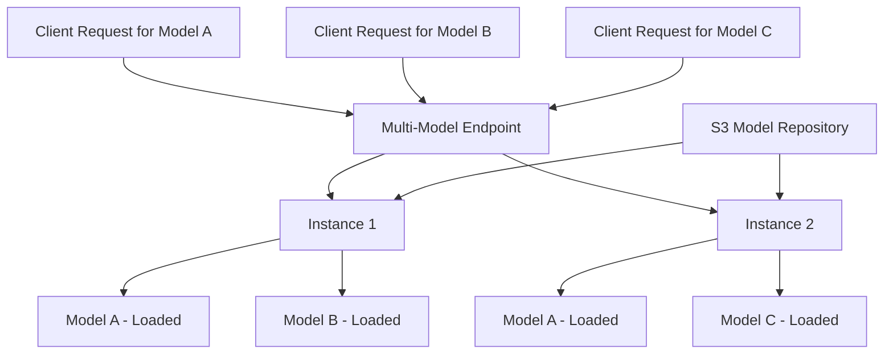

# How to Deploy Multi-Model Endpoints with SageMaker

Author: [nawazdhandala](https://github.com/nawazdhandala)

Tags: AWS, SageMaker, Model Deployment, Machine Learning, Cost Optimization

Description: Deploy multiple machine learning models on a single SageMaker endpoint to reduce costs and simplify management using Multi-Model Endpoints.

---

If you're running more than a handful of models in production, the cost of maintaining a separate endpoint for each one adds up fast. A single ml.m5.xlarge instance costs roughly $270/month. Multiply that by 50 or 100 models and you're looking at serious cloud spend. SageMaker Multi-Model Endpoints (MME) solve this by hosting multiple models on the same infrastructure.

This guide walks through setting up and managing multi-model endpoints.

## How Multi-Model Endpoints Work

With a standard SageMaker endpoint, one model runs on one (or more) instances. With a multi-model endpoint, multiple models share the same instances. SageMaker dynamically loads and unloads models based on traffic patterns.



When a request comes in for a specific model:
1. If the model is already loaded in memory, SageMaker routes the request to it
2. If the model isn't loaded, SageMaker loads it from S3 (this adds a "cold start" delay)
3. If memory is full, SageMaker evicts the least recently used model

## When to Use Multi-Model Endpoints

MME is a great fit when you have:

- **Many similar models** - Like one model per customer or per region
- **Infrequent per-model traffic** - Not every model gets hit constantly
- **Models of similar size** - They share memory, so similar footprints work best
- **Cost sensitivity** - You want to consolidate infrastructure

It's NOT ideal when:
- Every model needs guaranteed low latency (cold starts can add seconds)
- Models are very large and won't fit several in memory
- Traffic is consistently high across all models

## Preparing Model Artifacts

MME expects model artifacts in a specific S3 location. Each model is a separate tar.gz file.

```python
import sagemaker
import boto3
import tarfile
import os

session = sagemaker.Session()
role = sagemaker.get_execution_role()
bucket = session.default_bucket()
prefix = 'multi-model-endpoint/models'

# Let's say you have models for different customer segments
# Each model was trained separately and saved as a .tar.gz

# Example: package a model artifact
def package_model(model_path, output_path):
    """Package a model file into a tar.gz archive."""
    with tarfile.open(output_path, 'w:gz') as tar:
        tar.add(model_path, arcname=os.path.basename(model_path))
    return output_path

# Upload multiple models to the same S3 prefix
s3_client = boto3.client('s3')

model_names = ['segment_a', 'segment_b', 'segment_c', 'segment_d', 'segment_e']

for model_name in model_names:
    # In practice, these would be actual trained model files
    local_tar = f'/tmp/{model_name}.tar.gz'

    # Upload to S3 under the same prefix
    s3_client.upload_file(
        local_tar,
        bucket,
        f'{prefix}/{model_name}.tar.gz'
    )
    print(f"Uploaded {model_name}.tar.gz to s3://{bucket}/{prefix}/")
```

## Creating a Multi-Model Endpoint

Here's how to create the endpoint using the SageMaker SDK.

```python
from sagemaker.multidatamodel import MultiDataModel
from sagemaker import image_uris

region = session.boto_region_name

# Get the XGBoost container (all models use the same container)
xgb_image = image_uris.retrieve('xgboost', region, '1.7-1')

# Create the MultiDataModel
multi_model = MultiDataModel(
    name='customer-segment-models',
    model_data_prefix=f's3://{bucket}/{prefix}/',  # S3 prefix with all model artifacts
    image_uri=xgb_image,
    role=role,
    sagemaker_session=session
)

# Deploy the multi-model endpoint
predictor = multi_model.deploy(
    initial_instance_count=2,
    instance_type='ml.m5.xlarge',
    endpoint_name='customer-segments-mme'
)

print(f"Multi-model endpoint deployed: {predictor.endpoint_name}")
```

## Invoking a Specific Model

When calling the endpoint, you specify which model to use via the `TargetModel` parameter.

```python
import boto3
import json

runtime = boto3.client('sagemaker-runtime')

# Call a specific model on the multi-model endpoint
response = runtime.invoke_endpoint(
    EndpointName='customer-segments-mme',
    TargetModel='segment_a.tar.gz',  # Which model to use
    ContentType='text/csv',
    Body='1.5,2.3,0.7,4.1,3.2,0.9,1.8,2.1,3.5,0.4'
)

result = response['Body'].read().decode('utf-8')
print(f"Prediction from segment_a: {result}")

# Call a different model on the same endpoint
response = runtime.invoke_endpoint(
    EndpointName='customer-segments-mme',
    TargetModel='segment_b.tar.gz',
    ContentType='text/csv',
    Body='1.5,2.3,0.7,4.1,3.2,0.9,1.8,2.1,3.5,0.4'
)

result = response['Body'].read().decode('utf-8')
print(f"Prediction from segment_b: {result}")
```

## Adding and Removing Models Dynamically

One of the best features of MME is that you can add or remove models without touching the endpoint.

```python
# Add a new model - just upload to S3
s3_client.upload_file(
    '/tmp/segment_f.tar.gz',
    bucket,
    f'{prefix}/segment_f.tar.gz'
)

# The new model is immediately available for invocation
response = runtime.invoke_endpoint(
    EndpointName='customer-segments-mme',
    TargetModel='segment_f.tar.gz',
    ContentType='text/csv',
    Body='1.5,2.3,0.7,4.1,3.2,0.9,1.8,2.1,3.5,0.4'
)

print(f"Prediction from newly added segment_f: {response['Body'].read().decode()}")

# Remove a model - just delete from S3
s3_client.delete_object(
    Bucket=bucket,
    Key=f'{prefix}/segment_c.tar.gz'
)
print("Model segment_c removed")
```

## Listing Available Models

Check what models are currently available on the endpoint.

```python
# List all models in the S3 prefix
paginator = s3_client.get_paginator('list_objects_v2')

print("Available models:")
for page in paginator.paginate(Bucket=bucket, Prefix=prefix):
    for obj in page.get('Contents', []):
        model_name = obj['Key'].split('/')[-1]
        size_mb = obj['Size'] / (1024 * 1024)
        print(f"  {model_name} ({size_mb:.1f} MB)")

# Or use the MultiDataModel SDK method
models = multi_model.list_models()
for model_path in models:
    print(f"  {model_path}")
```

## Custom Inference Container for MME

If you need custom inference logic, build a container that implements the multi-model server protocol.

```python
# inference.py for a custom MME container

import os
import json
import joblib
import numpy as np

# Model cache to avoid reloading
_model_cache = {}

def model_fn(model_dir):
    """Load model from the given directory.
    SageMaker calls this when a model needs to be loaded."""
    model_path = os.path.join(model_dir, 'model.joblib')
    model = joblib.load(model_path)
    return model

def input_fn(request_body, request_content_type):
    """Deserialize the incoming request."""
    if request_content_type == 'text/csv':
        values = [float(x) for x in request_body.strip().split(',')]
        return np.array([values])
    elif request_content_type == 'application/json':
        data = json.loads(request_body)
        return np.array(data['instances'])
    raise ValueError(f"Unsupported content type: {request_content_type}")

def predict_fn(input_data, model):
    """Run prediction."""
    predictions = model.predict(input_data)
    probabilities = model.predict_proba(input_data)
    return {'predictions': predictions.tolist(), 'probabilities': probabilities.tolist()}

def output_fn(prediction, response_content_type):
    """Serialize the prediction response."""
    return json.dumps(prediction)
```

## Auto-Scaling Multi-Model Endpoints

Set up auto-scaling based on the number of invocations.

```python
asg_client = boto3.client('application-autoscaling')

# Register the endpoint as a scalable target
asg_client.register_scalable_target(
    ServiceNamespace='sagemaker',
    ResourceId='endpoint/customer-segments-mme/variant/AllTraffic',
    ScalableDimension='sagemaker:variant:DesiredInstanceCount',
    MinCapacity=2,
    MaxCapacity=20
)

# Scale based on invocations per instance
asg_client.put_scaling_policy(
    PolicyName='mme-scaling-policy',
    ServiceNamespace='sagemaker',
    ResourceId='endpoint/customer-segments-mme/variant/AllTraffic',
    ScalableDimension='sagemaker:variant:DesiredInstanceCount',
    PolicyType='TargetTrackingScaling',
    TargetTrackingScalingPolicyConfiguration={
        'TargetValue': 750.0,
        'PredefinedMetricSpecification': {
            'PredefinedMetricType': 'SageMakerVariantInvocationsPerInstance'
        },
        'ScaleInCooldown': 300,
        'ScaleOutCooldown': 60
    }
)
```

## Monitoring MME Performance

Track model-level metrics to understand usage patterns and catch issues.

```python
cloudwatch = boto3.client('cloudwatch')

# Get model loading latency
response = cloudwatch.get_metric_statistics(
    Namespace='AWS/SageMaker',
    MetricName='ModelLoadingWaitTime',
    Dimensions=[
        {'Name': 'EndpointName', 'Value': 'customer-segments-mme'},
        {'Name': 'VariantName', 'Value': 'AllTraffic'}
    ],
    StartTime='2026-02-01T00:00:00Z',
    EndTime='2026-02-12T00:00:00Z',
    Period=3600,
    Statistics=['Average', 'Maximum']
)

for datapoint in sorted(response['Datapoints'], key=lambda x: x['Timestamp']):
    print(f"{datapoint['Timestamp']}: avg={datapoint['Average']:.0f}ms, max={datapoint['Maximum']:.0f}ms")
```

For comprehensive monitoring, connect these metrics to [OneUptime](https://oneuptime.com/blog/post/2026-02-13-aws-cloudwatch-alerting-best-practices/view) to get a unified view across all your ML infrastructure.

## Wrapping Up

Multi-Model Endpoints are one of the most effective ways to reduce ML serving costs on SageMaker. If you're running dozens or hundreds of models that don't all need dedicated infrastructure, MME can cut your endpoint costs dramatically. The tradeoff is cold start latency when a model isn't cached, but for many use cases that's an acceptable tradeoff. For workloads where even cold starts are unacceptable, consider [SageMaker Serverless Inference](https://oneuptime.com/blog/post/2026-02-12-sagemaker-serverless-inference/view) as an alternative.
