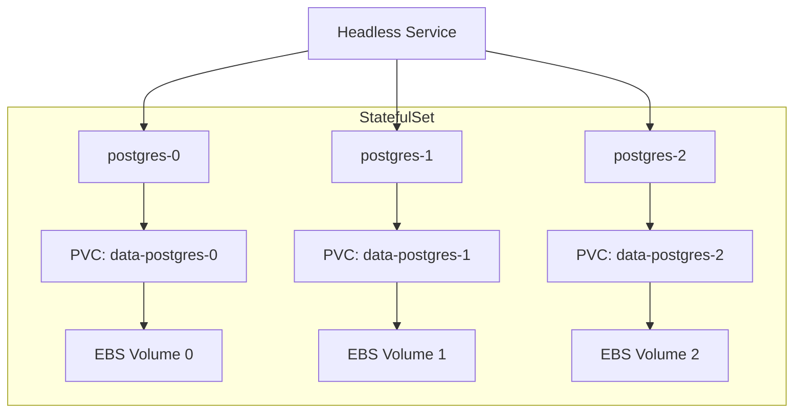

# How to Deploy Stateful Applications on EKS

Author: [nawazdhandala](https://github.com/nawazdhandala)

Tags: AWS, EKS, Kubernetes, StatefulSets, Storage

Description: Learn how to deploy and manage stateful applications like databases and message queues on Amazon EKS using StatefulSets, persistent volumes, and EBS storage.

---

Kubernetes was built for stateless workloads. Pods come and go, scale up and down, get rescheduled to different nodes - and that's fine when your app doesn't care about local state. But databases, message queues, caches, and other stateful systems need stable network identities, persistent storage, and ordered operations. That's what StatefulSets are for.

Running stateful workloads on EKS is absolutely possible and many organizations do it successfully. But it requires understanding the trade-offs and getting the configuration right. This guide covers everything from basic StatefulSet setup to production considerations.

## StatefulSets vs. Deployments

A Deployment treats all pods as interchangeable. A StatefulSet gives each pod:

- **A stable hostname** - `my-app-0`, `my-app-1`, `my-app-2` (not random suffixes)
- **Stable persistent storage** - each pod gets its own PersistentVolumeClaim that follows it across rescheduling
- **Ordered operations** - pods are created, updated, and deleted in sequence (0, 1, 2... and reverse for deletion)
- **Stable network identity** - a headless Service gives each pod a DNS record



## Prerequisites

Before deploying stateful apps, you need:

- An EKS cluster with the EBS CSI driver installed
- A gp3 StorageClass configured
- kubectl access

## Setting Up the EBS CSI Driver

EKS requires the EBS CSI driver for dynamic volume provisioning. Install it as a managed add-on:

```bash
# Create IRSA for the EBS CSI driver
eksctl create iamserviceaccount \
  --cluster my-cluster \
  --namespace kube-system \
  --name ebs-csi-controller-sa \
  --attach-policy-arn arn:aws:iam::aws:policy/service-role/AmazonEBSCSIDriverPolicy \
  --approve

# Install the EBS CSI driver add-on
aws eks create-addon \
  --cluster-name my-cluster \
  --addon-name aws-ebs-csi-driver \
  --service-account-role-arn arn:aws:iam::123456789012:role/AmazonEKS_EBS_CSI_DriverRole
```

Create a StorageClass for gp3 volumes:

```yaml
# storageclass-gp3.yaml - EBS gp3 StorageClass
apiVersion: storage.k8s.io/v1
kind: StorageClass
metadata:
  name: gp3
  annotations:
    storageclass.kubernetes.io/is-default-class: "true"
provisioner: ebs.csi.aws.com
parameters:
  type: gp3
  fsType: ext4
  encrypted: "true"
volumeBindingMode: WaitForFirstConsumer
reclaimPolicy: Retain
allowVolumeExpansion: true
```

```bash
# Apply the StorageClass
kubectl apply -f storageclass-gp3.yaml
```

The `WaitForFirstConsumer` binding mode is important for EKS - it ensures the volume is created in the same availability zone as the pod that needs it.

## Deploying a PostgreSQL StatefulSet

Here's a production-ready PostgreSQL deployment:

```yaml
# postgres-statefulset.yaml - PostgreSQL on EKS
apiVersion: v1
kind: Service
metadata:
  name: postgres
  labels:
    app: postgres
spec:
  ports:
    - port: 5432
      name: postgres
  clusterIP: None  # Headless service for stable DNS
  selector:
    app: postgres
---
apiVersion: apps/v1
kind: StatefulSet
metadata:
  name: postgres
spec:
  serviceName: postgres
  replicas: 1
  selector:
    matchLabels:
      app: postgres
  template:
    metadata:
      labels:
        app: postgres
    spec:
      containers:
        - name: postgres
          image: postgres:16
          ports:
            - containerPort: 5432
          env:
            - name: POSTGRES_DB
              value: myapp
            - name: POSTGRES_USER
              valueFrom:
                secretKeyRef:
                  name: postgres-credentials
                  key: username
            - name: POSTGRES_PASSWORD
              valueFrom:
                secretKeyRef:
                  name: postgres-credentials
                  key: password
            - name: PGDATA
              value: /var/lib/postgresql/data/pgdata
          resources:
            requests:
              cpu: 500m
              memory: 1Gi
            limits:
              cpu: 1000m
              memory: 2Gi
          volumeMounts:
            - name: data
              mountPath: /var/lib/postgresql/data
          livenessProbe:
            exec:
              command:
                - pg_isready
                - -U
                - $(POSTGRES_USER)
            initialDelaySeconds: 30
            periodSeconds: 10
          readinessProbe:
            exec:
              command:
                - pg_isready
                - -U
                - $(POSTGRES_USER)
            initialDelaySeconds: 5
            periodSeconds: 5
  volumeClaimTemplates:
    - metadata:
        name: data
      spec:
        accessModes: ["ReadWriteOnce"]
        storageClassName: gp3
        resources:
          requests:
            storage: 50Gi
```

Create the secrets and deploy:

```bash
# Create the database credentials secret
kubectl create secret generic postgres-credentials \
  --from-literal=username=myapp \
  --from-literal=password=supersecretpassword

# Deploy PostgreSQL
kubectl apply -f postgres-statefulset.yaml

# Watch the pod come up
kubectl get pods -l app=postgres -w
```

## Deploying a Redis Cluster

For a Redis cluster with sentinel for high availability:

```yaml
# redis-statefulset.yaml - Redis with persistence
apiVersion: v1
kind: Service
metadata:
  name: redis
spec:
  ports:
    - port: 6379
  clusterIP: None
  selector:
    app: redis
---
apiVersion: apps/v1
kind: StatefulSet
metadata:
  name: redis
spec:
  serviceName: redis
  replicas: 3
  selector:
    matchLabels:
      app: redis
  template:
    metadata:
      labels:
        app: redis
    spec:
      containers:
        - name: redis
          image: redis:7-alpine
          ports:
            - containerPort: 6379
          command:
            - redis-server
            - --appendonly
            - "yes"
            - --save
            - "60 1000"
          resources:
            requests:
              cpu: 250m
              memory: 512Mi
            limits:
              cpu: 500m
              memory: 1Gi
          volumeMounts:
            - name: data
              mountPath: /data
  volumeClaimTemplates:
    - metadata:
        name: data
      spec:
        accessModes: ["ReadWriteOnce"]
        storageClassName: gp3
        resources:
          requests:
            storage: 20Gi
```

## Pod Disruption Budgets

Protect your stateful workloads from disruptions during node upgrades or autoscaling:

```yaml
# pdb.yaml - Ensure minimum availability during disruptions
apiVersion: policy/v1
kind: PodDisruptionBudget
metadata:
  name: postgres-pdb
spec:
  minAvailable: 1
  selector:
    matchLabels:
      app: postgres
```

This tells Kubernetes that at least one PostgreSQL pod must remain running during voluntary disruptions.

## Backup Strategy

Persistent volumes protect against pod restarts, but not against data corruption or accidental deletion. Set up regular backups.

Use EBS snapshots for volume-level backups:

```bash
# Find the EBS volume for your StatefulSet
VOLUME_ID=$(kubectl get pvc data-postgres-0 -o jsonpath='{.spec.volumeName}' | xargs -I {} kubectl get pv {} -o jsonpath='{.spec.csi.volumeHandle}')

# Create a snapshot
aws ec2 create-snapshot \
  --volume-id $VOLUME_ID \
  --description "postgres-backup-$(date +%Y%m%d)" \
  --tag-specifications "ResourceType=snapshot,Tags=[{Key=Name,Value=postgres-backup}]"
```

For application-level backups, use tools like pg_dump for PostgreSQL or redis-cli for Redis.

## Volume Expansion

When you need more storage, expand the PVC (if the StorageClass allows it):

```bash
# Expand the PVC from 50Gi to 100Gi
kubectl patch pvc data-postgres-0 -p '{"spec":{"resources":{"requests":{"storage":"100Gi"}}}}'
```

gp3 volumes support online expansion - no pod restart needed.

## Topology Awareness

EBS volumes are AZ-specific. If a node fails and the pod reschedules to a different AZ, it can't attach the volume. Use topology constraints to keep pods in the same AZ as their volumes:

```yaml
# topologySpreadConstraints ensure pods stay in appropriate AZs
spec:
  topologySpreadConstraints:
    - maxSkew: 1
      topologyKey: topology.kubernetes.io/zone
      whenUnsatisfiable: DoNotSchedule
      labelSelector:
        matchLabels:
          app: postgres
```

For workloads that need cross-AZ access, consider using [EFS instead of EBS](https://oneuptime.com/blog/post/set-up-efs-csi-driver-for-eks-shared-storage/view).

## Should You Run Databases on Kubernetes?

It's a fair question. Managed services like RDS, ElastiCache, and Amazon MQ handle the operational burden for you. Running databases on EKS makes sense when:

- You need full control over the database configuration
- You're running in a multi-cloud or hybrid environment
- Your team has strong Kubernetes expertise
- Cost optimization is critical and managed services are too expensive

For many teams, a hybrid approach works best - run application-level state on EKS (caches, message queues) and offload critical databases to managed services.

Stateful workloads on EKS require more care than stateless ones, but with proper configuration, monitoring, and backup strategies, they're perfectly viable in production.
