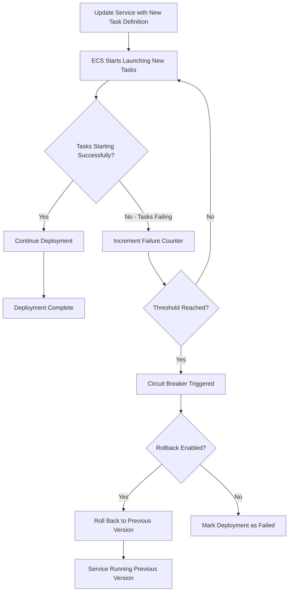

# How to Configure Deployment Circuit Breaker in ECS

Author: [nawazdhandala](https://github.com/nawazdhandala)

Tags: AWS, ECS, Deployments, Circuit Breaker, DevOps

Description: Learn how to configure the ECS deployment circuit breaker to automatically detect failed deployments and roll back to the last working version of your service.

---

There's a particular kind of pain that comes from a bad ECS deployment that just won't give up. You push a broken image, the new tasks keep crashing, ECS keeps trying to launch them, and your service sits in a half-deployed state. Without intervention, this can go on for hours. The deployment circuit breaker exists to stop this cycle automatically.

The circuit breaker monitors your deployment and, if it detects that tasks keep failing, it halts the deployment and optionally rolls back to the previous working version. It's one of those features that's easy to enable and saves you from 3 AM pages.

## How the Circuit Breaker Works

The circuit breaker tracks task launch attempts during a deployment. If ECS can't successfully launch and stabilize new tasks after a threshold number of attempts, it marks the deployment as failed. With rollback enabled, it then reverts the service to the previous task definition.

The threshold is calculated based on your desired count:
- For desired count 1-9: the threshold is `min(10, 2 * desired_count)`
- For desired count 10+: the threshold is `min(200, desired_count)`

So for a service with 4 desired tasks, ECS will attempt up to 8 launches before triggering the circuit breaker. For a service with 50 tasks, it'll try up to 50 times.



## Enabling the Circuit Breaker

It's a simple addition to your service configuration. In Terraform:

```hcl
resource "aws_ecs_service" "api" {
  name            = "api-service"
  cluster         = aws_ecs_cluster.main.id
  task_definition = aws_ecs_task_definition.api.arn
  desired_count   = 4
  launch_type     = "FARGATE"

  # Enable circuit breaker with automatic rollback
  deployment_circuit_breaker {
    enable   = true
    rollback = true
  }

  network_configuration {
    subnets         = var.private_subnet_ids
    security_groups = [aws_security_group.api.id]
  }

  load_balancer {
    target_group_arn = aws_lb_target_group.api.arn
    container_name   = "api"
    container_port   = 8080
  }
}
```

With CloudFormation:

```yaml
Resources:
  ApiService:
    Type: AWS::ECS::Service
    Properties:
      ServiceName: api-service
      Cluster: !Ref ECSCluster
      TaskDefinition: !Ref ApiTaskDef
      DesiredCount: 4
      LaunchType: FARGATE
      DeploymentConfiguration:
        DeploymentCircuitBreaker:
          Enable: true
          Rollback: true
        MinimumHealthyPercent: 100
        MaximumPercent: 200
      NetworkConfiguration:
        AwsvpcConfiguration:
          Subnets:
            - !Ref PrivateSubnet1
            - !Ref PrivateSubnet2
          SecurityGroups:
            - !Ref ApiSecurityGroup
```

Via the AWS CLI:

```bash
# Enable circuit breaker on an existing service
aws ecs update-service \
  --cluster my-cluster \
  --service api-service \
  --deployment-configuration '{
    "deploymentCircuitBreaker": {
      "enable": true,
      "rollback": true
    },
    "minimumHealthyPercent": 100,
    "maximumPercent": 200
  }'
```

## What Triggers the Circuit Breaker

The circuit breaker kicks in when tasks fail to reach a RUNNING state. Common scenarios include:

**Container crashes on startup**: Your application throws an error and exits immediately. The task goes from PROVISIONING to STOPPED.

**Health check failures**: Tasks start but fail the load balancer health check and get killed by ECS. This counts as a failed launch.

**Image pull failures**: The container image doesn't exist or the execution role can't access ECR. Tasks fail before they even start.

**Resource constraints**: Not enough CPU/memory available. Tasks can't be placed.

**Dependency failures**: Your application crashes because it can't reach a database or external service. The container exits with a non-zero code.

## Monitoring Circuit Breaker Events

ECS emits EventBridge events when the circuit breaker triggers. Set up notifications so you know when a deployment fails and rolls back.

```hcl
# EventBridge rule to catch circuit breaker events
resource "aws_cloudwatch_event_rule" "circuit_breaker" {
  name        = "ecs-circuit-breaker-trigger"
  description = "Alert when ECS deployment circuit breaker triggers"

  event_pattern = jsonencode({
    source        = ["aws.ecs"]
    "detail-type" = ["ECS Deployment State Change"]
    detail = {
      eventName = ["SERVICE_DEPLOYMENT_FAILED"]
    }
  })
}

# Send to SNS for alerting
resource "aws_cloudwatch_event_target" "circuit_breaker_alert" {
  rule      = aws_cloudwatch_event_rule.circuit_breaker.name
  target_id = "notify-team"
  arn       = aws_sns_topic.deployments.arn

  input_transformer {
    input_paths = {
      service = "$.detail.deploymentId"
      reason  = "$.detail.reason"
    }
    input_template = "\"ECS deployment circuit breaker triggered for <service>. Reason: <reason>\""
  }
}

# Also track successful deployments
resource "aws_cloudwatch_event_rule" "deployment_success" {
  name = "ecs-deployment-success"

  event_pattern = jsonencode({
    source        = ["aws.ecs"]
    "detail-type" = ["ECS Deployment State Change"]
    detail = {
      eventName = ["SERVICE_DEPLOYMENT_COMPLETED"]
    }
  })
}
```

## Checking Deployment Status

You can check the status of a deployment at any time to see if the circuit breaker is active.

```bash
# Check deployment status
aws ecs describe-services \
  --cluster my-cluster \
  --services api-service \
  --query 'services[0].deployments[*].{
    id:id,
    status:status,
    taskDef:taskDefinition,
    desired:desiredCount,
    running:runningCount,
    failed:failedTasks,
    rolloutState:rolloutState,
    rolloutReason:rolloutStateReason
  }' \
  --output table
```

The `rolloutState` field tells you what's happening:
- `IN_PROGRESS` - Deployment is ongoing
- `COMPLETED` - Successfully finished
- `FAILED` - Circuit breaker triggered

And `rolloutStateReason` gives you details about why it failed.

## Testing the Circuit Breaker

It's a good idea to verify the circuit breaker works before you need it in production. Here's how to test it.

```bash
# Create a task definition with a deliberately broken image
aws ecs register-task-definition \
  --family test-circuit-breaker \
  --container-definitions '[{
    "name": "app",
    "image": "123456789.dkr.ecr.us-east-1.amazonaws.com/app:nonexistent-tag",
    "essential": true,
    "memory": 256,
    "portMappings": [{"containerPort": 8080}]
  }]' \
  --network-mode awsvpc \
  --requires-compatibilities FARGATE \
  --cpu 256 \
  --memory 512

# Update the service with the broken task definition
aws ecs update-service \
  --cluster my-cluster \
  --service test-service \
  --task-definition test-circuit-breaker

# Watch the rollout state
watch -n 10 'aws ecs describe-services \
  --cluster my-cluster \
  --services test-service \
  --query "services[0].deployments[*].{status:status,rolloutState:rolloutState,running:runningCount,failed:failedTasks}"'
```

After several failed attempts, you should see the deployment's `rolloutState` change to `FAILED` and a new deployment appear that rolls back to the previous task definition.

## Circuit Breaker with Rolling Deployments

The circuit breaker works alongside your rolling deployment configuration. The `minimumHealthyPercent` and `maximumPercent` settings still apply - the circuit breaker just adds automatic failure detection on top.

```hcl
resource "aws_ecs_service" "api" {
  name            = "api-service"
  desired_count   = 6

  # Rolling deployment settings
  deployment_minimum_healthy_percent = 100
  deployment_maximum_percent         = 150

  # Circuit breaker on top of rolling deployment
  deployment_circuit_breaker {
    enable   = true
    rollback = true
  }
}
```

This means during deployment, ECS will run at most 9 tasks (150% of 6), keep at least 6 healthy tasks at all times, and if the new tasks keep failing, it'll roll back automatically.

## Limitations

There are a few things to be aware of:

**No custom thresholds**: You can't configure the failure threshold. AWS determines it based on desired count. This means for services with high desired counts, it might take a while before the circuit breaker triggers.

**No health-based triggers**: The circuit breaker only tracks task launch failures, not application-level health metrics. If your new version starts successfully but returns errors, the circuit breaker won't catch that. For health-based rollbacks, use CodeDeploy with CloudWatch alarms (see our post on [blue/green deployments](https://oneuptime.com/blog/post/ecs-blue-green-deployments-codedeploy/view)).

**Rollback is to the previous version only**: If the previous version was also broken, the rollback won't help. It goes back exactly one version.

**Doesn't work with CODE_DEPLOY controller**: The circuit breaker is for the default ECS deployment controller only. If you're using CodeDeploy, it has its own rollback mechanism.

## Best Practices

1. **Always enable rollback** when you enable the circuit breaker. Without rollback, the deployment just marks as failed and your service sits in a degraded state.

2. **Set up alerts** for circuit breaker events. You want to know when deployments fail, even if the rollback handles it automatically.

3. **Use container health checks** in your task definition. This helps ECS detect unhealthy tasks faster.

4. **Combine with proper health check grace period**. If your application takes 60 seconds to start, set the grace period to at least 60 seconds so that slow startups don't count as failures.

5. **Test it in staging first.** Push a broken image intentionally and verify the circuit breaker triggers and rolls back correctly.

The deployment circuit breaker is one of those features that you hope never triggers, but you're glad it's there when it does. Enable it on every ECS service - there's virtually no downside.
