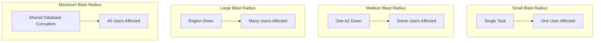

# How to Design for Fault Tolerance on AWS

Author: [nawazdhandala](https://github.com/nawazdhandala)

Tags: AWS, Fault Tolerance, Architecture, Resilience, Reliability

Description: Learn how to design fault-tolerant systems on AWS using retry strategies, circuit breakers, redundancy, and chaos engineering to survive component failures.

---

Fault tolerance goes beyond high availability. While high availability is about keeping your system running, fault tolerance is about surviving failures gracefully - without data loss, without corrupted state, and ideally without users even noticing. It's the difference between having a backup plan and having a backup plan that actually works.

Let's dig into the patterns and AWS services that make systems truly fault tolerant.

## Fault Tolerance vs. High Availability

People use these terms interchangeably, but they're different.

**High availability**: The system stays accessible. If a server dies, another takes over. There might be a brief interruption.

**Fault tolerance**: The system continues operating correctly despite failures. No data loss, no inconsistent state, no visible impact.

Achieving fault tolerance requires thinking about failure at every layer of your architecture.

## The Blast Radius Concept

Every component has a blast radius - the scope of impact when it fails. Your goal is to minimize blast radii through isolation.



## Retry Strategies

The most basic fault tolerance mechanism is retrying failed operations. But naive retries can make things worse - if a service is overwhelmed, hammering it with retries adds fuel to the fire.

Use exponential backoff with jitter.

```javascript
// Retry with exponential backoff and jitter
async function retryWithBackoff(fn, options = {}) {
  const maxRetries = options.maxRetries || 3;
  const baseDelay = options.baseDelay || 100;
  const maxDelay = options.maxDelay || 10000;

  for (let attempt = 0; attempt <= maxRetries; attempt++) {
    try {
      return await fn();
    } catch (error) {
      if (attempt === maxRetries) throw error;

      // Only retry on transient errors
      if (!isRetryable(error)) throw error;

      // Exponential backoff with full jitter
      const delay = Math.min(maxDelay, baseDelay * Math.pow(2, attempt));
      const jitteredDelay = Math.random() * delay;

      console.log(`Attempt ${attempt + 1} failed, retrying in ${jitteredDelay.toFixed(0)}ms`);
      await sleep(jitteredDelay);
    }
  }
}

function isRetryable(error) {
  // Retry on throttling and transient errors
  const retryableCodes = [429, 500, 502, 503, 504];
  return retryableCodes.includes(error.statusCode) ||
    error.code === 'ThrottlingException' ||
    error.code === 'ProvisionedThroughputExceededException';
}

function sleep(ms) {
  return new Promise(resolve => setTimeout(resolve, ms));
}
```

## Circuit Breaker Pattern

When a downstream service is failing, you don't want every request to wait for a timeout. A circuit breaker detects repeated failures and short-circuits the calls, returning an error immediately.

```javascript
// Production-ready circuit breaker
class CircuitBreaker {
  constructor(options = {}) {
    this.failureThreshold = options.failureThreshold || 5;
    this.successThreshold = options.successThreshold || 2;
    this.timeout = options.timeout || 30000;
    this.state = 'CLOSED';
    this.failureCount = 0;
    this.successCount = 0;
    this.lastFailureTime = null;
  }

  async execute(fn, fallback) {
    if (this.state === 'OPEN') {
      if (Date.now() - this.lastFailureTime >= this.timeout) {
        this.state = 'HALF_OPEN';
      } else {
        // Circuit is open, use fallback
        if (fallback) return fallback();
        throw new Error('Circuit breaker is open');
      }
    }

    try {
      const result = await fn();
      this.onSuccess();
      return result;
    } catch (error) {
      this.onFailure();
      if (fallback) return fallback();
      throw error;
    }
  }

  onSuccess() {
    if (this.state === 'HALF_OPEN') {
      this.successCount++;
      if (this.successCount >= this.successThreshold) {
        this.state = 'CLOSED';
        this.failureCount = 0;
        this.successCount = 0;
      }
    } else {
      this.failureCount = 0;
    }
  }

  onFailure() {
    this.failureCount++;
    this.lastFailureTime = Date.now();
    if (this.failureCount >= this.failureThreshold) {
      this.state = 'OPEN';
      this.successCount = 0;
    }
  }
}

// Usage
const paymentCircuitBreaker = new CircuitBreaker({
  failureThreshold: 3,
  timeout: 60000,
});

async function processPayment(order) {
  return paymentCircuitBreaker.execute(
    () => paymentService.charge(order),
    () => ({ status: 'queued', message: 'Payment will be processed shortly' })
  );
}
```

## Bulkhead Pattern

Isolate components so one failure doesn't cascade to everything else. In practice, this means separate connection pools, thread pools, and rate limits per dependency.

```javascript
// Bulkhead: separate connection pools for different services
const paymentPool = new ConnectionPool({
  max: 10,
  connectionTimeoutMillis: 5000,
});

const inventoryPool = new ConnectionPool({
  max: 20,
  connectionTimeoutMillis: 3000,
});

const notificationPool = new ConnectionPool({
  max: 5,
  connectionTimeoutMillis: 2000,
});

// If notification service gets slow, it only affects its own pool
// Payment and inventory continue working fine
```

On AWS, you can implement bulkheads using separate Lambda functions with individual concurrency limits.

```typescript
// Each service gets its own concurrency limit
const paymentFunction = new lambda.Function(this, 'PaymentHandler', {
  runtime: lambda.Runtime.NODEJS_18_X,
  handler: 'payment.handler',
  code: lambda.Code.fromAsset('lambda'),
  reservedConcurrentExecutions: 50, // Max 50 concurrent payment operations
});

const notificationFunction = new lambda.Function(this, 'NotificationHandler', {
  runtime: lambda.Runtime.NODEJS_18_X,
  handler: 'notification.handler',
  code: lambda.Code.fromAsset('lambda'),
  reservedConcurrentExecutions: 20, // Notifications get less capacity
});
```

## Idempotent Operations

In a fault-tolerant system, operations get retried. If an operation isn't idempotent, retries can cause duplicate charges, duplicate records, or corrupted data.

```javascript
// Idempotent payment processing using DynamoDB conditional writes
async function processPayment(idempotencyKey, amount, userId) {
  const dynamoClient = new DynamoDBClient({});

  // Try to record the operation first
  try {
    await dynamoClient.send(new PutItemCommand({
      TableName: 'IdempotencyKeys',
      Item: {
        key: { S: idempotencyKey },
        status: { S: 'processing' },
        amount: { N: String(amount) },
        userId: { S: userId },
        createdAt: { S: new Date().toISOString() },
        ttl: { N: String(Math.floor(Date.now() / 1000) + 86400) }, // Expire in 24 hours
      },
      ConditionExpression: 'attribute_not_exists(#key)',
      ExpressionAttributeNames: { '#key': 'key' },
    }));
  } catch (error) {
    if (error.name === 'ConditionalCheckFailedException') {
      // This operation was already processed
      const existing = await dynamoClient.send(new GetItemCommand({
        TableName: 'IdempotencyKeys',
        Key: { key: { S: idempotencyKey } },
      }));
      return { duplicate: true, status: existing.Item.status.S };
    }
    throw error;
  }

  // Process the actual payment
  try {
    const result = await chargePayment(amount, userId);
    await updateIdempotencyKey(idempotencyKey, 'completed', result);
    return result;
  } catch (error) {
    await updateIdempotencyKey(idempotencyKey, 'failed', error.message);
    throw error;
  }
}
```

## Dead Letter Queues

When messages fail processing after multiple retries, they need to go somewhere you can investigate. Dead letter queues capture these failed messages.

```typescript
// DLQ setup with alarm
const dlq = new sqs.Queue(this, 'DeadLetterQueue', {
  retentionPeriod: cdk.Duration.days(14),
});

const mainQueue = new sqs.Queue(this, 'MainQueue', {
  deadLetterQueue: {
    queue: dlq,
    maxReceiveCount: 3,
  },
});

// Alert when messages land in the DLQ
new cloudwatch.Alarm(this, 'DLQAlarm', {
  metric: dlq.metricApproximateNumberOfMessagesVisible(),
  threshold: 1,
  evaluationPeriods: 1,
  alarmDescription: 'Messages failing processing',
});
```

## Chaos Engineering

You can't be confident in your fault tolerance without testing it. AWS Fault Injection Simulator lets you inject failures and observe how your system responds.

```typescript
// FIS experiment: terminate EC2 instances
const experiment = new fis.CfnExperimentTemplate(this, 'TerminateInstanceExperiment', {
  description: 'Terminate random instance to test failover',
  roleArn: fisRole.roleArn,
  targets: {
    'ec2-instances': {
      resourceType: 'aws:ec2:instance',
      resourceTags: { 'app': 'my-application' },
      selectionMode: 'COUNT(1)',
    },
  },
  actions: {
    'terminate-instance': {
      actionId: 'aws:ec2:terminate-instances',
      parameters: {},
      targets: { Instances: 'ec2-instances' },
    },
  },
  stopConditions: [{
    source: 'aws:cloudwatch:alarm',
    value: errorRateAlarm.alarmArn,
  }],
  tags: { Name: 'instance-termination-test' },
});
```

## Data Durability

Fault tolerance for data means no data loss even during failures.

- **S3**: 99.999999999% durability by default (11 nines)
- **DynamoDB**: Automatically replicated across 3 AZs
- **RDS**: Multi-AZ with synchronous replication
- **Aurora**: 6 copies of data across 3 AZs

For critical data, consider cross-region replication too.

```typescript
// DynamoDB global table for cross-region data durability
const table = new dynamodb.Table(this, 'GlobalTable', {
  partitionKey: { name: 'id', type: dynamodb.AttributeType.STRING },
  replicationRegions: ['eu-west-1', 'ap-southeast-1'],
  billingMode: dynamodb.BillingMode.PAY_PER_REQUEST,
});
```

For monitoring your fault tolerance mechanisms in production, check out our guide on [building a logging and monitoring stack on AWS](https://oneuptime.com/blog/post/build-logging-and-monitoring-stack-on-aws/view).

## Summary

Fault tolerance is about expecting failures and handling them gracefully. Use retries with backoff for transient errors, circuit breakers for failing dependencies, bulkheads for isolation, idempotency for safe retries, and dead letter queues for capturing failures. Test everything with chaos engineering. The goal is a system where individual component failures are routine events that the system handles automatically, not emergencies that wake up your on-call team.
