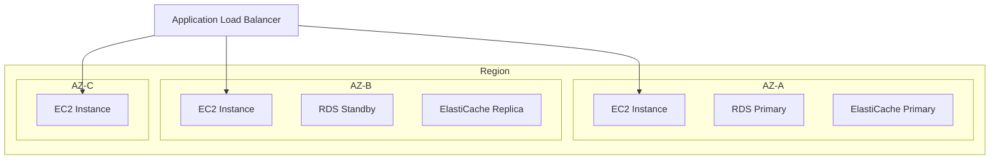

# How to Design for High Availability on AWS

Author: [nawazdhandala](https://github.com/nawazdhandala)

Tags: AWS, High Availability, Architecture, Multi-AZ, Reliability

Description: A comprehensive guide to designing highly available systems on AWS, covering multi-AZ deployments, health checks, failover strategies, and redundancy patterns.

---

High availability means your application keeps running even when things break. And things will break - servers fail, network connections drop, entire data centers go offline. The question isn't whether failure will happen but how your system responds when it does.

AWS gives you the building blocks for highly available architectures, but it doesn't happen automatically. You have to design for it. Here's how.

## Understanding Availability Tiers

Before designing anything, know what availability target you're aiming for.

| Availability | Monthly Downtime | Common Name |
|---|---|---|
| 99% | 7.2 hours | Two nines |
| 99.9% | 43.8 minutes | Three nines |
| 99.99% | 4.4 minutes | Four nines |
| 99.999% | 26.3 seconds | Five nines |

Most web applications target three or four nines. Each additional nine gets exponentially harder and more expensive to achieve.

## The Foundation: Multi-AZ Everything

Availability Zones (AZs) are physically separate data centers within an AWS region. They have independent power, cooling, and networking. If one AZ goes down, the others stay up. This is your first line of defense.



### VPC and Subnet Design

Spread your resources across at least two AZs, ideally three.

```typescript
// VPC with subnets in 3 AZs
const vpc = new ec2.Vpc(this, 'HighlyAvailableVpc', {
  maxAzs: 3,
  subnetConfiguration: [
    {
      name: 'Public',
      subnetType: ec2.SubnetType.PUBLIC,
      cidrMask: 24,
    },
    {
      name: 'Private',
      subnetType: ec2.SubnetType.PRIVATE_WITH_EGRESS,
      cidrMask: 24,
    },
    {
      name: 'Isolated',
      subnetType: ec2.SubnetType.PRIVATE_ISOLATED,
      cidrMask: 24,
    },
  ],
});
```

### Database High Availability

RDS Multi-AZ gives you automatic failover. A standby replica in another AZ takes over within 60-120 seconds if the primary fails.

```typescript
// Multi-AZ RDS database
const database = new rds.DatabaseInstance(this, 'Database', {
  engine: rds.DatabaseInstanceEngine.postgres({
    version: rds.PostgresEngineVersion.VER_15,
  }),
  instanceType: ec2.InstanceType.of(ec2.InstanceClass.R6G, ec2.InstanceSize.LARGE),
  vpc,
  multiAz: true, // This is the key setting
  storageType: rds.StorageType.GP3,
  allocatedStorage: 100,
  deletionProtection: true,
  backupRetention: cdk.Duration.days(14),
  preferredBackupWindow: '03:00-04:00',
  autoMinorVersionUpgrade: true,
});
```

For even higher availability, use Aurora with read replicas across AZs.

```typescript
// Aurora cluster with automatic failover
const cluster = new rds.DatabaseCluster(this, 'AuroraCluster', {
  engine: rds.DatabaseClusterEngine.auroraPostgres({
    version: rds.AuroraPostgresEngineVersion.VER_15_4,
  }),
  instances: 3, // Primary + 2 read replicas
  instanceProps: {
    vpc,
    instanceType: ec2.InstanceType.of(ec2.InstanceClass.R6G, ec2.InstanceSize.LARGE),
  },
  backup: {
    retention: cdk.Duration.days(14),
  },
});
```

### Cache High Availability

ElastiCache Redis with Multi-AZ and automatic failover.

```typescript
// Redis cluster with failover
const cacheSubnetGroup = new elasticache.CfnSubnetGroup(this, 'CacheSubnets', {
  description: 'Subnets for ElastiCache',
  subnetIds: vpc.privateSubnets.map(s => s.subnetId),
});

const redis = new elasticache.CfnReplicationGroup(this, 'RedisCluster', {
  replicationGroupDescription: 'HA Redis cluster',
  engine: 'redis',
  cacheNodeType: 'cache.r6g.large',
  numNodeGroups: 1,
  replicasPerNodeGroup: 2,
  automaticFailoverEnabled: true,
  multiAzEnabled: true,
  cacheSubnetGroupName: cacheSubnetGroup.ref,
});
```

## Load Balancing

The Application Load Balancer distributes traffic across healthy instances in multiple AZs.

```typescript
// ALB with cross-zone load balancing
const alb = new elbv2.ApplicationLoadBalancer(this, 'ALB', {
  vpc,
  internetFacing: true,
  crossZoneEnabled: true,
});

const targetGroup = new elbv2.ApplicationTargetGroup(this, 'TargetGroup', {
  vpc,
  port: 80,
  protocol: elbv2.ApplicationProtocol.HTTP,
  targetType: elbv2.TargetType.INSTANCE,
  healthCheck: {
    path: '/health',
    interval: cdk.Duration.seconds(15),
    healthyThresholdCount: 2,
    unhealthyThresholdCount: 3,
    timeout: cdk.Duration.seconds(5),
  },
  deregistrationDelay: cdk.Duration.seconds(30),
});
```

## Health Checks at Every Layer

Health checks are the mechanism that makes failover work. Every component needs them.

```javascript
// Application health check that verifies all dependencies
app.get('/health', async (req, res) => {
  const checks = {};
  let healthy = true;

  // Check database
  try {
    await db.query('SELECT 1');
    checks.database = 'ok';
  } catch (e) {
    checks.database = 'failed';
    healthy = false;
  }

  // Check cache
  try {
    await redis.ping();
    checks.cache = 'ok';
  } catch (e) {
    checks.cache = 'failed';
    // Cache failure might not be fatal
  }

  // Check external dependencies
  try {
    await fetch('https://api.external-service.com/health', { timeout: 2000 });
    checks.externalApi = 'ok';
  } catch (e) {
    checks.externalApi = 'degraded';
  }

  const status = healthy ? 200 : 503;
  res.status(status).json({ status: healthy ? 'healthy' : 'unhealthy', checks });
});
```

## Stateless Application Design

For high availability, your application instances should be stateless. No session data stored locally, no files on the instance.

```javascript
// Store sessions in Redis instead of local memory
const session = require('express-session');
const RedisStore = require('connect-redis').default;

app.use(session({
  store: new RedisStore({ client: redisClient }),
  secret: process.env.SESSION_SECRET,
  resave: false,
  saveUninitialized: false,
  cookie: { maxAge: 3600000 },
}));
```

Store file uploads in S3, not on local disk. Use ElastiCache or DynamoDB for caching instead of in-process memory.

## Graceful Degradation

Not every failure needs to bring down the whole system. Design for graceful degradation where non-critical features fail independently.

```javascript
// Circuit breaker pattern for external dependencies
class CircuitBreaker {
  constructor(fn, options = {}) {
    this.fn = fn;
    this.failureThreshold = options.failureThreshold || 5;
    this.resetTimeout = options.resetTimeout || 30000;
    this.failures = 0;
    this.state = 'closed'; // closed = normal, open = failing, half-open = testing
    this.nextAttempt = 0;
  }

  async call(...args) {
    if (this.state === 'open') {
      if (Date.now() < this.nextAttempt) {
        throw new Error('Circuit breaker is open');
      }
      this.state = 'half-open';
    }

    try {
      const result = await this.fn(...args);
      this.onSuccess();
      return result;
    } catch (error) {
      this.onFailure();
      throw error;
    }
  }

  onSuccess() {
    this.failures = 0;
    this.state = 'closed';
  }

  onFailure() {
    this.failures++;
    if (this.failures >= this.failureThreshold) {
      this.state = 'open';
      this.nextAttempt = Date.now() + this.resetTimeout;
    }
  }
}
```

## Monitoring and Alerting

You can't maintain high availability if you don't know when something fails. Set up comprehensive monitoring.

```typescript
// Critical alarms for HA monitoring
new cloudwatch.Alarm(this, 'HealthyHostAlarm', {
  metric: targetGroup.metricHealthyHostCount(),
  threshold: 2,
  comparisonOperator: cloudwatch.ComparisonOperator.LESS_THAN_THRESHOLD,
  evaluationPeriods: 1,
  alarmDescription: 'Fewer than 2 healthy hosts - availability at risk',
});

new cloudwatch.Alarm(this, 'ErrorRateAlarm', {
  metric: alb.metricHttpCodeTarget(elbv2.HttpCodeTarget.TARGET_5XX_COUNT, {
    period: cdk.Duration.minutes(5),
  }),
  threshold: 50,
  evaluationPeriods: 2,
  alarmDescription: 'High 5xx error rate detected',
});
```

For building out a complete monitoring stack, see our guide on [building a logging and monitoring stack on AWS](https://oneuptime.com/blog/post/build-logging-and-monitoring-stack-on-aws/view).

## Testing Your HA Design

The worst time to discover your failover doesn't work is during an actual failure. Test regularly.

- Kill instances and verify the ALB routes around them
- Trigger a Multi-AZ RDS failover and measure recovery time
- Simulate AZ failures using AWS Fault Injection Simulator
- Run load tests to verify auto scaling kicks in

## Summary

Designing for high availability on AWS comes down to redundancy, health checks, and failover automation. Deploy across multiple AZs, use managed services with built-in failover (RDS Multi-AZ, ElastiCache Multi-AZ), keep your application stateless, and monitor everything. The goal is not to prevent failures but to make them invisible to your users.
