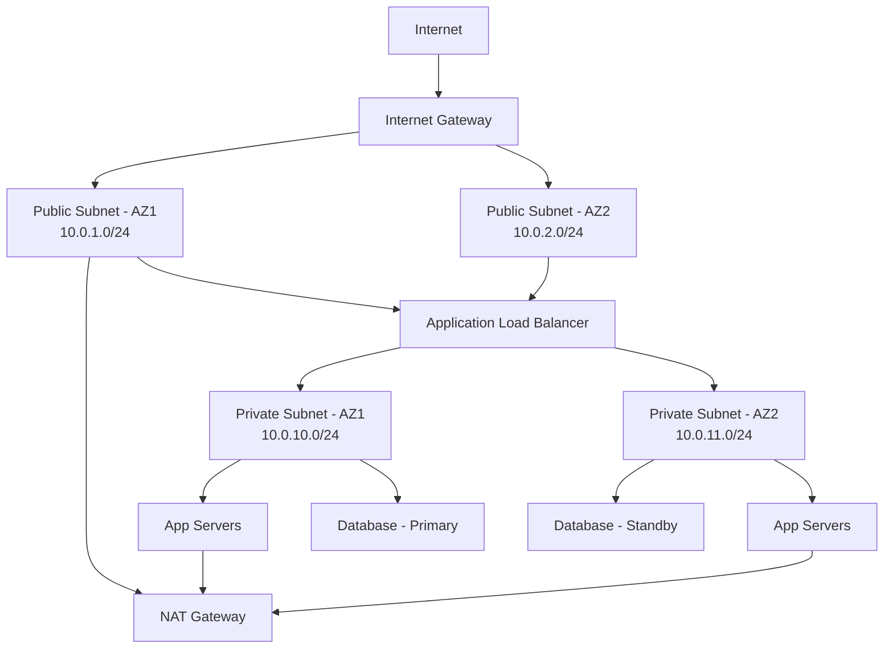

# How to Design a VPC with Public and Private Subnets

Author: [nawazdhandala](https://github.com/nawazdhandala)

Tags: AWS, VPC, Networking, Security

Description: Learn how to design an AWS VPC architecture with public and private subnets for secure, production-ready deployments with proper network isolation.

---

The most common VPC design pattern in AWS splits your network into public and private subnets. Public subnets hold resources that need direct internet access - load balancers, bastion hosts, NAT gateways. Private subnets hold everything else - application servers, databases, internal services. This separation is the foundation of secure cloud architecture.

If you're putting your database in a public subnet, this post is for you.

## Why Separate Public and Private?

It comes down to attack surface. Every resource in a public subnet gets a public IP address and is directly reachable from the internet (subject to security group rules). That's fine for a load balancer. It's not fine for your PostgreSQL database.

Private subnets have no direct internet access. Resources in private subnets can only be reached from within the VPC or through specific, controlled pathways. If an attacker compromises a public-facing web server, they still can't directly reach your database server because there's no route from the internet to the private subnet.

## The Architecture

Here's what we're building:



Two public subnets across two availability zones for the load balancer and NAT gateway. Two private subnets for application servers and databases. Simple, resilient, and secure.

## CIDR Block Planning

Good subnet design starts with CIDR planning. Here's a practical allocation for a `/16` VPC:

```
VPC:              10.0.0.0/16  (65,536 addresses)

Public subnets:
  AZ-a:           10.0.1.0/24  (256 addresses)
  AZ-b:           10.0.2.0/24  (256 addresses)
  AZ-c:           10.0.3.0/24  (256 addresses)

Private app subnets:
  AZ-a:           10.0.10.0/24 (256 addresses)
  AZ-b:           10.0.11.0/24 (256 addresses)
  AZ-c:           10.0.12.0/24 (256 addresses)

Private data subnets:
  AZ-a:           10.0.20.0/24 (256 addresses)
  AZ-b:           10.0.21.0/24 (256 addresses)
  AZ-c:           10.0.22.0/24 (256 addresses)
```

Notice the pattern. Public subnets use 10.0.1-3.x, app subnets use 10.0.10-12.x, data subnets use 10.0.20-22.x. This makes it easy to write NACL rules and identify traffic sources at a glance.

## CloudFormation Template

Let's build this as infrastructure as code. Here's a CloudFormation template that creates the full setup:

```yaml
# vpc-public-private.yaml
AWSTemplateFormatVersion: '2010-09-09'
Description: VPC with public and private subnets across two AZs

Parameters:
  EnvironmentName:
    Type: String
    Default: production

Resources:
  # The VPC itself
  VPC:
    Type: AWS::EC2::VPC
    Properties:
      CidrBlock: 10.0.0.0/16
      EnableDnsSupport: true
      EnableDnsHostnames: true
      Tags:
        - Key: Name
          Value: !Sub ${EnvironmentName}-vpc

  # Internet Gateway for public subnet access
  InternetGateway:
    Type: AWS::EC2::InternetGateway
    Properties:
      Tags:
        - Key: Name
          Value: !Sub ${EnvironmentName}-igw

  InternetGatewayAttachment:
    Type: AWS::EC2::VPCGatewayAttachment
    Properties:
      InternetGatewayId: !Ref InternetGateway
      VpcId: !Ref VPC

  # Public subnets - these get public IP addresses
  PublicSubnet1:
    Type: AWS::EC2::Subnet
    Properties:
      VpcId: !Ref VPC
      AvailabilityZone: !Select [0, !GetAZs '']
      CidrBlock: 10.0.1.0/24
      MapPublicIpOnLaunch: true
      Tags:
        - Key: Name
          Value: !Sub ${EnvironmentName}-public-1

  PublicSubnet2:
    Type: AWS::EC2::Subnet
    Properties:
      VpcId: !Ref VPC
      AvailabilityZone: !Select [1, !GetAZs '']
      CidrBlock: 10.0.2.0/24
      MapPublicIpOnLaunch: true
      Tags:
        - Key: Name
          Value: !Sub ${EnvironmentName}-public-2

  # Private subnets - no public IP, no direct internet access
  PrivateSubnet1:
    Type: AWS::EC2::Subnet
    Properties:
      VpcId: !Ref VPC
      AvailabilityZone: !Select [0, !GetAZs '']
      CidrBlock: 10.0.10.0/24
      Tags:
        - Key: Name
          Value: !Sub ${EnvironmentName}-private-1

  PrivateSubnet2:
    Type: AWS::EC2::Subnet
    Properties:
      VpcId: !Ref VPC
      AvailabilityZone: !Select [1, !GetAZs '']
      CidrBlock: 10.0.11.0/24
      Tags:
        - Key: Name
          Value: !Sub ${EnvironmentName}-private-2

  # NAT Gateway with Elastic IP for private subnet outbound access
  NatGatewayEIP:
    Type: AWS::EC2::EIP
    DependsOn: InternetGatewayAttachment
    Properties:
      Domain: vpc

  NatGateway:
    Type: AWS::EC2::NatGateway
    Properties:
      AllocationId: !GetAtt NatGatewayEIP.AllocationId
      SubnetId: !Ref PublicSubnet1
      Tags:
        - Key: Name
          Value: !Sub ${EnvironmentName}-nat

  # Public route table - routes through internet gateway
  PublicRouteTable:
    Type: AWS::EC2::RouteTable
    Properties:
      VpcId: !Ref VPC
      Tags:
        - Key: Name
          Value: !Sub ${EnvironmentName}-public-rt

  DefaultPublicRoute:
    Type: AWS::EC2::Route
    DependsOn: InternetGatewayAttachment
    Properties:
      RouteTableId: !Ref PublicRouteTable
      DestinationCidrBlock: 0.0.0.0/0
      GatewayId: !Ref InternetGateway

  PublicSubnet1RouteTableAssociation:
    Type: AWS::EC2::SubnetRouteTableAssociation
    Properties:
      RouteTableId: !Ref PublicRouteTable
      SubnetId: !Ref PublicSubnet1

  PublicSubnet2RouteTableAssociation:
    Type: AWS::EC2::SubnetRouteTableAssociation
    Properties:
      RouteTableId: !Ref PublicRouteTable
      SubnetId: !Ref PublicSubnet2

  # Private route table - routes through NAT gateway
  PrivateRouteTable:
    Type: AWS::EC2::RouteTable
    Properties:
      VpcId: !Ref VPC
      Tags:
        - Key: Name
          Value: !Sub ${EnvironmentName}-private-rt

  DefaultPrivateRoute:
    Type: AWS::EC2::Route
    Properties:
      RouteTableId: !Ref PrivateRouteTable
      DestinationCidrBlock: 0.0.0.0/0
      NatGatewayId: !Ref NatGateway

  PrivateSubnet1RouteTableAssociation:
    Type: AWS::EC2::SubnetRouteTableAssociation
    Properties:
      RouteTableId: !Ref PrivateRouteTable
      SubnetId: !Ref PrivateSubnet1

  PrivateSubnet2RouteTableAssociation:
    Type: AWS::EC2::SubnetRouteTableAssociation
    Properties:
      RouteTableId: !Ref PrivateRouteTable
      SubnetId: !Ref PrivateSubnet2

Outputs:
  VPC:
    Value: !Ref VPC
    Export:
      Name: !Sub ${EnvironmentName}-VpcId

  PublicSubnets:
    Value: !Join [',', [!Ref PublicSubnet1, !Ref PublicSubnet2]]
    Export:
      Name: !Sub ${EnvironmentName}-PublicSubnets

  PrivateSubnets:
    Value: !Join [',', [!Ref PrivateSubnet1, !Ref PrivateSubnet2]]
    Export:
      Name: !Sub ${EnvironmentName}-PrivateSubnets
```

Deploy it with a single command:

```bash
# Deploy the VPC stack
aws cloudformation deploy \
  --template-file vpc-public-private.yaml \
  --stack-name production-vpc \
  --parameter-overrides EnvironmentName=production
```

## Security Groups Design

With the network structure in place, define security groups to control traffic flow between tiers:

```yaml
  # ALB security group - accepts traffic from the internet
  ALBSecurityGroup:
    Type: AWS::EC2::SecurityGroup
    Properties:
      GroupDescription: Allow HTTP/HTTPS from internet
      VpcId: !Ref VPC
      SecurityGroupIngress:
        - IpProtocol: tcp
          FromPort: 80
          ToPort: 80
          CidrIp: 0.0.0.0/0
        - IpProtocol: tcp
          FromPort: 443
          ToPort: 443
          CidrIp: 0.0.0.0/0

  # App security group - only accepts traffic from the ALB
  AppSecurityGroup:
    Type: AWS::EC2::SecurityGroup
    Properties:
      GroupDescription: Allow traffic from ALB only
      VpcId: !Ref VPC
      SecurityGroupIngress:
        - IpProtocol: tcp
          FromPort: 8080
          ToPort: 8080
          SourceSecurityGroupId: !Ref ALBSecurityGroup

  # Database security group - only accepts traffic from app servers
  DatabaseSecurityGroup:
    Type: AWS::EC2::SecurityGroup
    Properties:
      GroupDescription: Allow traffic from app servers only
      VpcId: !Ref VPC
      SecurityGroupIngress:
        - IpProtocol: tcp
          FromPort: 5432
          ToPort: 5432
          SourceSecurityGroupId: !Ref AppSecurityGroup
```

This creates a chain: Internet -> ALB -> App -> Database. Each layer can only talk to its neighbors. The database has zero exposure to the internet.

## Network ACLs for Defense in Depth

Security groups are stateful and operate at the instance level. NACLs (Network Access Control Lists) are stateless and operate at the subnet level. Use both for defense in depth:

```bash
# Create a NACL for private subnets that blocks all direct internet traffic
NACL_ID=$(aws ec2 create-network-acl \
  --vpc-id $VPC_ID \
  --query 'NetworkAcl.NetworkAclId' \
  --output text)

# Allow inbound traffic from VPC CIDR only
aws ec2 create-network-acl-entry \
  --network-acl-id $NACL_ID \
  --rule-number 100 \
  --protocol -1 \
  --cidr-block 10.0.0.0/16 \
  --rule-action allow \
  --ingress

# Allow outbound traffic to anywhere (for NAT gateway access)
aws ec2 create-network-acl-entry \
  --network-acl-id $NACL_ID \
  --rule-number 100 \
  --protocol -1 \
  --cidr-block 0.0.0.0/0 \
  --rule-action allow \
  --egress
```

## Common Mistakes to Avoid

**Putting everything in public subnets.** Just because it's easier doesn't mean it's right. If a resource doesn't need to be directly reachable from the internet, put it in a private subnet.

**Using a single NAT gateway.** If your NAT gateway's AZ goes down, private subnet resources in other AZs lose internet access. For high availability, deploy a NAT gateway in each AZ. Yes, it costs more. Yes, it's worth it for production.

**Undersizing CIDR blocks.** You can't resize subnets after creation. Plan for growth. A `/24` subnet gives you 251 usable addresses (AWS reserves 5). That might seem like a lot until you're running Kubernetes with multiple pods per node.

For a deeper dive into multi-AZ deployments, see [creating subnets across multiple availability zones](https://oneuptime.com/blog/post/2026-02-12-create-subnets-across-multiple-availability-zones/view).

## Wrapping Up

The public-private subnet pattern is the bread and butter of AWS networking. It gives you internet-facing services where you need them and isolation where you don't. Once you've built this foundation, you can layer on load balancers, auto-scaling, and container orchestration with confidence that your network architecture is solid.
